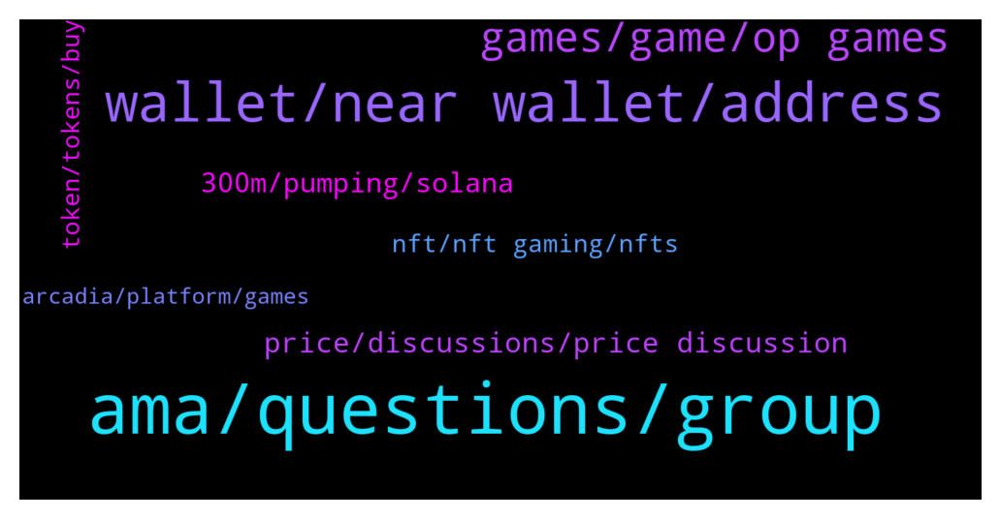

# **@cryptonear**
 ## Analysis for **2022-02-02** - **2022-02-03**.

---

## 📊 **Basic Stats**

**n_messages_sent**: 479

---

---

## 🔝 **Top keywords and related messages**

1. **ama, questions, group**

    @Kripto_Raptor --- *congratz @jlaudybell @lxydeep @huangfi @hayabusa2506 @HarryLot Please DM @kv9990 and deliver your Near addresses for the rewards* **--->** [TG Discussion](https://t.me/cryptonear/325187)

    @becausetelegram --- *ah ok. am disappoined with this near crowd unfortunately. ..* **--->** [TG Discussion](https://t.me/cryptonear/325338)

    @felicia_124 --- *hi everyone! felicia here from OP Games 🙂* **--->** [TG Discussion](https://t.me/cryptonear/325178)

    @Kripto_Raptor --- *the AMA is over. thanks for accompanying us #Nearians the chat is unmuted now* **--->** [TG Discussion](https://t.me/cryptonear/325195)

    @chasefreo --- *huge apologies for droping off soon. I had a meeting but hopefully you had a great time at the AMA. Thank you.* **--->** [TG Discussion](https://t.me/cryptonear/325217)

    @TheGo1denBull --- *Send me a dm so I can give you in sight on amas on telegram* **--->** [TG Discussion](https://t.me/cryptonear/325222)

2. **wallet, near wallet, address**

    @javachip_x --- *I think it's new i don't think it's the same anymore. Here i try to make a new one and it still random character. And if i want to create custom address i need to make a new want again and fund 0.1Near again* **--->** [TG Discussion](https://t.me/cryptonear/325479)

    @patrickbateman4423 --- *I’m new to NEAR. Can you stake NEAR directly from the wallet?* **--->** [TG Discussion](https://t.me/cryptonear/325327)

    @Franko27 --- *Error started popping up since then I got frustrated* **--->** [TG Discussion](https://t.me/cryptonear/325673)

    @Bui_Long --- *Hello admin do we have near wallet app for ios? Thanks* **--->** [TG Discussion](https://t.me/cryptonear/325425)

    @heartradiance --- *I like the near wallet a lot, very user friendly, but I get so confused when another explorer is used than the typical etherscan type* **--->** [TG Discussion](https://t.me/cryptonear/325291)

    @GeorgePro1 --- *Please don’t send out all fund from your wallet. Leave at least 0.1 near in your wallet.* **--->** [TG Discussion](https://t.me/cryptonear/324634)

3. **games, game, op games**

    @chasefreo --- *I think in this new age of web3 this is definitely bound to happen. To bring players more skin in the game by giving them a level of ownership and for devs to have the backing of the community in a much deeper level.* **--->** [TG Discussion](https://t.me/cryptonear/325030)

    @felicia_124 --- *2021 was the year where the team steadily built up its roster with world class talent to a 35-strong team in order to support our goal of empowering more game developers for Web 3.0. The team is composed of a mix of veterans in the game development / blockchain scene while we also welcomed members who were highly interested in shaping the future of Web 3 with us. 🙌  We're also hiring! View our job openings at https://twitter.com/OPGames_/status/1478717389877710849* **--->** [TG Discussion](https://t.me/cryptonear/325183)

    @chasefreo --- *We built OP Games specifically for developers to be able to get their games from web2 to web3 and for players to participate in the fun and rewards attached to it* **--->** [TG Discussion](https://t.me/cryptonear/325012)

    @chasefreo --- *There are several things that's really cool about OP Games  1. Game Legos - these are open source composable tools that game developers can use to plug in blockchain and crypto into theiur games 2. Arcadia - Our platform where all games are playable.* **--->** [TG Discussion](https://t.me/cryptonear/325014)

    @Kripto_Raptor --- *You're moving digital ownership to the next level thanks to web3 hehe* **--->** [TG Discussion](https://t.me/cryptonear/325028)

    @lxydeep --- *How do you see the evolution of Web 3.0 gaming? & How you guys aim to be the centre of web 3 gaming?  #OpGamesIsNear* **--->** [TG Discussion](https://t.me/cryptonear/325152)

4. **price, discussions, price discussion**

    @Hagi --- *It is a good moment to buy now, what is the general opinion? Or to wait little bit more maybe will come some correction ? I feel the price is little bit hugh but want to hear ur opinions* **--->** [TG Discussion](https://t.me/cryptonear/325312)

    @PxHarry --- *What was the ico price for near?* **--->** [TG Discussion](https://t.me/cryptonear/325422)

    @Simeon4real --- *Please keep all price-related discussions in Price chat here: https://t.me/merchantsofnear* **--->** [TG Discussion](https://t.me/cryptonear/325237)

    @GeorgePro1 --- *For price discussions chat here: https://t.me/merchantsofnear* **--->** [TG Discussion](https://t.me/cryptonear/325455)

    @rahulgoel007 --- *Join below group for price discussion https://t.me/merchantsofnear* **--->** [TG Discussion](https://t.me/cryptonear/324844)

    @Mohdazeem --- *Why is there no movement on price??* **--->** [TG Discussion](https://t.me/cryptonear/324742)

5. **300m, pumping, solana**

    @Herman --- *any thought why ASAC keep pumping to the roof hahaha* **--->** [TG Discussion](https://t.me/cryptonear/325513)

    @Mohdazeem --- *Why pumping is there any news??* **--->** [TG Discussion](https://t.me/cryptonear/325236)

    @cuiking --- *But I feel sad for SOL in the part 2 years they have experience huge issues on thier blockchain* **--->** [TG Discussion](https://t.me/cryptonear/325600)

    @chitranpuppy --- *Solana - wEth got hacked 300M USD, that's why Btc dump 🙈* **--->** [TG Discussion](https://t.me/cryptonear/325405)

    @Kripto_Raptor --- *Can we say you're just getting warmed up then* **--->** [TG Discussion](https://t.me/cryptonear/325049)

    @harryfrottercrypto --- *I havent showered in a month* **--->** [TG Discussion](https://t.me/cryptonear/325380)

6. **nft, nft gaming, nfts**

    @tan70061142 --- *so much cheap NFT on PARAS. 😁😁😁* **--->** [TG Discussion](https://t.me/cryptonear/325627)

    @chasefreo --- *We did an NFT sale via Paras a couple of months back. Games like Flip Flop, Forest Cuties etc. will eventually be part of a DAO. So whover own those NFTs, there are plans for you guys. 🙂* **--->** [TG Discussion](https://t.me/cryptonear/325029)

    @GoldKinging --- *So many people here want to learn how to create their own NFT's, I will guide you on how to create and sell/buy NFT's* **--->** [TG Discussion](https://t.me/cryptonear/324609)

    @Herman --- *NFT seems gaining traction in Near* **--->** [TG Discussion](https://t.me/cryptonear/325502)

    @jloc_NEAR --- *Hello fam! Let's chillout this #legalTip from the LEGAL GUILD (https://t.me/NEARLegal) about #NFTs: Ownership and #intellectualproperty rights 🎨💡  https://bit.ly/LegalTip_NFTs* **--->** [TG Discussion](https://t.me/cryptonear/325813)

    @Herman --- *What nft is your pfp? Look awesome* **--->** [TG Discussion](https://t.me/cryptonear/325550)

7. **token, tokens, buy**

    @heartradiance --- *You cant really search token transactions very well right? Also cannot search for specific tokens such as Octopus network...* **--->** [TG Discussion](https://t.me/cryptonear/325299)

    @hooiyewlim --- *Is there a group for meta token?* **--->** [TG Discussion](https://t.me/cryptonear/324734)

    @kid --- *How to get the Near token* **--->** [TG Discussion](https://t.me/cryptonear/324792)

    @Berlo123 --- *Hello everybody. I have a question, i bought Rainbow tokens are they legit?* **--->** [TG Discussion](https://t.me/cryptonear/325290)

    @rahulgoel007 --- *Check below link where NEAR token is listed https://coinmarketcap.com/currencies/near-protocol/markets/* **--->** [TG Discussion](https://t.me/cryptonear/324793)

    @TheGo1denBull --- *You may have to reach out to the TriSolaris telegram because I haven't heard of that token* **--->** [TG Discussion](https://t.me/cryptonear/325298)

