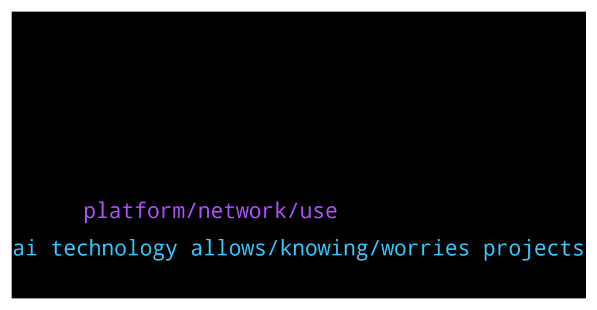

# **@de_fi**
 ## Analysis for **2022-02-02** - **2022-02-03**.

---

## 📊 **Basic Stats**

**n_messages_sent**: 30

---

---

## 🔝 **Top keywords and related messages**

1. **ai technology allows, knowing, worries projects**

    @Thomasgagnon11 --- *No worries, also if you want to know anything about projects* **--->** [TG Discussion](https://t.me/de_fi/245712)

    @anastasialiski --- *do you know any cool projects?* **--->** [TG Discussion](https://t.me/de_fi/245715)

    @Thomasgagnon11 --- *Hi, you can try to follow some of these https://thedefiant.io/top-10-defi-resources/* **--->** [TG Discussion](https://t.me/de_fi/245710)

    @Mind4u2cn2 --- *If you know any founders building in DeFi please let them know this is happening.  We are looking to fund DeFi innovators.  https://www.crowdcast.io/e/defi-base-camp-qa* **--->** [TG Discussion](https://t.me/de_fi/245681)

    @Thomasgagnon11 --- *this project has a technology behind and also have the craziest AI technology that allows you to tokenize any aspect of the human nature, for example your voice* **--->** [TG Discussion](https://t.me/de_fi/245722)

    @Vivon --- *I don't know if this I allowed but I would like to send the link all so here in the chat.* **--->** [TG Discussion](https://t.me/de_fi/245623)

2. **platform, network, use**

    @Vivon --- *Here is the main page of the platform, you are welcome to join in and use the provided data, explore for new assets monitor. The platform will help you to make the right decision 👀  If you are interested in API you can speak with the developers directly, to receive more info.   https://data.valid.network/home* **--->** [TG Discussion](https://t.me/de_fi/245626)

    @Paramkodi --- *Ankr is teaming up with IoTeX to build a robust global network of nodes, through the brand new RPC endpoint.  https://medium.com/ankr-network/ankr-teaming-up-with-iotex-to-speed-global-network-growth-fa48947a386* **--->** [TG Discussion](https://t.me/de_fi/245765)

    @Thomasgagnon11 --- *I don't know abou cool, but I can tell about one that has perks and utilities, exactly what you need if you want to invest in NFTs* **--->** [TG Discussion](https://t.me/de_fi/245716)

    @anastasialiski --- *I m really interested in NFTs* **--->** [TG Discussion](https://t.me/de_fi/245714)

    @Vivon --- *You can find the platform by typing  “Valid Network” in any search engine you use.  I will send you the link.   There you will find a platform, where you will be able to track your assets and check the security level, also they offer to compete between vaults and tracking your asset 24/7 with notifications.* **--->** [TG Discussion](https://t.me/de_fi/245611)

    @coincrazy --- *Hi guys, friend of mine looking to acquire and acquihire a web3 wallet provider. Other then the obvious big ones anyone have any direct connects with plausible recommendations to look at? Intro to?* **--->** [TG Discussion](https://t.me/de_fi/245599)

