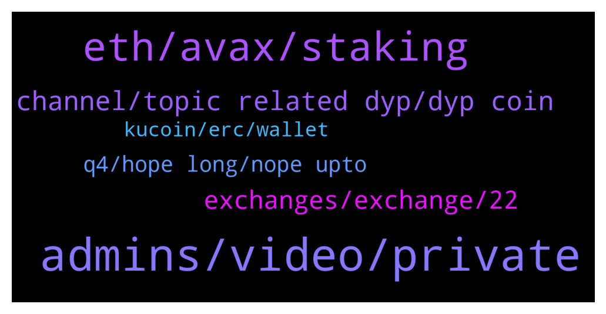

# **@dypfinance**
 ## Analysis for **2022-02-02** - **2022-02-03**.

---

## 📊 **Basic Stats**

**n_messages_sent**: 120

---

---

## 🔝 **Top keywords and related messages**

1. **admins, video, private**

    @Stefano --- *DhonMSD contacted me in private chat, and fuck me. Well done* **--->** [TG Discussion](https://t.me/dypfinance/244367)

    @Stefano --- *Yes sure he send me this* **--->** [TG Discussion](https://t.me/dypfinance/244397)

    @Stefano --- *He ask me my metamask address* **--->** [TG Discussion](https://t.me/dypfinance/244370)

    @Stefano --- *Hello, so now, that a guy with a name of an administrator f...k me my metamask identity and my money, what can I do?* **--->** [TG Discussion](https://t.me/dypfinance/244452)

    @Oso7us --- *I am completely new to this* **--->** [TG Discussion](https://t.me/dypfinance/244234)

    @timdyp --- *Stefano you see this type of messages that are sent every 30-45 min on the group? https://t.me/dypfinance/244343 https://t.me/dypfinance/244350 This messages are in order to avoid users to be scammed.* **--->** [TG Discussion](https://t.me/dypfinance/244396)

2. **eth, avax, staking**

    @Idaveofficial --- *Are there any chances of increasing APR %  in staking ?* **--->** [TG Discussion](https://t.me/dypfinance/244493)

    @DhoniMSD516 --- *DYOR and invest only what you afford to loose our products have no min deposit you can even start with 1$ :)* **--->** [TG Discussion](https://t.me/dypfinance/244415)

    @Mustaphakn --- *I will not expose how much I purchased, but a reasonable community welcomes an investor with no matter what little investment.* **--->** [TG Discussion](https://t.me/dypfinance/244264)

    @Disguy125 --- *It says claim in 9hrs but I havent seem any increase in weth in a while.....* **--->** [TG Discussion](https://t.me/dypfinance/244164)

    @Night --- *Defi farming  are creating Messive profit nowdays , Defi dominating the space  , some of the growing on the space are DYP wonderland and REFI ,* **--->** [TG Discussion](https://t.me/dypfinance/244170)

    @DhoniMSD516 --- *Hey the staking apr is also dynamic, v1 staking used to be fixed but V2 is dynamic* **--->** [TG Discussion](https://t.me/dypfinance/244360)

3. **channel, topic related dyp, dyp coin**

    @DhoniMSD516 --- *This is going bit off topic, please keep this only related to DYP as you are in DYP exclusive group :)* **--->** [TG Discussion](https://t.me/dypfinance/244428)

    @DhoniMSD516 --- *Hey welcome please head here to start learning about DYP :)  https://t.me/dypfinance/229271* **--->** [TG Discussion](https://t.me/dypfinance/244405)

    @DhoniMSD516 --- *Hey welcome head here to learn about DYP :) https://t.me/dypfinance/229271* **--->** [TG Discussion](https://t.me/dypfinance/244193)

    @DhoniMSD516 --- *You are in DYP(Defi Yield Protocol channel) and this will be good start to know about DYP https://t.me/dypfinance/229271* **--->** [TG Discussion](https://t.me/dypfinance/244203)

    @Gabriel --- *DYP keep building!Awesome team! 👀🚀.Soon DYP will be a big player in crypto market!* **--->** [TG Discussion](https://t.me/dypfinance/244291)

    @DhoniMSD516 --- *This channel is exclusive for DYP so please keep the topic only related to DYP Thanks :)* **--->** [TG Discussion](https://t.me/dypfinance/244283)

4. **exchanges, exchange, 22**

    @AladinCrypto --- *Super. Come more exchanges or just one now ? :)* **--->** [TG Discussion](https://t.me/dypfinance/244469)

    @AladinCrypto --- *When go DYP to new exchange, this month ?* **--->** [TG Discussion](https://t.me/dypfinance/244462)

    @Mustaphakn --- *Which exchanges are you going to be listed by Q3 22?* **--->** [TG Discussion](https://t.me/dypfinance/244247)

    @DhoniMSD516 --- *We provided everything from our end, just waiting for exchange to announce :)* **--->** [TG Discussion](https://t.me/dypfinance/244466)

    @DhoniMSD516 --- *We cannot disclose the exchanges names yet due to NDA :)* **--->** [TG Discussion](https://t.me/dypfinance/244248)

    @trader_broi --- *I think the tier 1 exchange is coinbase* **--->** [TG Discussion](https://t.me/dypfinance/244131)

5. **q4, hope long, nope upto**

    @Mustaphakn --- *I can only see Q4 21 in the end.* **--->** [TG Discussion](https://t.me/dypfinance/244245)

    @DhoniMSD516 --- *No date announced yet, please stay tuned :)* **--->** [TG Discussion](https://t.me/dypfinance/244274)

    @DhoniMSD516 --- *Nope we have upto Q4 2022* **--->** [TG Discussion](https://t.me/dypfinance/244246)

    @Bishop --- *The bulls r out, and the bears went into hiding👀* **--->** [TG Discussion](https://t.me/dypfinance/244126)

    @Disguy125 --- *This was earlier today..... now look* **--->** [TG Discussion](https://t.me/dypfinance/244117)

    @Nji_jalen --- *Hope not too long we can mint CAWS* **--->** [TG Discussion](https://t.me/dypfinance/244157)

6. **kucoin, erc, wallet**

    @Jorge --- *Hello guys, i have a question!! We have 2 options dyp on trust wallet, erc and bep!! If i want to move my dyps from kucoin to my trust wallet, whats the option?? Thanks* **--->** [TG Discussion](https://t.me/dypfinance/244499)

    @Stefano --- *Because I can't do a withdraw dyp* **--->** [TG Discussion](https://t.me/dypfinance/244373)

    @MJay530 --- *I hate kucoin. Took 4 days to verify during a hot buy time for me. Fucked me hard* **--->** [TG Discussion](https://t.me/dypfinance/244501)

    @DhoniMSD516 --- *Hey Kucoin suports only ERC deposits and withdrawals so you need to use ERC only* **--->** [TG Discussion](https://t.me/dypfinance/244500)

    @DhoniMSD516 --- *Move your assets to other wallet* **--->** [TG Discussion](https://t.me/dypfinance/244455)

