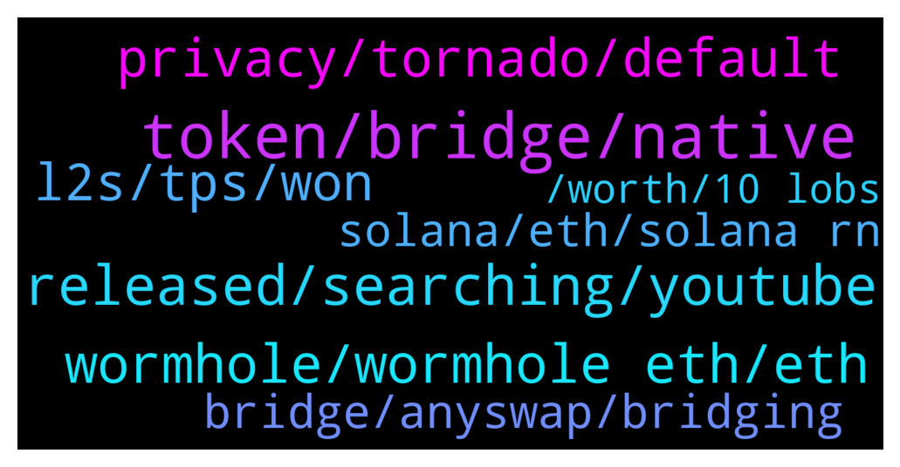

# **@lobsters_chat**
 ## Analysis for **2022-02-02** - **2022-02-03**.

---

## 📊 **Basic Stats**

**n_messages_sent**: 469

---

---

## 🔝 **Top keywords and related messages**

1. **token, bridge, native**

    @Szsahaj --- *how do you go about bridging to native network token for fees without using an exchange. ?  for eg, i have 1 eth on eth network, and want to bridge it to FTM network in FTM but my ftm wallet side is new and has no ftm for fees.  I am mostly using anyswap stable pools, but you still need to use exchange their to get some native token for fees, yes? thanks.* **--->** [TG Discussion](https://t.me/lobsters_chat/322804)

    @philippvienna --- *some bridges add a bit of native token for gas, some times there are faucets, sometimes you would have to buy ftm on eth mainnet and bridge that first  https://docs.spookyswap.finance/getting-started/how-to-get-fantom-gas* **--->** [TG Discussion](https://t.me/lobsters_chat/322805)

    @Szsahaj --- *i meant for example, if i want to go from polygon to avax, there's only option to do so via usdc pool, and not native tokens. it'll get stuck and has no point if my avax wallet is new and has no avax for fees to withdraw usdc from pool on the other end* **--->** [TG Discussion](https://t.me/lobsters_chat/322812)

    @bernyn --- *I have done so with elk finance but the bridge is of elk token + native and then swap* **--->** [TG Discussion](https://t.me/lobsters_chat/322814)

    @sonicblend --- *Sometimes buy token from cex and withdraw to blockchain. You can buy FTM from Binance for example.* **--->** [TG Discussion](https://t.me/lobsters_chat/322807)

    @Nicolas_A --- *Multiple bridge "airdrop" you some gas token (AVAX, BNB, MATIC) to pay for your first transaction nowadays. Synapse and Celer have that feature* **--->** [TG Discussion](https://t.me/lobsters_chat/322819)

2. **released, searching, youtube**

    @DefiApe --- *This is their one of the core documents released.  https://docs.google.com/document/d/1MqPYWqEpHow4GxiUjCWMDDa6fvmR6OWxRxMOfXmzgh4/edit#  All I see is michael saylor* **--->** [TG Discussion](https://t.me/lobsters_chat/322367)

    @eth2enthusiast --- *got this mega list of VCs from some dude i met at a hostel last night, if anyone wants it https://docs.google.com/document/d/1BIM7Nbz_ohI9Lrk4sfu6LPHfpe7HkYFvH6rs7QD6iRE/edit?usp=sharing* **--->** [TG Discussion](https://t.me/lobsters_chat/322345)

    @MoonDuck --- *Yes ser. Would be interested if u do find* **--->** [TG Discussion](https://t.me/lobsters_chat/322342)

    @zeThrouzz --- *here we test in production sir* **--->** [TG Discussion](https://t.me/lobsters_chat/322459)

    @coine_r --- *It's new, at least on the homepage. Up until last month, there was no mention of that: https://web.archive.org/web/20220130234225/https://fantom.foundation/* **--->** [TG Discussion](https://t.me/lobsters_chat/322305)

    @ikram101 --- *You can find their code here:  https://github.com/certusone/wormhole/tree/dev.v2/solana/bridge/program  https://github.com/certusone/wormhole/tree/dev.v2/ethereum/contracts* **--->** [TG Discussion](https://t.me/lobsters_chat/322534)

3. **wormhole, wormhole eth, eth**

    @CryptoGraham --- *Was wormhole a well established product? I’ve been away a while.* **--->** [TG Discussion](https://t.me/lobsters_chat/322624)

    @sf481 --- *if anything, it pumps because people dump wormhole ETH for soETH?* **--->** [TG Discussion](https://t.me/lobsters_chat/322409)

    @Internal123456 --- *solend mkt rn, wormhole eth at the top correct?* **--->** [TG Discussion](https://t.me/lobsters_chat/322449)

    @syed_jafri --- *Anyways you want to borrow wormhole ETH and sell it* **--->** [TG Discussion](https://t.me/lobsters_chat/322423)

    @Quiveringsphinx --- *Can the same hack or similar be duplicated for the other chains wormhole supports?* **--->** [TG Discussion](https://t.me/lobsters_chat/322539)

    @samkazemian --- *Wow this Vitalik tweet is straight up prophetic given the Wormhole stuff. He basically just wrote out exactly what happened.* **--->** [TG Discussion](https://t.me/lobsters_chat/322490)

4. **privacy, tornado, default**

    @ivangbi --- *There seems to be quite some time between contract deployment and funding from tornado - and the actual drainage. So a tool we spoke of before could have detected this. But my issue is - what would be the playbook? You can’t stop contracts every time such shit happens (what if somebody is just messing with you). So how would you even pause or unpause given you don’t even know if there is an issue and if yes, what it is @banteg  Nvm this was an EOA on ETH side* **--->** [TG Discussion](https://t.me/lobsters_chat/322448)

    @hb19840 --- *Do a lot of people use Aztec now?  I found the tech really interesting in early days and I would guess if it's got high liquidity now, it's most likely better designed than tornado.  Practically tho, it might be hard to compete with Tornado anonymity set?* **--->** [TG Discussion](https://t.me/lobsters_chat/322246)

    @LyrrraD --- *Dumb question, but can tornado blacklist addresses?* **--->** [TG Discussion](https://t.me/lobsters_chat/322557)

    @bensams0 --- *if you want privacy for the sake of privacy, then it needs to be a default. otherwise the only thing it's good for is hacking and getting blacklisted by CEXes when you try to offramp* **--->** [TG Discussion](https://t.me/lobsters_chat/322589)

    @LyrrraD --- *People can also use Bucc. Not only tornado* **--->** [TG Discussion](https://t.me/lobsters_chat/322605)

    @coine_r --- *No one says you're required to use CEXs a, b, and c after using tornado though* **--->** [TG Discussion](https://t.me/lobsters_chat/322604)

5. **l2s, tps, won**

    @tesslerc --- *https://twitter.com/podcastdelphi/status/1488736151003602945?s=21  Interesting points by Emin about why L2s aren't the solution. His points are also relevant for L1s that act like many distinct blockchains for scale, eg Kadena.* **--->** [TG Discussion](https://t.me/lobsters_chat/322249)

    @van0k --- *Is there a source with comparative analysis of how L2s actually perform? I was under an impression that Arbitrum was doing better than that* **--->** [TG Discussion](https://t.me/lobsters_chat/322273)

    @tesslerc --- *Why won't L2s suffer from fragmentation? They too have scalability limitations as they are essentially blockchains. So multiple L2s means liquidity and usage is fragmented across ledgers.* **--->** [TG Discussion](https://t.me/lobsters_chat/322261)

    @Oxc4t --- *Every criticism stated for L2s can be attributed to altL1s. Also he definetly watches iguanas fuck.* **--->** [TG Discussion](https://t.me/lobsters_chat/322252)

    @Oxc4t --- *Long term L1s are to become used by L2s only, so you won't have fragmentation.* **--->** [TG Discussion](https://t.me/lobsters_chat/322255)

    @Crypto_McKenna --- *All L1s are cutting corners except ETH* **--->** [TG Discussion](https://t.me/lobsters_chat/322262)

6. **bridge, anyswap, bridging**

    @Sp33qr --- *Yes its was the only native bridge used by everyone bridging to solana* **--->** [TG Discussion](https://t.me/lobsters_chat/322633)

    @BigBombo --- *If only there was a bridge that had been running for years with nearly $10bn volume, $500m++ continuously custodied, 0 downtime and $0 hacked* **--->** [TG Discussion](https://t.me/lobsters_chat/322512)

    @MoonDuck --- *Yes but this is probably a problem that will get solved in 'practical  'terms. For example Subways are bridges connecting Skyscrapers ( Chains) in the city metaphor of Chains and may fail or get delayed but are usefull most time.  See Alex.near  tweet   https://twitter.com/AlexSkidanov/status/1129511266660126720?s=20&t=auUUOVELlt4Q6oIxn4XEjQ* **--->** [TG Discussion](https://t.me/lobsters_chat/322720)

    @Sp33qr --- *anyswap wasn't existent I mean its first early bridge* **--->** [TG Discussion](https://t.me/lobsters_chat/322636)

    @BigBombo --- *Name 1 (one) unhacked bridge kek* **--->** [TG Discussion](https://t.me/lobsters_chat/322518)

    @defi_lobster --- *Im not talking about bridges ofc* **--->** [TG Discussion](https://t.me/lobsters_chat/322860)

7. **solana, eth, solana rn**

    @sf481 --- *sbf singlehandedly saving solana once again* **--->** [TG Discussion](https://t.me/lobsters_chat/322611)

    @naps62 --- *Solana contracts aren't open source? :O* **--->** [TG Discussion](https://t.me/lobsters_chat/322508)

    @Odedby --- *Looks like theres no code on explorer.solana.com* **--->** [TG Discussion](https://t.me/lobsters_chat/322532)

    @zariat_5D --- *because it would have rekt tf out of solana* **--->** [TG Discussion](https://t.me/lobsters_chat/322830)

    @akashking0 --- *why wheth price doesn't dumped? it's same 1:1 on solana blockchain* **--->** [TG Discussion](https://t.me/lobsters_chat/322718)

    @Odedby --- *Whereas on eth contracts are written in solidity, on solana you write them in another language and compile them to bytecode* **--->** [TG Discussion](https://t.me/lobsters_chat/322527)

