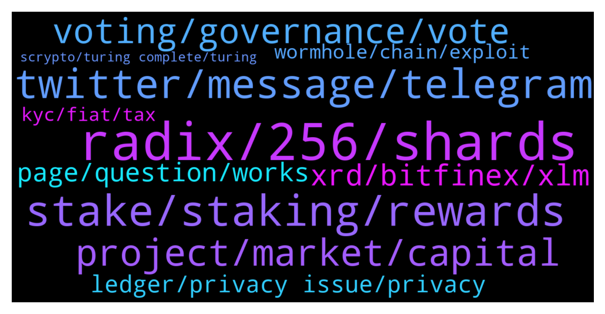

# **@radix_dlt**
 ## Analysis for **2022-02-02** - **2022-02-03**.

---

## 📊 **Basic Stats**

**n_messages_sent**: 511

---

---

## 🔝 **Top keywords and related messages**

1. **radix, 256, shards**

    @Mr_TMA --- *Actually there are not 2^256 shards in existence, but rather it is a prepared mapping. Storage space will only be taken up when a piece of data is mapped into the shard space.  The number 2^256 comes from the SHA-256 cryptographic hash-function. When there is a new piece of data (substate) to be processed it will be its own shard with shard-id given by SHA-256 hash-function: f(substate) —> shard_id. Based on the shard_id's the shards can be distributed over nodes and be traced.  To make this sharding strategy work the Radix design needs each substate to be mapped into a «unique» shard_id.  This is different from 'regular' hashing where each item is mapped into a bucket of items. It is possible to get a unique shard_id by applying the SHA-256 cryptographic hash-function: this function is designed to give 'practilally unique' outcomes as used in cryptographic protection (there is uniqueness up to astronomically small chances of collisions, which are non-fatal for the Radix design).  Radix uses the near-uniqueness property in its sharding strategy. Radix needs this because with Radix shards are minimalistic objects: tiny pieces of data that can are tied together on the fly during a consensus operation. The more granular the shards (the tinier the objects), the more indepedent objects you have which allows for more parellellization during consensus (different transactions tend to involve different shards, which allows to process them in parallel).  With sharding in regular non-crypto databases the uniquess property provided by the SHA-256 function is not important by itself. It may be useful if it could speed up the mapping/lookup process, but since SHA-256 is a heavy function itself it probably won't beat simpler hashing in common circumstances.  This post provides a top-level overview + background links:  https://www.reddit.com/r/Radix/comments/qq43xh/what_is_sharding_and_how_is_the_radix_way_of/* **--->** [TG Discussion](https://t.me/radix_dlt/350426)

    @PeterFATAss --- *Is there any proof that flexathon and radflix is not just running on a normal server? Thanks* **--->** [TG Discussion](https://t.me/radix_dlt/350117)

    @Straydawg333 --- *Right make sense plus radix not built on block chain so maybe even harder ?* **--->** [TG Discussion](https://t.me/radix_dlt/350182)

    @Straydawg333 --- *Wen binance lambo lol. Gosh I really thought guy radix would be on binance now....how come shib crapcoin can get but not radix* **--->** [TG Discussion](https://t.me/radix_dlt/350171)

    @djstellar --- *it is much more difficult as radixDLT's engine is not turing complete aka general computing and the engine is finite state machine so it is pretty hard for engineers to go wrong.* **--->** [TG Discussion](https://t.me/radix_dlt/350314)

    @Tom --- *Essentially unsharded cerberus uses a hotstuff fork, please correct me If I‘m wrong.* **--->** [TG Discussion](https://t.me/radix_dlt/349998)

2. **stake, staking, rewards**

    @Adam_XRD --- *Dust from unstaking is known annoyance. I am sure Russ or Matt wrote about it somewhere, but from memory it is actually technically quite hard to add a "Max" unstake function so no ETA on a solution, but we hear you ❤️* **--->** [TG Discussion](https://t.me/radix_dlt/349850)

    @ALFRED_DULAIRE --- *There should be a max button for unstaking, I have 3 staked shares with 0.000001 on it 😆* **--->** [TG Discussion](https://t.me/radix_dlt/349836)

    @Jazzer9F --- *That's a good point, hadn't considered that.  Of course there's no reason the protocol couldn't have an unstakeAll method or smth to get around that. But I digress, lol.  My point was that the number that is copied when you click it isn't the actual number that is your stake. If you use it, the unstake will fail because it's too high in the final ±7 decimal places or so. That just shouldn't be imo. Low priority bug definitely, but still an annoyance in the UX.* **--->** [TG Discussion](https://t.me/radix_dlt/349863)

    @ahsimon --- *The NULs approach points in an interesting type of change to the delegation incentive strategy for the Viskocity problem.  Consider a specific example:  As I understand the basic idea, the current Radix algorithm says that IF you choose two delegators, one at stake rank 10 and one at stake rank 100, AND you delegate the same amount of XRD to each validator, AND both validators happen to have roughly the same fees and uptime, then your earned rewards (ie. APY times delegated stake) are the same for each of the two validators.  This seems to be a bad alignment of delegation rewards and delegator risks.  In particular, the delegation to validator 10 "seems" much safer, since there is "little risk" of "dropping out of the top 100".   But as the Viskocity experience shows this is an illusion, and even delegating to rank 10 can be risky.  So my suggestion is to (do something like) increase the APY for any validator below 1% of. total stake.  That is, since people seem to believe that it is a good idea to stake to the top of the list, lets add a financial incentive to them, rather than just relying on a "recommendation".  How much of a financial incentive and other details is something I would leave to the team.  But the basic idea is simple:  If I knew I could earn more rewards by deliberately delegating to one of the low % stake validators, that would be a much stronger inducement for me to do so.  The additional APY would compensate me for taking what seems to be using a more risky validator.   This can still be done in a permissionlesss environment, since when the rules change they change for everyone.  The immediate question that must be answered is:  How easy would this be to being gamed?  I suppose I could run multiple validators, but not publicize that I am doing so.  That is, Instead of owning a validator with 3% of total stake I could run four validators with .75% of total stake each.   But I dont think that would be very effective.  One of the reasons for people making the top 10 validator list, is that delegators like rewarding people who have made significant efforts to make Radix better.  If I chose to hide the fact that all four validators were run by me, then it would be much harder to attract delegations to my other validators.  Also, running 4 validators has to cost more than running one validator.  By careful design of the incentives, one can still make it more profitable to run a single easily recognized validator than multiple unknown validators.  Finally, it would be much harder to get past the KYC needed to earn a Foundation subsidy.  Doing something like this would involve another iteration of the core API, since the before and after strategy will change at some well-defined epoch.  This is not the kind of change that the team would "like" to do, because it has inherent risks.   So at the very least, it must be thoroughly tested and psychologically simulated before it is public.* **--->** [TG Discussion](https://t.me/radix_dlt/349858)

    @hr15allstar --- *For all the USA residents, big IRS news on staking - not taxed until sale  https://www.forbes.com/sites/kamranrosen/2022/02/02/in-huge-precedent-irs-says-it-will-not-tax-unsold-staked-crypto/* **--->** [TG Discussion](https://t.me/radix_dlt/350382)

    @Kafkafrate --- *It's this good news for US stakers on radix also? Seems that this paves the way for tax free staking rewards.  https://blockworks.co/sources-in-win-for-crypto-stakers-irs-says-untraded-tokens-are-tax-free/* **--->** [TG Discussion](https://t.me/radix_dlt/350342)

3. **twitter, message, telegram**

    @tesslerc --- *I need 461 community members, a decomissioned plane (tbh I think I know where to get one :D), Andre Cronje and a $10m budget. Going to be epic 🤪* **--->** [TG Discussion](https://t.me/radix_dlt/350528)

    @L --- *any one creating a email service on radix?* **--->** [TG Discussion](https://t.me/radix_dlt/350441)

    @Straydawg333 --- *So are we saying by end of year lol* **--->** [TG Discussion](https://t.me/radix_dlt/350190)

    @h0ll0wstick --- *At current market evaluation? Forget it.* **--->** [TG Discussion](https://t.me/radix_dlt/350234)

    @mattiabe98 --- *Not yet, it's just the forum for now. We do have Twitter though: https://twitter.com/radix_talk  If you want to share your project you just need to sign up and create a thread 🙂* **--->** [TG Discussion](https://t.me/radix_dlt/350630)

    @rotane77 --- *🚀 Airdrop Time! 🚀  (open for 48 hours - now until Saturday 14:00 UTC)  ------------------------  ℹ How do I participate in today's $OCI airdrop?  1) Follow both of us on Twitter https://twitter.com/ociswap https://twitter.com/Lawrence_tko   2) Comment on Lawrence's tweet with your favorite athlete here: https://twitter.com/Lawrence_tko/status/1489237796397137920 (only comment/reply - don't quote in our own tweet)  3) Download the Radix wallet from https://wallet.radixdlt.com (a desktop computer is required to participate in the airdrop)  4) Register your Radix wallet address with a message in our bot @ocicatbot:  /wallet yourwalletadress  Example message: /wallet rdx....  5) Register your twitter account with a message in our bot @ocicatbot:  /twitter yourtwitterusername  Example message: /twitter ocifan  ------------------------  ✅ Congratulations, you are now participating in the airdrop!    🐈 For your participation we reward you with a minimum of 100 $OCI.  If you have any further questions just ask us in the Telegram group.* **--->** [TG Discussion](https://t.me/radix_dlt/350615)

4. **project, market, capital**

    @Cpt_Charles --- *Lol. Someone stole 216m USD by exploiting Solana VAA verification and minted 80k wETH tokens 🤡  https://etherscan.io/tx/0x24c7d855a0a931561e412d809e2596c3fd861cc7385566fd1cb528f9e93e5f14  https://www.notifi.xyz/messages/1497* **--->** [TG Discussion](https://t.me/radix_dlt/350235)

    @Tom --- *If the team has an explanation why they are not pushing and focusing more on a working prototype of a trillion + technology, i‘d love to hear it btw.* **--->** [TG Discussion](https://t.me/radix_dlt/350017)

    @Alex --- *Hahahaha I thought the same, complete rubbish seriously…  I am always so surprised that those guys state: fast development is key in crypto. So it is better to develop and release the future global finance program over night with some hype, rather than actually developing a good product coming from a decent R&D? I assume they would also rather drive a car, which was not even tested for a year and see where it goes, rather than one that was properly tested😂* **--->** [TG Discussion](https://t.me/radix_dlt/349986)

    @ITProfligate --- *What Miles Saltiel draws attention to in this document (which I may share from google drive if requested) is the lack of accurate figures for world wide investment. e.g. “The site parading itself as definitive, the Sovereign Wealth Fund Institute (SWF) (www.swfinstitute.org), presents different figures for “assets under management” (AUM), in different tables of the same class of investor. Their tables also fail to inspire confidence, as they miss TIAA ($1.3tn AUM of US teachers’ pensions), so who knows what else? In addition, the SWF isn’t interested in private wealth, so it excludes the tech and other billionaires listed here and here, with such lists themselves unreliable as excluding (eg) the Rockefellers and Wallenbergs; let alone royal and other old-ish money families, about whom no reliable information is to hand.” (Links not included.) I’m listening to Piers and again that figure of $400 trillion market comes up again. Maybe, maybe not. Whatever, to divert into a crypto solution a very keen focus on product is needed.* **--->** [TG Discussion](https://t.me/radix_dlt/350206)

    @Mik3ology --- *I'm totally baffled. He says in a comment. "Being in development since 2013 is flaw" Like seriously 😂 Bitcoin was launched in 2009 after many years and attempts by other projects, and the world still hasn't seen a sufficient live solution fit for global adoption. So how can 9 years of R&D be a flaw of Radix? Bizarre* **--->** [TG Discussion](https://t.me/radix_dlt/349942)

    @Tom --- *The thing is, implementing a solid smart contract engine on a distributed ledger is hard. Really hard. Add infinite scalability to that, and we are in territory where no one was able to pull it off yet in a good way. Not even projects with hundreds of millions in capital. It is not trivial at all.* **--->** [TG Discussion](https://t.me/radix_dlt/350008)

5. **voting, governance, vote**

    @Jacob_XRD --- *Governance of a system with $400 Trillion of potential is normally reserved for nation-states, and now Radix.  RDX Works is searching for a unique individual to design and implement a Governance model for the Radix Public Network.  Full Details: https://www.radixdlt.com/post/designing-governance-with-400-trillion-of-potential* **--->** [TG Discussion](https://t.me/radix_dlt/350488)

    @Kafkafrate --- *The most common model so far is probably power voting based on staking amount. More skin in the game more voting power, but then this leads to whales having more voting power and therefore centralisation* **--->** [TG Discussion](https://t.me/radix_dlt/350547)

    @chrisijoyah --- *This is a huge challenge that most DAOs are currently facing how do you find the right balance. The most common model where the more tokens you have equates to how much voting right you have, I don't think this is a fair system as you mentioned with whales having the majority of influence and control. I have been looking at other models to adopt for Adepts governance component. I don't believe theres a one model that fits all types of DAO as every DAO is different so, we're trying to implement something that is flexible. If you think about real world democracy, rich or poor ever citizen is allowed one vote and no vote is greater than the other. I think having something similar in place for a voting model might work but I had stumbled across something called "proof of participation" where other time based on your contributions to a given community you maybe garner a greater voting influence. This is something that cannot be bought and something that has to be earned. This is the sort of direction we're leaning closer to.* **--->** [TG Discussion](https://t.me/radix_dlt/350558)

    @tesslerc --- *Yup, challenging decisions indeed. On the one hand you want an inclusive system, on the other it's a financial protocol and hence those impacted the most by governance are those with the most capital.* **--->** [TG Discussion](https://t.me/radix_dlt/350554)

    @Jacob_XRD --- *Exactly! Then one group secure the water source, you then control the population.* **--->** [TG Discussion](https://t.me/radix_dlt/350494)

    @ITProfligate --- *#Governance Re: Convo above @tesslerc @Blind5ight Shang En @chrisijoyah @Kafkafrate @jafaroff55 Bent @SYS_01 @Jacob_XRD  From Jameson Quinn’s LessWrong three part sequence from four years ago. https://www.lesswrong.com/s/ZBNBTSMAXbyJwJoKY  I am going to reread and follow up any later comments by him. He is no longer working with The Centre for Election Science, if he ever was, I’m not sure. I believe he is now a full time academic, can't remember where. But I also believe this sort of problem should interest him. I have had previous contact.  A couple of extracts, possibly not the most relevant (saline).  “# What is voting theory?  Voting theory, also called social choice theory, is the study of the design and evaulation of democratic voting methods (that's the activists' word; game theorists call them "voting mechanisms", engineers call them "electoral algorithms", and political scientists say "electoral formulas"). In other words, for a given list of candidates and voters, a voting method specifies a set of valid ways to fill out a ballot, and, given a valid ballot from each voter, produces an outcome.”  Important: He has produced code to measure voter satisfaction which can be run in simulations.  “# What is Voter Satisfaction Efficiency?  Voter Satisfaction Efficiency (VSE) is a way of measuring the outcome quality a voting method will give. It relies on making various assumptions about what kind of voters and candidates are likely to occur, then running large numbers of elections that are simulated using those assumptions, and measuring how satisfied the average simulated voter is by the outcome in each election.”  “# Where’s the code?  [The Center for Election Science’s GitHub](https://github.com/electionscience/vse-sim)”* **--->** [TG Discussion](https://t.me/radix_dlt/350641)

6. **xrd, bitfinex, xlm**

    @Tamás --- *If you buy BTC, the transaction fee will be higher. Go for XLM instead, for example* **--->** [TG Discussion](https://t.me/radix_dlt/350378)

    @L --- *bitfinex steady messing up xlm deposits* **--->** [TG Discussion](https://t.me/radix_dlt/350404)

    @emilevz --- *yes, this works well. Send the XLM then sell for USD then buy XRD* **--->** [TG Discussion](https://t.me/radix_dlt/350380)

    @L --- *u cud use anything really i was just using xlm* **--->** [TG Discussion](https://t.me/radix_dlt/350483)

    @peterkimkz --- *My opinion: buy btc by FTX > Bitfinex> XRD > Wallet* **--->** [TG Discussion](https://t.me/radix_dlt/350377)

    @Magal36 --- *you can swap eXRD for XRD using Bitfinex (no KYC required) or Instabridge (KYC required). https://learn.radixdlt.com/categories/instabridge-user-guide* **--->** [TG Discussion](https://t.me/radix_dlt/350413)

7. **page, question, works**

    @Callum --- *I’ll DM them later.. don’t open until 9am* **--->** [TG Discussion](https://t.me/radix_dlt/349936)

    @Crypto_Ginax --- *Can you point me to a specific page?* **--->** [TG Discussion](https://t.me/radix_dlt/350644)

    @piersr --- *Done deal. What do you need fam?* **--->** [TG Discussion](https://t.me/radix_dlt/350525)

    @tednol --- *This might be of interest to you. :)  https://t.me/radix_dlt/349480* **--->** [TG Discussion](https://t.me/radix_dlt/349834)

    @Null_v0id --- *Hyperlink on this page isn’t href’d:  https://www.radixdlt.com/post/designing-governance-with-400-trillion-of-potential* **--->** [TG Discussion](https://t.me/radix_dlt/350489)

    @Natethegreat762 --- *No.. it's gone now lol xD* **--->** [TG Discussion](https://t.me/radix_dlt/350341)

8. **ledger, privacy issue, privacy**

    @chrisijoyah --- *I don't know if you have heard of minaprotocol but they do something clever to get around the data privacy issue, its a very interesting project to look into https://minaprotocol.com/* **--->** [TG Discussion](https://t.me/radix_dlt/350571)

    @Magal36 --- *that's probably because of it. It compares mostly permissionless ledgers* **--->** [TG Discussion](https://t.me/radix_dlt/350219)

    @chrisijoyah --- *I don't know if this has already been discussed already, most likely it already has been. When you think about the real world and how the banking systems work all our banking information is private and not publicly available. If we truly want to achieve mass adoption, we would need to tackle the privacy issue. I mean how would you feel if anyone could access your back details publicly and see your transactions, and how much money you have? I wonder if there is a way to obfuscate data or only expose certain data that is crucial for the transaction to be completed.* **--->** [TG Discussion](https://t.me/radix_dlt/350565)

    @Hillarytel --- *You're right, Hardware wallets are the safest option* **--->** [TG Discussion](https://t.me/radix_dlt/350518)

    @Magal36 --- *Not on the roadmap for the protocol yet, but probably could be provided by a Dapp like tornado.cash* **--->** [TG Discussion](https://t.me/radix_dlt/350524)

    @Cpt_Charles --- *I see no reason why they shouldn't be able to dump it* **--->** [TG Discussion](https://t.me/radix_dlt/350257)

9. **wormhole, chain, exploit**

    @Natethegreat762 --- *https://youtu.be/d-EM8tkz7gI at 47:45, I thought eth wasn't implementing smart contracts with its shards and that that was a polkadot thing and eth would use zk and optimistic to scale? I might be wording this bad I'll have to find the vid where I heard this* **--->** [TG Discussion](https://t.me/radix_dlt/350336)

    @rmf55 --- *Interesting to see Emin publicly acknowledging the lack of atomic composability as a big issue with L2's.  Maybe Avalanche have found their own solution, but seeing as they don't have basic cross subnet transactions yet, maybe it's more likely that he's seen the light and now has a bag of XRD 😎* **--->** [TG Discussion](https://t.me/radix_dlt/350053)

    @Bent --- *Do we know that it was EVM awkwardness that was at the root of the vulnerability?* **--->** [TG Discussion](https://t.me/radix_dlt/350595)

    @chrisijoyah --- *I’ve used Wormhole once and didn’t have enough ETH to complete the transaction so the SOL was just sitting in limbo, and there it still remains 😏* **--->** [TG Discussion](https://t.me/radix_dlt/350337)

    @ITProfligate --- *ETH1 has smart contracts but it is a single unsharded chain. I am, as yet, unclear about ETH2. Rollups etc are on ETH1, but they must also port to ETH2? I see some of this is written up here but haven’t had time to read. https://www.howtogeek.com/782335/what-is-ethereum-2.0-and-will-it-solve-cryptos-problems/* **--->** [TG Discussion](https://t.me/radix_dlt/350347)

    @Magal36 --- *Well, hacks in cross chain bridges or DEXes are not comparable to hacks in smart contracts IMO.* **--->** [TG Discussion](https://t.me/radix_dlt/350611)

10. **kyc, fiat, tax**

    @tesslerc --- *That would mean the entire system would rely on a single point of failure -- the KYC provider 😉 Not a simple decision either.* **--->** [TG Discussion](https://t.me/radix_dlt/350559)

    @Natethegreat762 --- *Ya you don't need to kyc to by a asic, for this project for example people in the usa can't even buy the native token* **--->** [TG Discussion](https://t.me/radix_dlt/349915)

    @E_Mimil --- *are you sure that bitfinex doesn't required KYC? Just an account?* **--->** [TG Discussion](https://t.me/radix_dlt/350416)

    @L --- *i been tryna buy some adept but i don’t think there’s a token* **--->** [TG Discussion](https://t.me/radix_dlt/350463)

    @barn_a --- *Hi any fiat on ramp for XRD (non erc20)purchase without KYC, or stable coin fiat onramp without KYC?* **--->** [TG Discussion](https://t.me/radix_dlt/350480)

    @chrisijoyah --- *Also the idea of using a centralized source fo KYC is not ideal too, but I guess its all part of being compliant.* **--->** [TG Discussion](https://t.me/radix_dlt/350572)

