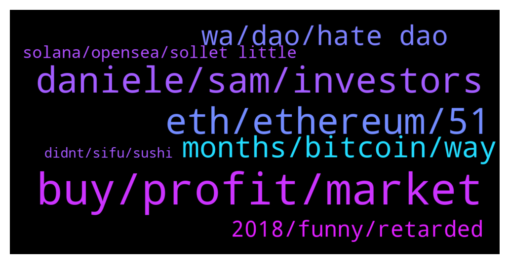

# **@shitpool**
 ## Analysis for **2022-02-02** - **2022-02-03**.

---

## 📊 **Basic Stats**

**n_messages_sent**: 250

---

---

## 🔝 **Top keywords and related messages**

1. **buy, profit, market**

    @Horselorde --- *I got into PayPal, Amazon, Apple, and eBay all at $1.* **--->** [TG Discussion](https://t.me/shitpool/722621)

    @wojackdegreate --- *Don’t forget to take profit before btc goes back to 33k and all that unrealized profit turns into an unrealized loss* **--->** [TG Discussion](https://t.me/shitpool/722338)

    @criptix --- *I would buy 60 imho - deeper if we go full blown bear market* **--->** [TG Discussion](https://t.me/shitpool/722637)

    @MoneroPal --- *Interesting little dApp that allows for stop-loss and limit orders on Trader Joe* **--->** [TG Discussion](https://t.me/shitpool/722583)

    @CryptoMike66 --- *As I understood, you are familiar with $AMB* **--->** [TG Discussion](https://t.me/shitpool/722681)

    @da0man --- *see SOL, +30% since u FUDed* **--->** [TG Discussion](https://t.me/shitpool/722332)

2. **eth, ethereum, 51**

    @MoneroPal --- *None of that bullshit is worth $250m they lost though. In all honesty ETH should just reverse the blocks on a network level and wormhole should pay miners. The hacks and outright thefts are bullshit and hurt the entire ecosystem more then anything.* **--->** [TG Discussion](https://t.me/shitpool/722868)

    @MoneroPal --- *It is highly unlikely ETH will be dethroned anytime soon it just hasn’t happaned. Nothing of importance has been built on AVAX, FTM, Polygon, SOL, or any of the new L1’s. Literally all dog shit projects, rugs, or VC exit scams. ETH is still king, yes it sucks, yes it’s slow, but it’s king.* **--->** [TG Discussion](https://t.me/shitpool/722496)

    @wojackdegreate --- *The fundamental security limits of bridges are actually a key reason why while I am optimistic about a multi-chain blockchain ecosystem (there really are a few separate communities with different values and it's better for them to live separately than all fight over influence on the same thing), I am pessimistic about cross-chain applications.  To understand why bridges have these limitations, we need to look at how various combinations of blockchains and bridging survive 51% attacks. Many people have the mentality that "if a blockchain gets 51% attacked, everything breaks, and so we need to put all our force on preventing a 51% attack from ever happening even once". I really disagree with this style of thinking; in fact, blockchains maintain many of their guarantees even after a 51% attack, and it's really important to preserve these guarantees.  For example, suppose that you have 100 ETH on Ethereum, and Ethereum gets 51% attacked, so some transactions get censored and/or reverted. No matter what happens, you still have your 100 ETH. Even a 51% attacker cannot propose a block that takes away your ETH, because such a block would violate the protocol rules and so it would get rejected by the network. Even if 99% of the hashpower or stake wants to take away your ETH, everyone running a node would just follow the chain with the remaining 1%, because only its blocks follow the protocol rules. More generally, if you have an application on Ethereum, then a 51% attack could censor or revert it for some time, but what comes out at the end is a consistent state. If you had 100 ETH, but sold it for 320000 DAI on Uniswap, even if the blockchain gets attacked in some arbitrary crazy way, at the end of the day you still have a sensible outcome - either you keep your 100 ETH or you get your 320000 DAI. The outcome where you get neither (or, for that matter, both) violates protocol rules and so would not get accepted.  Now, imaging what happens if you move 100 ETH onto a bridge on Solana to get 100 Solana-WETH, and then Ethereum gets 51% attacked. The attacker deposited a bunch of their own ETH into Solana-WETH and then reverted that transaction on the Ethereum side as soon as the Solana side confirmed it. The Solana-WETH contract is now no longer fully backed, and perhaps your 100 Solana-WETH is now only worth 60 ETH. Even if there's a perfect ZK-SNARK-based bridge that fully validates consensus, it's still vulnerable to theft through 51% attacks like this.  For this reason, it's always safer to hold Ethereum-native assets on Ethereum or Solana-native assets on Solana than it is to hold Ethereum-native assets on Solana or Solana-native assets on Ethereum. And in this context, "Ethereum" refers not just to the base chain, but also any proper L2 that is built on it. If Ethereum gets 51% attacked and reverts, Arbitrum and Optimism revert too, and so "cross-rollup" applications that hold state on Arbitrum and Optimism are guaranteed to remain consistent even if Ethereum gets 51% attacked. And if Ethereum does not get 51% attacked, there's no way to 51% attack Arbitrum and Optimism separately. Hence, holding assets issued on Optimism wrapped on Arbitrum is still perfectly safe.  The problem gets worse when you go beyond two chains. If there are 100 chains, then there will end up being dapps with many interdependencies between those chains, and 51% attacking even one chain would create a systemic contagion that threatens the economy on that entire ecosystem. This is why I think zones of interdependency are likely to align closely to zones of sovereignty (so, lots of Ethereum-universe applications interfacing closely with each other, lots of Avax-universe applications interfacing with each other, etc etc, but NOT Ethereum-universe and Avax-universe applications interfacing closely with each other)* **--->** [TG Discussion](https://t.me/shitpool/722738)

    @wojackdegreate --- *Eth to reimburse the wormhole bridge? 👀* **--->** [TG Discussion](https://t.me/shitpool/722822)

    @wojackdegreate --- *This is how frog nation has to commute to eth Denver now* **--->** [TG Discussion](https://t.me/shitpool/722519)

    @rocket_fuel --- *if eth were like #7 - nobody would give a damn* **--->** [TG Discussion](https://t.me/shitpool/722552)

3. **daniele, sam, investors**

    @da0man --- *He will team up with Daniele and restart the bull* **--->** [TG Discussion](https://t.me/shitpool/722412)

    @MoneroPal --- *He ran an unlicensed investment fund that produced fake front-projects to lure in investors and hid knowledge of convicted frauds managing it to raise money from investors, while using a sophisticated scheme to sell out of it. The attack vector here is Americans were harmed. He’ll eventually go down, they have it out for him already due to MIM and mentioned it at a senate hearing in the US. VC’s are all for this as well as it damages DeFi and digital assets industry overall goodwill.* **--->** [TG Discussion](https://t.me/shitpool/722457)

    @MoneroPal --- *Sam won’t touch Daniele with a 10 foot pole, 100% certain of that* **--->** [TG Discussion](https://t.me/shitpool/722418)

    @chatwithgera --- *dude will have all the jail time of bernie madoff with all the support of epstein when the feds get hold of him* **--->** [TG Discussion](https://t.me/shitpool/722455)

    @pizza_dog --- *He’s already touching him with his 10 foot hog* **--->** [TG Discussion](https://t.me/shitpool/722419)

    @wojackdegreate --- *Or he’s making money and eating well* **--->** [TG Discussion](https://t.me/shitpool/722438)

4. **months, bitcoin, way**

    @Léo --- *Can someone teach me some strategy to enter cryptocurrency releases??? Please!!!!* **--->** [TG Discussion](https://t.me/shitpool/722589)

    @MoneroPal --- *not really, they dumped a shit load of MIM and SPELL, they will likely milk it for whatever its worth until it all collapses* **--->** [TG Discussion](https://t.me/shitpool/722422)

    @wojackdegreate --- *There will always be another dip in crypto* **--->** [TG Discussion](https://t.me/shitpool/722354)

    @pizza_dog --- *Promising 50% + apys on stablecoins* **--->** [TG Discussion](https://t.me/shitpool/722753)

    @BeAMightyKing --- *I will exit all Crypto if #1 becomes fulfilled* **--->** [TG Discussion](https://t.me/shitpool/722734)

    @da0man --- *The most bullish quarter in crypto upon us soon* **--->** [TG Discussion](https://t.me/shitpool/722508)

5. **wa, dao, hate dao**

    @da0man --- *It’s that time of the cycle where I delete blockfolio and other apps and drown my sorrows in alcohol for a year or two* **--->** [TG Discussion](https://t.me/shitpool/722846)

    @wanker007 --- *Reading thru a list of rekt high APY Dao shit...wowow.  like 15...all trash rekt shit. Lmao* **--->** [TG Discussion](https://t.me/shitpool/722904)

    @R0mster --- *I can’t even follow wtf is going on with that shit.* **--->** [TG Discussion](https://t.me/shitpool/722818)

    @MoneroPal --- *lol dial 911, don’t dm brother 0.24* **--->** [TG Discussion](https://t.me/shitpool/722712)

    @R0mster --- *You couldn’t make this shit up if you tried.* **--->** [TG Discussion](https://t.me/shitpool/722327)

    @da0man --- *Don't DM me plz unless it's life and death* **--->** [TG Discussion](https://t.me/shitpool/722710)

6. **2018, funny, retarded**

    @wojackdegreate --- *So you’re telling me they’re not the future of France* **--->** [TG Discussion](https://t.me/shitpool/722914)

    @wanker007 --- *It'll be funny/not funny when most of these Alts are back to their late 2020 early 2021 levels.......* **--->** [TG Discussion](https://t.me/shitpool/722760)

    @OxZilla --- *Trying to compare 2018 to now is retarded* **--->** [TG Discussion](https://t.me/shitpool/722538)

    @da0man --- *that is why 2018 was so bad* **--->** [TG Discussion](https://t.me/shitpool/722351)

    @da0man --- *problem is if this is 2018, that is exactly when it will nuke* **--->** [TG Discussion](https://t.me/shitpool/722350)

    @Horselorde --- *I feel like this shit is gonna go for the entirety of 2022 lmao* **--->** [TG Discussion](https://t.me/shitpool/722328)

7. **solana, opensea, sollet little**

    @OxZilla --- *DeFi on solana is so retarded* **--->** [TG Discussion](https://t.me/shitpool/722823)

    @OxZilla --- *Sollet but it’s a little more technical I believe* **--->** [TG Discussion](https://t.me/shitpool/722836)

    @wojackdegreate --- *Yea, solanart, digitaleyes, magiceden or something like that* **--->** [TG Discussion](https://t.me/shitpool/722543)

    @rocket_fuel --- *does solana have an opensea thingy* **--->** [TG Discussion](https://t.me/shitpool/722542)

    @OxZilla --- *Solana dev goes something like this:* **--->** [TG Discussion](https://t.me/shitpool/722392)

    @criptix --- *The irony that swapman is a solana whale 🥲* **--->** [TG Discussion](https://t.me/shitpool/722795)

