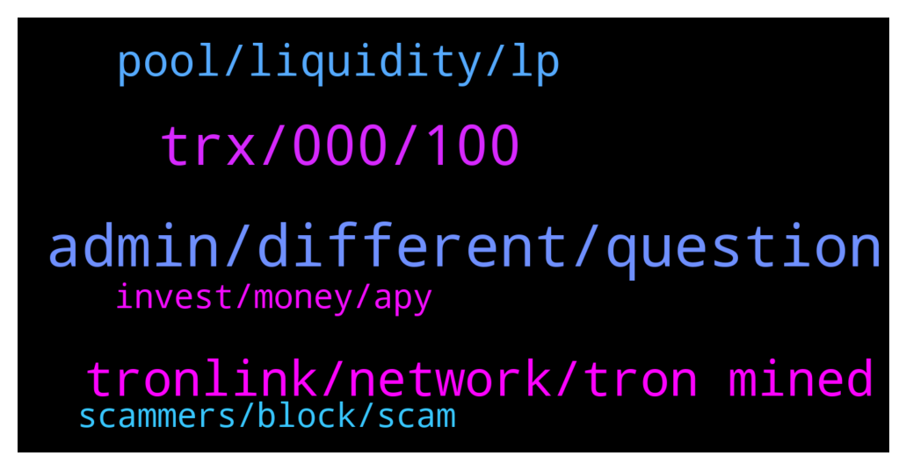

# **@tronnetworkEN**
 ## Analysis for **2022-02-02** - **2022-02-03**.

---

## 📊 **Basic Stats**

**n_messages_sent**: 213

---

---

## 🔝 **Top keywords and related messages**

1. **admin, different, question**

    @DmG_90 --- *For more you can ask here  https://t.me/apenftEN* **--->** [TG Discussion](https://t.me/tronnetworkEN/3869105)

    @Alina --- *Admin, please explain more about this, thank you* **--->** [TG Discussion](https://t.me/tronnetworkEN/3868503)

    @M --- *I know their moderators direct me to here* **--->** [TG Discussion](https://t.me/tronnetworkEN/3869106)

    @MilNoslen --- *I literally just told you where to go* **--->** [TG Discussion](https://t.me/tronnetworkEN/3867200)

    @agentpiki --- *If they are not in the channel, useless to ban* **--->** [TG Discussion](https://t.me/tronnetworkEN/3868607)

    @KingsDove_TRX --- *just lend is your friend 😁* **--->** [TG Discussion](https://t.me/tronnetworkEN/3867173)

2. **trx, 000, 100**

    @fa_hua --- *I am not familiar with TRX. The ecosystem looks more complicated than what I am used to* **--->** [TG Discussion](https://t.me/tronnetworkEN/3867165)

    @M --- *Sorry I don’t have the exact statement ready. But I can’t see if I’m top 100,000 and how are they able to* **--->** [TG Discussion](https://t.me/tronnetworkEN/3869099)

    @M --- *The statements reads Top 100,000 wallets on Tronlink* **--->** [TG Discussion](https://t.me/tronnetworkEN/3869098)

    @Oemer000 --- *Trx when do you make marketing* **--->** [TG Discussion](https://t.me/tronnetworkEN/3867806)

    @DmG_90 --- *From personal observations to be in the top 100k you need about 15-20k TRX* **--->** [TG Discussion](https://t.me/tronnetworkEN/3869079)

    @Md Appel --- *Its name is torntrx. I got a link from someone but I can't find him anymore. After accounting here, he gave 600trx and gave 7% bonus every day. At present I have 1080 trx. Then I seriously want to know today.* **--->** [TG Discussion](https://t.me/tronnetworkEN/3868745)

3. **tronlink, network, tron mined**

    @jj --- *Play and Like (PAL) trc 10.* **--->** [TG Discussion](https://t.me/tronnetworkEN/3866774)

    @DmG_90 --- *Its not tronlink, its for all tronwallets* **--->** [TG Discussion](https://t.me/tronnetworkEN/3869092)

    @M --- *Lol yeah I’ve gotten that answer a few times. But doesn’t change the Tronlink statement* **--->** [TG Discussion](https://t.me/tronnetworkEN/3869091)

    @ElkhatirYoussef --- *How can i add Tron Network to Metamask?* **--->** [TG Discussion](https://t.me/tronnetworkEN/3867553)

    @Carlos_TRX --- *what miner? TRON CAN NOT BE MINED* **--->** [TG Discussion](https://t.me/tronnetworkEN/3866615)

    @Stinky_Pinky --- *What's the difference between old BTT and new BTT?* **--->** [TG Discussion](https://t.me/tronnetworkEN/3869178)

4. **pool, liquidity, lp**

    @fa_hua --- *I unstaked from LP mining page yes, but restaked on « pool » within the « swap » tab* **--->** [TG Discussion](https://t.me/tronnetworkEN/3867155)

    @fa_hua --- *I actually unstaked. And it did go to my wallet. But I thought I made a mistake so I went back and added it again 😢 now I can see my liquidity but cannot remove nor see it in the pool as it is ended* **--->** [TG Discussion](https://t.me/tronnetworkEN/3867135)

    @fa_hua --- *On sunswap, it’s possible to add liquidity in « swap » / « pool »* **--->** [TG Discussion](https://t.me/tronnetworkEN/3867142)

    @MilNoslen --- *You unstaked from the LP mining page, then restaked it again on the LP mining page?* **--->** [TG Discussion](https://t.me/tronnetworkEN/3867151)

    @fa_hua --- *Hi all, I just realized the LP pools have been ended on January 21 but now it seems I can’t remove my liquidity?* **--->** [TG Discussion](https://t.me/tronnetworkEN/3867131)

    @fa_hua --- *Yeah but the pool as ended so I don’t see it there 😜* **--->** [TG Discussion](https://t.me/tronnetworkEN/3867180)

5. **scammers, block, scam**

    @Frendy --- *Hay,, do you think all Tron mining site over there is really Legit???* **--->** [TG Discussion](https://t.me/tronnetworkEN/3869436)

    @telusnet1 --- *Not all mining sites are legitimate. Read the review of the site first ...... But yes some sites have been paying out.* **--->** [TG Discussion](https://t.me/tronnetworkEN/3869439)

    @DmG_90 --- *These are scammers, ignore and block them to be safe* **--->** [TG Discussion](https://t.me/tronnetworkEN/3869071)

    @agentpiki --- *Oh yeah it is. Thank you. Reporting this.* **--->** [TG Discussion](https://t.me/tronnetworkEN/3867365)

    @Carlos_TRX --- *No, all bots are fake, beware* **--->** [TG Discussion](https://t.me/tronnetworkEN/3867016)

    @agentpiki --- *Say good bye to that scam.  Don't bring that garbage again or else I will see it as promotion of scam* **--->** [TG Discussion](https://t.me/tronnetworkEN/3868756)

6. **invest, money, apy**

    @agentpiki --- *What is the name of the platform you are investing* **--->** [TG Discussion](https://t.me/tronnetworkEN/3868743)

    @Deiiva --- *That’s the command to show the msg right before yours, where the bot explains good and legit alternatives to invest* **--->** [TG Discussion](https://t.me/tronnetworkEN/3869211)

    @Carlos_TRX --- *There is no free money, invest and stary to earn* **--->** [TG Discussion](https://t.me/tronnetworkEN/3869194)

    @agentpiki --- *Invest first, ask later.  Come to official channel and ask lol* **--->** [TG Discussion](https://t.me/tronnetworkEN/3868754)

    @Emmanuel --- *How can I get easy money* **--->** [TG Discussion](https://t.me/tronnetworkEN/3866815)

    @Carlos_TRX --- *Dont know, u have invested there, try to look for some website* **--->** [TG Discussion](https://t.me/tronnetworkEN/3868295)

