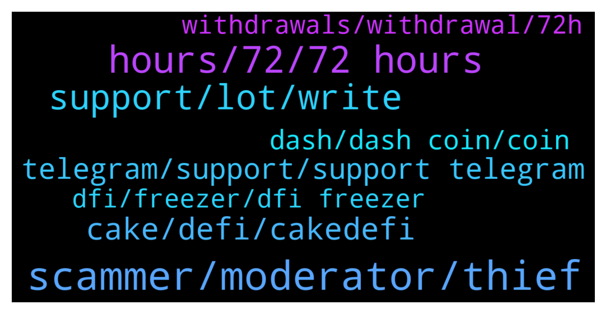

# **@CakeDeFi_EN**
 ## Analysis for **2022-02-03** - **2022-02-04**.

---

## 📊 **Basic Stats**

**n_messages_sent**: 507

---

---

## 🔝 **Top keywords and related messages**

1. **scammer, moderator, thief**

    @mamajamapuma --- *Seems like very serious allegations that you have to prove my friend. You’re just tainting the name of another member unnecessarily and it is very uncalled tor* **--->** [TG Discussion](https://t.me/CakeDeFi_EN/172092)

    @YSL --- *Silly question. The only way scammer can access our account if we ourself provide them the information or click on the fake link right? Can’t be just chatting with them ll be able to access our account right ? Need to be sure how scammer can access our account* **--->** [TG Discussion](https://t.me/CakeDeFi_EN/171390)

    @mamajamapuma --- *You’re just alleging without evidence. If you’ve been scammed then I’m sorry but you have to be more vigilant* **--->** [TG Discussion](https://t.me/CakeDeFi_EN/172095)

    @Javixo --- *I know scammers are not here; just warning people 😊* **--->** [TG Discussion](https://t.me/CakeDeFi_EN/171983)

    @BerndMack --- *just report them to a moderator (a real one:) )* **--->** [TG Discussion](https://t.me/CakeDeFi_EN/171226)

    @War --- *I only want to talk to a moderator, you thief, the scammer was very certain and mentioned you as the matermind chan.* **--->** [TG Discussion](https://t.me/CakeDeFi_EN/172089)

2. **hours, 72, 72 hours**

    @selahattingizli1 --- *Hello  it has received 60 approvals but is still pending What's the problem* **--->** [TG Discussion](https://t.me/CakeDeFi_EN/172126)

    @Mehmet --- *In a volatile market this is a long time. People can be nervous. We ask you to speed up our request.* **--->** [TG Discussion](https://t.me/CakeDeFi_EN/171837)

    @Michael_Schredl --- *72 Hours are the maximum, usually it takes around 1 hour* **--->** [TG Discussion](https://t.me/CakeDeFi_EN/172416)

    @Michael_Schredl --- *It can take up to 72 hours* **--->** [TG Discussion](https://t.me/CakeDeFi_EN/171940)

    @Malii007 --- *waiting in the process i asked for it* **--->** [TG Discussion](https://t.me/CakeDeFi_EN/171238)

    @Malii007 --- *I have confirmed the e-mail. but it's still in processing.* **--->** [TG Discussion](https://t.me/CakeDeFi_EN/171243)

3. **support, lot, write**

    @Malii007 --- *Let's wait, if there is a problem, I will write to you.* **--->** [TG Discussion](https://t.me/CakeDeFi_EN/171249)

    @Lebroncuk --- *is there an address I can email for support?* **--->** [TG Discussion](https://t.me/CakeDeFi_EN/171285)

    @The_Euphoria69 --- *But u didnt nothing nice support* **--->** [TG Discussion](https://t.me/CakeDeFi_EN/172368)

    @Michael_Schredl --- *That is the rule, can't change anything about that* **--->** [TG Discussion](https://t.me/CakeDeFi_EN/171821)

    @DmgBautista --- *But please, do as Michael said and make sure that all the requirements were met, otherwise will be you and support losing time 😅 I'm sure you understand 🙂* **--->** [TG Discussion](https://t.me/CakeDeFi_EN/172408)

    @Michael_Schredl --- *Hmm and you are sure that all requirements are met? https://support.cakedefi.com/hc/en-us/articles/4404348275609-Will-my-referees-and-I-be-eligible-for-the-limited-time-promotion-bonus-  If yes, take a look at Daniels link and contact the support :)* **--->** [TG Discussion](https://t.me/CakeDeFi_EN/172406)

4. **cake, defi, cakedefi**

    @jezzkng --- *Hello! please make reference here, user in India is able to use Cake DeFi service  https://support.cakedefi.com/hc/en-us/articles/360040335072-Which-countries-are-currently-not-able-to-use-the-Cake-DeFi-Services-* **--->** [TG Discussion](https://t.me/CakeDeFi_EN/172038)

    @Michael_Schredl --- *That are the laws in singapore, where Cake DeFi is located* **--->** [TG Discussion](https://t.me/CakeDeFi_EN/171845)

    @LovecLetadeL --- *Hi any admin here? Can i ask if cakedefi is available in India? If yes wat need for Verification.  Thank you in advance for those who will reply . 😊* **--->** [TG Discussion](https://t.me/CakeDeFi_EN/172037)

    @Michael_Schredl --- *Hey welcome. Start your DeFi Journey Here: Cake  DeFi Services Simply Explained https://support.cakedefi.com/hc/en-us/articles/900003427506-Cake-Service-simply-explained* **--->** [TG Discussion](https://t.me/CakeDeFi_EN/171631)

    @mm_phoenix --- *cakedefi is a central company offering defi products.  More -> https://support.cakedefi.com/hc/en-us/articles/900003427506-Cake-Service-einfach-erkl%C3%A4rt* **--->** [TG Discussion](https://t.me/CakeDeFi_EN/171180)

    @Kassius84 --- *Hey welcome. Start your DeFi Journey Here: Cake  DeFi Services Simply Explained https://support.cakedefi.com/hc/en-us/articles/900003427506-Cake-Service-simply-explained* **--->** [TG Discussion](https://t.me/CakeDeFi_EN/171367)

5. **telegram, support, support telegram**

    @Batuhan --- *72 hours is a very long time. That's why people can be defrauded from fake telegram accounts. and people are afraid that the money will not be withdrawn.* **--->** [TG Discussion](https://t.me/CakeDeFi_EN/171889)

    @zachgax --- *There is no support in Telegram. Mods are also not support. You have to open a ticket here. This is the only official channel for support https://support.cakedefi.com/hc/en-us/requests/new* **--->** [TG Discussion](https://t.me/CakeDeFi_EN/171977)

    @Kassius84 --- *No official support via Telegram. It's a Community Channel. If someone sends you a direct message and claims to be Moderator, Admin or Cake DeFi Staff, be aware it's scam i* **--->** [TG Discussion](https://t.me/CakeDeFi_EN/172241)

    @DmgBautista --- *Good morning guys! @zachgax it seems you had a rough night 😕   Unfortunatelly when users don't read the basics on safety and how to avoid scams, that are posted every single day several times a day, such can happen.  Sorry that you had to go through that.  All users, and once again, mods don't DM or call and there is no support on telegram. If someone sends you an unsolicited DM or call, whoever it may seem to be, just block and report. Plain simple as that.  Best regards! 👍* **--->** [TG Discussion](https://t.me/CakeDeFi_EN/172135)

    @BerndMack --- *Take care, there is no Support via telegram, you will get some DMs from "FakeAdmins"!* **--->** [TG Discussion](https://t.me/CakeDeFi_EN/171515)

    @Arne --- *No moderators will ever message you on Telegram.* **--->** [TG Discussion](https://t.me/CakeDeFi_EN/172310)

6. **dash, dash coin, coin**

    @jerzysz --- *i need help paying dash where i can get it* **--->** [TG Discussion](https://t.me/CakeDeFi_EN/172401)

    @ertanyildirim75 --- *I requested a dash coin withdrawal.  It's been about 17 hours.  It says transaction pending.  there is no problem, right* **--->** [TG Discussion](https://t.me/CakeDeFi_EN/172016)

    @ertanyildirim75 --- *It is not right for you to keep people waiting for dash coin withdrawal.  This is a development that affects the stock market badly.* **--->** [TG Discussion](https://t.me/CakeDeFi_EN/171778)

    @DmgBautista --- *Hi! Please try to not use other users/mods conversation sequences, as it mixes subjects and may leave users without answer. What do you mean with help paying Dash?* **--->** [TG Discussion](https://t.me/CakeDeFi_EN/172404)

    @Moruq1 --- *Yes, Dash coin over 50 usdt* **--->** [TG Discussion](https://t.me/CakeDeFi_EN/172351)

    @aliberci --- *I made a dash withdrawal, how long does it take* **--->** [TG Discussion](https://t.me/CakeDeFi_EN/171613)

7. **dfi, freezer, dfi freezer**

    @Moruq1 --- *1.9 bro 5usd it's from learn quiz* **--->** [TG Discussion](https://t.me/CakeDeFi_EN/172403)

    @Michael_Schredl --- *How many DFI do you have in your account?* **--->** [TG Discussion](https://t.me/CakeDeFi_EN/172400)

    @Ynlmz0 --- *Can dfi coins be withdrawn? If so , to which exchanges* **--->** [TG Discussion](https://t.me/CakeDeFi_EN/171733)

    @DmgBautista --- *Highly doubt that may exist a problem. Being a first time deposit and if you withdraw DFI using the defichain network for a compatible and supported exchange, everything will work ok :) Will surelly be on manual revision for it. But if it's the case, may take up to 72h for that verification.* **--->** [TG Discussion](https://t.me/CakeDeFi_EN/171252)

    @Malii007 --- *yes I used DFI chain. I had withdraw before, it took a very short time. Now I'm surprised it took so long.* **--->** [TG Discussion](https://t.me/CakeDeFi_EN/171255)

    @Michael_Schredl --- *Yes, you can send dfi from you DeFiChain or Exchange Wallet to his Account* **--->** [TG Discussion](https://t.me/CakeDeFi_EN/171671)

