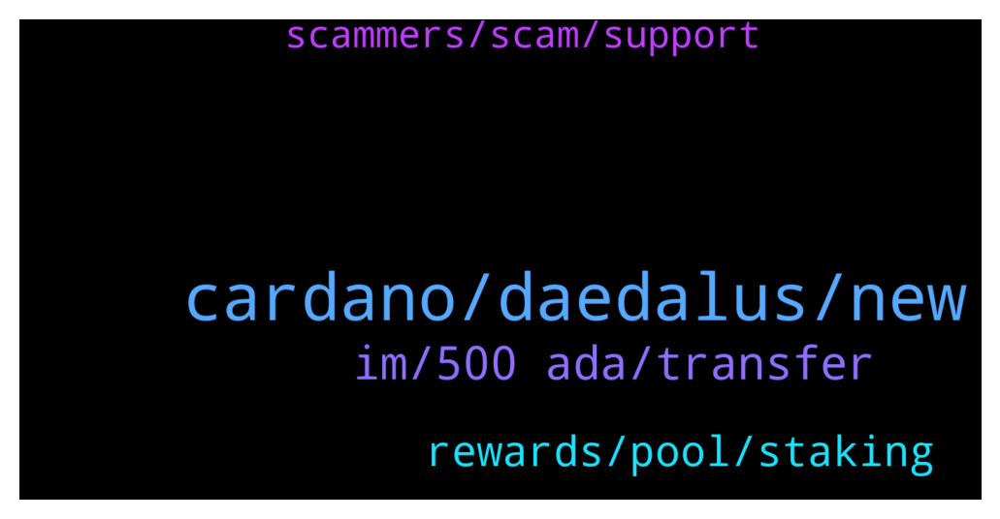

# **@Cardano**
 ## Analysis for **2022-02-03** - **2022-02-04**.

---

## 📊 **Basic Stats**

**n_messages_sent**: 92

---

---

## 🔝 **Top keywords and related messages**

1. **cardano, daedalus, new**

    @Nicolasfont --- *Wtf is going on with daedalus?? Can't update to new version. Keep crashing* **--->** [TG Discussion](https://t.me/Cardano/778536)

    @appleFxxxPen --- *My goodness the new Daedalus wallet took almost half day to update it madness….* **--->** [TG Discussion](https://t.me/Cardano/778488)

    @ExInfernis --- *did anyone had problems with installing 4.8.0 of daedalus? I receive Error opening file for wriing: C;\Program Files\Daedalus Mainnet\Daedalus Mainnet.exe* **--->** [TG Discussion](https://t.me/Cardano/778420)

    @Nicolasfont --- *Yes I did. I'm not new. Dealing with daedalus since over a year. I just restarted my laptop and this time it did work. So for those having the same issue just restart laptop and that should be ok.* **--->** [TG Discussion](https://t.me/Cardano/778542)

    @Lgbeano --- *Wtf, Have you closed daedalus to download the new version?* **--->** [TG Discussion](https://t.me/Cardano/778539)

    @bextmany --- *Please where can I find information on how to setup hardware wallet? Would like to transfer my online wallet to my new ledger nano x* **--->** [TG Discussion](https://t.me/Cardano/778290)

2. **im, 500 ada, transfer**

    @domib97 --- *Does anyone tried https://transak.com/ yet? This is from the TerraLuna ecosystem and could help mainstream people to get some ADA too, without big complicated exchanges. As an EU-citizen I can do SEPA Bank Transfer.  I think this is a game changer.* **--->** [TG Discussion](https://t.me/Cardano/778048)

    @Iohkcharles --- *EUTXO makes this particular issue impossible by design* **--->** [TG Discussion](https://t.me/Cardano/778050)

    @Benjade --- *hello, when we vote we recover our 500 Ada ?* **--->** [TG Discussion](https://t.me/Cardano/778093)

    @Dionysis --- *Hello everyone! Quick question: can I transfer my ada from one wallet to another while they are delegated, without unstaking them? Is there a way?* **--->** [TG Discussion](https://t.me/Cardano/778502)

    @Coltey --- *yes you can, your ada is not locked* **--->** [TG Discussion](https://t.me/Cardano/778503)

    @Benjade --- *Where Crypto investors rush to buy ADA ? ADA still very low.. Fake news 😂* **--->** [TG Discussion](https://t.me/Cardano/778031)

3. **rewards, pool, staking**

    @Lgbeano --- *Depends whether your other wallet is delegated or not. You register the wallets staking key, so anything in there is delegated.   If you move your ₳ from one staked wallet to another, your old wallet will continue receiving the rewards from that ₳ for three epochs, before your new wallet takes over. So you never lose out on rewards* **--->** [TG Discussion](https://t.me/Cardano/778529)

    @... --- *If i want to redelegate, how can i avoid losing rewards this epoch?* **--->** [TG Discussion](https://t.me/Cardano/778195)

    @jack44sk8 --- *Just something safe to hold and staking in the pools usually when I want to use a dapp i send some to nami* **--->** [TG Discussion](https://t.me/Cardano/778554)

    @Lgbeano --- *Just delegate to a new pool, you will continue receiving rewards from the old pool before your new pool takes over. You will not lose any rewards* **--->** [TG Discussion](https://t.me/Cardano/778196)

    @Lgbeano --- *Just send them like normal. Your ₳ tokens are never locked when staking, they remain in your wallet under your complete control.* **--->** [TG Discussion](https://t.me/Cardano/778504)

    @... --- *Will i not lose rewards from this epoch?* **--->** [TG Discussion](https://t.me/Cardano/778203)

4. **scammers, scam, support**

    @glitch04 --- *First don't respond to users that dm you they are scammers* **--->** [TG Discussion](https://t.me/Cardano/778439)

    @bextmany --- *This was actually a scam bait. I was waiting for them on my DM. I love putting curses on them* **--->** [TG Discussion](https://t.me/Cardano/778296)

    @Lgbeano --- *IGNORE EVERY PRIVATE MESSAGE, ALL SCAMS* **--->** [TG Discussion](https://t.me/Cardano/778291)

    @glitch04 --- *if someone says otherwise or dm's you then it's a scam* **--->** [TG Discussion](https://t.me/Cardano/778145)

    @glitch04 --- *Use the channel listed above anyone that dm's you is a scammer* **--->** [TG Discussion](https://t.me/Cardano/778018)

    @glitch04 --- *best to ask their support https://t.me/Cardano/778144* **--->** [TG Discussion](https://t.me/Cardano/778385)

