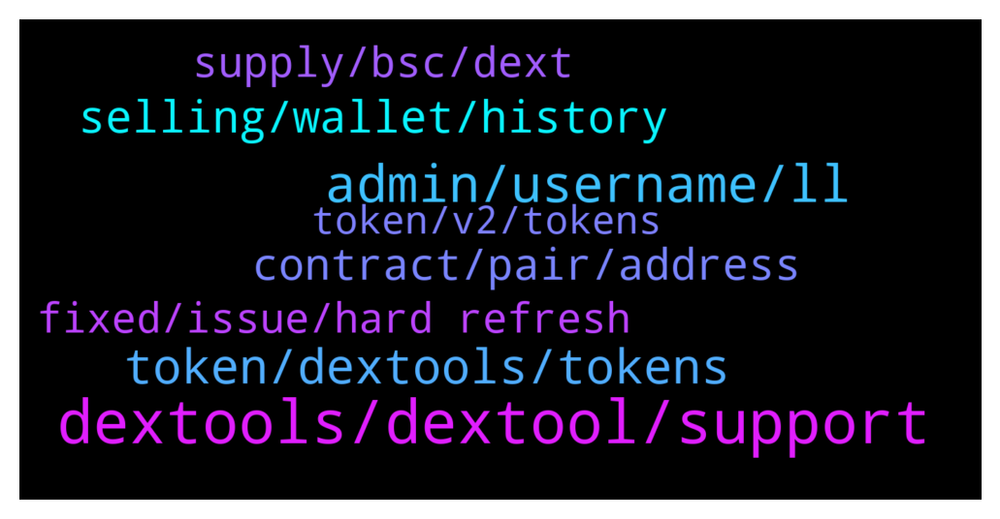

# **@DEXToolsCommunity**
 ## Analysis for **2022-02-02** - **2022-02-04**.

---

## 📊 **Basic Stats**

**n_messages_sent**: 339

---

---

## 🔝 **Top keywords and related messages**

1. **dextools, dextool, support**

    @whaleishh --- *Smh dextools. Get your shit together.* **--->** [TG Discussion](https://t.me/DEXToolsCommunity/330546)

    @rapido30 --- *A fail on dextools has been exploited ?* **--->** [TG Discussion](https://t.me/DEXToolsCommunity/330496)

    @napascual --- *This is DEXTools support, refer to https://t.me/DEXTtraderslounge please* **--->** [TG Discussion](https://t.me/DEXToolsCommunity/330224)

    @bastardganpunk --- *must be a general issue on dextools side I guess. The devs are looking into it now 🙂* **--->** [TG Discussion](https://t.me/DEXToolsCommunity/330495)

    @MademoiselleDL --- *Yes, but is there a limit to it on Dextools ?* **--->** [TG Discussion](https://t.me/DEXToolsCommunity/331162)

    @hmk18990 --- *this is dextools support, you can use https://t.me/DEXTtraderslounge for other talks.* **--->** [TG Discussion](https://t.me/DEXToolsCommunity/330140)

2. **admin, username, ll**

    @E --- *but now you know 100 percent it's a scam why don't you stop it at least more people don't fall for it* **--->** [TG Discussion](https://t.me/DEXToolsCommunity/331142)

    @crypto0o0o0o --- *always telling me have to be an admin, I am the owner of the group* **--->** [TG Discussion](https://t.me/DEXToolsCommunity/331069)

    @e_nois_na_fita --- *That your admin @pablojan  dm me first* **--->** [TG Discussion](https://t.me/DEXToolsCommunity/330984)

    @napascual --- *He WONT DM FIRST. Be aware of scammers* **--->** [TG Discussion](https://t.me/DEXToolsCommunity/330775)

    @Thomas --- *How do I get hooked up with an admin and be sure it's not a scammer?* **--->** [TG Discussion](https://t.me/DEXToolsCommunity/330579)

    @e_nois_na_fita --- *@Pablojan are you one of the admins here?* **--->** [TG Discussion](https://t.me/DEXToolsCommunity/330972)

3. **token, dextools, tokens**

    @oni_o_n --- *good morning all, can someone please inform me how to update the dextools info for a token that I deployed* **--->** [TG Discussion](https://t.me/DEXToolsCommunity/330265)

    @napascual --- *There are 1M tokens around, you need to DYOR. Dextools metrics are automatic checks, they help you out, but won’t advise you to buy a token* **--->** [TG Discussion](https://t.me/DEXToolsCommunity/330766)

    @Killthezerotoken --- *how to update token symbol on Dextools?* **--->** [TG Discussion](https://t.me/DEXToolsCommunity/331150)

    @stanes --- *It's not how it works: We index all the pairs present on the DEXs we support. Once again: there is no listing process. We give some tools to users to downvote a pair if they think it's a scam. When you are interacting with some DEXs, you have to be extremely careful, most of the coins are scams or will anyway be valueless in the future.  Always DYOR, apeing any token without knowing anything about it is throwing your money away.* **--->** [TG Discussion](https://t.me/DEXToolsCommunity/331144)

    @kryptoUSA --- *When a token cannot be sold , is it possible for dextools to put a red banner with note on the token page?* **--->** [TG Discussion](https://t.me/DEXToolsCommunity/331236)

    @FS_LT --- *Hello. Not sure if this is the right one but how do we edit information of our token on dex. Like add websites, socials. Thank you!* **--->** [TG Discussion](https://t.me/DEXToolsCommunity/331100)

4. **selling, wallet, history**

    @freudyung --- *Basically I got in right I bought the bottom; which I thought was bottom, then they sold and price of crypto tanked* **--->** [TG Discussion](https://t.me/DEXToolsCommunity/330756)

    @AX3L_R0SE --- *all sells showing from our marketing wallet* **--->** [TG Discussion](https://t.me/DEXToolsCommunity/330670)

    @HOBOCRUNCH --- *says a team wallet is selling* **--->** [TG Discussion](https://t.me/DEXToolsCommunity/330484)

    @AX3L_R0SE --- *@admin what's with this glitch on ETH showing marketing wallets/deployer selling ??* **--->** [TG Discussion](https://t.me/DEXToolsCommunity/330648)

    @HOBOCRUNCH --- *so ya'll gonna be able to fix that my token says a team wallet selling when it's literally just a buyer?* **--->** [TG Discussion](https://t.me/DEXToolsCommunity/330473)

    @FomoSapien --- *i am releasing a new coin called Excrement Token and I was wondering how much it would cost for trending on the ticker? i did not see anything about it when i looked* **--->** [TG Discussion](https://t.me/DEXToolsCommunity/330764)

5. **contract, pair, address**

    @CryptoFatherBoard --- *I want to be sure which exactly is the right contract* **--->** [TG Discussion](https://t.me/DEXToolsCommunity/330878)

    @FloooCrypto --- *We airdropped all old holders 1:1 the amount they had on V1 of the contract* **--->** [TG Discussion](https://t.me/DEXToolsCommunity/330396)

    @FloooCrypto --- *Do you also need the old contract?* **--->** [TG Discussion](https://t.me/DEXToolsCommunity/330393)

    @stanes --- *DEXT UNISWAP PAIR Chart and trade: https://www.dextools.io/app/uniswap/pair-explorer/0xa29fe6ef9592b5d408cca961d0fb9b1faf497d6d Contract: 0xfb7b4564402e5500db5bb6d63ae671302777c75a  DEXT PANCAKESWAP PAIR Chart and trade: https://www.dextools.io/app/pancakeswap/pair-explorer/0x4b729d5d871057f3a9c424792729217cde72410d Contract: 0xe91a8d2c584ca93c7405f15c22cdfe53c29896e3* **--->** [TG Discussion](https://t.me/DEXToolsCommunity/330858)

    @JoeyDieleman --- *Above are the right contracts, as Stanes already gave too* **--->** [TG Discussion](https://t.me/DEXToolsCommunity/330882)

    @stanes --- *Yeah, that's absolutely not a pb, the issue is with the api provider but not related to your old contract. We will see what we can do.* **--->** [TG Discussion](https://t.me/DEXToolsCommunity/330398)

6. **supply, bsc, dext**

    @stanes --- *What is important is the supply on Ethereum. Supply on BSC will never represent the total supply unless 100% of the tokens are bridged.* **--->** [TG Discussion](https://t.me/DEXToolsCommunity/330890)

    @CryptoFatherBoard --- *This particular contract shows 2.8 million supply on BSCScan... 👇👇👇👇0xe91a8d2c584ca93c7405f15c22cdfe53c29896e3* **--->** [TG Discussion](https://t.me/DEXToolsCommunity/330877)

    @CryptoFatherBoard --- *This particular bsc contract has supply of 2.8 million token, while the other contract on dextool website says 200 million token supply.. Can you explain sir* **--->** [TG Discussion](https://t.me/DEXToolsCommunity/330874)

    @stanes --- *Both are rights, it only depends if you want to buy on ETh or BSC.* **--->** [TG Discussion](https://t.me/DEXToolsCommunity/330883)

    @CryptoFatherBoard --- *Now i understand... That means 100% of supply not bridge... Am i right?* **--->** [TG Discussion](https://t.me/DEXToolsCommunity/330891)

    @CryptoFatherBoard --- *Okay, am just trying to learn how supply on Ethereum side is more higher than the binance side* **--->** [TG Discussion](https://t.me/DEXToolsCommunity/330886)

7. **fixed, issue, hard refresh**

    @Cryptoflencer --- *ffs disable the function until you fixed it. Should be a fking basic move.* **--->** [TG Discussion](https://t.me/DEXToolsCommunity/330682)

    @stanes --- *It looks fine now for me.* **--->** [TG Discussion](https://t.me/DEXToolsCommunity/330669)

    @napascual --- *It has been fixed and regenerated already* **--->** [TG Discussion](https://t.me/DEXToolsCommunity/330530)

    @napascual --- *It’s already fixed, no need to move anything* **--->** [TG Discussion](https://t.me/DEXToolsCommunity/330683)

    @stanes --- *Devs just fixed the issue. Thanks for reporting 👍* **--->** [TG Discussion](https://t.me/DEXToolsCommunity/330399)

    @stanes --- *Could you try a hard refresh of the page please? CTRL+F5* **--->** [TG Discussion](https://t.me/DEXToolsCommunity/330915)

