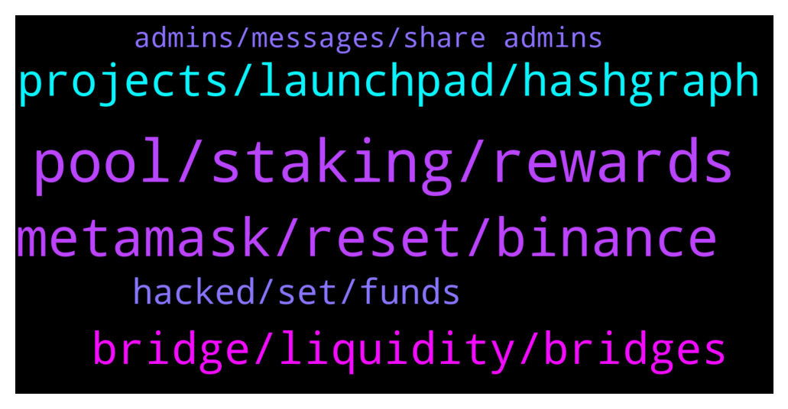

# **@Fantom_English**
 ## Analysis for **2022-02-03** - **2022-02-04**.

---

## 📊 **Basic Stats**

**n_messages_sent**: 141

---

---

## 🔝 **Top keywords and related messages**

1. **pool, staking, rewards**

    @Mcjig --- *Rewards: currently ~13% APY (Normal APY on self-stake + 15% of delegators' rewards). APY varies based on staked %* **--->** [TG Discussion](https://t.me/Fantom_English/646657)

    @Trinity --- *What does the delegate stands for* **--->** [TG Discussion](https://t.me/Fantom_English/647102)

    @kaysee00 --- *Hi everyone, I understand that staking rewards are paid out from   a pool, what happens when it’s empty?  Can the staking rewards be paid out from transaction fees in future?   Is the low fees be able to cope?* **--->** [TG Discussion](https://t.me/Fantom_English/646890)

    @TheBDan --- *So can you give an estimated for the current delegators reward?* **--->** [TG Discussion](https://t.me/Fantom_English/646660)

    @TheBDan --- *How much does a validator node earns compared to just staking your ftm for a year?* **--->** [TG Discussion](https://t.me/Fantom_English/646654)

    @Mcjig --- *13% is what you get as self stake* **--->** [TG Discussion](https://t.me/Fantom_English/646662)

2. **metamask, reset, binance**

    @karfei00 --- *Dear all anyone knows how to transfer USDC to ftm network from binance cex?* **--->** [TG Discussion](https://t.me/Fantom_English/647259)

    @conflead --- *Hello!  why erc 1155 tokens are not tracked by ftmscan?* **--->** [TG Discussion](https://t.me/Fantom_English/647158)

    @slickrick6 --- *how to resolve pending txs ?  1. reset metamask go to metamask setting -> advanced -> reset reset metamask will only clear pending tx   2. add other RPC for back up Fantom RPC : a. https://rpc.ftm.tools/ b. https://rpc.ankr.com/fantom c. https://ftmrpc.ultimatenodes.io/   ChainID: 250 Symbol: FTM Browser : https://ftmscan.com  3. after reset metamask and add other rpc re-do your tx, check gas price here https://ftm.guru/fantomscan.html* **--->** [TG Discussion](https://t.me/Fantom_English/647350)

    @pajamasfreak --- *Use cex like binance is much easier for now* **--->** [TG Discussion](https://t.me/Fantom_English/647067)

    @slickrick6 --- *You can’t deposit ftm usdc to binance* **--->** [TG Discussion](https://t.me/Fantom_English/646943)

    @Val_Val10 --- *what better price to buy ftm Please* **--->** [TG Discussion](https://t.me/Fantom_English/646651)

3. **projects, launchpad, hashgraph**

    @salemkode --- *Are there bonus projects in Fantom* **--->** [TG Discussion](https://t.me/Fantom_English/646962)

    @HeyRodri --- *We really, really need a decent DEX in fantom, do we know if 1inch is going to onboard in Fantom? I want to sell 0.18092595. In Fantom (Firebirdswap or Beethoven) it´s 6717 while on 1inch polygon it´s 6741* **--->** [TG Discussion](https://t.me/Fantom_English/647078)

    @CryptoTheDreamer --- *Is fantoms only purpose is to support eth or independent from eth* **--->** [TG Discussion](https://t.me/Fantom_English/647054)

    @Gondaliza --- *What are the best platforms to find new projects launching on Fantom?* **--->** [TG Discussion](https://t.me/Fantom_English/647222)

    @Kay246 --- *Please I need a link to fantom wallet* **--->** [TG Discussion](https://t.me/Fantom_English/647216)

    @law_giver --- *Whats the difference between Fanton and Hashgraph ?* **--->** [TG Discussion](https://t.me/Fantom_English/647208)

4. **bridge, liquidity, bridges**

    @quevivacris --- *No FTM liquidity on bridges, that sucks!* **--->** [TG Discussion](https://t.me/Fantom_English/647015)

    @pajamasfreak --- *Never bridge wbtc, no info. You can try and explore those bridges above and ask their admins for better route and liquidity.* **--->** [TG Discussion](https://t.me/Fantom_English/647093)

    @HeyRodri --- *So I want to move WBTC from Fantom to Polygon. All the bridges dont´t have WBTC so I need to sell WBTC. to USDT to then use the anyswap bridge. So I have to sell the WBTC to have the usdt and be able to bridge* **--->** [TG Discussion](https://t.me/Fantom_English/647081)

    @quevivacris --- *There is no liquidity on most bridges, when will this be solved?* **--->** [TG Discussion](https://t.me/Fantom_English/647164)

    @wassoB --- *Hello! Our EverBridge was recently added to FTM foundation site under cross-chain bridge, is it possible to add in the telegram list also?* **--->** [TG Discussion](https://t.me/Fantom_English/647296)

    @Israel --- *Hey guys. Im trying to use spookyswap to bridge my ftm over to the ftm network but it won't let me because of insufficient liquidity. how can i go around this?* **--->** [TG Discussion](https://t.me/Fantom_English/646687)

5. **hacked, set, funds**

    @Chucky --- *Damn sorry to hear that. Can I ask how was it hacked? Want to make sure I don’t make the same mistake… this chat has the most scammer btw* **--->** [TG Discussion](https://t.me/Fantom_English/646670)

    @hirakusan --- *Solana is not only get trouble network,but also get hacked 👀* **--->** [TG Discussion](https://t.me/Fantom_English/646618)

    @Daytriper --- *ouffffff thank you from my part  had the same issue shitted my pants thought my wallet was compromised ....🙌🏾* **--->** [TG Discussion](https://t.me/Fantom_English/646521)

    @secondvald --- *what does getting hacked imply here?* **--->** [TG Discussion](https://t.me/Fantom_English/646645)

    @SamSakamoto --- *Did WFTM get hacked or was that ETH?* **--->** [TG Discussion](https://t.me/Fantom_English/646610)

    @LONGDONGWONG --- *pls for the love of god...get a proper antivirus / shield and pay for the subscription.... its worth every penny* **--->** [TG Discussion](https://t.me/Fantom_English/646671)

6. **admins, messages, share admins**

    @L DILLI --- *Dear Admin..... upcoming events details pls share 🙏🤗🙏🙏🤗* **--->** [TG Discussion](https://t.me/Fantom_English/646726)

    @HeyRodri --- *Please, scammer stop contacing me! I wont answer any DM even if you say ¨Fantom Support¨* **--->** [TG Discussion](https://t.me/Fantom_English/647085)

    @slickrick6 --- *Please dm one of the other admins* **--->** [TG Discussion](https://t.me/Fantom_English/646545)

    @Kassemhamzeh --- *Kindly sir check your messages when you are free* **--->** [TG Discussion](https://t.me/Fantom_English/647004)

    @Advert_Maxim --- *Sup everyone! Is there any admins who I can contact for partnership proposes?* **--->** [TG Discussion](https://t.me/Fantom_English/646886)

    @amaprince3 --- *When is the ama voice chat I have a suggestion?* **--->** [TG Discussion](https://t.me/Fantom_English/646830)

