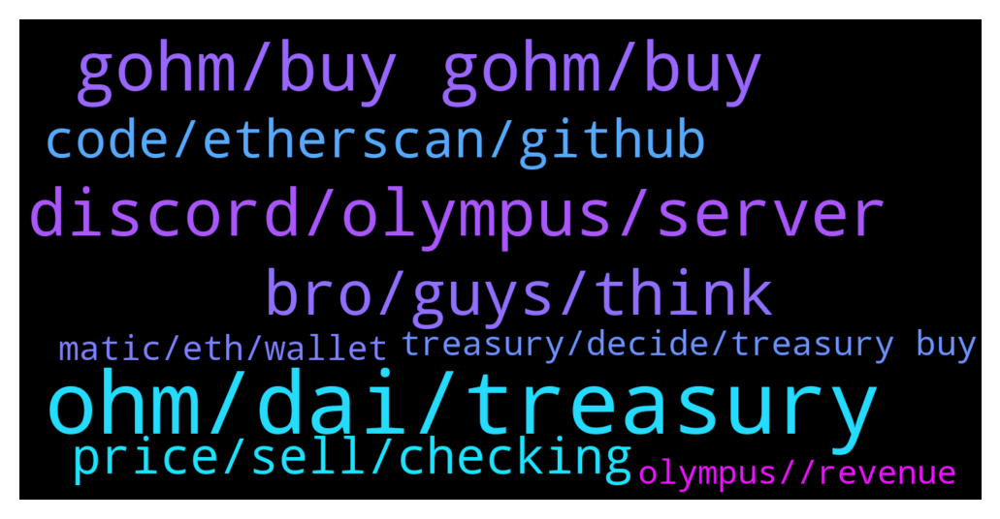

# **@OlympusTG**
 ## Analysis for **2022-02-03** - **2022-02-04**.

---

## 📊 **Basic Stats**

**n_messages_sent**: 609

---

---

## 🔝 **Top keywords and related messages**

1. **ohm, dai, treasury**

    @theMagicUnicorn --- *this is an amazing video Waple found about OHM, please check it out! 💚💚https://youtu.be/jETcS1nnv8U* **--->** [TG Discussion](https://t.me/OlympusTG/178505)

    @o_nexus_o --- *Just that it will stop minting* **--->** [TG Discussion](https://t.me/OlympusTG/179006)

    @EasternCircumcision --- *no it will not,  it will stop minting tokens if price drops below 1$, decreasing total supply* **--->** [TG Discussion](https://t.me/OlympusTG/178599)

    @Jimjim82 --- *Where can I buy Ohm? Pls give me contract add* **--->** [TG Discussion](https://t.me/OlympusTG/178536)

    @o_nexus_o --- *I see no facility to redeem 1 Ohm for 1 dollar if the market price drops below 1 dollar, say it drops to 10 cents.* **--->** [TG Discussion](https://t.me/OlympusTG/178999)

    @nfwaple --- *the treasury does not need to buy your OHM, since the treasury owns the entire LP, it can just buy from its own LP till 1 OHM = 1 DAI* **--->** [TG Discussion](https://t.me/OlympusTG/179012)

2. **gohm, buy gohm, buy**

    @Dan --- *Can I send gOHM that I bought on the Eth network to my other MetaMask account we’re I have more gOHM but I bought that on the avax network* **--->** [TG Discussion](https://t.me/OlympusTG/179459)

    @SecuriTech24 --- *I am wary of locking gohm or anything these days. I locked my ATOM into a vault, I got almost 2X but by the time I managed to unstake it I was back down to what I put in.* **--->** [TG Discussion](https://t.me/OlympusTG/179354)

    @Cle7us --- *yes sohm v2 to buy directly is not possible i assume?* **--->** [TG Discussion](https://t.me/OlympusTG/179187)

    @Max --- *Now if you excuse me, I got some more gOHMs to buy* **--->** [TG Discussion](https://t.me/OlympusTG/179467)

    @nfwaple --- *ah I see, I was thinking about gOHM haha* **--->** [TG Discussion](https://t.me/OlympusTG/179404)

    @cdp279 --- *Ser, you need to get gohm* **--->** [TG Discussion](https://t.me/OlympusTG/178540)

3. **discord, olympus, server**

    @nfwaple --- *have you been banned from the Discord before* **--->** [TG Discussion](https://t.me/OlympusTG/179453)

    @TurboLaserClip --- *I dunno why but i dont really like discord, so I always look for info here, it would be nice to duplicate here also for ppl who do not use discord, but then again all is recorded so..* **--->** [TG Discussion](https://t.me/OlympusTG/178847)

    @Cory --- *I am new to this...good time to join olympusdao?* **--->** [TG Discussion](https://t.me/OlympusTG/179049)

    @nfwaple --- *7 months ago we installed the Sherpa program into the Discord server. Olympus is a complex protocol to understand. The Sherpas stand as a united front in service of supporting the community and educating the Ohmies on how Olympus works and on the implications of its innovative mechanics. In the time since the Sherpa initiative began, the econOHMy has exploded in terms of users and builders; it's difficult to find a protocol in DeFi that isn’t using Olympus Pro and/or partnered with Olympus in some other capacity.   As the protocol has evolved and the community has grown, there is both more material to understand and a greater number of users trying to understand it. Our team of Sherpas in the Olympus server continues to grow and Sherpa led initiatives such as Learn With Sherpa and the Sherpa Library (SL) Medium Articles (https://medium.com/sherpa-library) have succeeded in getting countless Ohmies up to speed. However, we are constantly striving to increase access to and accessibility of key Olympus resources and educational material.   Today, it is with great joy that we present to you the SL Discord server. Fitted with a sleek ticketing system and an otherwise unassuming, read-only user experience, the SL Discord is designed to function as a focused learning center. Resources are well organized and easy to find. In the case that a visitor can't find what they're looking for, or need further help understanding a concept, our SL Curators are ready to help via the ticketing system. Swing by anytime, the SL library is officially open. https://discord.gg/PbZukUnVT6* **--->** [TG Discussion](https://t.me/OlympusTG/178241)

    @Cixex --- *Never got banned from any group. I stimulate convo* **--->** [TG Discussion](https://t.me/OlympusTG/179325)

    @Ap0l1o --- *Also, if anyone is a SC dev, wanting to join Olympus, lmk* **--->** [TG Discussion](https://t.me/OlympusTG/178748)

4. **bro, guys, think**

    @David --- *Youtuber George CryptosRUs was talking about it 😅* **--->** [TG Discussion](https://t.me/OlympusTG/179388)

    @nfwaple --- *you must be fun at parties* **--->** [TG Discussion](https://t.me/OlympusTG/179211)

    @TurboLaserClip --- *wait i though I was here for you* **--->** [TG Discussion](https://t.me/OlympusTG/178838)

    @Flower --- *treat yourself to this video waple found 👍 https://youtu.be/jETcS1nnv8U* **--->** [TG Discussion](https://t.me/OlympusTG/179383)

    @Ap0l1o --- *its funny cause its most probably true* **--->** [TG Discussion](https://t.me/OlympusTG/178217)

    @michella_cer --- *Don’t worry this means you are Safu 😅* **--->** [TG Discussion](https://t.me/OlympusTG/178324)

5. **code, etherscan, github**

    @o_nexus_o --- *Why is the contract code on github different to that on etherscan?* **--->** [TG Discussion](https://t.me/OlympusTG/178903)

    @o_nexus_o --- *Well if I assumed it was hard-coded into the protocol, other people probably assume that* **--->** [TG Discussion](https://t.me/OlympusTG/179070)

    @nfwaple --- *I heard that should be in line 577* **--->** [TG Discussion](https://t.me/OlympusTG/178916)

    @o_nexus_o --- *Yes I read the $1 thing in the docs, but the docs can say what they want. I'm looking for the CODE 🙂* **--->** [TG Discussion](https://t.me/OlympusTG/178739)

    @o_nexus_o --- *Because you were looking at the V1 code on etherscan and the V2 code on github...* **--->** [TG Discussion](https://t.me/OlympusTG/178911)

    @Max --- *Never checked it. If it is in python, I will. Is it?* **--->** [TG Discussion](https://t.me/OlympusTG/178715)

6. **price, sell, checking**

    @o_nexus_o --- *No, I'm wondering if we bought at $1.10 !! If we would be mostly backed then* **--->** [TG Discussion](https://t.me/OlympusTG/179014)

    @Ap0l1o --- *Well, if you are good at it, with the current price, that is not a lot to ask for :)* **--->** [TG Discussion](https://t.me/OlympusTG/178774)

    @Ninja --- *62 is it the floor price,right?* **--->** [TG Discussion](https://t.me/OlympusTG/178626)

    @o_nexus_o --- *No, wait till price hits $1.01* **--->** [TG Discussion](https://t.me/OlympusTG/179050)

    @nfwaple --- *I know you're sad, we all want the price to go up* **--->** [TG Discussion](https://t.me/OlympusTG/178951)

    @EasternCircumcision --- *depends on the price, if it goes below backed price* **--->** [TG Discussion](https://t.me/OlympusTG/178495)

7. **treasury, decide, treasury buy**

    @o_nexus_o --- *Well yeah the dev team could decide to use treasury to buy it back. I know that. I'm just saying it's not automatic, therefore not guaranteed. Because they could decide to just not do it.* **--->** [TG Discussion](https://t.me/OlympusTG/179046)

    @TurboLaserClip --- *Lol just noticed,  treasury runaway 374 days,  my breakeven 380 days :DDD* **--->** [TG Discussion](https://t.me/OlympusTG/178189)

    @nfwaple --- *I don't see treasury strategy being automatic any time soon, see pinned message, for example the wormhole hack yesterday, someone had to decide to stop the UST Wormhole bond* **--->** [TG Discussion](https://t.me/OlympusTG/179135)

    @chitangxxx --- *Paedophile fraudster who was managing a 800m treasury* **--->** [TG Discussion](https://t.me/OlympusTG/178328)

    @nfwaple --- *at the moment, the treasury requires multisig to execute such transaction* **--->** [TG Discussion](https://t.me/OlympusTG/179129)

    @nfwaple --- *it says the treasury will buy back* **--->** [TG Discussion](https://t.me/OlympusTG/179067)

8. **matic, eth, wallet**

    @Cle7us --- *uniswap against eth says  unsufficient funds* **--->** [TG Discussion](https://t.me/OlympusTG/179174)

    @metaconvict --- *To buy eth ...and transfer in MetaMask ...now again I m charged with lots of $* **--->** [TG Discussion](https://t.me/OlympusTG/178430)

    @metaconvict --- *I loose 44$ to wrap eth to with* **--->** [TG Discussion](https://t.me/OlympusTG/178403)

    @nfwaple --- *get $130 to be safe, since you need some for gas as well* **--->** [TG Discussion](https://t.me/OlympusTG/178447)

    @nfwaple --- *im still using my 4k per ETH gas 👌🏻👌🏻* **--->** [TG Discussion](https://t.me/OlympusTG/179272)

    @metaconvict --- *I have gass fee on my matic wallet ...but simply 130$ is enough* **--->** [TG Discussion](https://t.me/OlympusTG/178449)

