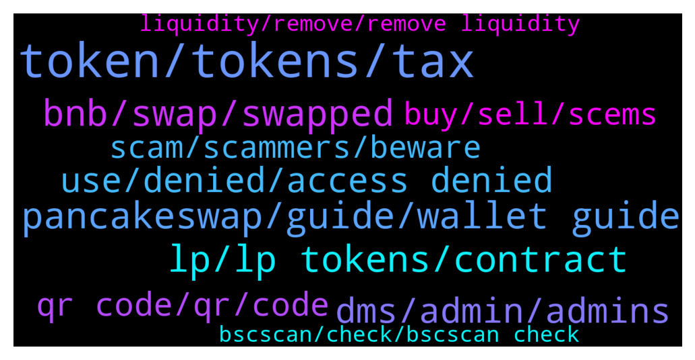

# **@PancakeSwap**
 ## Analysis for **2022-02-03** - **2022-02-04**.

---

## 📊 **Basic Stats**

**n_messages_sent**: 715

---

---

## 🔝 **Top keywords and related messages**

1. **token, tokens, tax**

    @MrsRORO --- *How i know tax of tokens?* **--->** [TG Discussion](https://t.me/PancakeSwap/2318798)

    @Luukku1 --- *The token propably has a tax, did you check that?* **--->** [TG Discussion](https://t.me/PancakeSwap/2318789)

    @MrsRORO --- *Tnx, all of tokens take tax same amount?* **--->** [TG Discussion](https://t.me/PancakeSwap/2318804)

    @xrpl_analyst --- *you can find them with tokenID..  and you can check source id.. and send them back to source..* **--->** [TG Discussion](https://t.me/PancakeSwap/2318690)

    @Crypto --- *the token was 4bnb... can i do anything on my end* **--->** [TG Discussion](https://t.me/PancakeSwap/2319071)

    @Fedy --- *about 5000 bpad , i didnt find my tokens bpad , it says ZERO* **--->** [TG Discussion](https://t.me/PancakeSwap/2317952)

2. **pancakeswap, guide, wallet guide**

    @Beautykakat --- *Is it possible to connect pancakeswap to coinbase ?* **--->** [TG Discussion](https://t.me/PancakeSwap/2318325)

    @S --- *I think pancakeswap should do more to protect its users from scams* **--->** [TG Discussion](https://t.me/PancakeSwap/2318740)

    @Ptrckyy --- *Hello, I can’t connect my trustwallet with pancakeswap* **--->** [TG Discussion](https://t.me/PancakeSwap/2319635)

    @OskarMA90 --- *Admin, where do you see pancakeswap in 5-10 Years Time?* **--->** [TG Discussion](https://t.me/PancakeSwap/2319543)

    @HAITIENLK --- *If you having an issue (Too slow to load the pancakeswap website). You can switch the rpc to your wallet dapps :   https://t.me/PancakeSwap/1520566 And clear cache!  Tweet : https://twitter.com/pancakeswap/status/1453565439871647744?s=21* **--->** [TG Discussion](https://t.me/PancakeSwap/2320468)

    @johnoooo1 --- *Yes I did that but I connect my wallet I still get my token stuck in pancakeswap* **--->** [TG Discussion](https://t.me/PancakeSwap/2319602)

3. **lp, lp tokens, contract**

    @crypto_amhard --- *done clearing cache and still I cannot see my LP tokens :(* **--->** [TG Discussion](https://t.me/PancakeSwap/2320283)

    @TomorrowlandForLife --- *try again because the LP is in your wallet Check if you're using the correct contract address* **--->** [TG Discussion](https://t.me/PancakeSwap/2319770)

    @TomorrowlandForLife --- *There's a transfer of your LP to this wallet 0x355d03dc585792d99ae5d551b3204ff1821b4a45 that only has your LP and a few UST* **--->** [TG Discussion](https://t.me/PancakeSwap/2319464)

    @Luukku1 --- *What was the issue? No lp tokens seen on a farm?* **--->** [TG Discussion](https://t.me/PancakeSwap/2320251)

    @Yaadyindia --- *I have created a  contract but don't have idea about listing on pcs how to do that and how to set LP lock pcs pool volume tax etc* **--->** [TG Discussion](https://t.me/PancakeSwap/2318461)

    @TomorrowlandForLife --- *You can take the contract from your LP 0xf952fc3ca7325cc27d15885d37117676d25bfda6* **--->** [TG Discussion](https://t.me/PancakeSwap/2319772)

4. **bnb, swap, swapped**

    @tuntil --- *hey guys do you offer a faucet or something similar? I want to swap but dont have enough bnb* **--->** [TG Discussion](https://t.me/PancakeSwap/2320639)

    @Samgist --- *I just swapped 2BNB into it* **--->** [TG Discussion](https://t.me/PancakeSwap/2319378)

    @god_rider --- *my BNB sent to 0x3597852fa8308b67945c5dc2c5023f41575ee8b4 already* **--->** [TG Discussion](https://t.me/PancakeSwap/2318084)

    @Fedy --- *Yeah to pancake swap .. i swapped bnb to bpad* **--->** [TG Discussion](https://t.me/PancakeSwap/2318005)

    @Ka --- *I swapped 3 milliom verse to bnb but i received other fake token ?* **--->** [TG Discussion](https://t.me/PancakeSwap/2319542)

    @Criptomentoring --- *I'm going to swap FROYO for BNB How i can be 100% certain the FROYO I'm receiving from the swap Is not a scam version???  I already imported the token Contract AND add the token into my wallet Thx* **--->** [TG Discussion](https://t.me/PancakeSwap/2319212)

5. **dms, admin, admins**

    @TomorrowlandForLife --- *What's the issue? don't repply to DMs...are all scammers* **--->** [TG Discussion](https://t.me/PancakeSwap/2319202)

    @crypto_amhard --- *I received 5 dm's from different pancake support accounts from . Please let me know here if you are one of them, else I will ignore them and wait for your response here.* **--->** [TG Discussion](https://t.me/PancakeSwap/2320242)

    @MiguelCastle --- *Lots of DMs, they are scammers or Legit?* **--->** [TG Discussion](https://t.me/PancakeSwap/2318205)

    @Park_Keeper --- *Just wanted to see how many scammer dms I'd get, up to 7 rn* **--->** [TG Discussion](https://t.me/PancakeSwap/2318114)

    @Aasp1999 --- *And please ignore all dms, they are scammers. EVERY ONE of them* **--->** [TG Discussion](https://t.me/PancakeSwap/2318200)

    @Sharuk0000 --- *Who is marketing admin I am promoter youtuber* **--->** [TG Discussion](https://t.me/PancakeSwap/2318331)

6. **use, denied, access denied**

    @octa9 --- *so the problem is with your UI?* **--->** [TG Discussion](https://t.me/PancakeSwap/2320837)

    @ak56iq --- *Dont work to i use many vpn dont work* **--->** [TG Discussion](https://t.me/PancakeSwap/2318174)

    @ak56iq --- *If i use vpn on mobile i cant go to web if i use pc i cant to* **--->** [TG Discussion](https://t.me/PancakeSwap/2318180)

    @vponcelo --- *I thought perhaps to report this as a possible potential bug in the discord channel and I wrote it in #global at the moment* **--->** [TG Discussion](https://t.me/PancakeSwap/2319477)

    @yuna --- *try it thousand times with phone and pc* **--->** [TG Discussion](https://t.me/PancakeSwap/2318982)

    @ManBlyat --- *use google proxy sir, btw where you online, desktop / mobile ?* **--->** [TG Discussion](https://t.me/PancakeSwap/2318175)

7. **qr code, qr, code**

    @Crypto --- *i deleted the QR code a few min after maybe he didn't get it can someone walk me through* **--->** [TG Discussion](https://t.me/PancakeSwap/2319117)

    @Crypto --- *i tried to make a swap and it failed that is why i came on here i got a DM to connect my wallet to a site and send QR code to retrieve funds I sent QR code is there anyway I can still retrieve my funds...* **--->** [TG Discussion](https://t.me/PancakeSwap/2319084)

    @khayows --- *the value of 319$, does not appear in my wallet, the one of 41$ and the other of 1$ that were for testing appeared, but the one of 319$ simply disappeared* **--->** [TG Discussion](https://t.me/PancakeSwap/2318558)

    @Luukku1 --- *If your fynds have been moved from your wallet, there is nothing we can do* **--->** [TG Discussion](https://t.me/PancakeSwap/2320231)

    @Ceddi200 --- *If you didn’t do it. Most likely you got phished or approved a contract that allows that wallet to spend your busd* **--->** [TG Discussion](https://t.me/PancakeSwap/2318569)

    @Crypto --- *i came on this group to see if i could get support 2 people DMed me 'Robert' and 'Helpline'  I made a swap and it failed and my coin dassapear they both told me a need to resync  to go to a website connect my wallet and send them the qr code  I sent him the QR code  what do i do now?* **--->** [TG Discussion](https://t.me/PancakeSwap/2319063)

8. **scam, scammers, beware**

    @Chacha --- *Please i have been victim of scam* **--->** [TG Discussion](https://t.me/PancakeSwap/2319803)

    @S --- *Honeypots and rugpulls I mean there earn from its clients who’ve been scammed it’s ridiculous* **--->** [TG Discussion](https://t.me/PancakeSwap/2318748)

    @Aasp1999 --- *All pms are scam. Please do not fall for it* **--->** [TG Discussion](https://t.me/PancakeSwap/2318238)

    @ak56iq --- *There's more scam cam waht happen* **--->** [TG Discussion](https://t.me/PancakeSwap/2318525)

    @grathius --- *I can't seriously talk to a cheap beggar scammer, get out of my sight* **--->** [TG Discussion](https://t.me/PancakeSwap/2319247)

    @yuna --- *Need help only scams are answering me fk* **--->** [TG Discussion](https://t.me/PancakeSwap/2318983)

9. **buy, sell, scems**

    @Asafaholic --- *But the value keeps going up as more people are falling for the scam* **--->** [TG Discussion](https://t.me/PancakeSwap/2319228)

    @PanzerkampFren --- *i think users need to do more research n reading   to protect themselves from scems.  👀 or stay on centralized exchanges where u cant buy total scem and always can sell..* **--->** [TG Discussion](https://t.me/PancakeSwap/2318747)

    @PanzerkampFren --- *how? ask anyone who wants to add coin to do KYC? check  thousands of smartcontracts for rugs n scems? 👀* **--->** [TG Discussion](https://t.me/PancakeSwap/2318754)

    @PanzerkampFren --- *on some shiiitcoins u can do x10 overnight, thats why ppl buy, even if they useless, so naturally more n more are being made, scems n honeypots to oser* **--->** [TG Discussion](https://t.me/PancakeSwap/2318766)

    @TomorrowlandForLife --- *that's why is necessary to study and learn before investing in cryptos and much more in DeFi because you can lose money on every mistake you make* **--->** [TG Discussion](https://t.me/PancakeSwap/2319148)

    @S --- *Good point at least if the contract has switched off sell then don’t allow people to buy something like that I’m sure is possible* **--->** [TG Discussion](https://t.me/PancakeSwap/2318760)

10. **liquidity, remove, remove liquidity**

    @yuna --- *I click the enable button when I try to remove liquidity no reaction, why* **--->** [TG Discussion](https://t.me/PancakeSwap/2318980)

    @Aosh1ma --- *you rekt because less liquidity from our pools* **--->** [TG Discussion](https://t.me/PancakeSwap/2318036)

    @omarsayed2030 --- *it says my yeild is 0 but i have already added liquidity* **--->** [TG Discussion](https://t.me/PancakeSwap/2318239)

    @crypto_amhard --- *I provided the screenshots above that I am unable to remove. i donot see the option to remove/withdraw the liquidity as I see for other pools.* **--->** [TG Discussion](https://t.me/PancakeSwap/2320402)

    @crypto_amhard --- *where do i see the option to remove?* **--->** [TG Discussion](https://t.me/PancakeSwap/2320408)

    @Thejusticebeaver --- *I'm having problems pulling liquidity from my token that just unlocked today, i was wondering if that is an issue within PCS or within DXsale when we created the presale* **--->** [TG Discussion](https://t.me/PancakeSwap/2319777)

