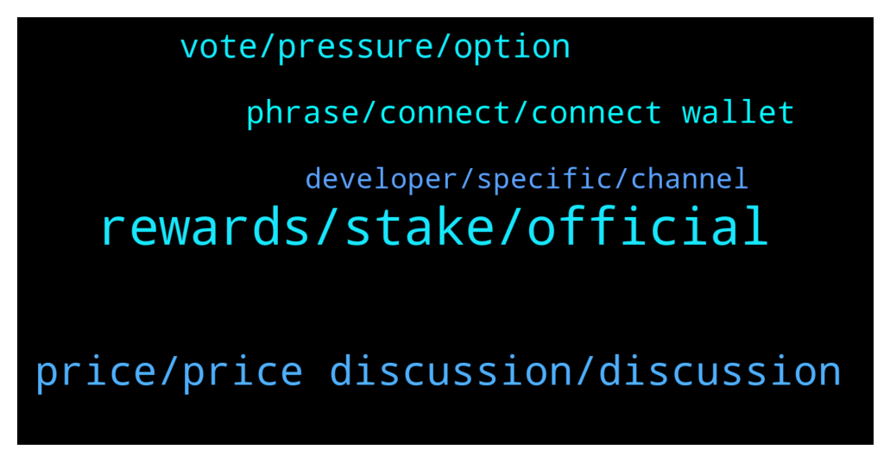

# **@algorand**
 ## Analysis for **2022-02-03** - **2022-02-04**.

---

## 📊 **Basic Stats**

**n_messages_sent**: 135

---

---

## 🔝 **Top keywords and related messages**

1. **rewards, stake, official**

    @tommynapper --- *Hey guys! New to algorand. Where is the best place to stake algo? 👀* **--->** [TG Discussion](https://t.me/algorand/336829)

    @Ferdi_Carrefour --- *Hi, can i stake algo on yieldly while i am in govrernance with the same amount?* **--->** [TG Discussion](https://t.me/algorand/336637)

    @Dnyjerry --- *Which wallet app can i download for Algo staking* **--->** [TG Discussion](https://t.me/algorand/336774)

    @Sahand_tabrizzz --- *hi. how can i opt out from my algo wallet. algodesk didnt support now* **--->** [TG Discussion](https://t.me/algorand/336777)

    @colibaba --- *Hi Guys Pls is it possible to stake Algo* **--->** [TG Discussion](https://t.me/algorand/336645)

    @MackDenver --- *Hello Coliba,  You don't need to stake ALGO, just hold your ALGO in the official ALGO wallet, you will get staking rewards automatically.* **--->** [TG Discussion](https://t.me/algorand/336646)

2. **price, price discussion, discussion**

    @NightAlgorand --- *here is not the place for price discussion* **--->** [TG Discussion](https://t.me/algorand/336565)

    @chuckdx --- *Hello, can you respond to pm pls* **--->** [TG Discussion](https://t.me/algorand/336755)

    @Tiny_Philosopher_784 --- *Btw... yieldly announced that they will have a yldy/hdl pairing on 10 Feb.* **--->** [TG Discussion](https://t.me/algorand/336586)

    @Pablo_cast --- *Offers a cheap and simple solution* **--->** [TG Discussion](https://t.me/algorand/336591)

    @S --- *When will the foundation announce Sean’s replacement?* **--->** [TG Discussion](https://t.me/algorand/336610)

    @Olaxy17 --- *You have their website or any social?* **--->** [TG Discussion](https://t.me/algorand/336658)

3. **vote, pressure, option**

    @abovyanv --- *why are you spitting in the face of your members like that? I was very disappointed in this blockchain. Let members vote without pressure* **--->** [TG Discussion](https://t.me/algorand/336661)

    @Edosall --- *Hi no it is not an issue. I ve much more Algo since the registration period and my vote is registered* **--->** [TG Discussion](https://t.me/algorand/336662)

    @MackDenver --- *Members can vote by their own choice. Both options are open and available to vote.* **--->** [TG Discussion](https://t.me/algorand/336663)

    @Tiny_Philosopher_784 --- *No, there really is not. If you feel pressure, that is a personal issue.  If you vote on stocks you own, they say the recommendation in the question, which is about the same pressure.  No one at Algorand Inc or Algorand Foundation is offering you more algos to pick one over the other.* **--->** [TG Discussion](https://t.me/algorand/336666)

    @abovyanv --- *its not a personal issue at all. This inscription puts a lot of pressure on the participant's decision. But I'm not going to argue with you. If you have hallucinations about various topics, then you are entitled to them.* **--->** [TG Discussion](https://t.me/algorand/336684)

    @Telemenop --- *While trying to submit my vote in governance im getting   ‘[RequestError.NotAuthorized] The extension user does not authorise the request.’  Anybody know what that is ?* **--->** [TG Discussion](https://t.me/algorand/336642)

4. **phrase, connect, connect wallet**

    @Abesmal --- *I spelled the phrase carefully, many times. as if the wallet does not exist.* **--->** [TG Discussion](https://t.me/algorand/336718)

    @NightAlgorand --- *What issue are you facing while using the wallet? Remember that you have to key your seedphrases exactly.* **--->** [TG Discussion](https://t.me/algorand/336703)

    @Abesmal --- *Hello Admin, all my wallets have stopped working, not a single side phrase is suitable.* **--->** [TG Discussion](https://t.me/algorand/336690)

    @KAPIBAYSIDE --- *Is connect wallet working not able to connect  my wallet* **--->** [TG Discussion](https://t.me/algorand/336748)

    @MackDenver --- *Please refresh the browser and try again.* **--->** [TG Discussion](https://t.me/algorand/336643)

    @KAPIBAYSIDE --- *It worked after refreshing several times couldn't connect my wallet to apps like yieldly. Think it was my connection* **--->** [TG Discussion](https://t.me/algorand/336753)

5. **developer, specific, channel**

    @MKT1236 --- *Any look into new crypto project on Algorand block chain. Just came out yesterday. Digileaf io. Same people that created blockcreate* **--->** [TG Discussion](https://t.me/algorand/336609)

    @lightjoegee --- *Please someone should recommend some good resource to learn Dapp with algorand* **--->** [TG Discussion](https://t.me/algorand/336571)

    @PVU --- *Hey team, I am planning to start developing on algorand blockchain. Just curious, is there a specific developer community channel for algorand where I can post developer specific questions ?* **--->** [TG Discussion](https://t.me/algorand/336759)

    @Pablo_cast --- *In developer.algorand.com there are resources... Computer science knowledge required* **--->** [TG Discussion](https://t.me/algorand/336573)

    @traderbrew --- *Not sure if you all know this, but the Algorand developer docs are downright sexy.* **--->** [TG Discussion](https://t.me/algorand/336723)

    @Dotaplayer1592 --- *And also where can I learn more algorand grants for early stage startups ?* **--->** [TG Discussion](https://t.me/algorand/336712)

