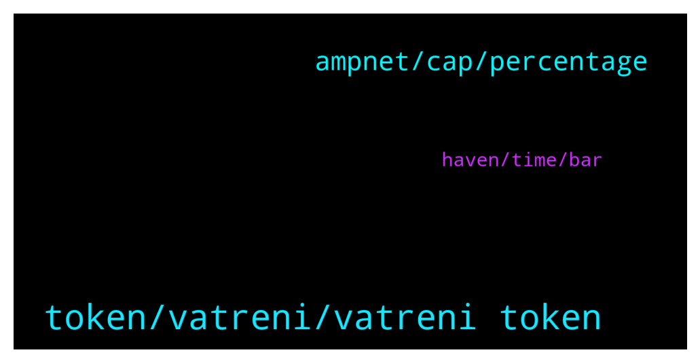

# **@ampnetapxchat**
 ## Analysis for **2022-01-30** - **2022-02-04**.

---

## 📊 **Basic Stats**

**n_messages_sent**: 63

---

---

## 🔝 **Top keywords and related messages**

1. **token, vatreni, vatreni token**

    @Braam --- *Thanks Jakov, and what happens if it doesn't reach $500000?* **--->** [TG Discussion](https://t.me/ampnetapxchat/36858)

    @Braam --- *I see the Vatreni token is 80% funded. However it's only until the 2 feb.  Jakov please explain what happens if the 2nd comes and goes when the funding has reached $500000. And then conversely what happens if it does fulfill the total amount? Thanks* **--->** [TG Discussion](https://t.me/ampnetapxchat/36856)

    @Tinus_Tussengas_1984 --- *is there somewhere we can see the progress on the prudenzzafc fan token seed sale?* **--->** [TG Discussion](https://t.me/ampnetapxchat/36828)

    @DexTrade_Listing_Dennis --- *Hello Who is the right person to discuss listing proposal?* **--->** [TG Discussion](https://t.me/ampnetapxchat/36846)

    @jakovtradingmentor --- *But yes, it's still a great big step :D* **--->** [TG Discussion](https://t.me/ampnetapxchat/36943)

    @runex_x1 --- *I wish the team all the luck on this one. We can use some positive investment news after all this technical progress* **--->** [TG Discussion](https://t.me/ampnetapxchat/36883)

2. **ampnet, cap, percentage**

    @MelonHusk --- *I have never seen a project recover from -98.5% losses.* **--->** [TG Discussion](https://t.me/ampnetapxchat/36820)

    @MelonHusk --- *Don't tell me Ampnet is raising more money?* **--->** [TG Discussion](https://t.me/ampnetapxchat/36814)

    @runex_x1 --- *should be more clear that the network is polygon though* **--->** [TG Discussion](https://t.me/ampnetapxchat/36922)

    @mislavjavor --- *Hey all, the bar counts until hard cap is reached, the percentage until the hard cap i* **--->** [TG Discussion](https://t.me/ampnetapxchat/36808)

    @jakovtradingmentor --- *if the 2nd comes and goes and the sale is fully funded, a percentage of the sale goes to ampnet as commission which is then used for aapx buybacks* **--->** [TG Discussion](https://t.me/ampnetapxchat/36857)

    @jakovtradingmentor --- *ofc if raise is successful, which seems like it is, a percentage of that raise is going to ampnet for aapx buybacks* **--->** [TG Discussion](https://t.me/ampnetapxchat/36817)

3. **haven, time, bar**

    @Tinus_Tussengas_1984 --- *thanks m8. that loading bar is looking strange btw... i assume its to see the progress in time to the deadline instead of the percentage of funding 😋* **--->** [TG Discussion](https://t.me/ampnetapxchat/36806)

    @runex_x1 --- *there is clearly something wrong with the progress bar (brave)* **--->** [TG Discussion](https://t.me/ampnetapxchat/36882)

    @jakovtradingmentor --- *i'm not a 100% sure as I haven't been told so maybe one of the devs can answer this* **--->** [TG Discussion](https://t.me/ampnetapxchat/36859)

    @mislavjavor --- *there is a bug though, it seems* **--->** [TG Discussion](https://t.me/ampnetapxchat/36811)

    @matejmz --- *Yeah, it is bugged apparently. (Time would be at 50%, so this is not the case)  @mislavjavor* **--->** [TG Discussion](https://t.me/ampnetapxchat/36807)

    @runex_x1 --- *ok, is there a lockup period?* **--->** [TG Discussion](https://t.me/ampnetapxchat/36892)

