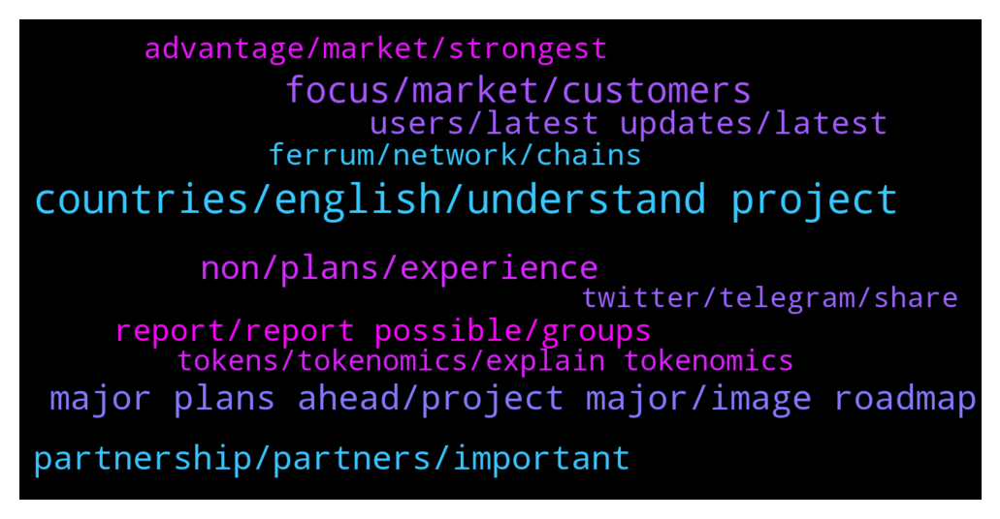

# **@avalancheavax**
 ## Analysis for **2022-02-03** - **2022-02-04**.

---

## 📊 **Basic Stats**

**n_messages_sent**: 552

---

---

## 🔝 **Top keywords and related messages**

1. **countries, english, understand project**

    @herodantes --- *Let suppose we don't want to go through a platform 😅* **--->** [TG Discussion](https://t.me/avalancheavax/326191)

    @LeliaRucker1991 --- *How do you plan to spread awareness about your project in different countries where English is not good? Do you have local communities like Vietnam, Indonesia, Thailand, Korea,.. so they can better understand your project?* **--->** [TG Discussion](https://t.me/avalancheavax/326513)

    @Zephara --- *Are you planning to promote your project in countries / regions where English is not good? Do you have a local community for them to better understand your project??* **--->** [TG Discussion](https://t.me/avalancheavax/326412)

    @ssiedow4 --- *Is your platform a global or is there any restriction to certain regions?* **--->** [TG Discussion](https://t.me/avalancheavax/326456)

    @ed_Russo --- *How Do you planning to promote your project in different countries, wherein English is not spoken well? Do you have a local communities for them to better understand your project?* **--->** [TG Discussion](https://t.me/avalancheavax/326484)

    @silva_corbett_42 --- *Are you planning to promote your project in countries / regions where English is not good? Do you have a local community for them to better understand your project??* **--->** [TG Discussion](https://t.me/avalancheavax/326480)

2. **focus, market, customers**

    @kristinakern47 --- *Marketing is a central element for every project, so that everyone knows the potential that a project can bring is vital to achieve the goals set. What is your strategy to attract new users and Investor to your platform and keep them long term.* **--->** [TG Discussion](https://t.me/avalancheavax/326705)

    @crouch_29 --- *Marketing is a central element for every project, so that everyone knows the potential that a project can bring is vital to achieve the goals set. What is your strategy to attract new users and Investor to your platform and keep them long term.* **--->** [TG Discussion](https://t.me/avalancheavax/326645)

    @ltmanley90 --- *What's your main focus right now, are you focused on the community or market/Exchange or the products?* **--->** [TG Discussion](https://t.me/avalancheavax/326452)

    @Frenchy1a --- *What's your main focus right now, are you focused on the community or market/Exchange or the products?* **--->** [TG Discussion](https://t.me/avalancheavax/326505)

    @BarryChang50 --- *Are you a global project or local project? At present, which market are you focus on, or is it focused on building and growing to gain customers, users and partners?* **--->** [TG Discussion](https://t.me/avalancheavax/326577)

    @lison_knott --- *Are you a global project or local project? At present, which market are you focus on, or is it focused on building and growing to gain customers, users and partners?* **--->** [TG Discussion](https://t.me/avalancheavax/326552)

3. **major plans ahead, project major, image roadmap**

    @Jamesborna --- *How old is Your project? What are the major plans ahead? Could you show to us image of your roadmap?* **--->** [TG Discussion](https://t.me/avalancheavax/326734)

    @Hazardless435 --- *How old is Your project? What are the major plans ahead? Could you show to us image of your roadmap?* **--->** [TG Discussion](https://t.me/avalancheavax/326683)

    @kerrie_jose_62 --- *How old is Your project? What are the major plans ahead? Could you show to us image of your roadmap?* **--->** [TG Discussion](https://t.me/avalancheavax/326498)

    @DJ0843 --- *How old is Your project? What are the major plans ahead? Could you show to us image of your roadmap?* **--->** [TG Discussion](https://t.me/avalancheavax/326514)

    @b777all --- *How old is Your project? What are the major plans ahead? Could you show to us image of your roadmap?* **--->** [TG Discussion](https://t.me/avalancheavax/326608)

    @tahchetsn --- *What is the most ambitious goal of your project? Could share with us any Upcoming Updates?* **--->** [TG Discussion](https://t.me/avalancheavax/326643)

4. **non, plans, experience**

    @dominic_gould --- *How many team members do you have? Do they have enough experience in the blockchain field? Do they have any experience on working in crypto and non-crypto project?* **--->** [TG Discussion](https://t.me/avalancheavax/326777)

    @Melsie_word_83 --- *Do you have any plans to attract non-crypto investors to join your project? Because the success of a project attracts more investors who haven't yet entered the crypto world. What are the plans to raise awareness about your project in the non-crypto space.* **--->** [TG Discussion](https://t.me/avalancheavax/326636)

    @siunhms --- *Do you have any plans to attract non-crypto investors to join your project? Because the success of a project attracts more investors who haven't yet entered the crypto world. What are the plans to raise awareness about your project in the non-crypto space.* **--->** [TG Discussion](https://t.me/avalancheavax/326457)

    @greathouse_fsd --- *Do you have any plans to attract non-crypto investors to join your project? Because the success of a project attracts more investors who haven't yet entered the crypto world. What are the plans to raise awareness about your project in the non-crypto space.* **--->** [TG Discussion](https://t.me/avalancheavax/326569)

    @Slic3man --- *Do you have any plans to attract non-crypto investors to join your project? Because the success of a project attracts more investors who haven't yet entered the crypto world. What are the plans to raise awareness about your project in the non-crypto space.* **--->** [TG Discussion](https://t.me/avalancheavax/326617)

    @thackeg --- *I am an EXPERIENCED DEVELOPER AND ETHICAL HACKER, does you have plans for HACKATHON so as to check the security of your ecosytem periodically and also invite developers to build?* **--->** [TG Discussion](https://t.me/avalancheavax/326690)

5. **partnership, partners, important**

    @ifriend05 --- *We have relationships with hundreds of projects across the industry, some are parternships, some gave us grants, some use our staking/defi tech, and others we have incubated/launched.  To learn more and see a complete list, you can refer to our Ecosystem page: https://ferrum.network/iron-alliance/* **--->** [TG Discussion](https://t.me/avalancheavax/326402)

    @ifriend05 --- *It is a group of many notable projects we have partnered with or are working with in some way, for example Avalanche is there because we are an official ecosystem partner! But there are many others too across the industry including Polygon, Algorand, Pokt, and dozens more top DeFi and infrastructure and NFT projects. We connect all these founders together in a group and find ways to add value to each other. Its a wonderful way to collaborate and add value to the entire industry* **--->** [TG Discussion](https://t.me/avalancheavax/326404)

    @shadow_type --- *PARTNERS are the most important that strengthen the ecosystems of all projects. Could you tell us about your project partners and the partnership strategy it has adopted?* **--->** [TG Discussion](https://t.me/avalancheavax/326533)

    @oree_Dewey --- *Partnership is always an important factor for every project. So who is your partner? What are the benefits you get from those relatiionships?* **--->** [TG Discussion](https://t.me/avalancheavax/326523)

    @quintanil --- *PARTNERS are the most important that strengthen the ecosystems of all projects. Could you tell us about your project partners and the partnership strategy it has adopted?* **--->** [TG Discussion](https://t.me/avalancheavax/326562)

    @que_lo --- *PARTNERS are the most important that strengthen the ecosystems of all projects. Could you tell us about your project partners and the partnership strategy it has adopted?* **--->** [TG Discussion](https://t.me/avalancheavax/326689)

6. **users, latest updates, latest**

    @Oneal_1995 --- *How can users stay updated with this project? Are there channels, including local communities where users can get the latest updates?* **--->** [TG Discussion](https://t.me/avalancheavax/326767)

    @Lulapeacock --- *How can users stay updated with this project? Are there channels, including local communities where users can get the latest updates?* **--->** [TG Discussion](https://t.me/avalancheavax/326614)

    @oscar_lloyd --- *How can users stay up to date with this project? Are there channels, including local communities, where users can get the latest updates?* **--->** [TG Discussion](https://t.me/avalancheavax/326582)

    @PhilVegasa44 --- *How can users stay up to date with this project? Are there channels, including local communities, where users can get the latest updates?* **--->** [TG Discussion](https://t.me/avalancheavax/326455)

    @Delorashulsey --- *How can users stay updated with this project? Are there channels, including local communities where users can get the latest updates?* **--->** [TG Discussion](https://t.me/avalancheavax/326449)

    @SmplstcBllistic --- *How can users stay updated with this project? Are there channels, including local communities where users can get the latest updates?* **--->** [TG Discussion](https://t.me/avalancheavax/326492)

7. **report, report possible, groups**

    @Amatio12 --- *Nicolas is a scammed me last week  please don't trust these people they are all scammer, they take my money from my wallets last week* **--->** [TG Discussion](https://t.me/avalancheavax/326070)

    @Discordance_Axis --- *my account is quite old.. ;) name is just Constantine#3186 there* **--->** [TG Discussion](https://t.me/avalancheavax/326273)

    @dyor_doesnt_end --- *I've been messing with them a bit if you can send them to @fudgalore we love wasting there time there* **--->** [TG Discussion](https://t.me/avalancheavax/326115)

    @oathtobarbatos --- *It's not like that. Scammers are using fake groups to get people and, we are always helping everyone to avoid it. If you get in those groups, report it as soon as possible!* **--->** [TG Discussion](https://t.me/avalancheavax/326138)

    @Nicolas_A --- *It's a scammer who uses my profile picture, same name. Not me lol* **--->** [TG Discussion](https://t.me/avalancheavax/326073)

    @zombieb0yx --- *2 scammers dming me in less than 10 seconds, be aware guys, love ya all.* **--->** [TG Discussion](https://t.me/avalancheavax/326079)

8. **tokens, tokenomics, explain tokenomics**

    @Eugenie_Darnell --- *Can you explain how is your Tokenomics Distribution? How many tokens Will be minted ? And How many tokens Will be locked by the team?* **--->** [TG Discussion](https://t.me/avalancheavax/326770)

    @Melda_jacks --- *Can you explain how is your Tokenomics Distribution? How many tokens Will be minted ? And How many tokens Will be locked by the team?* **--->** [TG Discussion](https://t.me/avalancheavax/326732)

    @xxxthe6345Txxx --- *Can you explain how is your Tokenomics Distribution? How many tokens Will be minted ? And How many tokens Will be locked by the team?* **--->** [TG Discussion](https://t.me/avalancheavax/326620)

    @siamattox1996 --- *Can you explain how is your Tokenomics Distribution? How many tokens Will be minted ? And How many tokens Will be locked by the team?* **--->** [TG Discussion](https://t.me/avalancheavax/326553)

    @Slurthaa --- *Can you explain how is your Tokenomics Distribution? How many tokens Will be minted ? And How many tokens Will be locked by the team?* **--->** [TG Discussion](https://t.me/avalancheavax/326440)

    @Kassialabc --- *Can you explain how is your Tokenomics Distribution? How many tokens Will be minted ? And How many tokens Will be locked by the team?* **--->** [TG Discussion](https://t.me/avalancheavax/326431)

9. **advantage, market, strongest**

    @conchom --- *What is your strongest advantage that you think will make your team leading the market?* **--->** [TG Discussion](https://t.me/avalancheavax/326567)

    @Jeni_Canty_26 --- *What is your strongest advantage that you think will make your team leading the market?* **--->** [TG Discussion](https://t.me/avalancheavax/326409)

    @elocavanau --- *Can you list 1-3 killer features of this project that makes it ahead of its competitors? What is the competitive advantage your project has that you feel most confident about?* **--->** [TG Discussion](https://t.me/avalancheavax/326632)

    @meckinhla --- *What is your strongest advantage that you think will make your team leading the market?* **--->** [TG Discussion](https://t.me/avalancheavax/326539)

    @Corcoran23 --- *What is your strongest advantage that you think will make your team leading the market?* **--->** [TG Discussion](https://t.me/avalancheavax/326515)

    @Monroe_belt_1998 --- *What is your strongest advantage that you think will make your team leading the market?* **--->** [TG Discussion](https://t.me/avalancheavax/326768)

10. **ferrum, network, chains**

    @Nicolas_A --- *How many different cryptocurrency projects and/or protocols does Ferrum Network have a relationship with? More specifically, how many different projects have signed up to use Ferrum Technology?* **--->** [TG Discussion](https://t.me/avalancheavax/326401)

    @Nicolas_A --- *Are there any exciting promotions or events that are happening right now at Ferrum Network that you suggest we look into?* **--->** [TG Discussion](https://t.me/avalancheavax/326406)

    @Nicolas_A --- *What is the Ferrum Network Iron Alliance? Can you tell us a bit about the projects that are associated with the Iron Alliance?* **--->** [TG Discussion](https://t.me/avalancheavax/326403)

    @Nicolas_A --- *Interesting ! Do you intend to add any additional networks to your network, and if so, which ones in the foreseeable future?* **--->** [TG Discussion](https://t.me/avalancheavax/326396)

    @Nicolas_A --- *Okay first question : Can you tell us a bit about Ferrum Network, what your project is about, and any notable accomplishments?* **--->** [TG Discussion](https://t.me/avalancheavax/326390)

    @Nicolas_A --- *Do you intend to provide any products or services on these various networks or will the cross-chain token bridge be your primary focus?* **--->** [TG Discussion](https://t.me/avalancheavax/326399)

