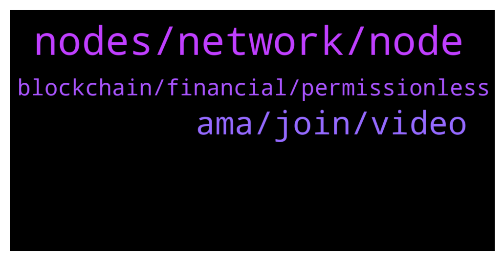

# **@chainlinkofficial**
 ## Analysis for **2022-02-03** - **2022-02-04**.

---

## 📊 **Basic Stats**

**n_messages_sent**: 52

---

---

## 🔝 **Top keywords and related messages**

1. **nodes, network, node**

    @Sylvarantt --- *Hi Sam, you can always request a new price feed by clicking on the "Request price feed" button at the top-right of https://data.chain.link/ or even talk with several node operators so they can satisfy your on-chain data needs. Either way, if you are a dApp developer/ representative looking to integrate Chainlink, feel free to DM me more details about it and I'll be happy to connect you with the right people* **--->** [TG Discussion](https://t.me/chainlinkofficial/371398)

    @Sylvarantt --- *Chainlink solutions haven't been deployed on SmartBCH yet. If there is demand for hybrid smart contracts, Chainlink will eventually be deployed there for sure 👍* **--->** [TG Discussion](https://t.me/chainlinkofficial/371612)

    @salemkode --- *Can I use chain link in smartbch* **--->** [TG Discussion](https://t.me/chainlinkofficial/371607)

    @marcromeron --- *Hi, Chainlink Labs do not pay third parties for listings, videos, paid AMAs, etc. because they have an internal marketing team, but thanks for reaching out.* **--->** [TG Discussion](https://t.me/chainlinkofficial/371369)

    @Jonah --- *Hi I posted a question on r/Chainlink but I believe it was removed for some reason. Can somebody help? It was a good question that I think ppl will want to know the answer to* **--->** [TG Discussion](https://t.me/chainlinkofficial/371459)

    @Kontur81 --- *How much link need I for lunch a link node?* **--->** [TG Discussion](https://t.me/chainlinkofficial/371466)

2. **ama, join, video**

    @JoshSimenhoff --- *Hi we are not intersted in 3rd party AMA proposals.* **--->** [TG Discussion](https://t.me/chainlinkofficial/371536)

    @shayan_malikFS --- *To whom should i contact for AMA proposal ?  We have organic members our services will be game changer for your project thanku .* **--->** [TG Discussion](https://t.me/chainlinkofficial/371368)

    @elifhilalumucu --- *You can find short and important information about DeFi in this video 🤩  By the way, time is very valuable to all of us, so it's a chance to learn in two minutes🙂 I highly recommend this video, good luck! 🍀   https://youtu.be/7lHhS3KiWgE* **--->** [TG Discussion](https://t.me/chainlinkofficial/371503)

    @albert_ce --- *So how do you get interested?* **--->** [TG Discussion](https://t.me/chainlinkofficial/371537)

    @albert_ce --- *Hello!! I'm  Marketer at Cryptoscreen, I know this project is very interesting and I want to know more about this project. I would like to invite you to hold an AMA session in our community, Who can I submit an AMA proposal to?* **--->** [TG Discussion](https://t.me/chainlinkofficial/371535)

    @itsmelodika --- *hi friends!! if you'll be at ETHDenver make sure you join our Smart Contract Developer Bootcamp. Sign up here:  https://chain.link/bootcamp/ethdenver-2022  you can also join online obvs! 😊* **--->** [TG Discussion](https://t.me/chainlinkofficial/371628)

3. **blockchain, financial, permissionless**

    @elifhilalumucu --- *👉🏻Stablecoins are a core component of DeFi that allow fiat currencies like the U.S. dollar and other assets to be represented on the blockchain as digital tokens.   A stablecoin is a representation of an underlying asset and tries to maintain a 1:1 peg with it through various mechanisms🙏🏻* **--->** [TG Discussion](https://t.me/chainlinkofficial/371498)

    @Sylvarantt --- *If you require a price feed for a liquid asset with enough market pressence and you use a centralized data source to calculate the price you expose yourself to flash loans attacks and price manipulation, that in the case of Money Markets would enable exploiters to empty your pools* **--->** [TG Discussion](https://t.me/chainlinkofficial/371410)

    @PraveenDino --- *Someone please tell me why the crypto is going down ?* **--->** [TG Discussion](https://t.me/chainlinkofficial/371357)

    @elifhilalumucu --- *Do you want to learn about slablecoins : https://blog.chain.link/what-are-stablecoins/* **--->** [TG Discussion](https://t.me/chainlinkofficial/371499)

    @suhademirsoy --- *The information you wrote is really useful, I just entered the Blockchain ecosystem.  Sometimes I find it difficult to understand technical concepts and shares, but when someone explains them to us, it becomes easier to understand, thanks again* **--->** [TG Discussion](https://t.me/chainlinkofficial/371512)

    @elifhilalumucu --- *👉🏻In the DeFi economy, users can access a similar financial application stack as they would in traditional finance but without requiring the involvement of centralized intermediaries.🙂  👉🏻By using open-source protocols running on censorship-resistant and decentralized networks, DeFi applications provide global permissionless access, mitigate counterparty risk, and interoperate with other applications to enable more advanced financial products🙏🏻* **--->** [TG Discussion](https://t.me/chainlinkofficial/371497)

