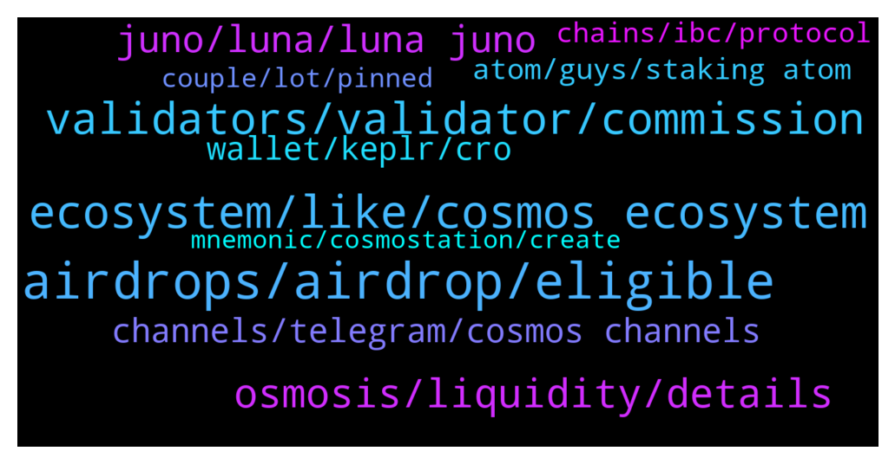

# **@cosmosproject**
 ## Analysis for **2022-02-03** - **2022-02-04**.

---

## 📊 **Basic Stats**

**n_messages_sent**: 388

---

---

## 🔝 **Top keywords and related messages**

1. **airdrops, airdrop, eligible**

    @TicoJohnny --- *Snapshot is the recorded time for when the airdrop eligibility requirements are made (i.e did you have ATOM staked on February 18th for Osmosis.)* **--->** [TG Discussion](https://t.me/cosmosproject/484930)

    @seny --- *I get the basic idea of airdrops that its not just free money but even that post just randomly namedrops "Juno" as if new people are supposed to know what that means* **--->** [TG Discussion](https://t.me/cosmosproject/485475)

    @ZoltanAtom --- *There will be Raw airdrop to Junoswapdex lps and incentives coming to lps soon. High Apy.* **--->** [TG Discussion](https://t.me/cosmosproject/485587)

    @ZoltanAtom --- *Also please do not invest your money just because of airdrops.   Airdrops are just gifts to community members and a way to create new communities.* **--->** [TG Discussion](https://t.me/cosmosproject/485511)

    @seny --- *ya maybe I'll start xD. Just outa curiousity, what kind of staking requirements have been made in the past for airdrops? I'm reading up on Juno now and it made me curious* **--->** [TG Discussion](https://t.me/cosmosproject/485555)

    @Luke --- *When I see people talking about airdrops, they also mention the date when it’s available but also the snapshot, what’s a snapshot?* **--->** [TG Discussion](https://t.me/cosmosproject/484929)

2. **ecosystem, like, cosmos ecosystem**

    @ZoltanAtom --- *The key part to get to know many details at Cosmos ecosystem is keeping in touch with community and join Cosmos groups. Unfortunately i don’t have a guide to share with you. Many useful links at the pinned message.   https://t.me/CosmosEcosystemChat  I can also share more Cosmos chains channels if you like to join.* **--->** [TG Discussion](https://t.me/cosmosproject/485477)

    @Wafa7872 --- *Hi guy. How are you? Sorry to bother. I’m a new member of the Cosmos group  I want to do some research on Cosmos platform but I didn’t have any data on it. I want to know if there is any simple course to read or watch without looking after difficult Youtube video’s, Reddit  or the Whitepaper, to see if this project is good for investing or not. I will appreciate you to send me to start my research on this project* **--->** [TG Discussion](https://t.me/cosmosproject/484895)

    @ZoltanAtom --- *Here is the list of Cosmos tokens;  https://cosmos.network/ecosystem/tokens* **--->** [TG Discussion](https://t.me/cosmosproject/485478)

    @seny --- *Ahhh nothing is simple with Cosmos is it xD* **--->** [TG Discussion](https://t.me/cosmosproject/485526)

    @ale128888 --- *Hi, may I know who should I talk to regarding BD matters from Cosmos? Thank you!* **--->** [TG Discussion](https://t.me/cosmosproject/485448)

    @ZoltanAtom --- *Hi there,thanks for sharing it. I will forward your request to the team. But for mintscan, you should contact with Cosmostation team.   support@cosmostation.io* **--->** [TG Discussion](https://t.me/cosmosproject/485232)

3. **validators, validator, commission**

    @BeaumedicLau --- *Hi, would like to ask is there any different in return if I stake my $OSMO with 2 different validators?   *if both validators offering 5% commission.* **--->** [TG Discussion](https://t.me/cosmosproject/485598)

    @Luke --- *Question with keplr, when staking with multiple validates example, 2 validates for 5 percent each, does that mean I would be paying for 10 percent commission fees?* **--->** [TG Discussion](https://t.me/cosmosproject/485673)

    @ZoltanAtom --- *Validators take commissions for their services.   For Delegators, you should check this reward calculation link;  https://www.stakingrewards.com/earn/cosmos* **--->** [TG Discussion](https://t.me/cosmosproject/485781)

    @DAD_DEFI --- *by the way, why would we not go to validators offering 0% commission? and how can they profit if comm is 0%?* **--->** [TG Discussion](https://t.me/cosmosproject/485137)

    @ZoltanAtom --- *Just avoid exchange validators.  Do not choose validators which offer 0 commission.  Better to separate your Atom with various validators.  Better to choose out of top 20 to keep decentralization safe and spreading voter power.* **--->** [TG Discussion](https://t.me/cosmosproject/485131)

    @AtomJazz --- *Make sure you avoid exchange validators! Other than that...The best validator is always subjective, here are some factors that might help:   - Commission Rate:  This is the % of earned rewards that go to the validator. Not the % of your total stake, just to eliminate that confusion.   - Self-Bonded rate:  This is the % of bonded ATOM that belong to the validator. Think of this as their skin in the game.   - Decentralization:  Choosing the smaller validators helps to decentralize the network which improves security overall. Again, decentralization should be a priority. On this point, centralized exchanges are not the best choice as they don't really support the network at all.   You can learn more about each validator in their profiles on the wallets and explorers.  The 8-10% is almost for everyone, feel free to use this reward calculator  https://www.stakingrewards.com/earn/cosmos  Commissions can be changed anytime so keep an eye on your validator via telegram or twitter* **--->** [TG Discussion](https://t.me/cosmosproject/485689)

4. **osmosis, liquidity, details**

    @seny --- *Is the atom on Osmosis dex different from normal Atom?* **--->** [TG Discussion](https://t.me/cosmosproject/485571)

    @Luke --- *I get ya, but how would you have atom staked on osmosis, would an example be like providing liquidity in a pool for atom and osmo? If so, how would you provide evidence, with the osmosis dex?* **--->** [TG Discussion](https://t.me/cosmosproject/484932)

    @Farhus_Shibnobi --- *The osmosis platform is also good for staking right?* **--->** [TG Discussion](https://t.me/cosmosproject/484993)

    @ZoltanAtom --- *Please ask it to Osmosis channel.* **--->** [TG Discussion](https://t.me/cosmosproject/485465)

    @ZoltanAtom --- *As I said to you,You should ask Osmosis admins that they will share with you tokenomics details.* **--->** [TG Discussion](https://t.me/cosmosproject/485470)

    @seny --- *Like woudn't OSMOSIS work as a standalone dex?* **--->** [TG Discussion](https://t.me/cosmosproject/485483)

5. **juno, luna, luna juno**

    @Pastashooter105 --- *What is the USP of Juno?* **--->** [TG Discussion](https://t.me/cosmosproject/485603)

    @ZoltanAtom --- *Hi there,not fully supported. But you can import your Luna address to Keplr and connect Keplr to Junoswapdex and get your Juno there.   Please join Juno community to learn more details;  https://t.me/JunoNetwork  https://t.me/JunoSwap* **--->** [TG Discussion](https://t.me/cosmosproject/485767)

    @Pastashooter105 --- *I wanna buy Juno with UST. Does Keplr support UST?* **--->** [TG Discussion](https://t.me/cosmosproject/485766)

    @TalcHands --- *How long is the lockup for unstaking juno?* **--->** [TG Discussion](https://t.me/cosmosproject/485473)

    @ZoltanAtom --- *It’s 28 days. Also please Juno community;  https://t.me/JunoNetwork* **--->** [TG Discussion](https://t.me/cosmosproject/485474)

    @seny --- *is there anywhere to follow this? the juno channel?* **--->** [TG Discussion](https://t.me/cosmosproject/485591)

6. **channels, telegram, cosmos channels**

    @seny --- *of course. I'm in so many diff communities rn that its overwhelming haha. I should cut some shitty ones out to join these new better ones. I appreciate the help! I'll stick around and lurk/learn* **--->** [TG Discussion](https://t.me/cosmosproject/485507)

    @ZoltanAtom --- *Yes. They also have discord ;  https://discord.gg/juno* **--->** [TG Discussion](https://t.me/cosmosproject/485592)

    @seny --- *Haha I'm gonna have to make a whole telegram folder for all the cosmos channels. Thanks :D* **--->** [TG Discussion](https://t.me/cosmosproject/485543)

    @ZoltanAtom --- *When I was telling you that you should keep in touch with community means join also other projects channels and Learn more to understand better whole system. Self research is very needed to make better decisions for your investments.* **--->** [TG Discussion](https://t.me/cosmosproject/485504)

    @millenium_earl2000 --- *Is there a telegram group for neta* **--->** [TG Discussion](https://t.me/cosmosproject/485097)

    @seny --- *oh boy thats gonna be insane. Slowly working my way up to that lol* **--->** [TG Discussion](https://t.me/cosmosproject/485560)

7. **wallet, keplr, cro**

    @Pastashooter105 --- *Can’t i just send some UST from my TerraStation wallet (Ledger Luna.app) to my Keplr wallet (Ledger Cosmos.app)?* **--->** [TG Discussion](https://t.me/cosmosproject/485771)

    @Contents_unknown --- *Hey everyone looking for info on how to get some native cro(cronos) into cosmos/osmosis chain. Have a keplr wallet setup dont see the ibc wallet for cro* **--->** [TG Discussion](https://t.me/cosmosproject/485151)

    @remsorunu --- *How do I move ATOMs in my Kava wallet to my Cosmos wallet? I looked up Cosmos's channel for Kava but Keplr doesnt accept it* **--->** [TG Discussion](https://t.me/cosmosproject/484945)

    @ZoltanAtom --- *We always recommend to users to use Ledger with Keplr.* **--->** [TG Discussion](https://t.me/cosmosproject/485709)

    @bigbadbenadd --- *Does anyone know is keplr is supported by ledger .* **--->** [TG Discussion](https://t.me/cosmosproject/485707)

    @ZoltanAtom --- *Oh yeah. It matters. Because Keprl has LIMITED chain support at mobile app. You should use Keplr web wallet.* **--->** [TG Discussion](https://t.me/cosmosproject/485160)

8. **atom, guys, staking atom**

    @DAD_DEFI --- *just sold my ETH for ATOM and ready to stake* **--->** [TG Discussion](https://t.me/cosmosproject/485129)

    @Dosang_11 --- *good to know that, always use any non custodial wallet such as atomic wallet for $ATOM staking* **--->** [TG Discussion](https://t.me/cosmosproject/485164)

    @TicoJohnny --- *Use Keplr or Cosmostation to Stake your ATOM* **--->** [TG Discussion](https://t.me/cosmosproject/484960)

    @Abz_2021 --- *I’ll have a look at you guys next time I purchase some atom  I planned on staking with multiple nodes 😀* **--->** [TG Discussion](https://t.me/cosmosproject/484823)

    @RetailDisbelief --- *Hi guys who is leading the intrafluid staking on atom?* **--->** [TG Discussion](https://t.me/cosmosproject/484842)

    @Bensimonnntheprocess --- *Thank you, for example : If I on Crypto.com and want to send some coin to stragaze  then, no need to use $ATOM right ?* **--->** [TG Discussion](https://t.me/cosmosproject/485046)

9. **chains, ibc, protocol**

    @AtomJazz --- *For IBC transaction going from or routing through the Hub yes* **--->** [TG Discussion](https://t.me/cosmosproject/485044)

    @ZoltanAtom --- *What would you like to know about which chain? If you can be more specific with your questions, i can do my best for you.* **--->** [TG Discussion](https://t.me/cosmosproject/485481)

    @AtomJazz --- *Correct. Unless this transaction would be routed through the Hub but the UX/UI is still being prepared for routing and not really ready atm* **--->** [TG Discussion](https://t.me/cosmosproject/485048)

    @ZoltanAtom --- *Please also read this to understand what is ibc;  https://blog.cosmos.network/deep-dive-how-will-ibc-create-value-for-the-cosmos-hub-eedefb83c7a0* **--->** [TG Discussion](https://t.me/cosmosproject/485489)

    @ZoltanAtom --- *In general all chains have their own governance token and own chains. All sovereign and interconnected via IBC protocol.* **--->** [TG Discussion](https://t.me/cosmosproject/485573)

    @TicoJohnny --- *Anything connected to IBC can be used on other chains to perform functions, like lending on Kava, or LPing on Osmosis for example* **--->** [TG Discussion](https://t.me/cosmosproject/485485)

10. **couple, lot, pinned**

    @ZoltanAtom --- *Happy to help. Good luck with your project!* **--->** [TG Discussion](https://t.me/cosmosproject/485244)

    @joaoneves003 --- *There is a link in this pic. There it's possible to see many informations too* **--->** [TG Discussion](https://t.me/cosmosproject/485818)

    @seny --- *I'm not sure about that one :p but ill check it out* **--->** [TG Discussion](https://t.me/cosmosproject/485566)

    @seny --- *Ya its clearing a lot of things up. Gonna have to reread it a few times but I'm glad I found what seems to be the backbone of this whole thing lol. thank you :)* **--->** [TG Discussion](https://t.me/cosmosproject/485494)

    @Lencri --- *thanks, so i have to read a lot...* **--->** [TG Discussion](https://t.me/cosmosproject/485201)

    @ZoltanAtom --- *Hi there,you should check Ursula articles at the pinned message!   Let me share with you couple of them too.* **--->** [TG Discussion](https://t.me/cosmosproject/485194)

