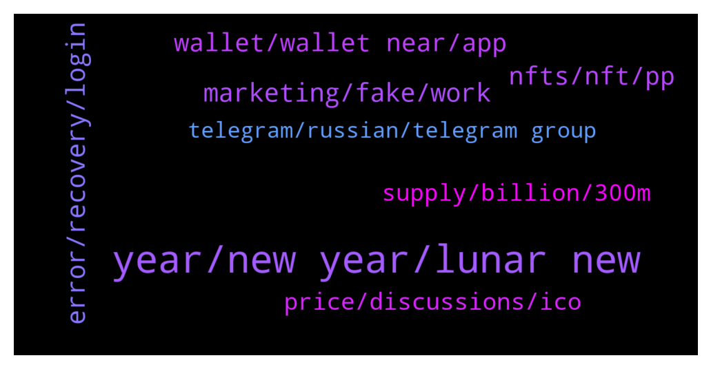

# **@cryptonear**
 ## Analysis for **2022-02-03** - **2022-02-04**.

---

## 📊 **Basic Stats**

**n_messages_sent**: 381

---

---

## 🔝 **Top keywords and related messages**

1. **year, new year, lunar new**

    @chasefreo --- *huge apologies for droping off soon. I had a meeting but hopefully you had a great time at the AMA. Thank you.* **--->** [TG Discussion](https://t.me/cryptonear/325217)

    @larry_lang --- *https://twitter.com/meta_pool/status/1489371891714433029 also just spotted a new giveaway chances=))) better not miss this=))* **--->** [TG Discussion](https://t.me/cryptonear/325974)

    @kv9990 --- *Next lunar new year probably =))* **--->** [TG Discussion](https://t.me/cryptonear/326106)

    @aidonker_x --- *thanks so much! i will give ice cream!* **--->** [TG Discussion](https://t.me/cryptonear/325874)

    @larry_lang --- *ah just comeback from my lunar new year holiday=)))* **--->** [TG Discussion](https://t.me/cryptonear/325971)

    @sanket_everstake --- *You are welcome, Let me know if you face any difficulty😃* **--->** [TG Discussion](https://t.me/cryptonear/326237)

2. **error, recovery, login**

    @hafeezsujan --- *How to login I Forget recovery phrase* **--->** [TG Discussion](https://t.me/cryptonear/325769)

    @C3lestial2 --- *Well my recovery email doesnt seem to work* **--->** [TG Discussion](https://t.me/cryptonear/326197)

    @surlamer --- *Hi admin please help to recover wallet* **--->** [TG Discussion](https://t.me/cryptonear/325633)

    @rahulgoel007 --- *Thatswhat i mentioned try to drop another mail and get in contact with her* **--->** [TG Discussion](https://t.me/cryptonear/325580)

    @hayabusa2506 --- *Why is it that when sending near is always an error?* **--->** [TG Discussion](https://t.me/cryptonear/325660)

    @iamkemoo --- *Hey, you can't log out currently, this feature is still in development and will be released this quarter.* **--->** [TG Discussion](https://t.me/cryptonear/326309)

3. **marketing, fake, work**

    @austinsims --- *Hello, how can I contact for marketing* **--->** [TG Discussion](https://t.me/cryptonear/325866)

    @Jorisstuurman --- *Yes i know its fake but want to warn you to do something about it. Some sapp will loose his money* **--->** [TG Discussion](https://t.me/cryptonear/325914)

    @hd283h --- *Sorry for the inconvenience  I work in the field of marketing, I have the best marketing offers We have a channel for work that has all the proof of work  I have many experiences, I love my work and I perfect it, we have a good reputation* **--->** [TG Discussion](https://t.me/cryptonear/325462)

    @Jorisstuurman --- *I think there is a fake near protocol official it promises to pay out 3 times the amount of near you sent them* **--->** [TG Discussion](https://t.me/cryptonear/325909)

    @williamcontact0 --- *Hello, how can i contact marketing* **--->** [TG Discussion](https://t.me/cryptonear/325895)

    @Berlo123 --- *Hello everybody. I have a question, i bought Rainbow tokens are they legit?* **--->** [TG Discussion](https://t.me/cryptonear/325290)

4. **nfts, nft, pp**

    @larry_lang --- *hmm didnt most NFTs projects all have little to no use cases=))) IMO i think the key part to build an solid NFTs is to build community =)) if u can build a large amount of pp u then u can make profit=))* **--->** [TG Discussion](https://t.me/cryptonear/326063)

    @Naikgauresh481 --- *After reading above chat I gained  some knowledge about NFTs* **--->** [TG Discussion](https://t.me/cryptonear/326103)

    @Herman --- *NFT seems gaining traction in Near* **--->** [TG Discussion](https://t.me/cryptonear/325502)

    @harryfrottercrypto --- *nfts are garbage, and on near especially theyre all so low effort and low quality* **--->** [TG Discussion](https://t.me/cryptonear/326058)

    @larry_lang --- *lol nft is kinda my weak spot to begin with=))* **--->** [TG Discussion](https://t.me/cryptonear/326057)

    @oppzsmoKe --- *I purchased him from near nft marketplace* **--->** [TG Discussion](https://t.me/cryptonear/325561)

5. **wallet, wallet near, app**

    @Bui_Long --- *Hello admin do we have near wallet app for ios? Thanks* **--->** [TG Discussion](https://t.me/cryptonear/325425)

    @FrenzyXO --- *Any plan on mobile app for near wallet ?* **--->** [TG Discussion](https://t.me/cryptonear/326126)

    @surlamer --- *Can l watch a wallet with NEAR ID? name* **--->** [TG Discussion](https://t.me/cryptonear/325640)

    @sedathaciarif --- *Is there a near extension wallet you can recommend?* **--->** [TG Discussion](https://t.me/cryptonear/326340)

    @heartradiance --- *I like the near wallet a lot, very user friendly, but I get so confused when another explorer is used than the typical etherscan type* **--->** [TG Discussion](https://t.me/cryptonear/325291)

    @Bheegem --- *What if I use 2FA on the one I have access to, hope nobody will be able to send funds from my wallet from other devices @iamkemoo* **--->** [TG Discussion](https://t.me/cryptonear/326317)

6. **price, discussions, ico**

    @Hagi --- *It is a good moment to buy now, what is the general opinion? Or to wait little bit more maybe will come some correction ? I feel the price is little bit hugh but want to hear ur opinions* **--->** [TG Discussion](https://t.me/cryptonear/325312)

    @Simeon4real --- *Please keep all price-related discussions in Price chat here: https://t.me/merchantsofnear* **--->** [TG Discussion](https://t.me/cryptonear/325237)

    @GeorgePro1 --- *For price discussions chat here: https://t.me/merchantsofnear* **--->** [TG Discussion](https://t.me/cryptonear/325455)

    @TheGo1denBull --- *Go to @merchantsofnear please for price discussions* **--->** [TG Discussion](https://t.me/cryptonear/325314)

    @NearFritz --- *Hello Mohd Azeem, the action of the price can have many reasons, we are here only for the tech* **--->** [TG Discussion](https://t.me/cryptonear/325368)

    @NearFritz --- *If you want to discuss about price action you can come to this group here @merchantsofnear* **--->** [TG Discussion](https://t.me/cryptonear/325369)

7. **supply, billion, 300m**

    @Herman --- *any thought why ASAC keep pumping to the roof hahaha* **--->** [TG Discussion](https://t.me/cryptonear/325513)

    @Mohdazeem --- *Why pumping is there any news??* **--->** [TG Discussion](https://t.me/cryptonear/325236)

    @chitranpuppy --- *Solana - wEth got hacked 300M USD, that's why Btc dump 🙈* **--->** [TG Discussion](https://t.me/cryptonear/325405)

    @oppzsmoKe --- *So this decreases the supply correct* **--->** [TG Discussion](https://t.me/cryptonear/326120)

    @oppzsmoKe --- *Does near  burn Their supply* **--->** [TG Discussion](https://t.me/cryptonear/326118)

    @Herman --- *got it just use burner for precaution* **--->** [TG Discussion](https://t.me/cryptonear/325732)

