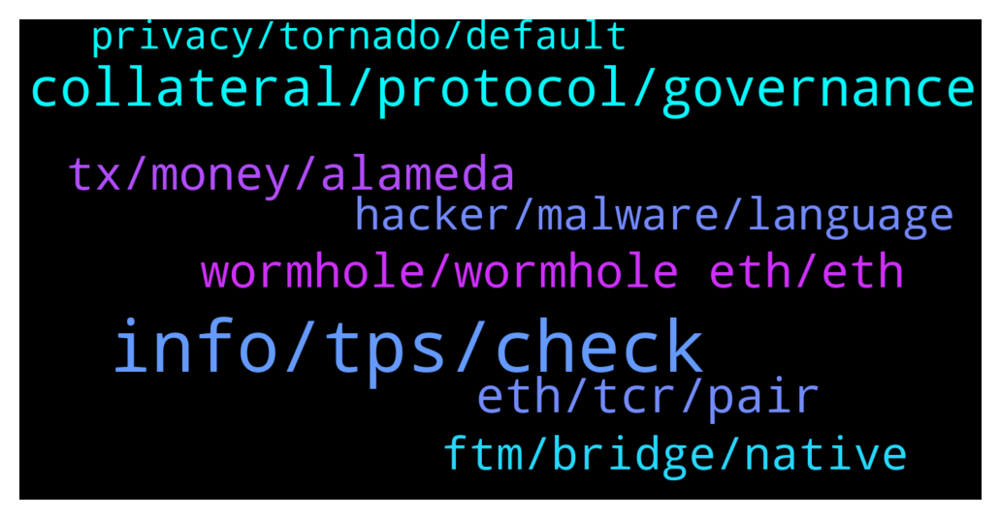

# **@lobsters_chat**
 ## Analysis for **2022-02-03** - **2022-02-04**.

---

## 📊 **Basic Stats**

**n_messages_sent**: 514

---

---

## 🔝 **Top keywords and related messages**

1. **info, tps, check**

    @DefiApe --- *This is their one of the core documents released.  https://docs.google.com/document/d/1MqPYWqEpHow4GxiUjCWMDDa6fvmR6OWxRxMOfXmzgh4/edit#  All I see is michael saylor* **--->** [TG Discussion](https://t.me/lobsters_chat/322367)

    @eth2enthusiast --- *got this mega list of VCs from some dude i met at a hostel last night, if anyone wants it https://docs.google.com/document/d/1BIM7Nbz_ohI9Lrk4sfu6LPHfpe7HkYFvH6rs7QD6iRE/edit?usp=sharing* **--->** [TG Discussion](https://t.me/lobsters_chat/322345)

    @ikram101 --- *You can find their code here:  https://github.com/certusone/wormhole/tree/dev.v2/solana/bridge/program  https://github.com/certusone/wormhole/tree/dev.v2/ethereum/contracts* **--->** [TG Discussion](https://t.me/lobsters_chat/322534)

    @bensams0 --- *is that insider info or can you reveal who?* **--->** [TG Discussion](https://t.me/lobsters_chat/322959)

    @carelion --- *hey guys, if i wanna check who’re the owner of mutisig address, where i can check it? Thanks!* **--->** [TG Discussion](https://t.me/lobsters_chat/322716)

    @DefiApe --- *one from the doc folder released* **--->** [TG Discussion](https://t.me/lobsters_chat/322374)

2. **collateral, protocol, governance**

    @Ile --- *You dont know the counterfactual, so this is debatable.   Also, they have not achieved (long term) stability. The unwinding will show the costs.   Also, I am suggesting a system for stability. FED has a bunch of other mandates too.* **--->** [TG Discussion](https://t.me/lobsters_chat/323086)

    @Ile --- *That is one way to do it, and it surely has its use. Change via governance is much more user- and dev friendly. However, you will never be truly resilient due to the human factor.  Unchangeable protocol may be re-deployed if needed. Such trial and error produces truly resilient protocols. It is not most profitable, or easy, but such public goods can benefit everyone.  This is emphasized in the decentralized algorithmic stablecoin design. Highest stability is achieved by huge collateral ratio, but no one wants to tie in so much capital. The fees from providing the service of stability are not enough to compete with other opportunities. However, if the capital belongs to the protocol, which does not care about opportunity cost, then it can solve the incentive problem that human backers would have.  Also governance is by definition less stable than an immutable contract. Which is great for a stablecoin that needs to be as predictable as possible.  I am surprised how people repeat the mistakes of tradfi at the very first step.* **--->** [TG Discussion](https://t.me/lobsters_chat/323083)

    @samkazemian --- *The governance is not for the profits, it’s for decentralized decision making on input parameters. You should make your stablecoin protocol :) it’s a cool idea.* **--->** [TG Discussion](https://t.me/lobsters_chat/323066)

    @samkazemian --- *The issue with governance minimized stablecoins is that price performance is the actual product of the protocol. So unless you've devised a god mechanism that somehow never can break under 99% of market conditions, it won't actually perform well in the most important thing: stable price.* **--->** [TG Discussion](https://t.me/lobsters_chat/323052)

    @Ile --- *Are there any attempts to make a self-sustaining, immutable, no-governance algostable?   @samkazemian has pointed out earlier that people should always prefer a stablecoin with higher collateral ratio. However, the collateral supply side is always looking for more capital  efficiency.   What if the collateral were fully owned by the protocol? Then there is no pressure to make the capital efficient. Just set a safe collateral ratio, like 400%. Issue new stablecoins only when above the safe threshold. Where does the collateral come then? Collect fees from usage, and add all fees to the collateral.   The build up would be slow, because the fees from usage are slow to accumulate the collateral. However, the demand should be strong: High collateral, no surprises from human intervention and transparent data on critical price point when collatetal ratio goes under 100%. Peg will always hold above that critical point (might break above peg in external markets though). Over time, more and more truly decentralized stablecoins would enter in circulation.  The only obstacle for the protocol self-sustainability is the price feed. An oracle imposes external point of failure. Auctioning sales and purchases of the stablecoin would internalize the risks. However, I have not come up with a sufficiently good system to avoid exploitation.* **--->** [TG Discussion](https://t.me/lobsters_chat/323043)

    @Ile --- *Central banks used to have a clear backing for dollar with gold.  Then they wanted to keep the inflation of dollar as stable as possible. Modified version of Taylor rule was proposed to make it as predictable as possible.  At every turn, the stable predetermined predictable rules were turned down with the argument that discretion is needed. I see the same pattern here.  Usefulness of governance depends on the application. When it comes to monetary stability, then unchangeable rules, simplicity and transparency trump discretion.* **--->** [TG Discussion](https://t.me/lobsters_chat/323084)

3. **eth, tcr, pair**

    @rahemanAli --- *probably, wrapped eth on other chains backed by eth on eth are exploited.. trying to figure out the exploit rn, looks bad tho..* **--->** [TG Discussion](https://t.me/lobsters_chat/322450)

    @ChiTimesChi --- *Neat. TCR team managed to fuck up with _allowances params order in burnFrom(). So anyone could burn coins from any address by allowing that address to spend your coins first.  So the exploit is fairly easy. You set up a contract, that buys a bit of TCR -> approves Uniswap pair to spend TCR -> burns almost all TCR supply in Uniswap pair -> syncs Uniswap pair reserves, thus inflating the TCR price -> sells back TCR to drain almost all USDT from the pair.  LPs are rekt, gg.  https://ethtx.info/mainnet/0x81e9918e248d14d78ff7b697355fd9f456c6d7881486ed14fdfb69db16631154/* **--->** [TG Discussion](https://t.me/lobsters_chat/323166)

    @lay2000lbs --- *wait this was exploited for real ETH? https://etherscan.io/tx/0x24c7d855a0a931561e412d809e2596c3fd861cc7385566fd1cb528f9e93e5f14* **--->** [TG Discussion](https://t.me/lobsters_chat/322433)

    @sonicblend --- *> ETH will be added over the next hours to ensure wETH is backed 1:1.  🔥* **--->** [TG Discussion](https://t.me/lobsters_chat/322626)

    @Henry_Elder --- *Permanent exploit against anyone who gave approval to the old Multichain contracts for WETH, PERI, OMG, WBNB, MATIC, AVAX. You can check here whether you're affected: https://app.multichain.org/#/approvals* **--->** [TG Discussion](https://t.me/lobsters_chat/322664)

    @ibogdanv --- *I think the problem is the entire Eth scaling model. Everything needs to be bridged. Long term this will have more security issues like this one.* **--->** [TG Discussion](https://t.me/lobsters_chat/322672)

4. **tx, money, alameda**

    @Internal123456 --- *how much of that is alameda?* **--->** [TG Discussion](https://t.me/lobsters_chat/322385)

    @CaptainTit0 --- *111 FTM 230$ BOO 57.5 = 1300$* **--->** [TG Discussion](https://t.me/lobsters_chat/322674)

    @Odedby --- *So how much is he worth now* **--->** [TG Discussion](https://t.me/lobsters_chat/322558)

    @sf481 --- *fuckin all of it, but this is pennies to alameda* **--->** [TG Discussion](https://t.me/lobsters_chat/322394)

    @sneg55 --- *sure thing, it is TX with the same amount of gas as for approval* **--->** [TG Discussion](https://t.me/lobsters_chat/322704)

    @minion0x --- *transaction in question: https://etherscan.io/tx/0x2896308cb1b2e388b5c07678570c5270d9845c872ea2dc66e68280d74ff71c4a   this is only like 1 dollar lol* **--->** [TG Discussion](https://t.me/lobsters_chat/322578)

5. **wormhole, wormhole eth, eth**

    @Internal123456 --- *solend mkt rn, wormhole eth at the top correct?* **--->** [TG Discussion](https://t.me/lobsters_chat/322449)

    @CryptoGraham --- *Was wormhole a well established product? I’ve been away a while.* **--->** [TG Discussion](https://t.me/lobsters_chat/322624)

    @syed_jafri --- *Anyways you want to borrow wormhole ETH and sell it* **--->** [TG Discussion](https://t.me/lobsters_chat/322423)

    @sf481 --- *if anything, it pumps because people dump wormhole ETH for soETH?* **--->** [TG Discussion](https://t.me/lobsters_chat/322409)

    @samkazemian --- *Wow this Vitalik tweet is straight up prophetic given the Wormhole stuff. He basically just wrote out exactly what happened.* **--->** [TG Discussion](https://t.me/lobsters_chat/322490)

    @Quiveringsphinx --- *Can the same hack or similar be duplicated for the other chains wormhole supports?* **--->** [TG Discussion](https://t.me/lobsters_chat/322539)

6. **ftm, bridge, native**

    @Szsahaj --- *how do you go about bridging to native network token for fees without using an exchange. ?  for eg, i have 1 eth on eth network, and want to bridge it to FTM network in FTM but my ftm wallet side is new and has no ftm for fees.  I am mostly using anyswap stable pools, but you still need to use exchange their to get some native token for fees, yes? thanks.* **--->** [TG Discussion](https://t.me/lobsters_chat/322804)

    @Szsahaj --- *i meant for example, if i want to go from polygon to avax, there's only option to do so via usdc pool, and not native tokens. it'll get stuck and has no point if my avax wallet is new and has no avax for fees to withdraw usdc from pool on the other end* **--->** [TG Discussion](https://t.me/lobsters_chat/322812)

    @philippvienna --- *some bridges add a bit of native token for gas, some times there are faucets, sometimes you would have to buy ftm on eth mainnet and bridge that first  https://docs.spookyswap.finance/getting-started/how-to-get-fantom-gas* **--->** [TG Discussion](https://t.me/lobsters_chat/322805)

    @bernyn --- *I have done so with elk finance but the bridge is of elk token + native and then swap* **--->** [TG Discussion](https://t.me/lobsters_chat/322814)

    @Nicolas_A --- *Multiple bridge "airdrop" you some gas token (AVAX, BNB, MATIC) to pay for your first transaction nowadays. Synapse and Celer have that feature* **--->** [TG Discussion](https://t.me/lobsters_chat/322819)

    @mrtdlgc --- *you can use elk finance to bridge, they just convert some ELK to the native token and deduct it from the amount you bridge* **--->** [TG Discussion](https://t.me/lobsters_chat/322808)

7. **hacker, malware, language**

    @adrianleb --- *no one knows exactly what is happening, what kind of exploit, peoples funds are at risk, not the time to speculate, or shill alternatives* **--->** [TG Discussion](https://t.me/lobsters_chat/322514)

    @PrimordialAA --- *You guys… do you not know who jump is ;p* **--->** [TG Discussion](https://t.me/lobsters_chat/322851)

    @ssmccul --- *https://cointelegraph.com/news/hodlers-beware-new-malware-targets-metamask-and-40-other-crypto-wallets  Mars Stealer can be spread through various channels such as file-hosting websites, torrent clients and any other shady downloaders. After infecting a system, the first thing the malware does is check the device language. If it matches the language ID of Kazakhstan, Uzbekistan, Azerbaijan, Belarus or Russia, the software leaves the system without any malicious action. (LOL, is this you Ivan?)  For the rest of the world, the malware targets a file that holds sensitive information such as crypto wallets’ address info and private keys. It then leaves the system by deleting any presence once the theft is complete.* **--->** [TG Discussion](https://t.me/lobsters_chat/323163)

    @coine_r --- *⁠$5 wrench attacks appear to be on the rise in the crypto community  "Be careful, sometimes, when you mention that you work in crypto, people's impression of you immediately switches to "millionaire" or "billionaire", making you far more susceptible to extortion-related crimes," writes security expert Dr. Anon.  https://ct.com/aatw* **--->** [TG Discussion](https://t.me/lobsters_chat/322379)

    @ivangbi --- *All the security convos are over now. Use ctrl+f to read banteg’s ideas, Immunefi guys ideas, samczsun, and others. FIN.* **--->** [TG Discussion](https://t.me/lobsters_chat/322795)

    @danrobinson010 --- *What would give the hacker any edge in that MEV race* **--->** [TG Discussion](https://t.me/lobsters_chat/322750)

