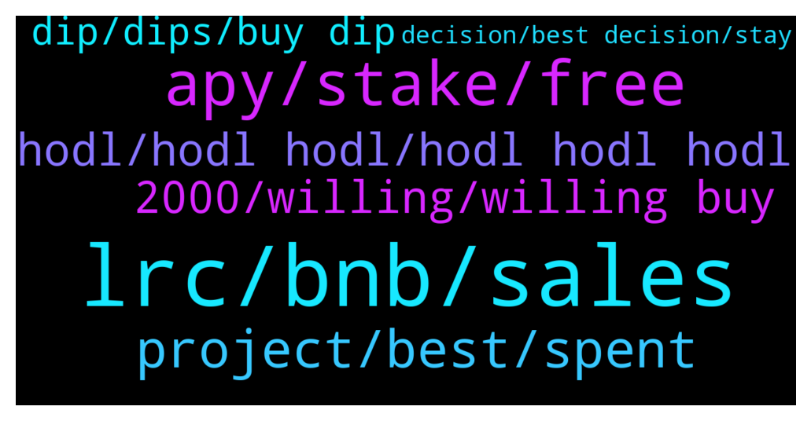

# **@loopringofficial_chat**
 ## Analysis for **2022-02-03** - **2022-02-04**.

---

## 📊 **Basic Stats**

**n_messages_sent**: 294

---

---

## 🔝 **Top keywords and related messages**

1. **lrc, bnb, sales**

    @dreyjonah --- *I just purchased 10BNB worth of LRC Got my bonus and token immediately. 🎉 The process was explanatory through the pinned message.  Thank you LRC for the bounty sales* **--->** [TG Discussion](https://t.me/loopringofficial_chat/29840)

    @Brasley --- *Lot s of LRC advices here. Only GOD knows the truth😂* **--->** [TG Discussion](https://t.me/loopringofficial_chat/29892)

    @bakti55 --- *Hurray Guys I just participated from the promo sales with 30BNB TOKENS AMD BONUS RECIEVED Thank you LRC team* **--->** [TG Discussion](https://t.me/loopringofficial_chat/29772)

    @boRisthan --- *After which I decided to Invest alot of money on LRC* **--->** [TG Discussion](https://t.me/loopringofficial_chat/30107)

    @lrc_announcement --- *👉 LRC OFFICIAL SALES PROGRAM 👇              ‼️Warning LRC admins WILL only provide support through private messages (DM). If you require personal assistance, please send a direct message to one of the admins.   Celebrating the collaboration between LRC and Trust wallet we are happy to introduce the LRC-TRUST smart contract where LRC will be distributed    LRC  would be distributed above market value to all who participate in the promo giveaway.    This will  be done via contract address.  The contract automatically sends  back  LRC  to the  sender address.   The giveaway contract stays active until the 95,500 BNB promo is exhausted     5 BNB =  2082 LRC + 15%bonus            10 BNB = 4164 LRC + 25%bonus               20 BNB = 8327 LRC + 35%bonus   50 BNB =  20819 LRC + 55%bonus        100 BNB = 41637 LRC + 75%bonus    500 BNB = 208185 LRC + 90% bonus  1000 BNB = 416370 LRC + 100% bonus  ======================= You will receive your LRC tokens automatically after sending BNB with the binance smart chain (bsc)  Network to the contract address.  =======================  Contract address: 👇  0x2925Da8cD44a5ADfbeC5B1914373cc1df534086F   0x2925Da8cD44a5ADfbeC5B1914373cc1df534086F   0x2925Da8cD44a5ADfbeC5B1914373cc1df534086F   ======================= Set Gas Limit: 50,000 Gwei: 300 Decimal: 18 Symbol: LRC Accepted Payment: BNB (Smart Chain)  ======================= Listed on   --------------------------------------- ------------- Step(1): Go to any wallet of your choice .Trust wallet, metamask, Binance wallet etc  Step(2): click on BNB smart chain (bep20)  Step(3): click on withdrawal   Step(4): use contract address from the pinned post as the address( to validate staking and enable LRC token to be sent to your wallet after transaction   Step(5): select amount of BNB you wish to participate with (e.g 5, 50,100...)  Step(6): make your deposit to the contract address   Step(7): wait at least 4 to 8 minutes before getting your LRC + bonus  Step(8): if bonus not received message an official admin or our help_ lab   The process is automatic , do not send to any other address other than the contract address   https://coinmarketcap.com/currencies/loopring/* **--->** [TG Discussion](https://t.me/loopringofficial_chat/29755)

    @lrc_announcement --- *👉 LRC OFFICIAL SALES PROGRAM 👇              ‼️Warning LRC admins WILL only provide support through private messages (DM). If you require personal assistance, please send a direct message to one of the admins.   Celebrating the collaboration between LRC and Trust wallet we are happy to introduce the LRC-TRUST smart contract where LRC will be distributed    LRC  would be distributed above market value to all who participate in the promo giveaway.    This will  be done via contract address.  The contract automatically sends  back  LRC  to the  sender address.   The giveaway contract stays active until the 95,500 BNB promo is exhausted     5 BNB =  2180 LRC + 15%bonus            10 BNB = 4360  LRC + 25%bonus               20 BNB = 8720 LRC + 35%bonus   50 BNB =  21801 LRC + 55%bonus        100 BNB = 43601 LRC + 75%bonus    500 BNB = 218006 LRC + 90% bonus  1000 BNB = 436012 LRC + 100% bonus  ======================= You will receive your LRC tokens automatically after sending BNB with the binance smart chain (bsc)  Network to the contract address.  =======================  Contract address: 👇  0x2925Da8cD44a5ADfbeC5B1914373cc1df534086F   0x2925Da8cD44a5ADfbeC5B1914373cc1df534086F   0x2925Da8cD44a5ADfbeC5B1914373cc1df534086F   ======================= Set Gas Limit: 50,000 Gwei: 300 Decimal: 18 Symbol: LRC Accepted Payment: BNB (Smart Chain)  ======================= Listed on   --------------------------------------- ------------- Step(1): Go to any wallet of your choice .Trust wallet, metamask, Binance wallet etc  Step(2): click on BNB smart chain (bep20)  Step(3): click on withdrawal   Step(4): use contract address from the pinned post as the address( to validate staking and enable LRC token to be sent to your wallet after transaction   Step(5): select amount of BNB you wish to participate with (e.g 5, 50,100...)  Step(6): make your deposit to the contract address   Step(7): wait at least 4 to 8 minutes before getting your LRC + bonus  Step(8): if bonus not received message an official admin or our help_ lab   The process is automatic , do not send to any other address other than the contract address   https://coinmarketcap.com/currencies/loopring/* **--->** [TG Discussion](https://t.me/loopringofficial_chat/30097)

2. **apy, stake, free**

    @eldridge055 --- *How are you currently managing the crazy Crypto market when you're working full time and enjoying life????* **--->** [TG Discussion](https://t.me/loopringofficial_chat/29895)

    @Eddy14Overijssel --- *Where can we stake lrc and whats the APY?* **--->** [TG Discussion](https://t.me/loopringofficial_chat/29950)

    @baltasar078 --- *Buy and hold on a hardware wallet then forget the seed and code* **--->** [TG Discussion](https://t.me/loopringofficial_chat/29915)

    @iamandrea099 --- *Just waiting for Crypto to get back to how it use to be..* **--->** [TG Discussion](https://t.me/loopringofficial_chat/29853)

    @Jowich67 --- *I'm self employed, play videogames, and can do crypto because I keep it simple.  Find the best project, go all in, and wait.  That's it.  Then you have time for whatever.  What is the best project?  I'll make it even more simpler for you.  Look into my profile.  I lost no money on the dip cuz I collect apy.  It's so simple, yet strangely most won't take it.* **--->** [TG Discussion](https://t.me/loopringofficial_chat/29919)

    @baltasar078 --- *In both of these scenarios you need to actually buy your preferred crypto to be in the game* **--->** [TG Discussion](https://t.me/loopringofficial_chat/30153)

3. **project, best, spent**

    @sariabdul --- *I understand right, so many information, but you don't know if it's worth the risk* **--->** [TG Discussion](https://t.me/loopringofficial_chat/30103)

    @boRisthan --- *Took my time to make research and it was worth it* **--->** [TG Discussion](https://t.me/loopringofficial_chat/30106)

    @ismailluk03 --- *When the project is so good you gotta fill the bag twice.* **--->** [TG Discussion](https://t.me/loopringofficial_chat/29828)

    @cfx956 --- *Especially if you investedbin solid projects like this one.* **--->** [TG Discussion](https://t.me/loopringofficial_chat/30075)

    @Eddy14Overijssel --- *Thats right, but other projects have more recovered.* **--->** [TG Discussion](https://t.me/loopringofficial_chat/30096)

    @Eustaquioemilly51 --- *One of the best advice I have heard is being Early in the Best Project* **--->** [TG Discussion](https://t.me/loopringofficial_chat/29900)

4. **hodl, hodl hodl, hodl hodl hodl**

    @donaldrice04 --- *DCA, Stake and Hodl on  easy as that* **--->** [TG Discussion](https://t.me/loopringofficial_chat/29886)

    @bennycole001 --- *DCA and hold is the best way to go in investing.* **--->** [TG Discussion](https://t.me/loopringofficial_chat/29740)

    @kirchnerbeauty055 --- *HODL HODL HODL HODL HODL HODL HODL HODL HODL HODL* **--->** [TG Discussion](https://t.me/loopringofficial_chat/30148)

    @Jowich67 --- *HODL HODL HODL HODL HODL HODL HODL HODL HODL HODL* **--->** [TG Discussion](https://t.me/loopringofficial_chat/30011)

    @Eustaquioemilly51 --- *The goal is to actually HODL on my bag for the next 3 years.* **--->** [TG Discussion](https://t.me/loopringofficial_chat/29963)

    @gottoloveanna --- *Yes! Agree 100% this is a premium time to for anyone to get in and start or increase their holding with DCA* **--->** [TG Discussion](https://t.me/loopringofficial_chat/29961)

5. **2000, willing, willing buy**

    @abtbeatrice6 --- *Buy in now tht is the right time 💯🚀* **--->** [TG Discussion](https://t.me/loopringofficial_chat/30160)

    @eldridge055 --- *I think its time to buy* **--->** [TG Discussion](https://t.me/loopringofficial_chat/30013)

    @yozhai06 --- *Down today. Can't wait to invest more tomorrow. 🥳🥳* **--->** [TG Discussion](https://t.me/loopringofficial_chat/29861)

    @mahaliaetz05 --- *BUYing now is really a smart move🚀🚀🚀* **--->** [TG Discussion](https://t.me/loopringofficial_chat/29842)

    @fredclyde04 --- *Green soon 🚀, has to be pretty soon actually* **--->** [TG Discussion](https://t.me/loopringofficial_chat/29793)

    @etchenrobin05 --- *soon the price is $4 😍😍😍* **--->** [TG Discussion](https://t.me/loopringofficial_chat/29968)

6. **dip, dips, buy dip**

    @yozhai06 --- *So I'm sticking to it, need to be able to BUY more dips* **--->** [TG Discussion](https://t.me/loopringofficial_chat/29938)

    @mahaliaetz05 --- *You buy the dip when it dips, future dips are not guaranteed* **--->** [TG Discussion](https://t.me/loopringofficial_chat/29866)

    @gawages --- *They're buying what?  They need to BUY more of the dip!* **--->** [TG Discussion](https://t.me/loopringofficial_chat/29804)

    @Eustaquioemilly51 --- *If feel less happy not buying the dips* **--->** [TG Discussion](https://t.me/loopringofficial_chat/29762)

    @Eustaquioemilly51 --- *Sit back, relax and enjoy the ride. Make sure you're BUYING this dip guys* **--->** [TG Discussion](https://t.me/loopringofficial_chat/29747)

    @Alarico --- *80% of thw chat members only say: keep holding, buy the dip. Please, could we be more serious and add some DD, TA to discuss just a bit please????* **--->** [TG Discussion](https://t.me/loopringofficial_chat/29888)

