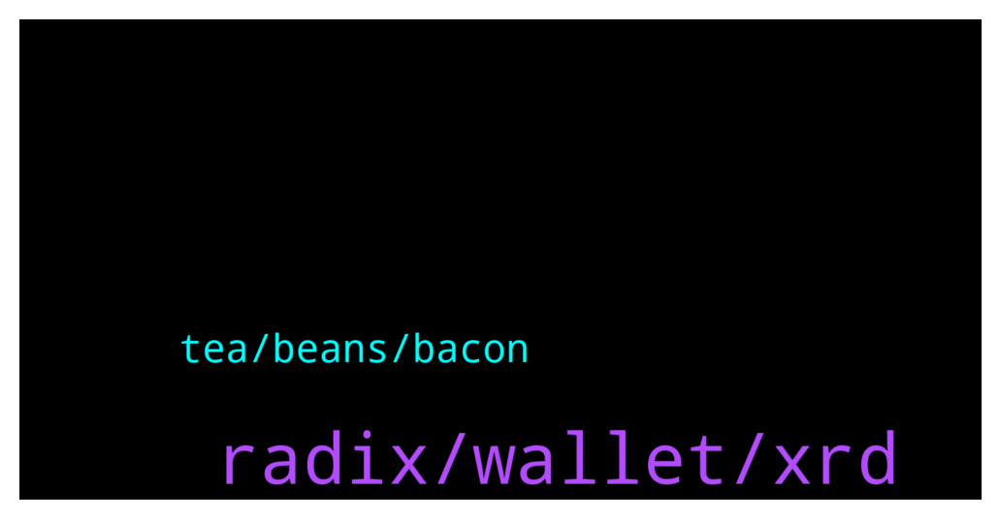

# **@radix_dlt**
 ## Analysis for **2022-02-03** - **2022-02-04**.

---

## 📊 **Basic Stats**

**n_messages_sent**: 643

---

---

## 🔝 **Top keywords and related messages**

1. **radix, wallet, xrd**

    @Jacob_XRD --- *Governance of a system with $400 Trillion of potential is normally reserved for nation-states, and now Radix.  RDX Works is searching for a unique individual to design and implement a Governance model for the Radix Public Network.  Full Details: https://www.radixdlt.com/post/designing-governance-with-400-trillion-of-potential* **--->** [TG Discussion](https://t.me/radix_dlt/350488)

    @Cpt_Charles --- *Lol. Someone stole 216m USD by exploiting Solana VAA verification and minted 80k wETH tokens 🤡  https://etherscan.io/tx/0x24c7d855a0a931561e412d809e2596c3fd861cc7385566fd1cb528f9e93e5f14  https://www.notifi.xyz/messages/1497* **--->** [TG Discussion](https://t.me/radix_dlt/350235)

    @Mr_TMA --- *Actually there are not 2^256 shards in existence, but rather it is a prepared mapping. Storage space will only be taken up when a piece of data is mapped into the shard space.  The number 2^256 comes from the SHA-256 cryptographic hash-function. When there is a new piece of data (substate) to be processed it will be its own shard with shard-id given by SHA-256 hash-function: f(substate) —> shard_id. Based on the shard_id's the shards can be distributed over nodes and be traced.  To make this sharding strategy work the Radix design needs each substate to be mapped into a «unique» shard_id.  This is different from 'regular' hashing where each item is mapped into a bucket of items. It is possible to get a unique shard_id by applying the SHA-256 cryptographic hash-function: this function is designed to give 'practilally unique' outcomes as used in cryptographic protection (there is uniqueness up to astronomically small chances of collisions, which are non-fatal for the Radix design).  Radix uses the near-uniqueness property in its sharding strategy. Radix needs this because with Radix shards are minimalistic objects: tiny pieces of data that can are tied together on the fly during a consensus operation. The more granular the shards (the tinier the objects), the more indepedent objects you have which allows for more parellellization during consensus (different transactions tend to involve different shards, which allows to process them in parallel).  With sharding in regular non-crypto databases the uniquess property provided by the SHA-256 function is not important by itself. It may be useful if it could speed up the mapping/lookup process, but since SHA-256 is a heavy function itself it probably won't beat simpler hashing in common circumstances.  This post provides a top-level overview + background links:  https://www.reddit.com/r/Radix/comments/qq43xh/what_is_sharding_and_how_is_the_radix_way_of/* **--->** [TG Discussion](https://t.me/radix_dlt/350426)

    @Jacob_XRD --- *Big congrats to @OfficiallyTimeWasted on his event in Kentucky! Amazing to see.  If you would like to host an event in your city let me know via the discord server or Telegram.   https://twitter.com/miso_shiru69/status/1489339664754372608?s=21  https://t.me/Radix_Meetup* **--->** [TG Discussion](https://t.me/radix_dlt/350757)

    @Natethegreat762 --- *https://youtu.be/d-EM8tkz7gI at 47:45, I thought eth wasn't implementing smart contracts with its shards and that that was a polkadot thing and eth would use zk and optimistic to scale? I might be wording this bad I'll have to find the vid where I heard this* **--->** [TG Discussion](https://t.me/radix_dlt/350336)

    @Null_v0id --- *Who’s representing Radix at the Crypto Bowl? https://fortune.com/2022/02/03/crypto-super-bowl-commercials-binance/* **--->** [TG Discussion](https://t.me/radix_dlt/350794)

2. **tea, beans, bacon**

    @Jacob_XRD --- *In any case. Australian brunch is superior to anything mentioned in this thread.* **--->** [TG Discussion](https://t.me/radix_dlt/351034)

    @Radstakes --- *Controversial! For tea without milk, 100% agree.  But not for english breakfast tea* **--->** [TG Discussion](https://t.me/radix_dlt/350968)

    @Cpt_Charles --- *It always surprises me what the brits eat for breakfast, beans sausage etc 😂* **--->** [TG Discussion](https://t.me/radix_dlt/350974)

    @tesslerc --- *Adam, if you ever visit Israel I'll take you to a real breakfast. Salad and shakshuka.  Tasty and you dont fall asleep after 2 hours 😉* **--->** [TG Discussion](https://t.me/radix_dlt/351009)

    @Adam_XRD --- *Will fight anyone who claims a full English breakfast isn't the ONE thing in British cuisine that is actual perfection.* **--->** [TG Discussion](https://t.me/radix_dlt/350986)

    @aj4269 --- *Breakfast is the most imp meal of the day, skip the dinner if you please.* **--->** [TG Discussion](https://t.me/radix_dlt/351072)

