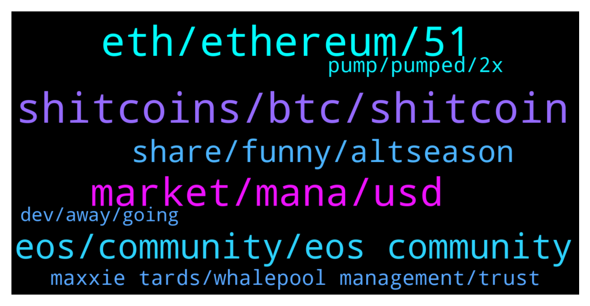

# **@shitpool**
 ## Analysis for **2022-02-03** - **2022-02-04**.

---

## 📊 **Basic Stats**

**n_messages_sent**: 239

---

---

## 🔝 **Top keywords and related messages**

1. **shitcoins, btc, shitcoin**

    @Zuhaib0095 --- *BTC isn't perfect, not even good compared to many other things out there. But it is the original one, that is the only big difference which makes us label them shitcoins.* **--->** [TG Discussion](https://t.me/shitpool/723115)

    @Zuhaib0095 --- *By definition everything other than BTC is a shitcoin, the degree of shitiness varies though.* **--->** [TG Discussion](https://t.me/shitpool/723108)

    @ptsolorid --- *It is also the only truly decentralised coin.* **--->** [TG Discussion](https://t.me/shitpool/723151)

    @bengotti --- *Shitcoins is either used affectionately to describe vaporware designed to make money or used by low iq bitcoiners to cope* **--->** [TG Discussion](https://t.me/shitpool/723121)

    @da0man --- *No, it is non-custodial bitcoin on ETH unlike renBTC and wBTC, and proxy-reencryption* **--->** [TG Discussion](https://t.me/shitpool/723027)

    @ManimalX --- *A lot of people shilling shitcoins 🤣🤣* **--->** [TG Discussion](https://t.me/shitpool/723131)

2. **eth, ethereum, 51**

    @wojackdegreate --- *The fundamental security limits of bridges are actually a key reason why while I am optimistic about a multi-chain blockchain ecosystem (there really are a few separate communities with different values and it's better for them to live separately than all fight over influence on the same thing), I am pessimistic about cross-chain applications.  To understand why bridges have these limitations, we need to look at how various combinations of blockchains and bridging survive 51% attacks. Many people have the mentality that "if a blockchain gets 51% attacked, everything breaks, and so we need to put all our force on preventing a 51% attack from ever happening even once". I really disagree with this style of thinking; in fact, blockchains maintain many of their guarantees even after a 51% attack, and it's really important to preserve these guarantees.  For example, suppose that you have 100 ETH on Ethereum, and Ethereum gets 51% attacked, so some transactions get censored and/or reverted. No matter what happens, you still have your 100 ETH. Even a 51% attacker cannot propose a block that takes away your ETH, because such a block would violate the protocol rules and so it would get rejected by the network. Even if 99% of the hashpower or stake wants to take away your ETH, everyone running a node would just follow the chain with the remaining 1%, because only its blocks follow the protocol rules. More generally, if you have an application on Ethereum, then a 51% attack could censor or revert it for some time, but what comes out at the end is a consistent state. If you had 100 ETH, but sold it for 320000 DAI on Uniswap, even if the blockchain gets attacked in some arbitrary crazy way, at the end of the day you still have a sensible outcome - either you keep your 100 ETH or you get your 320000 DAI. The outcome where you get neither (or, for that matter, both) violates protocol rules and so would not get accepted.  Now, imaging what happens if you move 100 ETH onto a bridge on Solana to get 100 Solana-WETH, and then Ethereum gets 51% attacked. The attacker deposited a bunch of their own ETH into Solana-WETH and then reverted that transaction on the Ethereum side as soon as the Solana side confirmed it. The Solana-WETH contract is now no longer fully backed, and perhaps your 100 Solana-WETH is now only worth 60 ETH. Even if there's a perfect ZK-SNARK-based bridge that fully validates consensus, it's still vulnerable to theft through 51% attacks like this.  For this reason, it's always safer to hold Ethereum-native assets on Ethereum or Solana-native assets on Solana than it is to hold Ethereum-native assets on Solana or Solana-native assets on Ethereum. And in this context, "Ethereum" refers not just to the base chain, but also any proper L2 that is built on it. If Ethereum gets 51% attacked and reverts, Arbitrum and Optimism revert too, and so "cross-rollup" applications that hold state on Arbitrum and Optimism are guaranteed to remain consistent even if Ethereum gets 51% attacked. And if Ethereum does not get 51% attacked, there's no way to 51% attack Arbitrum and Optimism separately. Hence, holding assets issued on Optimism wrapped on Arbitrum is still perfectly safe.  The problem gets worse when you go beyond two chains. If there are 100 chains, then there will end up being dapps with many interdependencies between those chains, and 51% attacking even one chain would create a systemic contagion that threatens the economy on that entire ecosystem. This is why I think zones of interdependency are likely to align closely to zones of sovereignty (so, lots of Ethereum-universe applications interfacing closely with each other, lots of Avax-universe applications interfacing with each other, etc etc, but NOT Ethereum-universe and Avax-universe applications interfacing closely with each other)* **--->** [TG Discussion](https://t.me/shitpool/722738)

    @EmotionLotion --- *It has been consistently the way  of the market to trap longs that think eth is leading* **--->** [TG Discussion](https://t.me/shitpool/723172)

    @MoneroPal --- *Im about to ape into ETH here fellas, wish me luck, or stop me* **--->** [TG Discussion](https://t.me/shitpool/723157)

    @MoneroPal --- *None of that bullshit is worth $250m they lost though. In all honesty ETH should just reverse the blocks on a network level and wormhole should pay miners. The hacks and outright thefts are bullshit and hurt the entire ecosystem more then anything.* **--->** [TG Discussion](https://t.me/shitpool/722868)

    @EmotionLotion --- *looks like volume is picking up here tbh* **--->** [TG Discussion](https://t.me/shitpool/723190)

    @wanker007 --- *It's like eth is the gov bailing out idiot banks looool* **--->** [TG Discussion](https://t.me/shitpool/722875)

3. **market, mana, usd**

    @Zuhaib0095 --- *A gem...👌  The only greed they displayed was listed at a higher than deserving price so the market punished them for that.  Now itz cheap and the best time to get in.* **--->** [TG Discussion](https://t.me/shitpool/723080)

    @da0man --- *imagine negotiating with MANA at 5 usd for example. you get 100k mana for the project. When you actually get the MANA, it is worth 0.05 usd* **--->** [TG Discussion](https://t.me/shitpool/722919)

    @MoneroPal --- *is this priced in already, ser?* **--->** [TG Discussion](https://t.me/shitpool/722693)

    @criptix --- *I would buy 60 imho - deeper if we go full blown bear market* **--->** [TG Discussion](https://t.me/shitpool/722637)

    @CryptoMike66 --- *As I understood, you are familiar with $AMB* **--->** [TG Discussion](https://t.me/shitpool/722681)

    @wojackdegreate --- *Should do that even when the market is bullish imo* **--->** [TG Discussion](https://t.me/shitpool/722852)

4. **eos, community, eos community**

    @rektkid --- *Dude, that's not what this is about. I'm not here to debate EOS with you.* **--->** [TG Discussion](https://t.me/shitpool/722959)

    @Horselorde --- *However I think the only people that believe the EOS community is audacious, unapologetic and uncompromising are the EOS community… most others think they’re morons.* **--->** [TG Discussion](https://t.me/shitpool/722932)

    @rektkid --- *EOS community stopped B1's vesting EOS and effectively divorced them. That is moving on.* **--->** [TG Discussion](https://t.me/shitpool/722943)

    @rektkid --- *Holy shit, are you still that hung up on EOS? Dude, move on.* **--->** [TG Discussion](https://t.me/shitpool/722939)

    @Horselorde --- *“EOS is about to EXPLODE!! Don’t miss out 😉”  They’re never gonna stop lmao* **--->** [TG Discussion](https://t.me/shitpool/722921)

    @Horselorde --- *Lmao no, it’s not my fault y’all got fucked by B1 and can’t move on.* **--->** [TG Discussion](https://t.me/shitpool/722941)

5. **share, funny, altseason**

    @BeAMightyKing --- *lmfao I will take that hindsight L* **--->** [TG Discussion](https://t.me/shitpool/723189)

    @Zuhaib0095 --- *You can share to two people.* **--->** [TG Discussion](https://t.me/shitpool/723088)

    @Horselorde --- *Always get a red exclamation point next to it saying it failed to send lol* **--->** [TG Discussion](https://t.me/shitpool/723016)

    @MasterOfCoin90 --- *Hahaha, nice one 😆. But I will only reveal it after 6 months* **--->** [TG Discussion](https://t.me/shitpool/723097)

    @b3n_ken0bi --- *Wen altseason sers? I need my juicy altseason soon or i might get really really bored* **--->** [TG Discussion](https://t.me/shitpool/722659)

    @Alwayscooked --- *Share it then and prove your worth* **--->** [TG Discussion](https://t.me/shitpool/723082)

6. **pump, pumped, 2x**

    @CryptoMike66 --- *Got listing by Binance. So, I think it will pump* **--->** [TG Discussion](https://t.me/shitpool/722688)

    @mrlurah --- *It's amazing to see how imx pumped and dumped after the news* **--->** [TG Discussion](https://t.me/shitpool/723144)

    @MasterOfCoin90 --- *Classic "sell the news" pump and dump* **--->** [TG Discussion](https://t.me/shitpool/723145)

    @gonubie --- *this feels like a proper pump overall, first time in months* **--->** [TG Discussion](https://t.me/shitpool/722978)

    @MoneroPal --- *Immutable, I recall them, they pumped hard last year in the spring* **--->** [TG Discussion](https://t.me/shitpool/722882)

    @BeAMightyKing --- *no idea. I was joking about that pump reason, mainly since QSP & RNDR went >= 2x in the days prior to their most recent Coinbase listing* **--->** [TG Discussion](https://t.me/shitpool/722695)

7. **maxxie tards, whalepool management, trust**

    @Moon --- *Maybe he wants to buy my ape* **--->** [TG Discussion](https://t.me/shitpool/723156)

    @bengotti --- *Not many maxxie tards in the whalepool management* **--->** [TG Discussion](https://t.me/shitpool/723126)

    @gonubie --- *its a bull trap isnt it* **--->** [TG Discussion](https://t.me/shitpool/722980)

    @Moon --- *whose buying my apes tonight? 😎😎* **--->** [TG Discussion](https://t.me/shitpool/722976)

    @criptix --- *The irony that swapman is a solana whale 🥲* **--->** [TG Discussion](https://t.me/shitpool/722795)

    @OxZilla --- *Do we trust badger still or no?* **--->** [TG Discussion](https://t.me/shitpool/722844)

