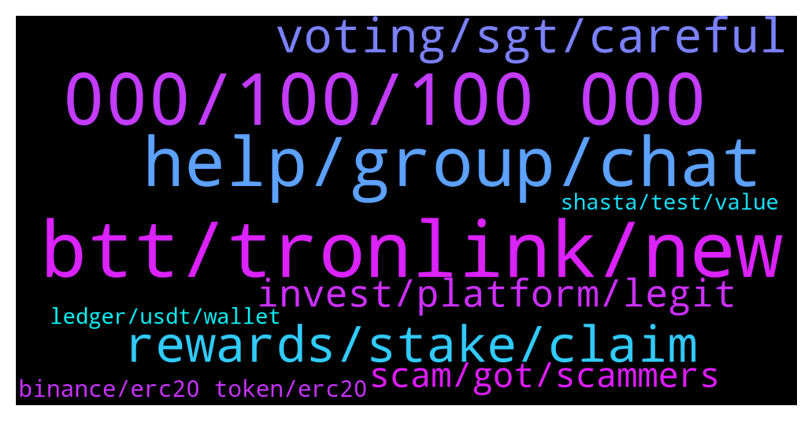

# **@tronnetworkEN**
 ## Analysis for **2022-02-03** - **2022-02-04**.

---

## 📊 **Basic Stats**

**n_messages_sent**: 229

---

---

## 🔝 **Top keywords and related messages**

1. **btt, tronlink, new**

    @Abelrajuz --- *Lol ur account is already activated. I think it needs only 0.1 trx* **--->** [TG Discussion](https://t.me/tronnetworkEN/3868709)

    @DmG_90 --- *Its not tronlink, its for all tronwallets* **--->** [TG Discussion](https://t.me/tronnetworkEN/3869092)

    @M --- *Lol yeah I’ve gotten that answer a few times. But doesn’t change the Tronlink statement* **--->** [TG Discussion](https://t.me/tronnetworkEN/3869091)

    @Carlos_TRX --- *they have different uses, although over time OLDBTT will disappear, with BTT you can move between blockchains on bt.io ,  @BTTBitTorrent continue here* **--->** [TG Discussion](https://t.me/tronnetworkEN/3869197)

    @Stinky_Pinky --- *What's the difference between old BTT and new BTT?* **--->** [TG Discussion](https://t.me/tronnetworkEN/3869178)

    @sTONe --- *What is tron? Is something big or not really?* **--->** [TG Discussion](https://t.me/tronnetworkEN/3869792)

2. **000, 100, 100 000**

    @M --- *Nah I’m not trying to be dick. That’s what I’ve been informed. Is top 100,000. Since I’m not able to find on Tron scan how does APENFT determine that* **--->** [TG Discussion](https://t.me/tronnetworkEN/3869064)

    @DmG_90 --- *Top 100.000 of eligible holders, yes* **--->** [TG Discussion](https://t.me/tronnetworkEN/3869068)

    @DmG_90 --- *From personal observations to be in the top 100k you need about 15-20k TRX* **--->** [TG Discussion](https://t.me/tronnetworkEN/3869079)

    @M --- *Sorry I don’t have the exact statement ready. But I can’t see if I’m top 100,000 and how are they able to* **--->** [TG Discussion](https://t.me/tronnetworkEN/3869099)

    @shhahid26 --- *after freezing trx what i will get??* **--->** [TG Discussion](https://t.me/tronnetworkEN/3871061)

    @M --- *I still have a legitimate question. What is threshold I need to pass to be top TronLink 100,000 wallet. 50,000 Trx ?* **--->** [TG Discussion](https://t.me/tronnetworkEN/3869048)

3. **help, group, chat**

    @sTONe --- *So you can't help me with this? 😁* **--->** [TG Discussion](https://t.me/tronnetworkEN/3869788)

    @DmG_90 --- *For more you can ask here  https://t.me/apenftEN* **--->** [TG Discussion](https://t.me/tronnetworkEN/3869105)

    @agentpiki --- *If they are not in the channel, useless to ban* **--->** [TG Discussion](https://t.me/tronnetworkEN/3868607)

    @Mo12345555 --- *Why there are  many people from this group send me in private chat 😒😒😒😒😒* **--->** [TG Discussion](https://t.me/tronnetworkEN/3869067)

    @Mohammed47789 --- *Oh tell me I wel guide you* **--->** [TG Discussion](https://t.me/tronnetworkEN/3870262)

    @M --- *I know their moderators direct me to here* **--->** [TG Discussion](https://t.me/tronnetworkEN/3869106)

4. **rewards, stake, claim**

    @Zer0log --- *Ok It's a good option to add. So that the rewards keep adding to the staked amount without the need to unstake* **--->** [TG Discussion](https://t.me/tronnetworkEN/3871408)

    @shhahid26 --- *if i stake 4000trx for 30 days then how much i will earn* **--->** [TG Discussion](https://t.me/tronnetworkEN/3871067)

    @Zer0log --- *How should i get my staking rewards from SRs like foobar ? No apy no distribution rate?* **--->** [TG Discussion](https://t.me/tronnetworkEN/3871375)

    @retrohightop --- *Hi. Why can't I see "Staked" amount, but I can see "Frozen" amount? Isn't it the same?* **--->** [TG Discussion](https://t.me/tronnetworkEN/3870672)

    @Moneyversac --- *Some SR payout directly like CryptoGuyZA for example* **--->** [TG Discussion](https://t.me/tronnetworkEN/3871376)

    @Moneyversac --- *One Version you need to claim and stake again. The other Version the sr pay directly but you need to stake as well* **--->** [TG Discussion](https://t.me/tronnetworkEN/3871405)

5. **voting, sgt, careful**

    @agentpiki --- *Let's all hope for the best 👌* **--->** [TG Discussion](https://t.me/tronnetworkEN/3871101)

    @sTONe --- *You know how the people are, they want more, they are idiots, they don't learn 🤣🤣🤣* **--->** [TG Discussion](https://t.me/tronnetworkEN/3869796)

    @sTONe --- *And I take out like 36 every day....* **--->** [TG Discussion](https://t.me/tronnetworkEN/3869780)

    @turbo_tutone --- *hey pitter, buddy:) it looks like justin is still the boss, what do you guys think?* **--->** [TG Discussion](https://t.me/tronnetworkEN/3869613)

    @PiterSpain --- *🙌Calling all #TRONICS :  🥳Join and Vote for Justin Sun for a chance to win Luxury Swag Gifts! 🎁We will choose ten lucky winners!  ✅Share your voting screenshot in the comment section below ⏰Feb 4th (SGT) - Feb 14th (SGT)  https://www.votingdao.io/vote  Read more: https://twitter.com/trondao/status/1489425322692907009* **--->** [TG Discussion](https://t.me/tronnetworkEN/3870896)

    @PiterSpain --- *🏆Blockchain Person of the Year 2021 voting campaign by Voting DAO has already started!  🙏Thanks to the community's support, we had a great year and achieved many goals! I believe that 2022 is going to be even more productive!  🗳Vote now:  https://www.votingdao.io/confirm-vote* **--->** [TG Discussion](https://t.me/tronnetworkEN/3869155)

6. **invest, platform, legit**

    @agentpiki --- *What is the name of the platform you are investing* **--->** [TG Discussion](https://t.me/tronnetworkEN/3868743)

    @Deiiva --- *That’s the command to show the msg right before yours, where the bot explains good and legit alternatives to invest* **--->** [TG Discussion](https://t.me/tronnetworkEN/3869211)

    @Carlos_TRX --- *There is no free money, invest and stary to earn* **--->** [TG Discussion](https://t.me/tronnetworkEN/3869194)

    @agentpiki --- *Invest first, ask later.  Come to official channel and ask lol* **--->** [TG Discussion](https://t.me/tronnetworkEN/3868754)

    @Carlos_TRX --- *Dont know, u have invested there, try to look for some website* **--->** [TG Discussion](https://t.me/tronnetworkEN/3868295)

    @agentpiki --- *Pls do your own research.  I say invest in both 👍* **--->** [TG Discussion](https://t.me/tronnetworkEN/3870570)

7. **scam, got, scammers**

    @MilNoslen --- *You dont, so dont fall for scams* **--->** [TG Discussion](https://t.me/tronnetworkEN/3870177)

    @Al-amin --- *I got scammed unfortunately, and I was tryna see if could be recovered 🤦🏾‍♂️🤦🏾‍♂️* **--->** [TG Discussion](https://t.me/tronnetworkEN/3869812)

    @azaadafg --- *Is new century scam or legit?* **--->** [TG Discussion](https://t.me/tronnetworkEN/3870363)

    @simon866 --- *Don't inbox me bro, scammers tend to do that so please keep chat here 👍* **--->** [TG Discussion](https://t.me/tronnetworkEN/3869767)

    @DmG_90 --- *These are scammers, ignore and block them to be safe* **--->** [TG Discussion](https://t.me/tronnetworkEN/3869071)

    @agentpiki --- *Say good bye to that scam.  Don't bring that garbage again or else I will see it as promotion of scam* **--->** [TG Discussion](https://t.me/tronnetworkEN/3868756)

8. **binance, erc20 token, erc20**

    @mojotwentyone --- *Thanks.  Actually I bought in 2017, so seems I need to use binance as suggested.  Cheers* **--->** [TG Discussion](https://t.me/tronnetworkEN/3871009)

    @Al-amin --- *Yeah it was an internal transfer on Binance* **--->** [TG Discussion](https://t.me/tronnetworkEN/3869816)

    @ZEDy66 --- *I cashed out 4 TRX on binance and still haven’t received it* **--->** [TG Discussion](https://t.me/tronnetworkEN/3868162)

    @Sham74tr --- *Ok I only sent it $10 from binance.  $1 was deducted for fees.  Downloading tron wallet for browser.  I appreciate your help.* **--->** [TG Discussion](https://t.me/tronnetworkEN/3871303)

    @DmG_90 --- *When in 2018 did you buy, around June there was a migration to mainnet. If you still have the old ERC20 token you have to swap using supporting exchanges like Binance* **--->** [TG Discussion](https://t.me/tronnetworkEN/3870998)

    @PiterSpain --- *Transactions on TRON are instantaneous. If you have delays it's because Binance has to procees the withdrawal, the problem are the centralized exchanges* **--->** [TG Discussion](https://t.me/tronnetworkEN/3871285)

9. **shasta, test, value**

    @Mo12345555 --- *I have 18 k trx on shasta When can I withdraw ?* **--->** [TG Discussion](https://t.me/tronnetworkEN/3868196)

    @Carlos_TRX --- *Shasta has no value it is only a test token* **--->** [TG Discussion](https://t.me/tronnetworkEN/3868208)

    @Carlos_TRX --- *Shasta existe sonce the beginning, onlu for test purposes for developers* **--->** [TG Discussion](https://t.me/tronnetworkEN/3868364)

    @agentpiki --- *Even if you have 1 billion shasta trx, no real value* **--->** [TG Discussion](https://t.me/tronnetworkEN/3868197)

    @ramzarz96 --- *what is benefits of Shasta for Tron community?* **--->** [TG Discussion](https://t.me/tronnetworkEN/3868362)

    @Mo12345555 --- *Guys do you tron shasta testnet ?* **--->** [TG Discussion](https://t.me/tronnetworkEN/3868186)

10. **ledger, usdt, wallet**

    @PiterSpain --- *There are 15.79 USDT in your wallet, it's there since 27 minutes ago  The Ledger Live app sometimes is slow to sync and show what happens in your wallet. Use Tronlink.org* **--->** [TG Discussion](https://t.me/tronnetworkEN/3871297)

    @PiterSpain --- *So the problem is the Ledger Live app.  Follow these steps:  Install Tronlink.org wallet for chrome browser  Connect your Ledger and enjoy the best TRON wallet, you will see your funds immediately.* **--->** [TG Discussion](https://t.me/tronnetworkEN/3871292)

    @Sham74tr --- *I downloaded tron app onto ledger* **--->** [TG Discussion](https://t.me/tronnetworkEN/3871279)

    @Sham74tr --- *I'm having problem receiving funds to tron account on ledger* **--->** [TG Discussion](https://t.me/tronnetworkEN/3871267)

    @Beleges --- *Hello guys, almost 2 hours ago send some usdt to my ledger via TRC20 and nothing received yet? I checked the transaction everything seems good. Used tron before sending usdt between cex's and that went easy and quick.* **--->** [TG Discussion](https://t.me/tronnetworkEN/3871016)

    @Sham74tr --- *I brought usdt on binance and withdrew to trc20 address that ledger gave me* **--->** [TG Discussion](https://t.me/tronnetworkEN/3871271)

