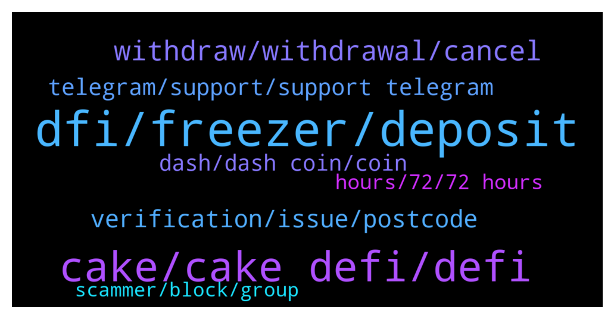

# **@CakeDeFi_EN**
 ## Analysis for **2022-02-04** - **2022-02-05**.

---

## 📊 **Basic Stats**

**n_messages_sent**: 456

---

---

## 🔝 **Top keywords and related messages**

1. **dfi, freezer, deposit**

    @私はアニメの女の子が大好きです --- *Hello  I deposited my friend's $50 reference today, but he changed the password, I have two factor authentication of the account, is there any chance of getting my money back?I am really sad* **--->** [TG Discussion](https://t.me/CakeDeFi_EN/172464)

    @Manvydasm --- *Why value of all dstocks-dusd pools are decreasing everyday? I think I lost around 20% value of dPDBC-dusd in a week* **--->** [TG Discussion](https://t.me/CakeDeFi_EN/172740)

    @fadfunky --- *All my freezer is 10 years freeze.* **--->** [TG Discussion](https://t.me/CakeDeFi_EN/172783)

    @zachgax --- *Are you talking about APR? That’s not the value of the pool. That’s the reward you get from the pool. And it goes down (or sometimes up) by design.   https://blog.defichain.com/the-7-most-frequently-asked-questions-about-liquidity-mining/amp/* **--->** [TG Discussion](https://t.me/CakeDeFi_EN/172747)

    @YSL --- *I’m still not familiar with LM , I’m sticking for stacking for now . DFI-DUSD ll be stable coz the only price movement is DFI right ?* **--->** [TG Discussion](https://t.me/CakeDeFi_EN/172626)

    @cumaali01 --- *Do I get my reward after making a deposit?  Do I need to do anything else?* **--->** [TG Discussion](https://t.me/CakeDeFi_EN/172223)

2. **cake, cake defi, defi**

    @Michael_Schredl --- *That are the laws in singapore, where Cake DeFi is located* **--->** [TG Discussion](https://t.me/CakeDeFi_EN/171845)

    @Diwashgh --- *I forget to unstake my DFI token and it Automatically restake for6 month please cake defi team i don't know the rules of cake defi please help me to unstake i need money now please help me dfi team* **--->** [TG Discussion](https://t.me/CakeDeFi_EN/172688)

    @jezzkng --- *Hello! please make reference here, user in India is able to use Cake DeFi service  https://support.cakedefi.com/hc/en-us/articles/360040335072-Which-countries-are-currently-not-able-to-use-the-Cake-DeFi-Services-* **--->** [TG Discussion](https://t.me/CakeDeFi_EN/172038)

    @Francesco --- *Thanks Kassius that’s the same answer I got from support but I still don’t understand how can I buy defichain DUSD. Do you have any clues on how to actually buy them? Thanks!* **--->** [TG Discussion](https://t.me/CakeDeFi_EN/172344)

    @datoshinakamoto --- *Hey got an issue: I am using cake account for 6 months and I referred my wife 26 hours ago which we uploaded passport, residence permit etc but still pending why? Is anyone from Cake here ?* **--->** [TG Discussion](https://t.me/CakeDeFi_EN/172271)

    @Kassius84 --- *There is another ERC20 Token named DUSD on Uniswap, but this one is not compatible with DeFiChain. DeFiChain dUSD is only available on Cake DeFi or directly on DefiChain* **--->** [TG Discussion](https://t.me/CakeDeFi_EN/172337)

3. **withdraw, withdrawal, cancel**

    @zachgax --- *I can only withdraw in 10 years 🤣* **--->** [TG Discussion](https://t.me/CakeDeFi_EN/172065)

    @Mehmet --- *when the process slows down, the friends in our group also cannot withdraw and make transactions.* **--->** [TG Discussion](https://t.me/CakeDeFi_EN/171820)

    @Kassius84 --- *!withdrawal Everybody who has questions regarding the 72h time for withdrawals, please read the faq 🙏* **--->** [TG Discussion](https://t.me/CakeDeFi_EN/171893)

    @Michael_Schredl --- *Withdrawals can take up to 72 hours* **--->** [TG Discussion](https://t.me/CakeDeFi_EN/172149)

    @ertanyildirim75 --- *Is the withdrawal after 72 hours or within 72 hours .* **--->** [TG Discussion](https://t.me/CakeDeFi_EN/171788)

    @Kassius84 --- *Sure, just have some patient. Withdrawal can take up to 72h to fulfil.* **--->** [TG Discussion](https://t.me/CakeDeFi_EN/171882)

4. **verification, issue, postcode**

    @HeliumMarcos --- *I sent the documents for verification and they all turned green but they didn't approve my account* **--->** [TG Discussion](https://t.me/CakeDeFi_EN/172825)

    @alextan18 --- *Hi team, i have type the wrong postcode when i complete my profile. Is there anyway i can change it? This cause the rejection of verification as i input the wrong postcode.* **--->** [TG Discussion](https://t.me/CakeDeFi_EN/172056)

    @Michael_Schredl --- *Hmm I would try it on another browser* **--->** [TG Discussion](https://t.me/CakeDeFi_EN/172366)

    @takeenx --- *Hi. I accidently delete google authenticator code. Anyone here can help me 😐* **--->** [TG Discussion](https://t.me/CakeDeFi_EN/171919)

    @detbul --- *my address was correct it was correct in the document but they asked me to send it again* **--->** [TG Discussion](https://t.me/CakeDeFi_EN/172658)

    @alextan18 --- *Issue had been resolve by mods. Thanks team!* **--->** [TG Discussion](https://t.me/CakeDeFi_EN/172058)

5. **telegram, support, support telegram**

    @Batuhan --- *72 hours is a very long time. That's why people can be defrauded from fake telegram accounts. and people are afraid that the money will not be withdrawn.* **--->** [TG Discussion](https://t.me/CakeDeFi_EN/171889)

    @zachgax --- *There is no support in Telegram. Mods are also not support. You have to open a ticket here. This is the only official channel for support https://support.cakedefi.com/hc/en-us/requests/new* **--->** [TG Discussion](https://t.me/CakeDeFi_EN/171977)

    @Kassius84 --- *No official support via Telegram. It's a Community Channel. If someone sends you a direct message and claims to be Moderator, Admin or Cake DeFi Staff, be aware it's scam i* **--->** [TG Discussion](https://t.me/CakeDeFi_EN/172241)

    @Michael_Schredl --- *No one will write you a DM, there is no official support on Telegram* **--->** [TG Discussion](https://t.me/CakeDeFi_EN/172365)

    @zachgax --- *Did you open a support ticket? There is no support on Telegram. Do not answer anyone who DM you, or log in to any weird websites.* **--->** [TG Discussion](https://t.me/CakeDeFi_EN/172061)

    @Arne --- *No moderators will ever message you on Telegram.* **--->** [TG Discussion](https://t.me/CakeDeFi_EN/172310)

6. **dash, dash coin, coin**

    @ExRooney --- *I sent 50 usd dash to the stock market, how many minutes is it coming?* **--->** [TG Discussion](https://t.me/CakeDeFi_EN/172714)

    @jerzysz --- *i need help paying dash where i can get it* **--->** [TG Discussion](https://t.me/CakeDeFi_EN/172401)

    @Moruq1 --- *Yes, Dash coin over 50 usdt* **--->** [TG Discussion](https://t.me/CakeDeFi_EN/172351)

    @ertanyildirim75 --- *I requested a dash coin withdrawal.  It's been about 17 hours.  It says transaction pending.  there is no problem, right* **--->** [TG Discussion](https://t.me/CakeDeFi_EN/172016)

    @ertanyildirim75 --- *It is not right for you to keep people waiting for dash coin withdrawal.  This is a development that affects the stock market badly.* **--->** [TG Discussion](https://t.me/CakeDeFi_EN/171778)

    @Moruq1 --- *I sent the dash coin in two parts (like 40+15), can't I get a reward?* **--->** [TG Discussion](https://t.me/CakeDeFi_EN/172411)

7. **hours, 72, 72 hours**

    @Michael_Schredl --- *72 Hours are the maximum, usually it takes around 1 hour* **--->** [TG Discussion](https://t.me/CakeDeFi_EN/172416)

    @Michael_Schredl --- *It can take up to 72 hours* **--->** [TG Discussion](https://t.me/CakeDeFi_EN/171940)

    @ertanyildirim75 --- *such a ridiculous system.  72 hours is too long for bitcoin.* **--->** [TG Discussion](https://t.me/CakeDeFi_EN/171891)

    @私はアニメの女の子が大好きです --- *It has been in the processing stage for 36 hours. There is no activity on the blockchain should I be worried* **--->** [TG Discussion](https://t.me/CakeDeFi_EN/171800)

    @Batuhan --- *I've never waited until now.  And 3 days is not a long time.* **--->** [TG Discussion](https://t.me/CakeDeFi_EN/171902)

    @KlausLberger --- *How often does this happen that your transaction needs longer?  :)* **--->** [TG Discussion](https://t.me/CakeDeFi_EN/171909)

