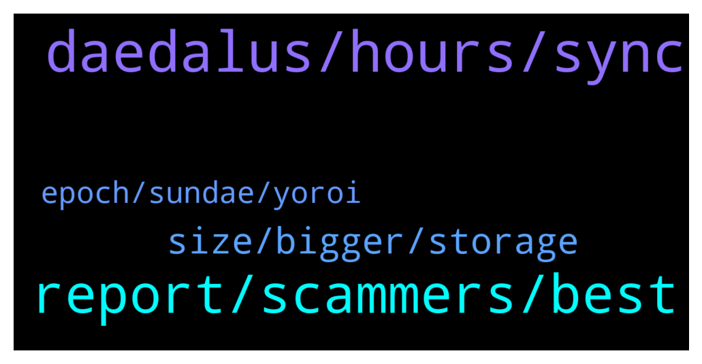

# **@Cardano**
 ## Analysis for **2022-02-04** - **2022-02-05**.

---

## 📊 **Basic Stats**

**n_messages_sent**: 93

---

---

## 🔝 **Top keywords and related messages**

1. **daedalus, hours, sync**

    @cryptoustt --- *daedalus taking 6.6 GB memory and 33% CPU. is this normal?* **--->** [TG Discussion](https://t.me/Cardano/778849)

    @ExInfernis --- *did anyone had problems with installing 4.8.0 of daedalus? I receive Error opening file for wriing: C;\Program Files\Daedalus Mainnet\Daedalus Mainnet.exe* **--->** [TG Discussion](https://t.me/Cardano/778420)

    @Nicolasfont --- *Yes I did. I'm not new. Dealing with daedalus since over a year. I just restarted my laptop and this time it did work. So for those having the same issue just restart laptop and that should be ok.* **--->** [TG Discussion](https://t.me/Cardano/778542)

    @appleFxxxPen --- *My goodness the new Daedalus wallet took almost half day to update it madness….* **--->** [TG Discussion](https://t.me/Cardano/778488)

    @Lgbeano --- *Wtf, Have you closed daedalus to download the new version?* **--->** [TG Discussion](https://t.me/Cardano/778539)

    @Nicolasfont --- *Wtf is going on with daedalus?? Can't update to new version. Keep crashing* **--->** [TG Discussion](https://t.me/Cardano/778536)

2. **report, scammers, best**

    @JR --- *is it safe to claim any/all airdrops from DripDropz?  Is there any risk to my wallet security?  Thanks in advance.* **--->** [TG Discussion](https://t.me/Cardano/778695)

    @barAbba12 --- *please, report this profile as a scam to Instagram:  https://instagram.com/charleshoskinson.adacardano?utm_medium=copy_link  tries to get ADA sent by saying to send awards in ADA with fake photos of charles.  thank you* **--->** [TG Discussion](https://t.me/Cardano/778331)

    @Kel --- *I can’t withdraw my coin.  What will I do* **--->** [TG Discussion](https://t.me/Cardano/778438)

    @glitch04 --- *best to ask their support https://t.me/Cardano/778144* **--->** [TG Discussion](https://t.me/Cardano/778385)

    @Lgbeano --- *Depends whether your other wallet is delegated or not. You register the wallets staking key, so anything in there is delegated.   If you move your ₳ from one staked wallet to another, your old wallet will continue receiving the rewards from that ₳ for three epochs, before your new wallet takes over. So you never lose out on rewards* **--->** [TG Discussion](https://t.me/Cardano/778529)

    @Dionysis --- *Thanks a lot. Btw too many ppl dming wtf* **--->** [TG Discussion](https://t.me/Cardano/778614)

3. **size, bigger, storage**

    @Paulo --- *bigger storage, bigger SPO requirements (memory + disk size)* **--->** [TG Discussion](https://t.me/Cardano/778572)

    @Sydney --- *Hey everyone, what is the drawback for increasing cardano block size?* **--->** [TG Discussion](https://t.me/Cardano/778562)

    @Lgbeano --- *Is that good for your experience?* **--->** [TG Discussion](https://t.me/Cardano/778489)

    @Sydney --- *It was my understanding though that not every slot was filled with a block before* **--->** [TG Discussion](https://t.me/Cardano/778580)

    @Paulo --- *it's mainly for decongesting the network. the block size was too small for the amount of demand. blocks were always nearly 100% full, with all the transactions, NFT drops, smart contracts, etc* **--->** [TG Discussion](https://t.me/Cardano/778577)

    @Sydney --- *Clearly haha. Jw if it has drawbacks* **--->** [TG Discussion](https://t.me/Cardano/778578)

4. **epoch, sundae, yoroi**

    @srinivas2121 --- *Need small info... Now epoch is 319...but in yoroi... rewards showing epoch showing 317 not 318...it will always shows like this only...* **--->** [TG Discussion](https://t.me/Cardano/778757)

    @gauthamnag --- *I have set slippage at 2% in sundae swap but still in awaiting scoop status since afternoon, generally how long does it take to get this confirmed..any suggestions pls* **--->** [TG Discussion](https://t.me/Cardano/778538)

    @FlamingElim --- *Hello Admin. Question. I started stake ADA at 23Jan. Epoch 316. Now my 1st reward status is Pending. Why is that ?* **--->** [TG Discussion](https://t.me/Cardano/778691)

    @glitch04 --- *takes 3 full epochs before rewards which is from 15-20 full days your rewards will arrive at the next epoch* **--->** [TG Discussion](https://t.me/Cardano/778704)

    @Ian --- *Hi guys, I've been to drip drpz but cannot see Sundae Tokens there so cannot claim them. I can clsim up to 10 other rewards but not Sundae. I'm confused. Can someone advise please?* **--->** [TG Discussion](https://t.me/Cardano/778685)

    @CaptainCharmander --- *has anyone imported yoroi to NAmi? Does it take a while/???* **--->** [TG Discussion](https://t.me/Cardano/778675)

