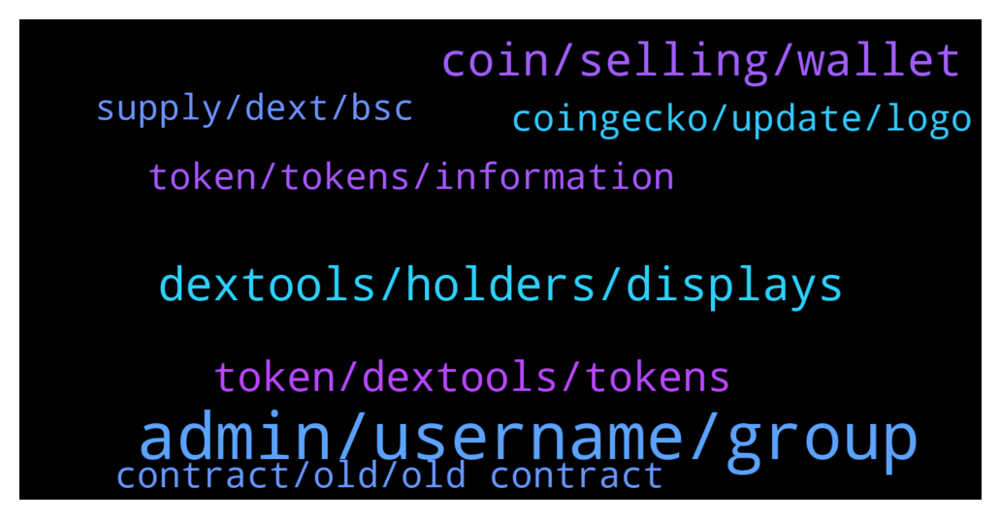

# **@DEXToolsCommunity**
 ## Analysis for **2022-02-03** - **2022-02-05**.

---

## 📊 **Basic Stats**

**n_messages_sent**: 368

---

---

## 🔝 **Top keywords and related messages**

1. **admin, username, group**

    @napascual --- *Let them live peacefuly, everyone deserves some affection* **--->** [TG Discussion](https://t.me/DEXToolsCommunity/330729)

    @napascual --- *He WONT DM FIRST. Be aware of scammers* **--->** [TG Discussion](https://t.me/DEXToolsCommunity/330775)

    @crypto0o0o0o --- *always telling me have to be an admin, I am the owner of the group* **--->** [TG Discussion](https://t.me/DEXToolsCommunity/331069)

    @freudyung --- *Sir I just sent my question here* **--->** [TG Discussion](https://t.me/DEXToolsCommunity/330738)

    @E --- *but now you know 100 percent it's a scam why don't you stop it at least more people don't fall for it* **--->** [TG Discussion](https://t.me/DEXToolsCommunity/331142)

    @e_nois_na_fita --- *That your admin @pablojan  dm me first* **--->** [TG Discussion](https://t.me/DEXToolsCommunity/330984)

2. **dextools, holders, displays**

    @whaleishh --- *Smh dextools. Get your shit together.* **--->** [TG Discussion](https://t.me/DEXToolsCommunity/330546)

    @bastardganpunk --- *must be a general issue on dextools side I guess. The devs are looking into it now 🙂* **--->** [TG Discussion](https://t.me/DEXToolsCommunity/330495)

    @MademoiselleDL --- *Yes, but is there a limit to it on Dextools ?* **--->** [TG Discussion](https://t.me/DEXToolsCommunity/331162)

    @George --- *How can we trend on dextool* **--->** [TG Discussion](https://t.me/DEXToolsCommunity/330300)

    @rapido30 --- *A fail on dextools has been exploited ?* **--->** [TG Discussion](https://t.me/DEXToolsCommunity/330496)

    @bastardganpunk --- *Dextools doesn’t provide APIs yet. In the future it will be available though 🙂* **--->** [TG Discussion](https://t.me/DEXToolsCommunity/331203)

3. **coin, selling, wallet**

    @freudyung --- *Basically I got in right I bought the bottom; which I thought was bottom, then they sold and price of crypto tanked* **--->** [TG Discussion](https://t.me/DEXToolsCommunity/330756)

    @AX3L_R0SE --- *all sells showing from our marketing wallet* **--->** [TG Discussion](https://t.me/DEXToolsCommunity/330670)

    @HOBOCRUNCH --- *says a team wallet is selling* **--->** [TG Discussion](https://t.me/DEXToolsCommunity/330484)

    @E --- *how can it be that such a coin is still online??? I've tried everything I can't sell ? how can it be that this coin is also in the trends that is unbelievable???* **--->** [TG Discussion](https://t.me/DEXToolsCommunity/331138)

    @AX3L_R0SE --- *@admin what's with this glitch on ETH showing marketing wallets/deployer selling ??* **--->** [TG Discussion](https://t.me/DEXToolsCommunity/330648)

    @HOBOCRUNCH --- *so ya'll gonna be able to fix that my token says a team wallet selling when it's literally just a buyer?* **--->** [TG Discussion](https://t.me/DEXToolsCommunity/330473)

4. **token, dextools, tokens**

    @Robertkaz --- *I have a token created lp added but not showing on dextools* **--->** [TG Discussion](https://t.me/DEXToolsCommunity/331295)

    @stanes --- *It's not how it works: We index all the pairs present on the DEXs we support. Once again: there is no listing process. We give some tools to users to downvote a pair if they think it's a scam. When you are interacting with some DEXs, you have to be extremely careful, most of the coins are scams or will anyway be valueless in the future.  Always DYOR, apeing any token without knowing anything about it is throwing your money away.* **--->** [TG Discussion](https://t.me/DEXToolsCommunity/331144)

    @napascual --- *There are 1M tokens around, you need to DYOR. Dextools metrics are automatic checks, they help you out, but won’t advise you to buy a token* **--->** [TG Discussion](https://t.me/DEXToolsCommunity/330766)

    @raul637 --- *Can i vote my favourite token if i hold 1,000 tokens of dex?* **--->** [TG Discussion](https://t.me/DEXToolsCommunity/331505)

    @Killthezerotoken --- *how to update token symbol on Dextools?* **--->** [TG Discussion](https://t.me/DEXToolsCommunity/331150)

    @kryptoUSA --- *When a token cannot be sold , is it possible for dextools to put a red banner with note on the token page?* **--->** [TG Discussion](https://t.me/DEXToolsCommunity/331236)

5. **token, tokens, information**

    @HeiHei1985 --- *For example, I click 1token, but it will become a 5 token.* **--->** [TG Discussion](https://t.me/DEXToolsCommunity/330911)

    @HeiHei1985 --- *I click on the token, and other tokens will appear.* **--->** [TG Discussion](https://t.me/DEXToolsCommunity/330909)

    @MademoiselleDL --- *Hey, can I ask is there a character limit on token symbols (for listing and search) ?* **--->** [TG Discussion](https://t.me/DEXToolsCommunity/331153)

    @num_ber7 --- *How do tokens enter the hot area?* **--->** [TG Discussion](https://t.me/DEXToolsCommunity/330420)

    @HODLnomix --- *Howdy. I have a token, and I'm curious how do we add the information needed like reddit, telegram, etc... so we can crease our information score?* **--->** [TG Discussion](https://t.me/DEXToolsCommunity/330381)

    @stanes --- *Talking about the ticker? I think there are some tokens with a 9 characters long tickers.* **--->** [TG Discussion](https://t.me/DEXToolsCommunity/331158)

6. **coingecko, update, logo**

    @JoeyDieleman --- *Update social info:  etherscan.io or bscscan.com or coingecko.com  Update logo:  CoinGecko or TrustWallet* **--->** [TG Discussion](https://t.me/DEXToolsCommunity/331101)

    @YELEN --- *Who should I contact to add avatars and supplementary information？* **--->** [TG Discussion](https://t.me/DEXToolsCommunity/331480)

    @stanes --- *They maybe have one but if their social info are not yet updated we can't show them.* **--->** [TG Discussion](https://t.me/DEXToolsCommunity/331934)

    @Killthezerotoken --- *We listed on Coingecko but logo didn't show up on dextool* **--->** [TG Discussion](https://t.me/DEXToolsCommunity/331157)

    @stanes --- *Then to update social Information for your token, please update etherscan.io or bscscan.com or coingecko.com  We pull info from there.    For the logo please update coinGecko or TrustWallet.* **--->** [TG Discussion](https://t.me/DEXToolsCommunity/331806)

    @bastardganpunk --- *About social Information for your token, please update etherscan.io or bscscan.com or coingecko.com  We pull info from there.    For the logo update coinGecko or TrustWallet* **--->** [TG Discussion](https://t.me/DEXToolsCommunity/331493)

7. **contract, old, old contract**

    @CryptoFatherBoard --- *I want to be sure which exactly is the right contract* **--->** [TG Discussion](https://t.me/DEXToolsCommunity/330878)

    @stanes --- *I will ping the devs about it. I can see you already gave us both contract addresses. We also need a link to the official announcement of the swap.* **--->** [TG Discussion](https://t.me/DEXToolsCommunity/331953)

    @FloooCrypto --- *Do you also need the old contract?* **--->** [TG Discussion](https://t.me/DEXToolsCommunity/330393)

    @stanes --- *DEXT UNISWAP PAIR Chart and trade: https://www.dextools.io/app/uniswap/pair-explorer/0xa29fe6ef9592b5d408cca961d0fb9b1faf497d6d Contract: 0xfb7b4564402e5500db5bb6d63ae671302777c75a  DEXT PANCAKESWAP PAIR Chart and trade: https://www.dextools.io/app/pancakeswap/pair-explorer/0x4b729d5d871057f3a9c424792729217cde72410d Contract: 0xe91a8d2c584ca93c7405f15c22cdfe53c29896e3* **--->** [TG Discussion](https://t.me/DEXToolsCommunity/330858)

    @Gucc1mat3 --- *We have similar problem with contract 0x6bab5fe1fa849efd5dc64ce35b92d679f4bdb034* **--->** [TG Discussion](https://t.me/DEXToolsCommunity/330690)

    @stanes --- *Yeah, that's absolutely not a pb, the issue is with the api provider but not related to your old contract. We will see what we can do.* **--->** [TG Discussion](https://t.me/DEXToolsCommunity/330398)

