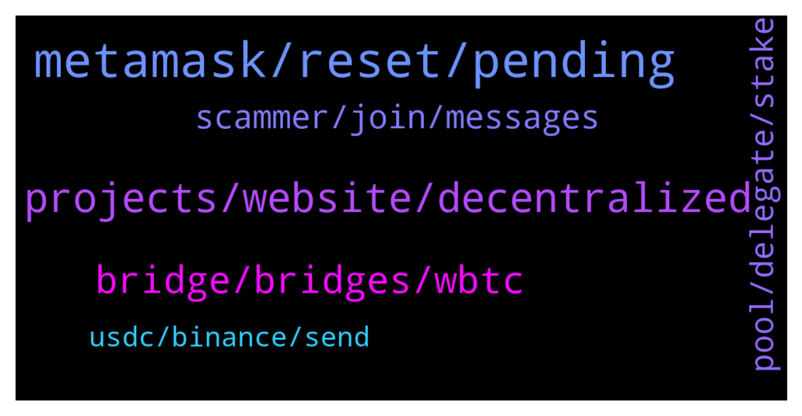

# **@Fantom_English**
 ## Analysis for **2022-02-04** - **2022-02-05**.

---

## 📊 **Basic Stats**

**n_messages_sent**: 130

---

---

## 🔝 **Top keywords and related messages**

1. **metamask, reset, pending**

    @Janevietani --- *Tx have not broadcasted so your coin should be still on your address You can import brave wallet address to metamask and do tx from metamask* **--->** [TG Discussion](https://t.me/Fantom_English/647816)

    @KD --- *I sent some ftm to my brave wallet... been trying to execute transactions.. when i do a txn hash is generated and when i go to ftmscan it says 'sorry no transaction found'. Tried to withdraw it to my metamask wallet and an exchange but nothing.* **--->** [TG Discussion](https://t.me/Fantom_English/647814)

    @quevivacris --- *Can’t withdraw it, it is on multichain* **--->** [TG Discussion](https://t.me/Fantom_English/647167)

    @KD --- *Does ftm network work with brave wallet?* **--->** [TG Discussion](https://t.me/Fantom_English/647796)

    @Zeric1123 --- *Had my transaction pending for 30min* **--->** [TG Discussion](https://t.me/Fantom_English/647334)

    @ynl87 --- *What’s up with this wallet? Did my ftm get stolen?* **--->** [TG Discussion](https://t.me/Fantom_English/647431)

2. **projects, website, decentralized**

    @salemkode --- *Are there bonus projects in Fantom* **--->** [TG Discussion](https://t.me/Fantom_English/646962)

    @CryptoTheDreamer --- *Is fantoms only purpose is to support eth or independent from eth* **--->** [TG Discussion](https://t.me/Fantom_English/647054)

    @Kay246 --- *Please I need a link to fantom wallet* **--->** [TG Discussion](https://t.me/Fantom_English/647216)

    @HeyRodri --- *We really, really need a decent DEX in fantom, do we know if 1inch is going to onboard in Fantom? I want to sell 0.18092595. In Fantom (Firebirdswap or Beethoven) it´s 6717 while on 1inch polygon it´s 6741* **--->** [TG Discussion](https://t.me/Fantom_English/647078)

    @Gondaliza --- *What are the best platforms to find new projects launching on Fantom?* **--->** [TG Discussion](https://t.me/Fantom_English/647222)

    @Supalima --- *how do I get BTC on Fantom network? From an exchange?* **--->** [TG Discussion](https://t.me/Fantom_English/647436)

3. **bridge, bridges, wbtc**

    @quevivacris --- *No FTM liquidity on bridges, that sucks!* **--->** [TG Discussion](https://t.me/Fantom_English/647015)

    @pajamasfreak --- *Never bridge wbtc, no info. You can try and explore those bridges above and ask their admins for better route and liquidity.* **--->** [TG Discussion](https://t.me/Fantom_English/647093)

    @HeyRodri --- *So I want to move WBTC from Fantom to Polygon. All the bridges dont´t have WBTC so I need to sell WBTC. to USDT to then use the anyswap bridge. So I have to sell the WBTC to have the usdt and be able to bridge* **--->** [TG Discussion](https://t.me/Fantom_English/647081)

    @quevivacris --- *There is no liquidity on most bridges, when will this be solved?* **--->** [TG Discussion](https://t.me/Fantom_English/647164)

    @wassoB --- *Hello! Our EverBridge was recently added to FTM foundation site under cross-chain bridge, is it possible to add in the telegram list also?* **--->** [TG Discussion](https://t.me/Fantom_English/647296)

    @pajamasfreak --- *Different chain, shouldn’t you use ethscan?* **--->** [TG Discussion](https://t.me/Fantom_English/647159)

4. **scammer, join, messages**

    @thomascorfu --- *@Janevietani can I dm you in private* **--->** [TG Discussion](https://t.me/Fantom_English/647811)

    @thomascorfu --- *Jane can I dm you please* **--->** [TG Discussion](https://t.me/Fantom_English/647810)

    @Mosh --- *Hello there thanks for let me join* **--->** [TG Discussion](https://t.me/Fantom_English/647590)

    @wassoB --- *Sadly, I cant DM in TG jail. Any chance you can DM me* **--->** [TG Discussion](https://t.me/Fantom_English/647361)

    @Kassemhamzeh --- *Kindly sir check your messages when you are free* **--->** [TG Discussion](https://t.me/Fantom_English/647004)

    @Alex_Tradin --- *Pls who's the admin I need help* **--->** [TG Discussion](https://t.me/Fantom_English/647402)

5. **pool, delegate, stake**

    @Trinity --- *What does the delegate stands for* **--->** [TG Discussion](https://t.me/Fantom_English/647102)

    @Trinity --- *Now I want to delegate again with a new validator that has longer number of lock days* **--->** [TG Discussion](https://t.me/Fantom_English/647150)

    @Trinity --- *How do I re delegate now* **--->** [TG Discussion](https://t.me/Fantom_English/647145)

    @Trinity --- *How do I know a delegate that has a longer locked time from today* **--->** [TG Discussion](https://t.me/Fantom_English/647137)

    @Trinity --- *Is it possible I change my delegate because looks like he’s doesn’t have for 365 days* **--->** [TG Discussion](https://t.me/Fantom_English/647122)

    @Trinity --- *Saying it would take me another 7 days to add a validator?* **--->** [TG Discussion](https://t.me/Fantom_English/647146)

6. **usdc, binance, send**

    @CG_05 --- *A question: if i want to send usdc from metamask (ftm network) to binance, what network must choose to binance for cheaper-better?* **--->** [TG Discussion](https://t.me/Fantom_English/647480)

    @karfei00 --- *Dear all anyone knows how to transfer USDC to ftm network from binance cex?* **--->** [TG Discussion](https://t.me/Fantom_English/647259)

    @First --- *use multichain to convert FTM USDC to BNB USDC* **--->** [TG Discussion](https://t.me/Fantom_English/647501)

    @Mcjig --- *just send ftm to binance and then swap for usdc* **--->** [TG Discussion](https://t.me/Fantom_English/647498)

    @slickrick6 --- *You can’t send ftm usdc to binance* **--->** [TG Discussion](https://t.me/Fantom_English/647489)

    @pajamasfreak --- *Use cex like binance is much easier for now* **--->** [TG Discussion](https://t.me/Fantom_English/647067)

