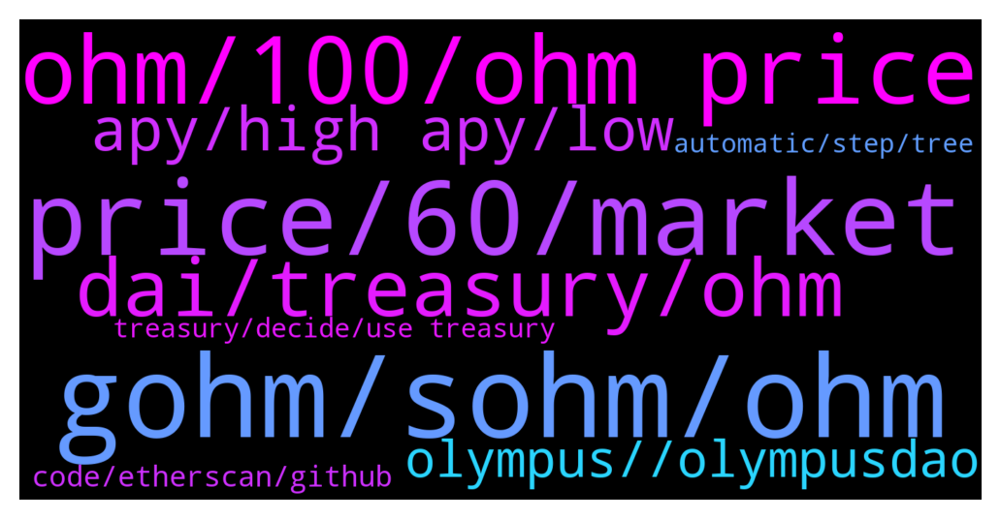

# **@OlympusTG**
 ## Analysis for **2022-02-04** - **2022-02-05**.

---

## 📊 **Basic Stats**

**n_messages_sent**: 780

---

---

## 🔝 **Top keywords and related messages**

1. **gohm, sohm, ohm**

    @Max --- *I still don't get where I'll make money from if it is not by increasing my amount of OHMs (or in gOHM terms, by the increase of the index)* **--->** [TG Discussion](https://t.me/OlympusTG/179725)

    @nfwaple --- *cool, remember to stake to get sOHM* **--->** [TG Discussion](https://t.me/OlympusTG/179185)

    @Flower --- *yeah ohm only available on eth meaning big fees to approve then stake. gOHM is already staked and available on Polygon and Avalanche for pennies 😎* **--->** [TG Discussion](https://t.me/OlympusTG/180257)

    @nfwaple --- *when you stake your OHM you swap your OHM for sOHM* **--->** [TG Discussion](https://t.me/OlympusTG/180291)

    @Crtlcontrol --- *is there any diff between staking ohm and buying gohm?* **--->** [TG Discussion](https://t.me/OlympusTG/180098)

    @ADIL --- *Hello guys  I already had sohm from before and completed the migration to gohm few months..if I want to buy more staked ohm so I just buy the gohm directly correct ??* **--->** [TG Discussion](https://t.me/OlympusTG/179574)

2. **price, 60, market**

    @savy2021 --- *What was the launch price of this token* **--->** [TG Discussion](https://t.me/OlympusTG/179779)

    @nfwaple --- *no, price can go under $60* **--->** [TG Discussion](https://t.me/OlympusTG/179872)

    @Host_Matt --- *buy pressure should be huge sub 60* **--->** [TG Discussion](https://t.me/OlympusTG/179882)

    @David IL --- *Trust me backing price was over 170$ and it keeps decreasing lol* **--->** [TG Discussion](https://t.me/OlympusTG/178943)

    @o_nexus_o --- *No, I'm wondering if we bought at $1.10 !! If we would be mostly backed then* **--->** [TG Discussion](https://t.me/OlympusTG/179014)

    @TheGuyFromCanada --- *Is it true the price cant go under $60?* **--->** [TG Discussion](https://t.me/OlympusTG/179870)

3. **ohm, 100, ohm price**

    @Host_Matt --- *selling kidney for more ohm at this price* **--->** [TG Discussion](https://t.me/OlympusTG/180020)

    @Gilberto --- *I want to invest in ohm and I don't know how it really works* **--->** [TG Discussion](https://t.me/OlympusTG/179720)

    @rasputen1 --- *Seems like ohm can’t free itself from the shackles of the $60-$70 region* **--->** [TG Discussion](https://t.me/OlympusTG/179648)

    @Host_Matt --- *hopefully when ohm 1k ohmie meetup strippers on me* **--->** [TG Discussion](https://t.me/OlympusTG/179818)

    @Drbolavet1 --- *what iis explorer address because I am seeing 2 different OHM* **--->** [TG Discussion](https://t.me/OlympusTG/180400)

    @David IL --- *Sorry man. I am just lost right now. I see that nobody is talking about Ohm price going up to previous ATH !* **--->** [TG Discussion](https://t.me/OlympusTG/178934)

4. **dai, treasury, ohm**

    @o_nexus_o --- *I see no facility to redeem 1 Ohm for 1 dollar if the market price drops below 1 dollar, say it drops to 10 cents.* **--->** [TG Discussion](https://t.me/OlympusTG/178999)

    @o_nexus_o --- *So I was looking through the contracts (mostly V1) and I didn't see any evidence that the treasury actually backs OHM at all. That is, I didn't see any code, or any allocator contract, that buys OHM if it drops down to $1 price. The protocol might stop minting Ohm at that point. But unless I've missed something (which I might have), there IS NO BACKING?! Max* **--->** [TG Discussion](https://t.me/OlympusTG/178915)

    @o_nexus_o --- *Ah - that line stops the minting of Ohm when the tresury's 'excess reserves' run out. It doesn't have anything to do with Buying Ohm* **--->** [TG Discussion](https://t.me/OlympusTG/178918)

    @nfwaple --- *when you stop minting, the existing OHM are all backed by 1 DAI* **--->** [TG Discussion](https://t.me/OlympusTG/178919)

    @nfwaple --- *the treasury does not need to buy your OHM, since the treasury owns the entire LP, it can just buy from its own LP till 1 OHM = 1 DAI* **--->** [TG Discussion](https://t.me/OlympusTG/179012)

    @nfwaple --- *you have the % ownership of the supply x 1 DAI in the treasury* **--->** [TG Discussion](https://t.me/OlympusTG/178976)

5. **apy, high apy, low**

    @J --- *the apy is so low for me* **--->** [TG Discussion](https://t.me/OlympusTG/179486)

    @Lucas --- *Can APY go back higher again?* **--->** [TG Discussion](https://t.me/OlympusTG/179889)

    @Max --- *Because the APY will decrease between 100 and 500* **--->** [TG Discussion](https://t.me/OlympusTG/179703)

    @Ap0l1o --- *And then the apy will increase :)* **--->** [TG Discussion](https://t.me/OlympusTG/179086)

    @Ap0l1o --- *We can see crazy high apy again :)* **--->** [TG Discussion](https://t.me/OlympusTG/179089)

    @nfwaple --- *not aping just because of high APY* **--->** [TG Discussion](https://t.me/OlympusTG/179417)

6. **olympus, , olympusdao**

    @Cory --- *I am new to this...good time to join olympusdao?* **--->** [TG Discussion](https://t.me/OlympusTG/179049)

    @theMagicUnicorn --- *Olympus PRO was introduced to the world on September 17, 2021. The idea was simple: allow DAOs and projects to take control of their token emissions and liquidity mining programs through protocol-owned liquidity. Since our launch in late September, we have been full steam ahead and have onboarded 40 partners across four different blockchains and layer 2s including Ethereum, Avalanche, Fantom, and Arbitrum. In total, we’ve helped projects bond >$45,000,000 in liquidity and have produced >$2,000,000 in revenue for the OlympusDAO treasury — all in just 4 months’ time   https://olympusdao.medium.com/olympus-pro-in-2022-c21c4fedb2cc   https://docs.olympusdao.finance/pro* **--->** [TG Discussion](https://t.me/OlympusTG/179154)

    @nfwaple --- *so when Olympus mcap goes up you can benefit from it* **--->** [TG Discussion](https://t.me/OlympusTG/179707)

    @o_nexus_o --- *But if there isn't automatic buyback or redemption I think the docs should be changed to make that clear, coz that's sure what I understood from docs and from news coverage of Olympus on other websites etc* **--->** [TG Discussion](https://t.me/OlympusTG/179065)

    @nfwaple --- *Olympus Pro Recap: January 2022  This month Olympus Pro launched bonds across 10 partners and produced $850k in revenue for the treasury.   More details here:  https://olympusdao.medium.com/olympus-pro-recap-january-2022-e3b3de07670c* **--->** [TG Discussion](https://t.me/OlympusTG/179802)

    @Ap0l1o --- *Also, if anyone is a SC dev, wanting to join Olympus, lmk* **--->** [TG Discussion](https://t.me/OlympusTG/178748)

7. **code, etherscan, github**

    @o_nexus_o --- *Why is the contract code on github different to that on etherscan?* **--->** [TG Discussion](https://t.me/OlympusTG/178903)

    @nfwaple --- *I heard that should be in line 577* **--->** [TG Discussion](https://t.me/OlympusTG/178916)

    @o_nexus_o --- *Well if I assumed it was hard-coded into the protocol, other people probably assume that* **--->** [TG Discussion](https://t.me/OlympusTG/179070)

    @o_nexus_o --- *Yes I read the $1 thing in the docs, but the docs can say what they want. I'm looking for the CODE 🙂* **--->** [TG Discussion](https://t.me/OlympusTG/178739)

    @Max --- *Or in the code? Can this be found in the code?* **--->** [TG Discussion](https://t.me/OlympusTG/178714)

    @Max --- *Never checked it. If it is in python, I will. Is it?* **--->** [TG Discussion](https://t.me/OlympusTG/178715)

8. **treasury, decide, use treasury**

    @unban_peteypete --- *How is the treasury used? How do holders benefit from it?* **--->** [TG Discussion](https://t.me/OlympusTG/180397)

    @o_nexus_o --- *Well yeah the dev team could decide to use treasury to buy it back. I know that. I'm just saying it's not automatic, therefore not guaranteed. Because they could decide to just not do it.* **--->** [TG Discussion](https://t.me/OlympusTG/179046)

    @cdp279 --- *Use it to grow, but only that proposals need to be made for any use of the treasury funds. (Other than the stated)* **--->** [TG Discussion](https://t.me/OlympusTG/180399)

    @Ap0l1o --- *In that case it holds enough if people want to buy it, but offers from treasury the option to buy it back* **--->** [TG Discussion](https://t.me/OlympusTG/179031)

    @nfwaple --- *I don't see treasury strategy being automatic any time soon, see pinned message, for example the wormhole hack yesterday, someone had to decide to stop the UST Wormhole bond* **--->** [TG Discussion](https://t.me/OlympusTG/179135)

    @o_nexus_o --- *Treasury never buys from the DEX (again unless I've missed something)* **--->** [TG Discussion](https://t.me/OlympusTG/179032)

