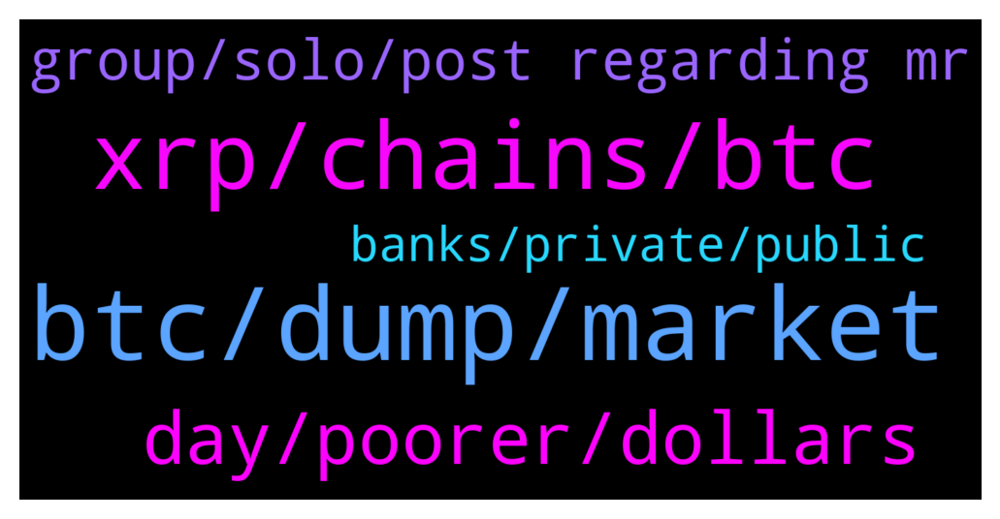

# **@Ripple**
 ## Analysis for **2022-02-04** - **2022-02-05**.

---

## 📊 **Basic Stats**

**n_messages_sent**: 111

---

---

## 🔝 **Top keywords and related messages**

1. **btc, dump, market**

    @Jakes1993 --- *Its annoying seeing we follow btc chart. But the gains are more at btc and eth* **--->** [TG Discussion](https://t.me/Ripple/3048962)

    @Troy4321 --- *1 more dump befoee big pump* **--->** [TG Discussion](https://t.me/Ripple/3048891)

    @SJ --- *At the moment I really dont see any catalyst that can push btc to new ATH. But still let's hope for it to happen!* **--->** [TG Discussion](https://t.me/Ripple/3049222)

    @Jake_ripple_XRP --- *My understanding is that mining BTC is requiring more and more energy for each new "coin"... That is my understanding... I could be wrong... but others might weigh in on this...* **--->** [TG Discussion](https://t.me/Ripple/3049099)

    @Skylar920817 --- *Other cryptocurrencies are following the price of BTC* **--->** [TG Discussion](https://t.me/Ripple/3049057)

    @stn021 --- *The prices are closely related. They all follow each other.  BTC follows the market just like the other major coins.* **--->** [TG Discussion](https://t.me/Ripple/3049056)

2. **xrp, chains, btc**

    @oyiekkk --- *When does xrp gonna hit 20$* **--->** [TG Discussion](https://t.me/Ripple/3048784)

    @Skylar920817 --- *XRP is completely following BTC, which makes me very unhappy* **--->** [TG Discussion](https://t.me/Ripple/3049024)

    @localfeeder --- *XRP is going to zero, bro! Trust me bro!* **--->** [TG Discussion](https://t.me/Ripple/3048839)

    @richcryto --- *Choose the colour of your lambo boys . XRP will go to Pluto .* **--->** [TG Discussion](https://t.me/Ripple/3049218)

    @nuszy --- *Is their any good staking/interest for XRP holders? I'm currently using Nexo, but is there anything else? Staking, etc?* **--->** [TG Discussion](https://t.me/Ripple/3049141)

    @Andromeda20022 --- *Just Google xrpl side chains and it's there xrpl org webpage* **--->** [TG Discussion](https://t.me/Ripple/3048836)

3. **day, poorer, dollars**

    @ReiTeh --- *5 to 10 dollars is good enough for me this year if the lawsuit gets settled.* **--->** [TG Discussion](https://t.me/Ripple/3048862)

    @CakedUp --- *I can literally be well off for the rest of my life on $5* **--->** [TG Discussion](https://t.me/Ripple/3048864)

    @Sarashoba05 --- *How much u r getting? Im using hotbit* **--->** [TG Discussion](https://t.me/Ripple/3049160)

    @Russty007 --- *I just wanna be rich 💰* **--->** [TG Discussion](https://t.me/Ripple/3049260)

    @Skylar920817 --- *There are seven meetings this year* **--->** [TG Discussion](https://t.me/Ripple/3049062)

    @gerrymchugh --- *just ask that crystal ball will it be cheaper tomorrow 😂* **--->** [TG Discussion](https://t.me/Ripple/3049000)

4. **group, solo, post regarding mr**

    @Jawaddeee --- *Guys wat can i do with solo* **--->** [TG Discussion](https://t.me/Ripple/3048963)

    @Riaje2 --- *Oh sorry I have missed a rule ? (deleted message)* **--->** [TG Discussion](https://t.me/Ripple/3048796)

    @richcryto --- *I meant boys and girls sorry* **--->** [TG Discussion](https://t.me/Ripple/3049221)

    @Jodxb2311 --- *Go to the solo chat 😃* **--->** [TG Discussion](https://t.me/Ripple/3048964)

    @yuhuagai --- *group not found ，i can not registe* **--->** [TG Discussion](https://t.me/Ripple/3048912)

    @specialpatrolgroup --- *When you u get a profile image.* **--->** [TG Discussion](https://t.me/Ripple/3048793)

5. **banks, private, public**

    @MartinJS10 --- *I mean, why banks would use a public and permionless blockchain? When traditional payments banks are private* **--->** [TG Discussion](https://t.me/Ripple/3048824)

    @JesusJames --- *not good to disclose your holdings* **--->** [TG Discussion](https://t.me/Ripple/3048798)

    @MartinJS10 --- *I think those transactions should be private* **--->** [TG Discussion](https://t.me/Ripple/3048829)

    @GreenGecko --- *No, i don't want to lose the ripple* **--->** [TG Discussion](https://t.me/Ripple/3049129)

    @GreenGecko --- *yes sir, sell and buy is now allowed* **--->** [TG Discussion](https://t.me/Ripple/3048971)

    @Andromeda20022 --- *Because it takes them days and months to settle the transaction.* **--->** [TG Discussion](https://t.me/Ripple/3048826)

