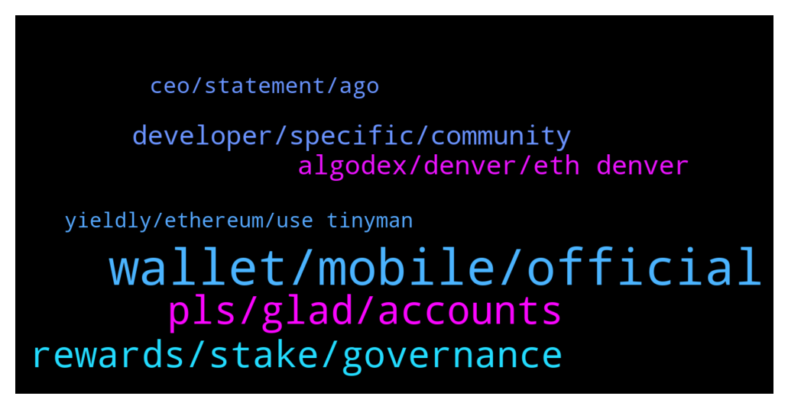

# **@algorand**
 ## Analysis for **2022-02-04** - **2022-02-05**.

---

## 📊 **Basic Stats**

**n_messages_sent**: 144

---

---

## 🔝 **Top keywords and related messages**

1. **wallet, mobile, official**

    @Sahand_tabrizzz --- *why oping out from apps is very hard in algorand???? i have 5 algo but 4.5 is locked... how can i opt out from apps* **--->** [TG Discussion](https://t.me/algorand/336865)

    @MackDenver --- *MyAlgo: https://wallet.myalgo.com/  Yes, MyAlgo is one of our official wallets.* **--->** [TG Discussion](https://t.me/algorand/336984)

    @incognitocas --- *Does anyone know if there are plans to create a desktop wallet for Algo?* **--->** [TG Discussion](https://t.me/algorand/336972)

    @min_time1 --- *Hi i have some of algo on trust wallet but i cant transfer  Why* **--->** [TG Discussion](https://t.me/algorand/336996)

    @NightAlgorand --- *What issue are you facing while using the wallet? Remember that you have to key your seedphrases exactly.* **--->** [TG Discussion](https://t.me/algorand/336703)

    @Abesmal --- *I spelled the phrase carefully, many times. as if the wallet does not exist.* **--->** [TG Discussion](https://t.me/algorand/336718)

2. **pls, glad, accounts**

    @chuckdx --- *Hello, can you respond to pm pls* **--->** [TG Discussion](https://t.me/algorand/336755)

    @MackDenver --- *Heo Rod, glad to see you.* **--->** [TG Discussion](https://t.me/algorand/336937)

    @NightAlgorand --- *Hi there, what is the issue?* **--->** [TG Discussion](https://t.me/algorand/336750)

    @Broohere --- *Anyone interested in being a part of a metaverse token minter project?* **--->** [TG Discussion](https://t.me/algorand/336807)

    @NightAlgorand --- *Glad it solved 😉 Have a great day!* **--->** [TG Discussion](https://t.me/algorand/336754)

    @Crypt0Playa --- *What's up with the stupid "Hi" messages? Can't we block these accounts?* **--->** [TG Discussion](https://t.me/algorand/336823)

3. **rewards, stake, governance**

    @kosta --- *I understand. I can read somewhere, why in this case pos ends? If I lock my money, can I only withdraw it for a given period of time? Thank you for all the answers. I'm interested in it* **--->** [TG Discussion](https://t.me/algorand/336792)

    @kosta --- *possession rewards end, right? Stake will only be for governors, maybe I misunderstand* **--->** [TG Discussion](https://t.me/algorand/336794)

    @tommynapper --- *Hey guys! New to algorand. Where is the best place to stake algo? 👀* **--->** [TG Discussion](https://t.me/algorand/336829)

    @kosta --- *So, it doesn't make much sense to me. When one does not join the gov. Then why should he hold an algo, I'm missing pos. don't take it as hate. I'm just thinking* **--->** [TG Discussion](https://t.me/algorand/336790)

    @sagscorpgem --- *Someone remind me when algo governance voting ends.* **--->** [TG Discussion](https://t.me/algorand/336717)

    @chillytoast --- *How can people choose xgov option if they don’t even know how many percent return they will get for committing algo for longer period..* **--->** [TG Discussion](https://t.me/algorand/336918)

4. **developer, specific, community**

    @. --- *I guys! I'm new in this community , I want to know how developer in algorand . Any idea ?* **--->** [TG Discussion](https://t.me/algorand/336991)

    @PVU_Assistant_member --- *Hey team, I am planning to start developing on algorand blockchain. Just curious, is there a specific developer community channel for algorand where I can post developer specific questions ?* **--->** [TG Discussion](https://t.me/algorand/336759)

    @chuhs --- *Which project are you talking about* **--->** [TG Discussion](https://t.me/algorand/336949)

    @MackDenver --- *Welcome to the community! You can start by visiting our documentation  http://developer.algorand.com  For development questions, it would be best if you reach out to our discord about this  https://discord.gg/algorand* **--->** [TG Discussion](https://t.me/algorand/336993)

    @MackDenver --- *Applications are now open for the eMerge Americas 2022 Global Startup Showcase!   With innovation accelerating across Miami’s thriving tech ecosystem, we are excited to continue to empower founders and developers building applications and solutions of the future: https://www.prnewswire.com/news-releases/emerge-americas-partners-with-algorand-florida-funders--panoramic-ventures-for-the-2022-global-startup-showcase-301471124.html* **--->** [TG Discussion](https://t.me/algorand/336935)

    @Dotaplayer1592 --- *And also where can I learn more algorand grants for early stage startups ?* **--->** [TG Discussion](https://t.me/algorand/336712)

5. **algodex, denver, eth denver**

    @cryptomanmachine --- *Is algorand doing an airdrop? I saw it on Twitter but looked fake* **--->** [TG Discussion](https://t.me/algorand/336728)

    @Brightmoon23 --- *Anyone has any idea about algodex when it goes live ? And isn't sounds like the algo defi failed ?* **--->** [TG Discussion](https://t.me/algorand/336962)

    @MackDenver --- *Please reach out to the AlgoDex team about this.* **--->** [TG Discussion](https://t.me/algorand/336967)

    @amavwv --- *Algo will soon pump to the moon* **--->** [TG Discussion](https://t.me/algorand/336769)

    @algorandland --- *For the ETH Denver coming up* **--->** [TG Discussion](https://t.me/algorand/336758)

    @CryptoWhale_420 --- *Algorand going to the moon this year 🚀🚀🚀* **--->** [TG Discussion](https://t.me/algorand/336739)

6. **ceo, statement, ago**

    @Todd --- *To have a ceo leave and no official statement to the public is completely unacceptable and profoundly unprofessional. Clarity is needed.* **--->** [TG Discussion](https://t.me/algorand/336948)

    @Lorenzo --- *Any idea yet why Sean Lee is out and who will be replacing him?* **--->** [TG Discussion](https://t.me/algorand/336903)

    @xM3Dx --- *When a team doesn't has results, the coach is replaced, same story here.* **--->** [TG Discussion](https://t.me/algorand/336959)

    @Todd --- *They control the distribution of funds for development for the Algorand ecosystem.  Having the CEO leave without a statement at all or even place an interim ceo is unlike any business I've seen.* **--->** [TG Discussion](https://t.me/algorand/336955)

    @Todd --- *Algorand foundation.  Ceo fired or quit more than a week ago and no official statement or direction.* **--->** [TG Discussion](https://t.me/algorand/336953)

    @Lorenzo --- *Sean Lee the Algorand Foundation leader casually dipped out a few days ago, no word since* **--->** [TG Discussion](https://t.me/algorand/336910)

7. **yieldly, ethereum, use tinyman**

    @Flexcryptonite --- *Thanks, one more thing I wanted to purchase some yieldly but realise it a Ethereum token, what's the best way to purchase yieldly without going through Ethereum please??* **--->** [TG Discussion](https://t.me/algorand/336985)

    @MackDenver --- *Yieldly is available on Algorand. You can use Tinyman* **--->** [TG Discussion](https://t.me/algorand/336986)

    @algorandland --- *There is also an Algorand version of YLDY available as ASA. You can use Tinyman to swap Algo for it* **--->** [TG Discussion](https://t.me/algorand/336988)

    @NightAlgorand --- *Not that i know of. Please do not get scam.* **--->** [TG Discussion](https://t.me/algorand/336736)

    @Sulfitry --- *I got an NFT from GA Where can i sell it ?* **--->** [TG Discussion](https://t.me/algorand/336708)

