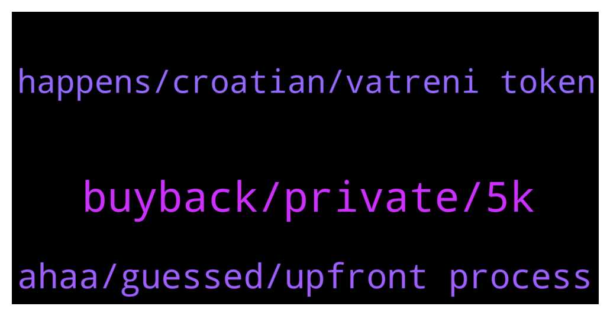

# **@ampnetapxchat**
 ## Analysis for **2022-01-31** - **2022-02-05**.

---

## 📊 **Basic Stats**

**n_messages_sent**: 54

---

---

## 🔝 **Top keywords and related messages**

1. **buyback, private, 5k**

    @Mest4r1 --- *What percent does ampnet get for buybacks?* **--->** [TG Discussion](https://t.me/ampnetapxchat/36950)

    @scemodonore --- *Don't get too excited over buybacks for now... they won't have much impact on pa. The whole fan token sale was more a showcase for the power of ampnet software for me... If they build on this progress we may see some more speculation driven pa in the near future I think.* **--->** [TG Discussion](https://t.me/ampnetapxchat/36966)

    @PFCBLic --- *What should i get excited than? Only price leverage toward up is buyback as i am awared.* **--->** [TG Discussion](https://t.me/ampnetapxchat/36968)

    @jakovtradingmentor --- *Thats public sale, private was over 2 days ago* **--->** [TG Discussion](https://t.me/ampnetapxchat/36959)

    @jakovtradingmentor --- *Private sale was 500k so idk where you got 12.5k from* **--->** [TG Discussion](https://t.me/ampnetapxchat/36954)

    @jakovtradingmentor --- *Not a 100% sure but last i heard its 5%, might have changed though  You will know for sure as public sale gets close to finishing* **--->** [TG Discussion](https://t.me/ampnetapxchat/36951)

2. **ahaa, guessed, upfront process**

    @jakovtradingmentor --- *And it will be more clear to you and to me as well* **--->** [TG Discussion](https://t.me/ampnetapxchat/36956)

    @PFCBLic --- *Ahaa  Understand now. All clear. Thank you for answers👍* **--->** [TG Discussion](https://t.me/ampnetapxchat/36942)

    @runex_x1 --- *guessed it right, but should be made more clear upfront* **--->** [TG Discussion](https://t.me/ampnetapxchat/36923)

    @runex_x1 --- *have to say, the process was smooth. No remarks* **--->** [TG Discussion](https://t.me/ampnetapxchat/36921)

    @North --- *It would be good to get confirmation on this please @mislavjavor* **--->** [TG Discussion](https://t.me/ampnetapxchat/36866)

    @jakovtradingmentor --- *Your feedback has been noted :D thank you!* **--->** [TG Discussion](https://t.me/ampnetapxchat/36926)

3. **happens, croatian, vatreni token**

    @Braam --- *Thanks Jakov, and what happens if it doesn't reach $500000?* **--->** [TG Discussion](https://t.me/ampnetapxchat/36858)

    @Braam --- *I see the Vatreni token is 80% funded. However it's only until the 2 feb.  Jakov please explain what happens if the 2nd comes and goes when the funding has reached $500000. And then conversely what happens if it does fulfill the total amount? Thanks* **--->** [TG Discussion](https://t.me/ampnetapxchat/36856)

    @runex_x1 --- *Regarding the croatian fantoken. Should anybody be interested. I asked some questions:There is a 30day linear vesting period. And there will be liquidity on Uniswap. We will lauch it after the public sale is over and considering the crypto market* **--->** [TG Discussion](https://t.me/ampnetapxchat/36897)

    @runex_x1 --- *I have to say, the token on its own looks great given the fact that people will be able to use it in real stores* **--->** [TG Discussion](https://t.me/ampnetapxchat/36896)

    @jakovtradingmentor --- *it is a utility token by croatian football organization where basically holders of it get bonuses in shops, access to events, discounts, they can pay with it and early access to ticket sales for games* **--->** [TG Discussion](https://t.me/ampnetapxchat/36891)

    @runex_x1 --- *I wish the team all the luck on this one. We can use some positive investment news after all this technical progress* **--->** [TG Discussion](https://t.me/ampnetapxchat/36883)

