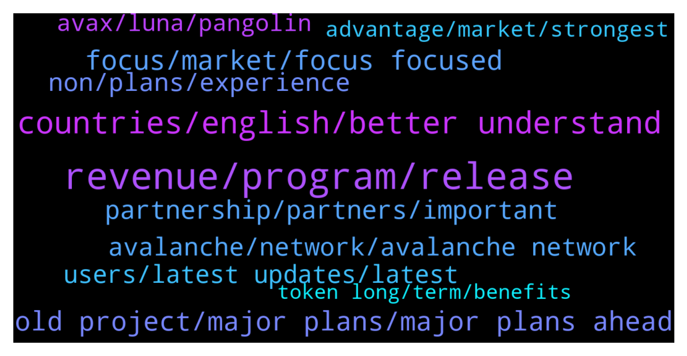

# **@avalancheavax**
 ## Analysis for **2022-02-04** - **2022-02-05**.

---

## 📊 **Basic Stats**

**n_messages_sent**: 525

---

---

## 🔝 **Top keywords and related messages**

1. **revenue, program, release**

    @Lanrejones --- *I’m a rookie that wants to make passive income and I want to start with 100$. Any advice* **--->** [TG Discussion](https://t.me/avalancheavax/326327)

    @maartok --- *Is the summit in March also for investors or is it more a developers kind of event* **--->** [TG Discussion](https://t.me/avalancheavax/326916)

    @Kendallas --- *Ambassadors play a very important role in every project, Do you have an ambassador program? If yes, how can I be one ?* **--->** [TG Discussion](https://t.me/avalancheavax/326773)

    @alrko616 --- *do we know the speaker who will attend the summit?* **--->** [TG Discussion](https://t.me/avalancheavax/326353)

    @luongsonbac2 --- *Too many projects promise magic but never release any working product or prove any revenue, Within a short/long time of release. Is your project also like this? If not can u tell us, What makes your project different from other projects?* **--->** [TG Discussion](https://t.me/avalancheavax/326738)

    @lethaind90 --- *What are the steps to become a part of your community, and start getting revenues? Where do we buy, where do we sign up? This looks like an amazing project!* **--->** [TG Discussion](https://t.me/avalancheavax/326563)

2. **countries, english, better understand**

    @burkholders --- *How do you plan to spread awareness about your project in different countries where English is not good? Do you have local communities like Vietnam, Indonesia, Thailand, Korea,.. so they can better understand your project?* **--->** [TG Discussion](https://t.me/avalancheavax/326730)

    @sebastianse3 --- *Is your platform a global or is there any restriction to certain regions?* **--->** [TG Discussion](https://t.me/avalancheavax/326724)

    @ssiedow4 --- *Is your platform a global or is there any restriction to certain regions?* **--->** [TG Discussion](https://t.me/avalancheavax/326456)

    @ed_Russo --- *How Do you planning to promote your project in different countries, wherein English is not spoken well? Do you have a local communities for them to better understand your project?* **--->** [TG Discussion](https://t.me/avalancheavax/326484)

    @silva_corbett_42 --- *Are you planning to promote your project in countries / regions where English is not good? Do you have a local community for them to better understand your project??* **--->** [TG Discussion](https://t.me/avalancheavax/326480)

    @Caffeine_Addictv --- *How do you plan to spread awareness about your project in different countries where English is not good? Do you have local communities like Vietnam, Indonesia, Thailand, Korea,.. so they can better understand your project?* **--->** [TG Discussion](https://t.me/avalancheavax/326479)

3. **focus, market, focus focused**

    @kristinakern47 --- *Marketing is a central element for every project, so that everyone knows the potential that a project can bring is vital to achieve the goals set. What is your strategy to attract new users and Investor to your platform and keep them long term.* **--->** [TG Discussion](https://t.me/avalancheavax/326705)

    @DeathNWar --- *Marketing is a central element for every project, so that everyone knows the potential that a project can bring is vital to achieve the goals set. What is your strategy to attract new users and Investor to your platform and keep them long term.* **--->** [TG Discussion](https://t.me/avalancheavax/326473)

    @elenorg1996 --- *What's your main focus right now, are you focused on the community or market/Exchange or the products?* **--->** [TG Discussion](https://t.me/avalancheavax/326723)

    @Azasimus --- *Are you a global project or local project? At present, which market are you focus on, or is it focused on building and growing to gain customers, users and partners?* **--->** [TG Discussion](https://t.me/avalancheavax/326696)

    @ltmanley90 --- *What's your main focus right now, are you focused on the community or market/Exchange or the products?* **--->** [TG Discussion](https://t.me/avalancheavax/326452)

    @donya_harwell --- *Are you a global project or local project? At present, which market are you focus on, or is it focused on building and growing to gain customers, users and partners?* **--->** [TG Discussion](https://t.me/avalancheavax/326640)

4. **old project, major plans, major plans ahead**

    @Blairturner1991 --- *What are the attractive features in your project? What is the vision and goals in your project that you want to achieve in 2022 and beyond?* **--->** [TG Discussion](https://t.me/avalancheavax/326607)

    @tahchetsn --- *What is the most ambitious goal of your project? Could share with us any Upcoming Updates?* **--->** [TG Discussion](https://t.me/avalancheavax/326643)

    @aoldham1992 --- *What are the attractive features in your project? What is the vision and goals in your project that you want to achieve in 2022 and beyond?* **--->** [TG Discussion](https://t.me/avalancheavax/326653)

    @dupree_1990 --- *What is the most ambitious goal of your project? Could share with us any Upcoming Updates?* **--->** [TG Discussion](https://t.me/avalancheavax/326650)

    @berta_Gilmore --- *What is the most ambitious goal of your project? Could share with us any Upcoming Updates?* **--->** [TG Discussion](https://t.me/avalancheavax/326547)

    @Korvica --- *What is the most ambitious goal of your project? Could share with us any Upcoming Updates?* **--->** [TG Discussion](https://t.me/avalancheavax/326635)

5. **partnership, partners, important**

    @ifriend05 --- *We have relationships with hundreds of projects across the industry, some are parternships, some gave us grants, some use our staking/defi tech, and others we have incubated/launched.  To learn more and see a complete list, you can refer to our Ecosystem page: https://ferrum.network/iron-alliance/* **--->** [TG Discussion](https://t.me/avalancheavax/326402)

    @ifriend05 --- *It is a group of many notable projects we have partnered with or are working with in some way, for example Avalanche is there because we are an official ecosystem partner! But there are many others too across the industry including Polygon, Algorand, Pokt, and dozens more top DeFi and infrastructure and NFT projects. We connect all these founders together in a group and find ways to add value to each other. Its a wonderful way to collaborate and add value to the entire industry* **--->** [TG Discussion](https://t.me/avalancheavax/326404)

    @arkinsona --- *Partnership is always an important factor for every project. So who is your partner? What are the benefits you get from those relatiionships?* **--->** [TG Discussion](https://t.me/avalancheavax/326556)

    @Blind5ighta --- *Can you briefly describe your PARTNERSHIP so far and upcoming partnerships?* **--->** [TG Discussion](https://t.me/avalancheavax/326477)

    @oxhickson --- *PARTNERS are the most important that strengthen the ecosystems of all projects. Could you tell us about your project partners and the partnership strategy it has adopted?* **--->** [TG Discussion](https://t.me/avalancheavax/326475)

    @msbunmw --- *Q)Can you tell us about some of your partners and who you plan to collaborate with in the near future ?* **--->** [TG Discussion](https://t.me/avalancheavax/326428)

6. **avalanche, network, avalanche network**

    @abedi_seyedmorteza --- *Yes BSC network.  I did not transfer to the wallet address  I transferred it to Avalanche network address* **--->** [TG Discussion](https://t.me/avalancheavax/326848)

    @Nicolas_A --- *What’s the issue with it ? It’s on the BSC network* **--->** [TG Discussion](https://t.me/avalancheavax/326841)

    @sherrie --- *hello administrator, how to send my eth on avalanche network in metamask? i send it to my avalanche wallet, but there's no response* **--->** [TG Discussion](https://t.me/avalancheavax/326796)

    @J --- *For development purposes,  What’s the difference between, let’s say, avalanches subnetwork vs. nears app-chain infra via octopus network?* **--->** [TG Discussion](https://t.me/avalancheavax/326921)

    @abedi_seyedmorteza --- *We have mistakenly transferred currency in avalanche network please guide me* **--->** [TG Discussion](https://t.me/avalancheavax/326342)

    @ysfm0 --- *Only me who can’t switch to Avalanche on MetaMask?* **--->** [TG Discussion](https://t.me/avalancheavax/326354)

7. **non, plans, experience**

    @dominic_gould --- *How many team members do you have? Do they have enough experience in the blockchain field? Do they have any experience on working in crypto and non-crypto project?* **--->** [TG Discussion](https://t.me/avalancheavax/326777)

    @greathouse_fsd --- *Do you have any plans to attract non-crypto investors to join your project? Because the success of a project attracts more investors who haven't yet entered the crypto world. What are the plans to raise awareness about your project in the non-crypto space.* **--->** [TG Discussion](https://t.me/avalancheavax/326569)

    @Slic3man --- *Do you have any plans to attract non-crypto investors to join your project? Because the success of a project attracts more investors who haven't yet entered the crypto world. What are the plans to raise awareness about your project in the non-crypto space.* **--->** [TG Discussion](https://t.me/avalancheavax/326617)

    @Kaufmans --- *Do you have any plans to attract non-crypto investors to join your project? Because the success of a project attracts more investors who haven't yet entered the crypto world. What are the plans to raise awareness about your project in the non-crypto space.* **--->** [TG Discussion](https://t.me/avalancheavax/326760)

    @Melsie_word_83 --- *Do you have any plans to attract non-crypto investors to join your project? Because the success of a project attracts more investors who haven't yet entered the crypto world. What are the plans to raise awareness about your project in the non-crypto space.* **--->** [TG Discussion](https://t.me/avalancheavax/326636)

    @unclethong --- *Security and anonymity are always prioritized by BlockChain projects in the development of project platforms and technologies. So, does you have any technological solutions or plans to enhance user trust in these issues?* **--->** [TG Discussion](https://t.me/avalancheavax/326638)

8. **users, latest updates, latest**

    @Oneal_1995 --- *How can users stay updated with this project? Are there channels, including local communities where users can get the latest updates?* **--->** [TG Discussion](https://t.me/avalancheavax/326767)

    @Nicolas_A --- *Native stable still needs a lot of work. Getting there slowly* **--->** [TG Discussion](https://t.me/avalancheavax/326822)

    @chucuoiabc --- *How can users stay up to date with this project? Are there channels, including local communities, where users can get the latest updates?* **--->** [TG Discussion](https://t.me/avalancheavax/326503)

    @Dillon_Trimble --- *How can users stay up to date with this project? Are there channels, including local communities, where users can get the latest updates?* **--->** [TG Discussion](https://t.me/avalancheavax/326718)

    @tranbinh23 --- *How can users stay updated with this project? Are there channels, including local communities where users can get the latest updates?* **--->** [TG Discussion](https://t.me/avalancheavax/326433)

    @hoagiayhd --- *How can users stay up to date with this project? Are there channels, including local communities, where users can get the latest updates?* **--->** [TG Discussion](https://t.me/avalancheavax/326655)

9. **avax, luna, pangolin**

    @frankophil --- *Is AVAX or TJ down? Submitted a transaction to TraderJoe and its taking forever, not showing up in Snowtrace* **--->** [TG Discussion](https://t.me/avalancheavax/326936)

    @apo --- *1 year in Bitcoin ages your body by 10 years. So hope avax is different lol* **--->** [TG Discussion](https://t.me/avalancheavax/326269)

    @Nezzro --- *Is stacking avax in daps safe ?* **--->** [TG Discussion](https://t.me/avalancheavax/326347)

    @raghav4288 --- *Buy avax Send in your wallet  then exchange it on dex* **--->** [TG Discussion](https://t.me/avalancheavax/326816)

    @Anabeli2 --- *Hi y’all What are your opinion on Avax token??* **--->** [TG Discussion](https://t.me/avalancheavax/326286)

    @joanandrewss --- *By the way! I've been searching deep, who knows if AVAX has any competitor. I'd love to see how the comparison turns out, no offence fam.* **--->** [TG Discussion](https://t.me/avalancheavax/326886)

10. **advantage, market, strongest**

    @conchom --- *What is your strongest advantage that you think will make your team leading the market?* **--->** [TG Discussion](https://t.me/avalancheavax/326567)

    @Monroe_belt_1998 --- *What is your strongest advantage that you think will make your team leading the market?* **--->** [TG Discussion](https://t.me/avalancheavax/326768)

    @Jeni_Canty_26 --- *What is your strongest advantage that you think will make your team leading the market?* **--->** [TG Discussion](https://t.me/avalancheavax/326409)

    @DrDemocracy --- *What is your strongest advantage that you think will make your team leading the market?* **--->** [TG Discussion](https://t.me/avalancheavax/326417)

    @castro_1995 --- *Can you list 1-3 killer features of this project that makes it ahead of its competitors? What is the competitive advantage your project has that you feel most confident about?* **--->** [TG Discussion](https://t.me/avalancheavax/326528)

    @meckinhla --- *What is your strongest advantage that you think will make your team leading the market?* **--->** [TG Discussion](https://t.me/avalancheavax/326539)

