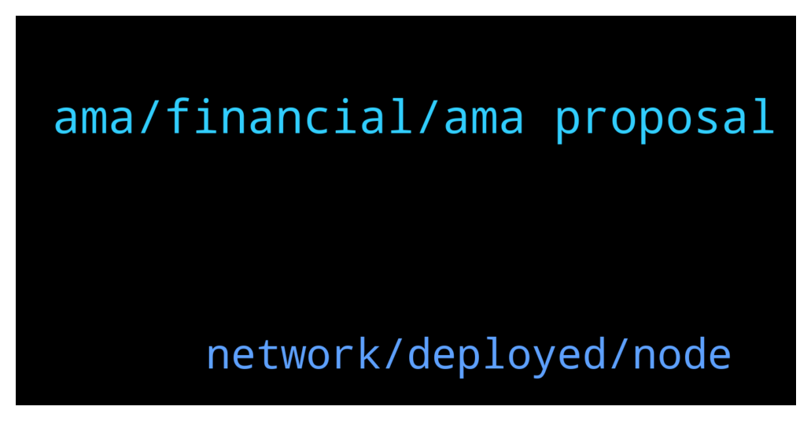

# **@chainlinkofficial**
 ## Analysis for **2022-02-04** - **2022-02-05**.

---

## 📊 **Basic Stats**

**n_messages_sent**: 38

---

---

## 🔝 **Top keywords and related messages**

1. **ama, financial, ama proposal**

    @JoshSimenhoff --- *Hi we are not intersted in 3rd party AMA proposals.* **--->** [TG Discussion](https://t.me/chainlinkofficial/371536)

    @elifhilalumucu --- *You can find short and important information about DeFi in this video 🤩  By the way, time is very valuable to all of us, so it's a chance to learn in two minutes🙂 I highly recommend this video, good luck! 🍀   https://youtu.be/7lHhS3KiWgE* **--->** [TG Discussion](https://t.me/chainlinkofficial/371503)

    @Robert6543 --- *Hello everyone I Have an AMA proposal, whom should I contact to directly discuss about it?* **--->** [TG Discussion](https://t.me/chainlinkofficial/371869)

    @albert_ce --- *So how do you get interested?* **--->** [TG Discussion](https://t.me/chainlinkofficial/371537)

    @albert_ce --- *Hello!! I'm  Marketer at Cryptoscreen, I know this project is very interesting and I want to know more about this project. I would like to invite you to hold an AMA session in our community, Who can I submit an AMA proposal to?* **--->** [TG Discussion](https://t.me/chainlinkofficial/371535)

    @elifhilalumucu --- *👉🏻Stablecoins are a core component of DeFi that allow fiat currencies like the U.S. dollar and other assets to be represented on the blockchain as digital tokens.   A stablecoin is a representation of an underlying asset and tries to maintain a 1:1 peg with it through various mechanisms🙏🏻* **--->** [TG Discussion](https://t.me/chainlinkofficial/371498)

2. **network, deployed, node**

    @Sylvarantt --- *Chainlink solutions haven't been deployed on SmartBCH yet. If there is demand for hybrid smart contracts, Chainlink will eventually be deployed there for sure 👍* **--->** [TG Discussion](https://t.me/chainlinkofficial/371612)

    @salemkode --- *Can I use chain link in smartbch* **--->** [TG Discussion](https://t.me/chainlinkofficial/371607)

    @Jonah --- *Hi I posted a question on r/Chainlink but I believe it was removed for some reason. Can somebody help? It was a good question that I think ppl will want to know the answer to* **--->** [TG Discussion](https://t.me/chainlinkofficial/371459)

    @Kontur81 --- *How much link need I for lunch a link node?* **--->** [TG Discussion](https://t.me/chainlinkofficial/371466)

    @Sylvarantt --- *The recommended testnet for Chainlink testing purpose is Rinkeby due to faucets, but the LINK token contract is also deployed in Goerli  https://docs.chain.link/docs/link-token-contracts/#rinkeby* **--->** [TG Discussion](https://t.me/chainlinkofficial/371832)

    @Linkederic --- *If you want to spin up your own Chainlink node you do not need LINK at this time, but you will need ETH (or the appropriate token for the given network) to pay for gas  https://blog.chain.link/what-is-a-chainlink-node-operator/ https://docs.chain.link/docs/running-a-chainlink-node/* **--->** [TG Discussion](https://t.me/chainlinkofficial/371528)

