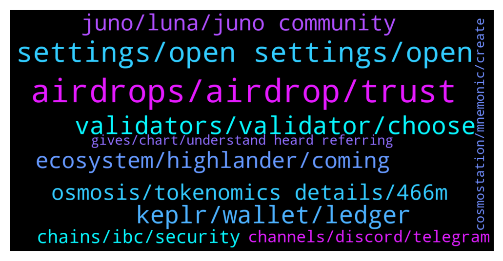

# **@cosmosproject**
 ## Analysis for **2022-02-04** - **2022-02-05**.

---

## 📊 **Basic Stats**

**n_messages_sent**: 407

---

---

## 🔝 **Top keywords and related messages**

1. **airdrops, airdrop, trust**

    @ZoltanAtom --- *There will be Raw airdrop to Junoswapdex lps and incentives coming to lps soon. High Apy.* **--->** [TG Discussion](https://t.me/cosmosproject/485587)

    @CHRISKOIN --- *Nobody has confirmed receiving airdrop from TW* **--->** [TG Discussion](https://t.me/cosmosproject/486231)

    @seny --- *I get the basic idea of airdrops that its not just free money but even that post just randomly namedrops "Juno" as if new people are supposed to know what that means* **--->** [TG Discussion](https://t.me/cosmosproject/485475)

    @ZoltanAtom --- *You will not able to eligible airdrops and also exchange validators have big power vote but they do not participate any governance proposals.   https://www.mintscan.io/cosmos/validators* **--->** [TG Discussion](https://t.me/cosmosproject/485531)

    @ZoltanAtom --- *Well I just can’t give to you a summary, it’s because there are tons of informations which are needed self research. At Cosmos each chain is sovereign and you need to follow up each of them to get more details.   For airdrops;  https://t.me/cosmosproject/485142* **--->** [TG Discussion](https://t.me/cosmosproject/485472)

    @Julien --- *Hello about airdrop nomic have to send some NOM but it seems that transfers are disabled for keplr* **--->** [TG Discussion](https://t.me/cosmosproject/486274)

2. **settings, open settings, open**

    @NikoDMT --- *Open settings - go to security - select groups set to: my contacts  Open settings - go to data and storage -turn of automatic media download for all options including media and gifs Open settings - go to privacy and security - phone number set to: nobody  Open settings - go to privacy and security - phone calls set to: nobody* **--->** [TG Discussion](https://t.me/cosmosproject/486193)

    @Adrian --- *I dont have my brother around...please how can I go about with this. I don't want to be victimized by these fools 🙏* **--->** [TG Discussion](https://t.me/cosmosproject/486186)

    @seny --- *A guide isn't really needed. Any explanation in your own words would be much more meaningful than any guide anyways, if anyone could do it* **--->** [TG Discussion](https://t.me/cosmosproject/485480)

    @seny --- *oh boy thats gonna be insane. Slowly working my way up to that lol* **--->** [TG Discussion](https://t.me/cosmosproject/485560)

    @seny --- *Ah I see sounds simple enough. Ok time to try it out lol Thank you :)* **--->** [TG Discussion](https://t.me/cosmosproject/485539)

    @Adrian --- *I was only able to turn off calls...the others got too complicated for me...lolz* **--->** [TG Discussion](https://t.me/cosmosproject/486205)

3. **validators, validator, choose**

    @BeaumedicLau --- *Hi, would like to ask is there any different in return if I stake my $OSMO with 2 different validators?   *if both validators offering 5% commission.* **--->** [TG Discussion](https://t.me/cosmosproject/485598)

    @Luke --- *Question with keplr, when staking with multiple validates example, 2 validates for 5 percent each, does that mean I would be paying for 10 percent commission fees?* **--->** [TG Discussion](https://t.me/cosmosproject/485673)

    @ZoltanAtom --- *Validators take commissions for their services.   For Delegators, you should check this reward calculation link;  https://www.stakingrewards.com/earn/cosmos* **--->** [TG Discussion](https://t.me/cosmosproject/485781)

    @SH_Daren --- *Think about it. Are you able to stake the same tokens at multiple validators? No. So you split your tokens among multiple validators. Each will take a cut of what is assigned to him, or the rewards thereof.* **--->** [TG Discussion](https://t.me/cosmosproject/485715)

    @AtomJazz --- *So with 20 validators you'd be paying 100% commission fees? 🤔😃* **--->** [TG Discussion](https://t.me/cosmosproject/485675)

    @AtomJazz --- *Make sure you avoid exchange validators! Other than that...The best validator is always subjective, here are some factors that might help:   - Commission Rate:  This is the % of earned rewards that go to the validator. Not the % of your total stake, just to eliminate that confusion.   - Self-Bonded rate:  This is the % of bonded ATOM that belong to the validator. Think of this as their skin in the game.   - Decentralization:  Choosing the smaller validators helps to decentralize the network which improves security overall. Again, decentralization should be a priority. On this point, centralized exchanges are not the best choice as they don't really support the network at all.   You can learn more about each validator in their profiles on the wallets and explorers.  The 8-10% is almost for everyone, feel free to use this reward calculator  https://www.stakingrewards.com/earn/cosmos  Commissions can be changed anytime so keep an eye on your validator via telegram or twitter* **--->** [TG Discussion](https://t.me/cosmosproject/485689)

4. **keplr, wallet, ledger**

    @GW --- *How do you claim on Keplr? Sorry for the silly question.* **--->** [TG Discussion](https://t.me/cosmosproject/485896)

    @TicoJohnny --- *You can use Keplr for PC or Cosmostation for Mobile* **--->** [TG Discussion](https://t.me/cosmosproject/485867)

    @AtomJazz --- *You just need to connect your Keplr wallet to https://app.nomic.io/ There's no transferring anything* **--->** [TG Discussion](https://t.me/cosmosproject/486282)

    @Pastashooter105 --- *Can’t i just send some UST from my TerraStation wallet (Ledger Luna.app) to my Keplr wallet (Ledger Cosmos.app)?* **--->** [TG Discussion](https://t.me/cosmosproject/485771)

    @bigbadbenadd --- *Does anyone know is keplr is supported by ledger .* **--->** [TG Discussion](https://t.me/cosmosproject/485707)

    @ZoltanAtom --- *We always recommend to users to use Ledger with Keplr.* **--->** [TG Discussion](https://t.me/cosmosproject/485709)

5. **juno, luna, juno community**

    @AndreLunaMoon --- *Not quite as good as $JUNO but still pretty good* **--->** [TG Discussion](https://t.me/cosmosproject/485648)

    @ggwashinton1 --- *You will probably like Juno then* **--->** [TG Discussion](https://t.me/cosmosproject/486159)

    @ZoltanAtom --- *Hi there,yes it’s the same. Also Please join Juno community;  https://t.me/JunoNetwork* **--->** [TG Discussion](https://t.me/cosmosproject/486251)

    @seny --- *is there anywhere to follow this? the juno channel?* **--->** [TG Discussion](https://t.me/cosmosproject/485591)

    @Pastashooter105 --- *What is the USP of Juno?* **--->** [TG Discussion](https://t.me/cosmosproject/485603)

    @ZoltanAtom --- *It’s 28 days. Also please Juno community;  https://t.me/JunoNetwork* **--->** [TG Discussion](https://t.me/cosmosproject/485474)

6. **ecosystem, highlander, coming**

    @ZoltanAtom --- *Hello again,Decentr is anymore at Cosmos apps&services section.  https://cosmos.network/ecosystem/apps* **--->** [TG Discussion](https://t.me/cosmosproject/485273)

    @ZoltanAtom --- *The key part to get to know many details at Cosmos ecosystem is keeping in touch with community and join Cosmos groups. Unfortunately i don’t have a guide to share with you. Many useful links at the pinned message.   https://t.me/CosmosEcosystemChat  I can also share more Cosmos chains channels if you like to join.* **--->** [TG Discussion](https://t.me/cosmosproject/485477)

    @seny --- *Ahhh nothing is simple with Cosmos is it xD* **--->** [TG Discussion](https://t.me/cosmosproject/485526)

    @SuperDupont44 --- *Hi Guys, Newbie coming from Dotsama to cruise a bit and take information on Cosmos 😎* **--->** [TG Discussion](https://t.me/cosmosproject/486151)

    @ale128888 --- *Hi, may I know who should I talk to regarding BD matters from Cosmos? Thank you!* **--->** [TG Discussion](https://t.me/cosmosproject/485448)

    @Adrian --- *I am new here...I'm having trouble buying cosmos with my ethereum  Pls I need honest guide not scammers 🙏* **--->** [TG Discussion](https://t.me/cosmosproject/486166)

7. **osmosis, tokenomics details, 466m**

    @ZoltanAtom --- *Please ask it to Osmosis channel.* **--->** [TG Discussion](https://t.me/cosmosproject/485465)

    @ZoltanAtom --- *As I said to you,You should ask Osmosis admins that they will share with you tokenomics details.* **--->** [TG Discussion](https://t.me/cosmosproject/485470)

    @seny --- *whats the benefit of that over osmosis?* **--->** [TG Discussion](https://t.me/cosmosproject/485585)

    @seny --- *Like woudn't OSMOSIS work as a standalone dex?* **--->** [TG Discussion](https://t.me/cosmosproject/485483)

    @seny --- *Is the atom on Osmosis dex different from normal Atom?* **--->** [TG Discussion](https://t.me/cosmosproject/485571)

    @ZoltanAtom --- *Osmosis Amm is sovereign specific blockchain. Osmo is their governance token. Here is their community channel ;  https://t.me/osmosis_chat* **--->** [TG Discussion](https://t.me/cosmosproject/485572)

8. **chains, ibc, security**

    @ZoltanAtom --- *What would you like to know about which chain? If you can be more specific with your questions, i can do my best for you.* **--->** [TG Discussion](https://t.me/cosmosproject/485481)

    @seny --- *So IBC is basically the backbone for this ecosystem and Cosmos is the blockchain that fuels its usage and operation?* **--->** [TG Discussion](https://t.me/cosmosproject/485490)

    @ZoltanAtom --- *Please also read this to understand what is ibc;  https://blog.cosmos.network/deep-dive-how-will-ibc-create-value-for-the-cosmos-hub-eedefb83c7a0* **--->** [TG Discussion](https://t.me/cosmosproject/485489)

    @AtomJazz --- *Those are all independent L1 blockchains* **--->** [TG Discussion](https://t.me/cosmosproject/485580)

    @ZoltanAtom --- *In general all chains have their own governance token and own chains. All sovereign and interconnected via IBC protocol.* **--->** [TG Discussion](https://t.me/cosmosproject/485573)

    @TicoJohnny --- *IBC is a state of symbiosis for the ecosystem, the use case of each sovereign and independent chain creates a synergy for the Cosmos Hub* **--->** [TG Discussion](https://t.me/cosmosproject/485492)

9. **channels, discord, telegram**

    @seny --- *of course. I'm in so many diff communities rn that its overwhelming haha. I should cut some shitty ones out to join these new better ones. I appreciate the help! I'll stick around and lurk/learn* **--->** [TG Discussion](https://t.me/cosmosproject/485507)

    @ZoltanAtom --- *Yes. They also have discord ;  https://discord.gg/juno* **--->** [TG Discussion](https://t.me/cosmosproject/485592)

    @seny --- *Haha I'm gonna have to make a whole telegram folder for all the cosmos channels. Thanks :D* **--->** [TG Discussion](https://t.me/cosmosproject/485543)

    @ZoltanAtom --- *Lol you have 3 Cosmos channels. You need to get at least 20 more maybe 30 😅* **--->** [TG Discussion](https://t.me/cosmosproject/485559)

    @ZoltanAtom --- *Well get ready for tons of channels. I can’t even count Cosmos channels how many I am in.* **--->** [TG Discussion](https://t.me/cosmosproject/485544)

    @cosmosfreak --- *discord channels are mopre quality :)* **--->** [TG Discussion](https://t.me/cosmosproject/485393)

10. **gives, chart, understand heard referring**

    @seny --- *conceptually ya but practically no lol* **--->** [TG Discussion](https://t.me/cosmosproject/485563)

    @nanedn --- *Sorry, I was referring myself to that chart* **--->** [TG Discussion](https://t.me/cosmosproject/486053)

    @Eric --- *Alright seems you didn’t really understand* **--->** [TG Discussion](https://t.me/cosmosproject/486213)

    @Tommaso --- *thanks i was confused now it is much clearer* **--->** [TG Discussion](https://t.me/cosmosproject/485793)

    @AtomJazz --- *No should be the same obviously* **--->** [TG Discussion](https://t.me/cosmosproject/485599)

    @RetailDisbelief --- *Didn’t even see your question what a coincidence* **--->** [TG Discussion](https://t.me/cosmosproject/485439)

