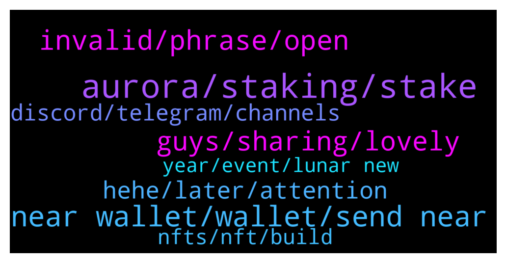

# **@cryptonear**
 ## Analysis for **2022-02-04** - **2022-02-05**.

---

## 📊 **Basic Stats**

**n_messages_sent**: 329

---

---

## 🔝 **Top keywords and related messages**

1. **aurora, staking, stake**

    @c_hinmay --- *How to get staking rewards in aurora?* **--->** [TG Discussion](https://t.me/cryptonear/326896)

    @leoma98 --- *Thrilled to announce that Meta Pool, is expanding into Aurora! 🚀  https://twitter.com/meta_pool/status/1489805919760392196* **--->** [TG Discussion](https://t.me/cryptonear/326626)

    @NearFritz --- *No worries we are here to be helpful, all the best.  And I will recommend you to take a look on Metapool.app 🤘 It is the best way of doing staking from my point of view of course* **--->** [TG Discussion](https://t.me/cryptonear/326545)

    @ieatapple --- *does this means i can use my StNear to farm for Aurora token? I was on the verge of putting it with Ref Finance.* **--->** [TG Discussion](https://t.me/cryptonear/326644)

    @iamkemoo --- *You go to staking in your wallet.near.org and choose the Aurora validator.* **--->** [TG Discussion](https://t.me/cryptonear/326899)

    @iamkemoo --- *You get 11% for single staking with you Near wallet* **--->** [TG Discussion](https://t.me/cryptonear/326932)

2. **near wallet, wallet, send near**

    @AbuZakariya09 --- *Hi can anyone help.  NEAR Wallet  Can I move some hapi tokens from CEX to near wallet or I need to do some bridging.  Thanks in advance* **--->** [TG Discussion](https://t.me/cryptonear/326911)

    @OlaitanOla --- *I can't send my near coins out* **--->** [TG Discussion](https://t.me/cryptonear/326507)

    @bailey_12 --- *I recommend to use KuCoin, OkCoin or crypto(dot)com to transfer your Near* **--->** [TG Discussion](https://t.me/cryptonear/326962)

    @rahulgoel007 --- *what issue or error you are getting. I have never used ONUS exchange.* **--->** [TG Discussion](https://t.me/cryptonear/326958)

    @zenkert --- *Stuck activating my NEAR wallet. Can't send NEAR from ONUS exchange where I bought my NEAR.* **--->** [TG Discussion](https://t.me/cryptonear/326956)

    @cuiking --- *How can I swap to usd in near wallet* **--->** [TG Discussion](https://t.me/cryptonear/326445)

3. **invalid, phrase, open**

    @zenkert --- *BEP20  not  available. Only Off Chain .* **--->** [TG Discussion](https://t.me/cryptonear/326960)

    @cuno6734 --- *why does the wallet not open* **--->** [TG Discussion](https://t.me/cryptonear/326836)

    @Faceless --- *The address is right, I've tried on other browsers. With or without vpn* **--->** [TG Discussion](https://t.me/cryptonear/326710)

    @iamkemoo --- *Try it again and double check.* **--->** [TG Discussion](https://t.me/cryptonear/326852)

    @rahulgoel007 --- *All good here try different browser once* **--->** [TG Discussion](https://t.me/cryptonear/326838)

    @rahulgoel007 --- *All browsers work perfectly, but firefox is much better out of all* **--->** [TG Discussion](https://t.me/cryptonear/326909)

4. **guys, sharing, lovely**

    @larry_lang --- *ah lovely^^ pls do share it with others^^* **--->** [TG Discussion](https://t.me/cryptonear/325983)

    @aidonker_x --- *thanks so much! i will give ice cream!* **--->** [TG Discussion](https://t.me/cryptonear/325874)

    @sanket_everstake --- *You are welcome, Let me know if you face any difficulty😃* **--->** [TG Discussion](https://t.me/cryptonear/326237)

    @rahulgoel007 --- *Just came for my duty ✌️* **--->** [TG Discussion](https://t.me/cryptonear/326752)

    @harryfrottercrypto --- *Thanks guys didnt mean to come off salty just lookin out for yas* **--->** [TG Discussion](https://t.me/cryptonear/326092)

    @IkkeLucky --- *Nice! Let's get it. Sharing right now* **--->** [TG Discussion](https://t.me/cryptonear/325979)

5. **hehe, later, attention**

    @kv9990 --- *Yeah,wish waited few mins more =))* **--->** [TG Discussion](https://t.me/cryptonear/326053)

    @butola_ravi --- *Yes he said talk later =))))* **--->** [TG Discussion](https://t.me/cryptonear/326039)

    @larry_lang --- *im been away for 3 days=)))* **--->** [TG Discussion](https://t.me/cryptonear/326017)

    @NearFritz --- *That's right hehe as it was confusing for you I tried to explain it harder HAHAHAHA* **--->** [TG Discussion](https://t.me/cryptonear/326542)

    @larry_lang --- *lol we was wondering what took u so long to reply=)))* **--->** [TG Discussion](https://t.me/cryptonear/326195)

    @larry_lang --- *i wish i paid attention to your call lol=))* **--->** [TG Discussion](https://t.me/cryptonear/326056)

6. **discord, telegram, channels**

    @GeorgePro1 --- *Metapool has no telegram join their discord and ask all your questions they will be glad to help   https://discord.gg/H36tqQbX* **--->** [TG Discussion](https://t.me/cryptonear/326658)

    @rahulgoel007 --- *Follow our official Twitter account, announcement channels and  https://t.me/nearweek and https://t.me/nearmates for major updates* **--->** [TG Discussion](https://t.me/cryptonear/326893)

    @GeorgePro1 --- *Oh sure!! we will cross to the heavens but for price talk use this channel https://t.me/merchantsofnear* **--->** [TG Discussion](https://t.me/cryptonear/326697)

    @kv9990 --- *Try https://t.me/neardev Or #dev channels on our discord near.chat* **--->** [TG Discussion](https://t.me/cryptonear/326157)

    @larry_lang --- *ah a little bit update on this, metapool now do have a telegram, this is newly made though, but still u can join and get support as well^^ https://t.me/MetaPoolOfficialGroup* **--->** [TG Discussion](https://t.me/cryptonear/326665)

    @larry_lang --- *hmm for this channel pls use english sir^^* **--->** [TG Discussion](https://t.me/cryptonear/326030)

7. **nfts, nft, build**

    @larry_lang --- *hmm didnt most NFTs projects all have little to no use cases=))) IMO i think the key part to build an solid NFTs is to build community =)) if u can build a large amount of pp u then u can make profit=))* **--->** [TG Discussion](https://t.me/cryptonear/326063)

    @harryfrottercrypto --- *nfts are garbage, and on near especially theyre all so low effort and low quality* **--->** [TG Discussion](https://t.me/cryptonear/326058)

    @Naikgauresh481 --- *After reading above chat I gained  some knowledge about NFTs* **--->** [TG Discussion](https://t.me/cryptonear/326103)

    @kv9990 --- *Here's Guide on Minting NFTs on Paras, a digital card NFT Marketplace on NEAR https://bit.ly/MintNFTsOnParas  Guide for How to create an store and mint NFT and sell NFTs on Mintbase :- https://youtu.be/wFiu5pLRIuk  You can have NFT Discussion at https://t.me/nearnftclub* **--->** [TG Discussion](https://t.me/cryptonear/326707)

    @harryfrottercrypto --- *doing some research before throwing money at hyperlinks to images on a file server. ALl near nfts have dumped out - all.   Thats just my thoughts.  :))))) Hoping it improves i just think the arts on near arent great atm* **--->** [TG Discussion](https://t.me/cryptonear/326068)

    @kv9990 --- *Yeah I was like that few months back when Solana NFTs trend started =))* **--->** [TG Discussion](https://t.me/cryptonear/326094)

