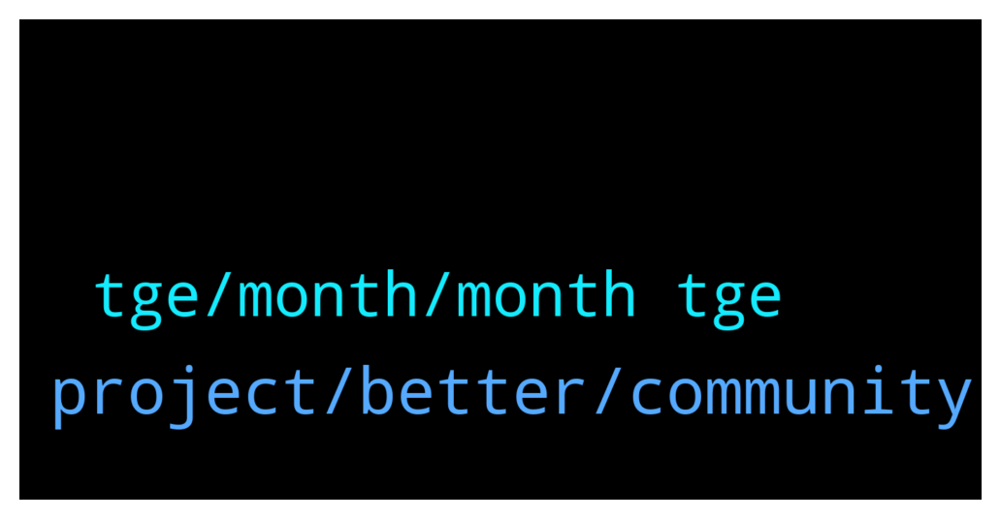

# **@defisearchpublic**
 ## Analysis for **2022-02-03** - **2022-02-05**.

---

## 📊 **Basic Stats**

**n_messages_sent**: 31

---

---

## 🔝 **Top keywords and related messages**

1. **project, better, community**

    @CryptoGoki_sensai --- *You know what's unique in this Platform is that this is ZK-powered.* **--->** [TG Discussion](https://t.me/defisearchpublic/241483)

    @CryptoMaskeRider --- *Is this for real? Its huge for a new project.* **--->** [TG Discussion](https://t.me/defisearchpublic/241472)

    @vinlens --- *hey come check out Discord with me https://discord.gg/j9ugJMXz* **--->** [TG Discussion](https://t.me/defisearchpublic/241496)

    @venturehead --- *If anyone is interested in a Pre-IDO for a super solid project. Hit me up. Project Team is offering a 40% bonus to early backers. Very limited amount only. Only serious peeps should DM me.* **--->** [TG Discussion](https://t.me/defisearchpublic/241504)

    @SkyMeFly21 --- *I attended moat of their AMA* **--->** [TG Discussion](https://t.me/defisearchpublic/241463)

    @5p1d3r --- *Hey everyone, Please read my message till the end I'm working for CryptoToday, a listing and research platform that aims to be a full DAO! We are currently gathering people that know something about cryptocurrency and want to hear their thoughts about the project in our discussion group. If you know anything about blockchain and crypto i invite you to join us in a friendly discussion about the space and help us make this project better, This is not a sale or anything like it. Just honest advice seeking. The group is Listcoin_1 Thank you in advance* **--->** [TG Discussion](https://t.me/defisearchpublic/241426)

2. **tge, month, month tge**

    @SkyMeFly21 --- *Venice is partnering with top auditing firms including Certik to guarantee the security of users’ money* **--->** [TG Discussion](https://t.me/defisearchpublic/241493)

    @SkyMeFly21 --- *Unique in a sense of How Venice will handle securing and making private trading* **--->** [TG Discussion](https://t.me/defisearchpublic/241484)

    @SkyMeFly21 --- *In summary to that: VENI tokens will be minted at genesis. VENI token issuance master smart contract level - a per-transfer 0.2% tax policy will be enforced and sent to a blackhole address. incorporates a tax that creates clear deflation for every on-chain movement. A 5% average movement per day creates an effective deflation of 4% annually.* **--->** [TG Discussion](https://t.me/defisearchpublic/241477)

    @CryptoMaskeRider --- *In what feature of venice this can handle frauds?* **--->** [TG Discussion](https://t.me/defisearchpublic/241492)

    @CryptoMaskeRider --- *So it appears traders will became anonymous?* **--->** [TG Discussion](https://t.me/defisearchpublic/241486)

    @GerardM --- *If you guys have time, check out $BLANK, Blockwallet. Privacy wallet that will allow users to hide transactions through their privacy pool. Beta running for half a year, and 28th Feb 2022 product launch.* **--->** [TG Discussion](https://t.me/defisearchpublic/241497)

