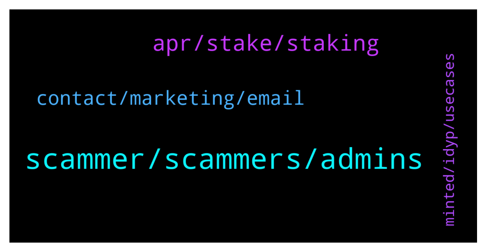

# **@dypfinance**
 ## Analysis for **2022-02-04** - **2022-02-05**.

---

## 📊 **Basic Stats**

**n_messages_sent**: 118

---

---

## 🔝 **Top keywords and related messages**

1. **scammer, scammers, admins**

    @Makrele22hz --- *Can anyone verify that he really had 10k?* **--->** [TG Discussion](https://t.me/dypfinance/244762)

    @shinigamikami --- *Yeah, have never fallen for such but mine was an elaborate hack where my pc was hacked and my keystore file was stolen back in 2017* **--->** [TG Discussion](https://t.me/dypfinance/244791)

    @prokarps --- *Bruh number 1 rule crypto to safe your money. No sending private key no clicking unknown links. Your stupid move bruh* **--->** [TG Discussion](https://t.me/dypfinance/244733)

    @DhoniMSD516 --- *In my initial days I got such messages too, once I almost fallen for prey 😅* **--->** [TG Discussion](https://t.me/dypfinance/244778)

    @Bossspo --- *Are you seriously? You made the shit and are coming here to make noise for the shit you made.* **--->** [TG Discussion](https://t.me/dypfinance/244759)

    @shinigamikami --- *I felt like shit for like 2years* **--->** [TG Discussion](https://t.me/dypfinance/244794)

2. **apr, stake, staking**

    @hemanrock --- *please check here for STAKE https://dyp.finance/stakev2 FARM https://dyp.finance/farmv2* **--->** [TG Discussion](https://t.me/dypfinance/244534)

    @Joy211ASa --- *Hello how many days is the apr* **--->** [TG Discussion](https://t.me/dypfinance/244533)

    @Jabirbobo001 --- *Hello admin, the day i staked my dyp it was at 22%apr, bt now 17%, which apr am I getting??* **--->** [TG Discussion](https://t.me/dypfinance/244515)

    @fiona_220 --- *Are there any chances of increasing APR %  in staking ?* **--->** [TG Discussion](https://t.me/dypfinance/244559)

    @Tettluft --- *Do you know if it will be any more staking at KuCoin?* **--->** [TG Discussion](https://t.me/dypfinance/244520)

    @itismeDH --- *How accumulated eth invested? And how* **--->** [TG Discussion](https://t.me/dypfinance/244631)

3. **contact, marketing, email**

    @zaynpromotes --- *hello! Good day / night I'm an admin of a 4 twitter account with over 250k, 310k, 340k and 470k followers. Who can I contact for marketing purposes?* **--->** [TG Discussion](https://t.me/dypfinance/244648)

    @Ernest_coinstore4 --- *Hi there! I am Ernest from Coinstore (CEX based in Singapore). With the full support and marketing campaigns that our exchange can offer, we are confident that your project listing with Coinstore will be a successful listing - especially in the Southeast Asia & Asia markets.   Other than Asia market, we are also providing Global market marketing and help project to have project’s community personal growth.    May I know who can I contact for this partnership?* **--->** [TG Discussion](https://t.me/dypfinance/244868)

    @itismeDH --- *Which is the good defi farming project.* **--->** [TG Discussion](https://t.me/dypfinance/244602)

    @iamJubi --- *Please visit this link. brief details and tutorials are provided on every feature https://t.me/dypfinance/229271* **--->** [TG Discussion](https://t.me/dypfinance/244627)

    @DhoniMSD516 --- *You can check here the available products currently https://t.me/dypfinance/229271 And here to know about our future roadmap https://dyp.finance/roadmap* **--->** [TG Discussion](https://t.me/dypfinance/244661)

    @DhoniMSD516 --- *Hey pls email your proposal to contact@dyp.finance :)* **--->** [TG Discussion](https://t.me/dypfinance/244870)

4. **minted, idyp, usecases**

    @DhoniMSD516 --- *Hey there are no VC invested in DYP, we have multiple partners though* **--->** [TG Discussion](https://t.me/dypfinance/244930)

    @Ali pajoo --- *Hi can I have the name of investing company that invested in dyp if there is any?* **--->** [TG Discussion](https://t.me/dypfinance/244927)

    @DhoniMSD516 --- *DYP and you are in right place head here to learn about DYP :)  https://t.me/dypfinance/229271* **--->** [TG Discussion](https://t.me/dypfinance/244603)

    @DhoniMSD516 --- *@DhoniMSD516, @Tekkol, @timdyp, @iamJubi, @kleopatrad, and @hemanrock  only are DYP admins* **--->** [TG Discussion](https://t.me/dypfinance/244755)

    @DhoniMSD516 --- *Both tokens are important in our ecosystem, DYP launched 13months ago and has more usecases iDYP launched recently and we are building usecases around it* **--->** [TG Discussion](https://t.me/dypfinance/244672)

    @DhoniMSD516 --- *Yes iDYP and DYP are two different token* **--->** [TG Discussion](https://t.me/dypfinance/244668)

