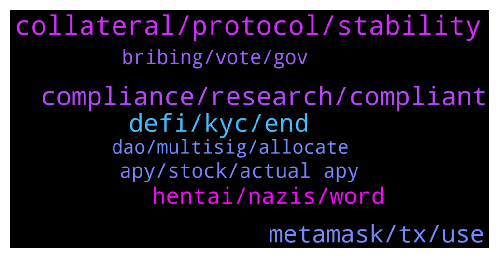

# **@lobsters_chat**
 ## Analysis for **2022-02-04** - **2022-02-05**.

---

## 📊 **Basic Stats**

**n_messages_sent**: 324

---

---

## 🔝 **Top keywords and related messages**

1. **collateral, protocol, stability**

    @Ile --- *Are there any attempts to make a self-sustaining, immutable, no-governance algostable?   @samkazemian has pointed out earlier that people should always prefer a stablecoin with higher collateral ratio. However, the collateral supply side is always looking for more capital  efficiency.   What if the collateral were fully owned by the protocol? Then there is no pressure to make the capital efficient. Just set a safe collateral ratio, like 400%. Issue new stablecoins only when above the safe threshold. Where does the collateral come then? Collect fees from usage, and add all fees to the collateral.   The build up would be slow, because the fees from usage are slow to accumulate the collateral. However, the demand should be strong: High collateral, no surprises from human intervention and transparent data on critical price point when collatetal ratio goes under 100%. Peg will always hold above that critical point (might break above peg in external markets though). Over time, more and more truly decentralized stablecoins would enter in circulation.  The only obstacle for the protocol self-sustainability is the price feed. An oracle imposes external point of failure. Auctioning sales and purchases of the stablecoin would internalize the risks. However, I have not come up with a sufficiently good system to avoid exploitation.* **--->** [TG Discussion](https://t.me/lobsters_chat/323043)

    @Ile --- *Why would the mechanism that I suggest break?   Only way would be if the collateral price crashes hard. This is an issue for every algostable, but with transparency and high collateral no one needs to panic. Also, if the crash is not immediate, then people will start exiting as the collateral ratio nears 100%. This will pump the collateral for remaining circulating supply.  Any system relying on arbitrage mechanisms and close to 100% collateral ratio are making up for the lack of collateral with a narrative. That makes it unclear, where the breaking point is, which in itself invites bank run.* **--->** [TG Discussion](https://t.me/lobsters_chat/323054)

    @Ile --- *That is one way to do it, and it surely has its use. Change via governance is much more user- and dev friendly. However, you will never be truly resilient due to the human factor.  Unchangeable protocol may be re-deployed if needed. Such trial and error produces truly resilient protocols. It is not most profitable, or easy, but such public goods can benefit everyone.  This is emphasized in the decentralized algorithmic stablecoin design. Highest stability is achieved by huge collateral ratio, but no one wants to tie in so much capital. The fees from providing the service of stability are not enough to compete with other opportunities. However, if the capital belongs to the protocol, which does not care about opportunity cost, then it can solve the incentive problem that human backers would have.  Also governance is by definition less stable than an immutable contract. Which is great for a stablecoin that needs to be as predictable as possible.  I am surprised how people repeat the mistakes of tradfi at the very first step.* **--->** [TG Discussion](https://t.me/lobsters_chat/323083)

    @samkazemian --- *Well that’s nice. I think your protocol would serve a very narrow but useful purpose for a stablecoin. It would not be able to grow fast enough given such capital inefficiency and no ability to upgrade anything. But that sounds like a feature than a bug. It could become a niche favorite of groups that want the most possible decentralized option while sacrificing liquidity and use cases.* **--->** [TG Discussion](https://t.me/lobsters_chat/323060)

    @samkazemian --- *The issue with governance minimized stablecoins is that price performance is the actual product of the protocol. So unless you've devised a god mechanism that somehow never can break under 99% of market conditions, it won't actually perform well in the most important thing: stable price.* **--->** [TG Discussion](https://t.me/lobsters_chat/323052)

    @banteg --- *notice that you cannot change dai contract without shutting down the whole system.* **--->** [TG Discussion](https://t.me/lobsters_chat/322931)

2. **compliance, research, compliant**

    @nickbtts --- *Anyone heard of a team not verifying a contract for security reasons? 😅  https://twitter.com/playcrabada/status/1489557110169825283?s=21* **--->** [TG Discussion](https://t.me/lobsters_chat/323069)

    @Cryptoaq --- *is this even legal if they are doxxed?* **--->** [TG Discussion](https://t.me/lobsters_chat/323141)

    @banteg --- *wouter has explained in this thread, but imo this context should've been a part of the forum post. the post makes it look like maker has compliance obligations and is working on changing the protocol and not "just research". https://twitter.com/wkampmann/status/1489381987110600704* **--->** [TG Discussion](https://t.me/lobsters_chat/322997)

    @banteg --- *wouter says it's just research. but every research has some purpose. imo it's indicative of further plans. https://twitter.com/wkampmann/status/1489329607950147587* **--->** [TG Discussion](https://t.me/lobsters_chat/322930)

    @Sp33qr --- *why is it illegal? the deal should have written everything probably but we couldn't find that out* **--->** [TG Discussion](https://t.me/lobsters_chat/323151)

    @ivangbi --- *There is evidence AML does not work at all (more $ spent than protected), and it only takes rights away from people, and all the accreditation stuff is total horseshit. You also infringe on privacy and if you say “why need privacy if you are not doing something illegal” this is a dead end. But we don’t have to argue ethics on law stance in lobsters, it makes for useless conversations.* **--->** [TG Discussion](https://t.me/lobsters_chat/323026)

3. **defi, kyc, end**

    @alexpgc21 --- *Future of DeFi is an algorithmic governance 🏛  We can’t build systems without flexibility and adaptability to the market which is constantly shaping. What we can do is reduce human participation in the protocols evolution.* **--->** [TG Discussion](https://t.me/lobsters_chat/323079)

    @bensams0 --- *I totally agree, eventually defi is going to come to a fork: either it's completely sovereign from meat space and cannot be governed by nation states, or nation states are going to figure out how to impose their will and everyone's gonna have to figure out how to cope with that.  We still don't know which way things are going to end up, so it's important to build an understanding of how we would have to cope if things take a turn towards the worst* **--->** [TG Discussion](https://t.me/lobsters_chat/322951)

    @banteg --- *defi has always been an alternative, an escape route, if you wish. we can only make sure it's universally loved so it can't be easily attacked.* **--->** [TG Discussion](https://t.me/lobsters_chat/322965)

    @samd0000 --- *And defi fixes all that regulation stuff* **--->** [TG Discussion](https://t.me/lobsters_chat/323264)

    @JoshZooDAO --- *Is this really where 'DeFi' is headed? I had such admiration for $DAI. 😞* **--->** [TG Discussion](https://t.me/lobsters_chat/322985)

    @investsam --- *for anyone interested in defi option vaults, we recently did a research piece showcasing the backtested PNL of these strategies: https://twitter.com/samchepal/status/1489640321352814593* **--->** [TG Discussion](https://t.me/lobsters_chat/323227)

4. **metamask, tx, use**

    @duckdegen --- *is there a simple tool i can use to send a onchain message via a TX to someone? All tutorials i can find are outdated and metamasks UI is a royal pain in the ass.* **--->** [TG Discussion](https://t.me/lobsters_chat/323353)

    @duckdegen --- *i've tried a few of those, including pokt and still cannot send a TX, i keep getting "inherent gas too low"* **--->** [TG Discussion](https://t.me/lobsters_chat/323377)

    @pjsm1508 --- *something happening in ethereum net? can't make a transaction, fantom working tho, weird* **--->** [TG Discussion](https://t.me/lobsters_chat/323336)

    @duckdegen --- *ja but the tools that i had found dont convert to the right format. this https://www.rapidtables.com/convert/number/ascii-to-hex.html definitely doesnt do the trick as tx gets rejected* **--->** [TG Discussion](https://t.me/lobsters_chat/323363)

    @juju1234534 --- *If you’re too inexperienced to navigate (barely) advanced Metamask functionality, don’t make general infrastructure comments here (which do require broad, nuanced knowledge). There are enough serious decentralization bottlenecks in this space atm, no need to throw in invalid/misleading ones.* **--->** [TG Discussion](https://t.me/lobsters_chat/323396)

    @coine_r --- *Reading data doesn't expose anything via ethers* **--->** [TG Discussion](https://t.me/lobsters_chat/323192)

5. **hentai, nazis, word**

    @kyle_stargarden --- *Mad haters caused Vice News to write tan article about us - go tell those haters what's good https://twitter.com/mjgault/status/1489253437489377287?s=20&t=GyuYSoS1_yTKBVMx2UWd0A* **--->** [TG Discussion](https://t.me/lobsters_chat/322893)

    @zotov --- *I genuinely don't understand hentai but this pic is a special enjoyment* **--->** [TG Discussion](https://t.me/lobsters_chat/323038)

    @lefterisjp --- *Okay he explained even futher in the post to my question: https://forum.makerdao.com/t/grant-announcement-kyc-aml-compliance-research/12991/16?u=lefterisjp* **--->** [TG Discussion](https://t.me/lobsters_chat/323003)

    @substreight --- *conspiracy theory* better choice of words* **--->** [TG Discussion](https://t.me/lobsters_chat/323256)

    @substreight --- *if you dont know what im referring to how can you question my word choice* **--->** [TG Discussion](https://t.me/lobsters_chat/323252)

    @samd0000 --- *I read the whole thing - a bit of a stretch to say some random French philosopher having the same name as a monkey means that they’re nazis* **--->** [TG Discussion](https://t.me/lobsters_chat/323260)

6. **apy, stock, actual apy**

    @altmortal --- *How does Yearn Finance calculate apy for Vaults? It displays 15.5% apy for DAI on Fantom while the actual apy is less than 1% lol* **--->** [TG Discussion](https://t.me/lobsters_chat/323157)

    @altmortal --- *Trying to attract TVL via fake APY?* **--->** [TG Discussion](https://t.me/lobsters_chat/323158)

    @samd0000 --- *But there’s lots of after hours stock movement that’s only available for certain big institutional investors right now* **--->** [TG Discussion](https://t.me/lobsters_chat/323232)

    @Astargath --- *yes, but most of the hype right now comes from the apr* **--->** [TG Discussion](https://t.me/lobsters_chat/323397)

    @alexn911 --- *They show last month APY, which is inflated because of xdao farming. Their TG is full of ppl complaining* **--->** [TG Discussion](https://t.me/lobsters_chat/323172)

    @ashkazat_bagatov --- *It's insane, they sold it right after the announcement* **--->** [TG Discussion](https://t.me/lobsters_chat/323142)

7. **bribing, vote, gov**

    @samkazemian --- *That's really awesome and interesting. What do you think about this though? There will likely be ways to not just borrow against gov tokens on Euler but just straight up get paid to vote a certain way https://www.bribe.xyz/* **--->** [TG Discussion](https://t.me/lobsters_chat/323209)

    @xmons --- *This is just a snapshot vote and not an on-chain gov proposal tho rite?* **--->** [TG Discussion](https://t.me/lobsters_chat/323302)

    @euler_mab --- *Ordinary lending protocols kind of are bribing protocols for governance tokens. Vitalik had a good post about this a while ago. Protected collateral on Euler is the only real option governance token holders have if they want to borrow against their tokens.* **--->** [TG Discussion](https://t.me/lobsters_chat/323212)

    @samkazemian --- *People think the bribes are just for veTokens but technically that's not true, someone like these guys just need to build the bribing system for the normal non-veTokens* **--->** [TG Discussion](https://t.me/lobsters_chat/323210)

    @HodlModel --- *Incredible 🤢 lower low! Instead of working on removing centralized coins from the collateral, they are going further down the rabbit hole. If MakerDao delegates vote for KYC/AML, they will put a nail in its coffin and Ethereum would lose what was supposed to be the backbone of its economy.   Users should warn their delegates against it in advance and threaten undelegation. Rn, $200M is delegated (10% of MKR). I guess this proposal could be expected in March/April, depending on the “findings”?* **--->** [TG Discussion](https://t.me/lobsters_chat/322991)

    @Figu3 --- *Bribes are a terrible idea on anything other than gauges* **--->** [TG Discussion](https://t.me/lobsters_chat/323223)

