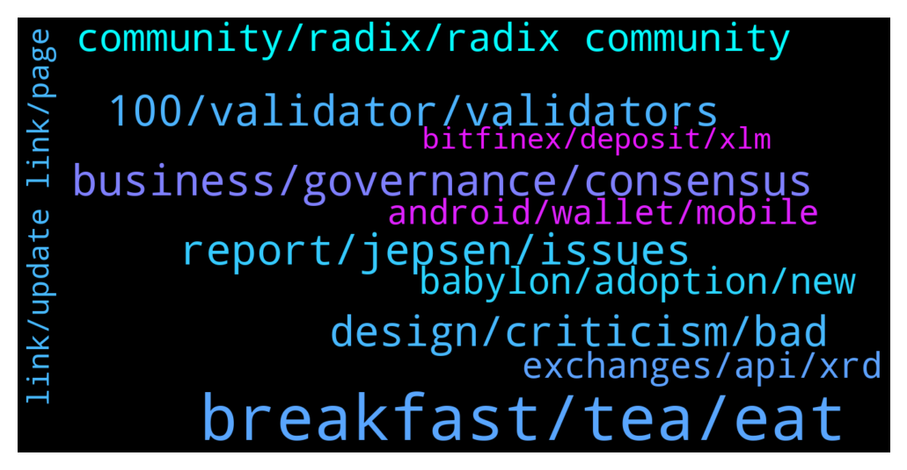

# **@radix_dlt**
 ## Analysis for **2022-02-04** - **2022-02-05**.

---

## 📊 **Basic Stats**

**n_messages_sent**: 547

---

---

## 🔝 **Top keywords and related messages**

1. **breakfast, tea, eat**

    @Radstakes --- *Controversial! For tea without milk, 100% agree.  But not for english breakfast tea* **--->** [TG Discussion](https://t.me/radix_dlt/350968)

    @Jacob_XRD --- *In any case. Australian brunch is superior to anything mentioned in this thread.* **--->** [TG Discussion](https://t.me/radix_dlt/351034)

    @PeachyKeehn --- *Salad?  No thanks. I eat cows and cows eat grass, thus I am getting my vegetables more efficiently as I delegate the eating to them.* **--->** [TG Discussion](https://t.me/radix_dlt/351035)

    @Adam_XRD --- *Will fight anyone who claims a full English breakfast isn't the ONE thing in British cuisine that is actual perfection.* **--->** [TG Discussion](https://t.me/radix_dlt/350986)

    @aj4269 --- *Breakfast is the most imp meal of the day, skip the dinner if you please.* **--->** [TG Discussion](https://t.me/radix_dlt/351072)

    @Cpt_Charles --- *It always surprises me what the brits eat for breakfast, beans sausage etc 😂* **--->** [TG Discussion](https://t.me/radix_dlt/350974)

2. **business, governance, consensus**

    @danhughes --- *1.7m tps isn't that impressive for a permissioned ledger. Look at the work our friends over at UCD have been doing. They've been hitting multiple millions tps on permissioned implementations for a number of years now* **--->** [TG Discussion](https://t.me/radix_dlt/350795)

    @ITProfligate --- *#Governance #DevvX Re: Convo above @tesslerc @Blind5ight Shang En @chrisijoyah @Kafkafrate @jafaroff55 Bent @SYS_01 @Jacob_XRD @fpieper  https://t.me/radix_dlt/350641 https://t.me/radix_dlt/350657  Twitter being Twitter brought up a video about www.devv.io  What I find very interesting and remarkably coincidental with my own thinking w.r.t. RadixDLT is the approach this company has to governance. Here is the relevant paragraph from https://www.devv.io/platform  “DevvShards can be public or private, and can be optimized for throughput, security, regulatory requirements such as HIPAA or GDPR compliance, or any business / governance needs.”  (DevvShards is what they call their shards - high level view is that it seems there are specialised shards coordinated through a central shard which they call the T1 Network - we know this approach has limits.)  What they have said is that a shard, or shards, can be optimised for … governance needs. What I was thinking this morning “in the shower” is that governance may have to be in layers and be flexible enough to account for many different use case scenarios such as those in the quoted paragraph. Whether or not this, or some of this, is translated into Radix Core architecture.  DevvX started in 2016 and were not attracted to the ICO market in 2017 for an early round because that path would have invited them to participate in a non-compliant way in “the kind of stuff that you’re really not supposed to do”. Their aim has been to build a real business that is designed around principles and does not take eg regulatory risk. What is evident, and this is also relevant on this level, is that they have now started an ESG (Environment and Social Governance) initiative which has a crypto token associated with it. This must be on the basis of considerable research. I am exploring this under the assumption that their business attitudes and the underlying research they have undertaken so far is something from which Radix can learn and may wish to emulate.  The Tweet that got me to them was that they are able to recover from hacks by rolling back, in some way. I haven’t yet explored the details of that. Those details matter of course.* **--->** [TG Discussion](https://t.me/radix_dlt/351012)

    @michwie --- *how far is the development regarding sharding?* **--->** [TG Discussion](https://t.me/radix_dlt/351389)

    @rmf55 --- *Atomic Composability, where have I heard that term mentioned before?  https://twitter.com/aeyakovenko/status/1489295073212731395?t=-EZ2md5CUMAEXXwM5h54MA&s=19* **--->** [TG Discussion](https://t.me/radix_dlt/350681)

    @tesslerc --- *"Specifically, a distributed ledger does not match the trust assumptions in Project Hamilton's approach, which assumes that the platform would be administered by a central actor."* **--->** [TG Discussion](https://t.me/radix_dlt/350777)

    @Mleekko --- *this is true though  in private DBs reads (by observers) are considered to follow the same rules as writes. But on public blockchains(ledgers) only state is what matters.* **--->** [TG Discussion](https://t.me/radix_dlt/351514)

3. **100, validator, validators**

    @Alex --- *Whats the reason behind rewarding only the top 100 anyway? Is it the intention of the network to force people to stake only with the top 100?  Education brings nothing if people dont get rewarded, since the thought of everybody is then simply why should I risk loosing my rewards and not someone else. If it is so important from a technological point of view that the validator number should be 100 then the reward structure, should at least be adjusted so that overstaked validators get punished for accepting over 2% by reducing their rewards tremendously until people unstake and the validator drops below the 2% again, so that there is absolutely no incentive for new people to go stake on such validator and I am sure this is possible to implement.* **--->** [TG Discussion](https://t.me/radix_dlt/350940)

    @rojiabraham --- *At that time the validator was in the top 100.. haven't checked since then* **--->** [TG Discussion](https://t.me/radix_dlt/350867)

    @Radstakes --- *At Olympia, there was deemed to be no performance benefit in having more than 100 validators.* **--->** [TG Discussion](https://t.me/radix_dlt/350920)

    @Radstakes --- *Well that depends on how you feel about their handling of the situation.  Following their outage, a few community validators decided to setup a code of conduct for validators to follow to ensure a minimum standard.  Check it out here: https://radixtalk.com/t/validator-code-of-conduct/320* **--->** [TG Discussion](https://t.me/radix_dlt/350907)

    @rojiabraham --- *Oh ok. So would it be a wise idea to switch to another validator since a 48 hour downtime  doesn't inspire much confidence* **--->** [TG Discussion](https://t.me/radix_dlt/350874)

    @Radstakes --- *I think there's a few things to consider here.  I agree that stake is concentrated too much at the top, and the Viskosity incident highlighted that simply being in the top 10 is  not a marker of performance, and that downtime of an over-staked validator can be detrimental to everyone.  The team have acknowledged this point and are looking at ways of reducing the impact of a validator going down.  Also the number 100 validator only has 0.1% of total stake.  Adding more validators doesn't do much to improve the spread of stake, it's far more important to educate the community to encourage a fairer distribution and improve decentralisation in my opinion.* **--->** [TG Discussion](https://t.me/radix_dlt/350936)

4. **report, jepsen, issues**

    @Tom --- *Also I do not understand why this report is made public, and not only used internally to fix the problems, anybody know the reason?* **--->** [TG Discussion](https://t.me/radix_dlt/351523)

    @Jacob_XRD --- *We were actually given the option not to publish when the report was commissioned, we chose to publish to maintain transparency with the community.* **--->** [TG Discussion](https://t.me/radix_dlt/351526)

    @Avaunt --- *There's an ongoing investigation with this.  https://status.radixdlt.com/* **--->** [TG Discussion](https://t.me/radix_dlt/351361)

    @Jacob_XRD --- *The security issues were fixed before the report was released. Network is SAFU.* **--->** [TG Discussion](https://t.me/radix_dlt/351535)

    @Stuart_RadixPool --- *Jepsen Radix report on front page of Hacker News - https://news.ycombinator.com/item?id=30221187* **--->** [TG Discussion](https://t.me/radix_dlt/351510)

    @Tom --- *Understand. Do you have any additional infos about performance issues mentioned in the report? Node failure few days ago did seem to indicate there is some truth to them.* **--->** [TG Discussion](https://t.me/radix_dlt/351541)

5. **design, criticism, bad**

    @guibs --- *you don't have to be Picasso to see that the design is bad* **--->** [TG Discussion](https://t.me/radix_dlt/351422)

    @chrisijoyah --- *I get that, but is the design really that bad, it conveys the message for now at least. They could spend the next 6 months updating their branding but it might not bring as much value as 6 months of development for working towards Bablyon. The redesign can always come after.* **--->** [TG Discussion](https://t.me/radix_dlt/351442)

    @guibs --- *I don't have enough talent, it's not my job, I just notice that design isn't serious, pay a real designer* **--->** [TG Discussion](https://t.me/radix_dlt/351418)

    @guibs --- *there is still a level of incompetence in design...* **--->** [TG Discussion](https://t.me/radix_dlt/351411)

    @chrisijoyah --- *It's not really constructive criticism though, it seems like you personally don't like the design, Design can be very subjective.* **--->** [TG Discussion](https://t.me/radix_dlt/351426)

    @propeterly --- *If you ever need a senior UX designer, this guy is very experienced, a very, very nice person and interested in Defi: https://look-at.myportfolio.com/copy-of-contact* **--->** [TG Discussion](https://t.me/radix_dlt/351461)

6. **community, radix, radix community**

    @Vorgesetzter --- *An idea for the Radix careers page.* **--->** [TG Discussion](https://t.me/radix_dlt/351200)

    @swlswlswl --- *is there a radix near protocol comparison?* **--->** [TG Discussion](https://t.me/radix_dlt/350766)

    @Miso_Shiru69 --- *Great to hear!  Would love to hear your ideas over in the  Radix meetup channel.   https://t.me/Radix_Meetup* **--->** [TG Discussion](https://t.me/radix_dlt/350778)

    @Jazzer9F --- *The Community Pulse Survey is back!  We’d love to learn a bit about you and get your feedback on how we can improve the Radix Community.   Answers are anonymous, and detailed feedback is appreciated.   👉 https://forms.gle/b1ih58gmhmJd1yxz6 👈* **--->** [TG Discussion](https://t.me/radix_dlt/350841)

    @Jacob_XRD --- *The Community Pulse Survey is back!  We’d love to learn a bit about you and get your feedback on how we can improve the Radix Community.   Answers are anonymous, and detailed feedback is appreciated.   👉 https://forms.gle/b1ih58gmhmJd1yxz6 👈* **--->** [TG Discussion](https://t.me/radix_dlt/351136)

    @MDK192 --- *Here’s a tribute to the Radix Team & Community and @danhughes  Join the Revolution $XRD 🔥🚀  Turn it up and enjoy   https://twitter.com/mdk1821/status/1489312431314817031?s=21* **--->** [TG Discussion](https://t.me/radix_dlt/350690)

7. **babylon, adoption, new**

    @aj4269 --- *Cerby could work on that even before Babylon.* **--->** [TG Discussion](https://t.me/radix_dlt/351159)

    @Jacob_XRD --- *Why now = This is an extraordinarily complex undertaking, we want to give the chosen person as much time as possible. Why not sooner? = We were still internally discussing what governance would look like, and did not have capacity for a full time position.   Re adoption, until Olympia there wasn't anything for people to adopt. Since Olympia we have had some very basic functionality in the wallet, nothin remarkable.  This is straying into personal opinion here but to me real adoption won't come until we deliver Babylon. Right now we have a strong focus on the adoption of builders, the devs that will craft the Radix ecosystem. They are the ones building the very things WILL adopt. "If you build It they will come" sort of thing.   I personally dont really look to closely at other layer 1's or projects until they deliver Smart Contracts and Governance, Im sure a lot of people are the same. 🤷* **--->** [TG Discussion](https://t.me/radix_dlt/350657)

    @piersr --- *We have some ideas, but definitely not a focus before Babylon* **--->** [TG Discussion](https://t.me/radix_dlt/350707)

    @CSpace80 --- *👏Great work on this timely post.   Having the team highlight what many people have been talking about, and giving answers to the 'why not now?' & when to expect those features/improvements adds peace of mind that what is coming in Babylon & Xian requires patience for now and will be worth the wait.* **--->** [TG Discussion](https://t.me/radix_dlt/351254)

    @Vorgesetzter --- *Some things, for me, were not transparent - or just "logical" - enough. First API - just for Bitfinex, it seemed. Rushed, maybe. Second API, everything new from scratch. Why bother (waste precious time) with API v1.0 in the first place? Hmm, ok. Olympia nodes with archive node architecture - sounded good. Somebody (maybe a dozen) spent lots of time with this. But then: everything new, from scratch. Why? Now we know. I appreciate Radix trying to do everything right. But sometimes the definition of "right" needs help from outside, it seems. I wonder if their current way to Babylon is the right one, or if they need Jepsen in 12/2022 again to realize: we messed some stuff up, let's postpone Babylon to 2023 and make it right. (Which would be the right way, but also wrong depending on your viewpoint.)* **--->** [TG Discussion](https://t.me/radix_dlt/351495)

    @ljulian100 --- *I am so excited when babylon is out. Great Team and article. 👍* **--->** [TG Discussion](https://t.me/radix_dlt/351150)

8. **exchanges, api, xrd**

    @Thorasan --- *Is it because the API isn't ready yet? Or just that Kucoin hasn't integrated it into their platform?* **--->** [TG Discussion](https://t.me/radix_dlt/351113)

    @Hokhla --- *Recently we expect another exchange?  I mean CEX* **--->** [TG Discussion](https://t.me/radix_dlt/351203)

    @aus87 --- *because our api that will be more universal with respect to exchanges listing xrd was just finished.* **--->** [TG Discussion](https://t.me/radix_dlt/351177)

    @propeterly --- *That CMC does not only need the new API, but to properly list XRD they also need it to be on at least 3 exchanges. As far as I know.* **--->** [TG Discussion](https://t.me/radix_dlt/351170)

    @Radstakes --- *No definite timescales unfortunately, but several exchanges are working on integrating XRD so hopefully you'll have more options soon.* **--->** [TG Discussion](https://t.me/radix_dlt/350680)

    @mymiad --- *Do you know why? I mean for a coin on top 100, wouldn't it be weird to be listed on only one exchange?* **--->** [TG Discussion](https://t.me/radix_dlt/351176)

9. **android, wallet, mobile**

    @ZeroPointThree --- *Hardware wallets not supported. Does anyone know if hardware wallets work with *any* mobile wallet? To my knowledge, they don’t.* **--->** [TG Discussion](https://t.me/radix_dlt/351185)

    @TaserFace6937 --- *This month easystake.net @minhnn_mvn should have a mobile wallet for Android that will work with the Ledger:  https://t.me/RadixValidatorAMA/699* **--->** [TG Discussion](https://t.me/radix_dlt/351190)

    @Radstakes --- *Mobile wallets are in the works by several community teams, such as https://t.me/cerbymask and https://t.me/ideomaker* **--->** [TG Discussion](https://t.me/radix_dlt/350886)

    @eMulah --- *Ledger live has mobile android app, I do connect my ledger nano s to the smartphone with otg cable.* **--->** [TG Discussion](https://t.me/radix_dlt/351186)

    @rgreene91 --- *Anyone use this new wallet yet? https://t.me/radix_dlt/351102* **--->** [TG Discussion](https://t.me/radix_dlt/351151)

    @dusanmatovic --- *Is it for evrry Smartphone or just iphone?* **--->** [TG Discussion](https://t.me/radix_dlt/351154)

10. **link, update link, page**

    @. --- *Thanks.  https://github.com/radixdlt/node-runner  I got the link from this page on Github, FYI if admin wants to update this.* **--->** [TG Discussion](https://t.me/radix_dlt/351522)

    @d1scere --- *I would use the site @AJ mentioned or https://www.radixscan.io/staker/* **--->** [TG Discussion](https://t.me/radix_dlt/350869)

    @. --- *https://docs.radixdlt.com/main/node/cli-install.html  Is there another link as this one is showing as page not found* **--->** [TG Discussion](https://t.me/radix_dlt/351518)

    @Radstakes --- *Thanks, have tagged the team to update the link* **--->** [TG Discussion](https://t.me/radix_dlt/351528)

    @ZeroPointThree --- *Thanks for the info, I’ll look into this as we develop future versions.* **--->** [TG Discussion](https://t.me/radix_dlt/351189)

    @NotBen --- *Amazing. Keep up the good work* **--->** [TG Discussion](https://t.me/radix_dlt/351132)

