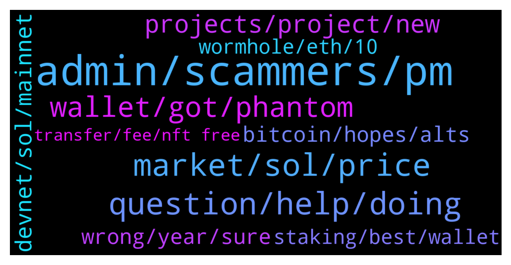

# **@solana**
 ## Analysis for **2022-02-04** - **2022-02-05**.

---

## 📊 **Basic Stats**

**n_messages_sent**: 305

---

---

## 🔝 **Top keywords and related messages**

1. **admin, scammers, pm**

    @cryptolover1987 --- *https://twitter.com/wormholecrypto/status/1489232008521859079  Also please join their community to get further  updates  https://t.me/wormholecrypto* **--->** [TG Discussion](https://t.me/solana/931664)

    @sugardaveibza --- *Monterreyrice dmdirect me a minutes ago is he a scammer ?* **--->** [TG Discussion](https://t.me/solana/932539)

    @Sevith --- *Legit 5 people just messaged me " I technical suppor ser how can help"* **--->** [TG Discussion](https://t.me/solana/932417)

    @cryptolover1987 --- *Hello Gerardo! Please note that, Real admins will never send you PM first. Thay are scammers & trying to impersonating us…* **--->** [TG Discussion](https://t.me/solana/933524)

    @mahib45 --- *Hello  Remember that there is no admin here who will PM you first or send any link to visit!  Let's block them immediately* **--->** [TG Discussion](https://t.me/solana/932672)

    @KingOfTheTown --- *why delete commento admin ? trying to make business here* **--->** [TG Discussion](https://t.me/solana/932173)

2. **question, help, doing**

    @Monterrey_Rice --- *How we doin this evening fam??* **--->** [TG Discussion](https://t.me/solana/932936)

    @mahib45 --- *Hello 👋  How may I help you?* **--->** [TG Discussion](https://t.me/solana/931403)

    @Liergou --- *@RealPrinceOla Hello, who do you want to cooperate with?* **--->** [TG Discussion](https://t.me/solana/933120)

    @cryptolover1987 --- *Hello! Thanks for reaching out! You can contact through 📧  1. For any query or question hello@solana.com   2. Request for proposal/marketing/AMA/exchange listing/partnership  growth@solana.com* **--->** [TG Discussion](https://t.me/solana/933495)

    @Monterrey_Rice --- *Good Morning Fam! How is everyone this fine Friday?* **--->** [TG Discussion](https://t.me/solana/933623)

    @mahib45 --- *Hello 👋  Forward your question to https://t.me/wormholecrypto* **--->** [TG Discussion](https://t.me/solana/931338)

3. **market, sol, price**

    @Ramji99 --- *How much time will sol take to touch 150$  Any pridiction* **--->** [TG Discussion](https://t.me/solana/933598)

    @Gerardo --- *I don't think. When upgrade resolving low speed issues will be released maybe price will run.* **--->** [TG Discussion](https://t.me/solana/933290)

    @Sam_2498 --- *All market is down..We need to calm down* **--->** [TG Discussion](https://t.me/solana/931395)

    @bbeccaria --- *Friday? I must be in the future. What's the price of Solana where you are?* **--->** [TG Discussion](https://t.me/solana/933624)

    @René --- *What will happen with the non circulating supply SOL. Will these, almost, 200M ever come on the market? Or are these on a dead adress?* **--->** [TG Discussion](https://t.me/solana/932277)

    @tonster84 --- *Doesnt state where the 350mil come from, cant be drop from thin air?* **--->** [TG Discussion](https://t.me/solana/931780)

4. **wallet, got, phantom**

    @Stix --- *Hey can anyone help? i created a token and merged it onto the solana tokenlist. it shows on solscan with the logo and name etc. But it doens't show on my phantom wallet yet, it stills  says  'unknown token'. Do i need to do something? Or just wait?* **--->** [TG Discussion](https://t.me/solana/933703)

    @sugardaveibza --- *hello . I hadn't opened my phantom wallet for 1 month and now I can't see my solana that I have in staking. In the wallet a red circle appears in the upper right corner that tells me that I am not connected. How can i solve this problem? Thank you* **--->** [TG Discussion](https://t.me/solana/932555)

    @ydoucare0 --- *i tried but the wallet address im looking to recover is not in that i have seed as well as private key* **--->** [TG Discussion](https://t.me/solana/932664)

    @sugardaveibza --- *Hello i have a problem with mi Phantom wallet somebody can help me?* **--->** [TG Discussion](https://t.me/solana/932500)

    @iDeonks --- *some app connect with serum api have the same problem* **--->** [TG Discussion](https://t.me/solana/933080)

    @ydoucare0 --- *i have cleared my cookies today but so my account got removed but i had the private key but when im accesing to it the ac which was deleted is not recovering so what do i do?* **--->** [TG Discussion](https://t.me/solana/932645)

5. **projects, project, new**

    @batugok --- *Can someone please share the roadmap?* **--->** [TG Discussion](https://t.me/solana/933537)

    @Suraj --- *Can someone share list of projects based on solana :)* **--->** [TG Discussion](https://t.me/solana/932961)

    @mahib45 --- *Hello! there is no docs or articles that talk about Solana roadmap. Check out docs.solana.com to get knowledge on the future goals and aims of the project.  You can also check out Solana latest releases here -  https://github.com/solana-labs/solana/releases for latest releases.* **--->** [TG Discussion](https://t.me/solana/933566)

    @Monterrey_Rice --- *Hey fam, no roadmap, but you can check this out: http://docs.solana.com* **--->** [TG Discussion](https://t.me/solana/933543)

    @Monterrey_Rice --- *Question for this fine Thursday. What is your favorite Solana Ecosystem Project???* **--->** [TG Discussion](https://t.me/solana/931272)

    @cryptolover1987 --- *Hello!  Check this out👇🏻  1️⃣ Solana Ecosystem  https://solana.com/ecosystem  2️⃣ New projects detail https://twitter.com/Solana_Mates   3️⃣ Tokens on Solana chain  https://solscan.io/tokens* **--->** [TG Discussion](https://t.me/solana/932965)

6. **devnet, sol, mainnet**

    @cryptolover1987 --- *◦ Devnet tokens are not real  ◦ Devnet includes a token faucet for airdrops for application testing  ◦ Devnet may be subject to ledger resets  ◦ Devnet typically runs a newer software version than Mainnet Beta  Check this out for more detail  🔗 https://docs.solana.com/clusters* **--->** [TG Discussion](https://t.me/solana/931239)

    @Dragos --- *Devnet and mainnet are two different  networks* **--->** [TG Discussion](https://t.me/solana/931236)

    @Neeraj --- *So my sol on devnet is fake ?* **--->** [TG Discussion](https://t.me/solana/931244)

    @mahib45 --- *Hello 👋  Yes you can store SOL in trustwallet* **--->** [TG Discussion](https://t.me/solana/931414)

    @Devv --- *I just wanted to know if I can keep SOL in my TW. Thanks.* **--->** [TG Discussion](https://t.me/solana/931412)

    @thitran86 --- *So if I have the sandbox worm hole, will solana get rid of all the wormhole tokens ?* **--->** [TG Discussion](https://t.me/solana/931451)

7. **wrong, year, sure**

    @SG --- *I respect your opinion but I belive that you will be wrong!* **--->** [TG Discussion](https://t.me/solana/933351)

    @YanLiiu --- *The best is yet to come* **--->** [TG Discussion](https://t.me/solana/931935)

    @Gerardo --- *I really HOPE I'm wrong ;)* **--->** [TG Discussion](https://t.me/solana/933352)

    @BYBmiya --- *There will be a surprise at the weekend.* **--->** [TG Discussion](https://t.me/solana/933155)

    @mary --- *better check it on i'm sure you gonna love it👌🏻* **--->** [TG Discussion](https://t.me/solana/931811)

    @constantine243 --- *Lol when did i said that* **--->** [TG Discussion](https://t.me/solana/931528)

8. **bitcoin, hopes, alts**

    @YanLiiu --- *Amidst the prolonging space cycle, crypto folks have been losing hopes on mainstream alts, Wherefore, hopes are now pinned on Bitcoin, to initiate a bull run.* **--->** [TG Discussion](https://t.me/solana/931859)

    @The_Cryptionian --- *And BTC dominance. If BTC price goes up and dominance goes up too, alts will bleed* **--->** [TG Discussion](https://t.me/solana/931860)

    @YanLiiu --- *That said, Bitcoin still holds prominence in the cycle. While the brawl of alts persists, Bitcoin would lead its magnificent rally. If things favor the run* **--->** [TG Discussion](https://t.me/solana/931867)

    @cryptoaggas --- *Many people confuse about bitcoin target. This chart will help you to clear doubts. In long term there are only two best possible scenario for Bitcoin.* **--->** [TG Discussion](https://t.me/solana/931794)

    @sukayanna --- *Spot Bitcoin ETF can be a catalyst for institutional adoption, savvies from the space cite that, no alt is perfect and hold one or the other flaws.* **--->** [TG Discussion](https://t.me/solana/931964)

    @ito_reyes --- *The hopes and responsibilities have now fallen on the arms of the leader of the pack Bitcoin, it has pursued it’s momentum in a 4-years perspective, considering the 200-Week MA.* **--->** [TG Discussion](https://t.me/solana/932220)

9. **wormhole, eth, 10**

    @cryptolover1987 --- *TPS history with 30m 2h 6h is available   https://explorer.solana.com/* **--->** [TG Discussion](https://t.me/solana/932373)

    @tonster84 --- *How wormhole managed to print 350mil to back their eth* **--->** [TG Discussion](https://t.me/solana/931658)

    @Jason Bourne --- *Cto Larsson explains the hack guys 10 min listen ....on wormhole..etc..I can't post the link here ...check it out if you get time ..* **--->** [TG Discussion](https://t.me/solana/931561)

    @Monterrey_Rice --- *Can also check out this tweet: https://twitter.com/wormholecrypto/status/1489232008521859079?s=21* **--->** [TG Discussion](https://t.me/solana/931582)

    @joanandrewss --- *Almost 120k ETH stolen from the bridge* **--->** [TG Discussion](https://t.me/solana/932213)

    @Cesssst --- *Yes, precisely! Do you have any clue what's going on?* **--->** [TG Discussion](https://t.me/solana/933331)

10. **staking, best, wallet**

    @cryptolover1987 --- *There is no minimum amount of SOL required for staking. But I would suggest for atleast 0.1 SOL.   Please read this article to know everything about Solana staking system  📎https://solana.com/staking  👇🏻Check this out for APY👇🏻  1️⃣ Solana validators list 📎 https://solanabeach.io/validators  2️⃣ Staking reward(%) 📎 https://www.stakingrewards.com/earn/solana/providers?sort=balance_DESC  3️⃣ Solana validators performance ranking 📎 https://stakeview.app/* **--->** [TG Discussion](https://t.me/solana/933507)

    @aiteok --- *Hello. What wallet do you recommend for staking SOL? I use Atomic, I find it safe and profitable. Thanks!* **--->** [TG Discussion](https://t.me/solana/931818)

    @ardatug --- *What's the minimum amount of solana you have to have in order to stake on phantom wallet? And what percentage it gives?* **--->** [TG Discussion](https://t.me/solana/933500)

    @Picoc --- *Which Is the best launchpad on solana chain?* **--->** [TG Discussion](https://t.me/solana/931378)

    @CryptoM0nger --- *Hey everyone, new to Solana - what’s the best way to buy & hold solana? Especially for staking purposes* **--->** [TG Discussion](https://t.me/solana/931956)

    @visnu5 --- *What wallet do you recommend for staking SOL* **--->** [TG Discussion](https://t.me/solana/931900)

