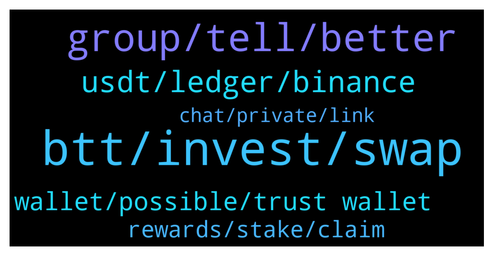

# **@tronnetworkEN**
 ## Analysis for **2022-02-04** - **2022-02-05**.

---

## 📊 **Basic Stats**

**n_messages_sent**: 207

---

---

## 🔝 **Top keywords and related messages**

1. **btt, invest, swap**

    @LloydMo --- *I actually thought hodlers of tron got apenft. When you hold more than 100trx* **--->** [TG Discussion](https://t.me/tronnetworkEN/3872870)

    @shhahid26 --- *after freezing trx what i will get??* **--->** [TG Discussion](https://t.me/tronnetworkEN/3871061)

    @benipoku --- *My bad Carlos, i wanted to say TRX trading related.  Cuz I wanna freeze my TRX for others, but I know advertising q not allowed here  Thanks!* **--->** [TG Discussion](https://t.me/tronnetworkEN/3873101)

    @aledvdntht --- *Do you know how to extract tron ​​with mobile* **--->** [TG Discussion](https://t.me/tronnetworkEN/3872554)

    @Rocky --- *Can any one give me update, s of trx going on from 2 week short please* **--->** [TG Discussion](https://t.me/tronnetworkEN/3871091)

    @Olenagh --- *I wonder 😀. How could he be expecting an airdrop for holding tron* **--->** [TG Discussion](https://t.me/tronnetworkEN/3872893)

2. **group, tell, better**

    @sTONe --- *So you can't help me with this? 😁* **--->** [TG Discussion](https://t.me/tronnetworkEN/3869788)

    @agentpiki --- *Let's all hope for the best 👌* **--->** [TG Discussion](https://t.me/tronnetworkEN/3871101)

    @Hhh --- *On which place exactly??  Can u please navigate for me* **--->** [TG Discussion](https://t.me/tronnetworkEN/3872541)

    @sTONe --- *And I take out like 36 every day....* **--->** [TG Discussion](https://t.me/tronnetworkEN/3869780)

    @Mohammed47789 --- *Oh tell me I wel guide you* **--->** [TG Discussion](https://t.me/tronnetworkEN/3870262)

    @MilNoslen --- *Watched you like 4-5 times trying to join* **--->** [TG Discussion](https://t.me/tronnetworkEN/3872185)

3. **usdt, ledger, binance**

    @mojotwentyone --- *Thanks.  Actually I bought in 2017, so seems I need to use binance as suggested.  Cheers* **--->** [TG Discussion](https://t.me/tronnetworkEN/3871009)

    @PiterSpain --- *There are 15.79 USDT in your wallet, it's there since 27 minutes ago  The Ledger Live app sometimes is slow to sync and show what happens in your wallet. Use Tronlink.org* **--->** [TG Discussion](https://t.me/tronnetworkEN/3871297)

    @Al-amin --- *Yeah it was an internal transfer on Binance* **--->** [TG Discussion](https://t.me/tronnetworkEN/3869816)

    @PiterSpain --- *You have 15 USDT in this address TKQ4dJbCPGSxzELFiV6FRUUBt4TDZd2r9Q* **--->** [TG Discussion](https://t.me/tronnetworkEN/3871288)

    @DmG_90 --- *When in 2018 did you buy, around June there was a migration to mainnet. If you still have the old ERC20 token you have to swap using supporting exchanges like Binance* **--->** [TG Discussion](https://t.me/tronnetworkEN/3870998)

    @Sham74tr --- *Ok I only sent it $10 from binance.  $1 was deducted for fees.  Downloading tron wallet for browser.  I appreciate your help.* **--->** [TG Discussion](https://t.me/tronnetworkEN/3871303)

4. **wallet, possible, trust wallet**

    @agentpiki --- *Go ask trust wallet support bro* **--->** [TG Discussion](https://t.me/tronnetworkEN/3870682)

    @simon866 --- *Yep, if it was a DeX or smart contract say goodbye forever but as they are centralized you have a chance 👍* **--->** [TG Discussion](https://t.me/tronnetworkEN/3869822)

    @aledvdntht --- *He told me that in order to secure my wallet, I needed a password, so I did not know that he was a scammer What should I do?* **--->** [TG Discussion](https://t.me/tronnetworkEN/3872708)

    @Landi --- *Its not possible in anyway? Pay some fee to the support? Is a lot of money that move in this Crypto Platform and sometimes we need help for stupid mistakes? Please help me???* **--->** [TG Discussion](https://t.me/tronnetworkEN/3871731)

    @Moneyversac --- *See sent to your wallet directly* **--->** [TG Discussion](https://t.me/tronnetworkEN/3871395)

    @MilNoslen --- *You were already helped and given the answer. You fail to understand crypto and decentralization. Only YOU are responsible for your assets and money.* **--->** [TG Discussion](https://t.me/tronnetworkEN/3871734)

5. **rewards, stake, claim**

    @Zer0log --- *Ok It's a good option to add. So that the rewards keep adding to the staked amount without the need to unstake* **--->** [TG Discussion](https://t.me/tronnetworkEN/3871408)

    @shhahid26 --- *if i stake 4000trx for 30 days then how much i will earn* **--->** [TG Discussion](https://t.me/tronnetworkEN/3871067)

    @Zer0log --- *How should i get my staking rewards from SRs like foobar ? No apy no distribution rate?* **--->** [TG Discussion](https://t.me/tronnetworkEN/3871375)

    @retrohightop --- *Hi. Why can't I see "Staked" amount, but I can see "Frozen" amount? Isn't it the same?* **--->** [TG Discussion](https://t.me/tronnetworkEN/3870672)

    @Moneyversac --- *Some SR payout directly like CryptoGuyZA for example* **--->** [TG Discussion](https://t.me/tronnetworkEN/3871376)

    @Moneyversac --- *So either way it does not stake it again automatically* **--->** [TG Discussion](https://t.me/tronnetworkEN/3871406)

6. **chat, private, link**

    @MilNoslen --- *You dont, so dont fall for scams* **--->** [TG Discussion](https://t.me/tronnetworkEN/3870177)

    @agentpiki --- *Did you  1. Invest in unknown / suspicious investment?  2. Click on a telegram airdrop link?  3. Provide mnemonic / private key in any form including in google form?  4. Talk to strangers who posed as admins?  5. Swapped currency in fraudulent platform and signed unknown smart contract?  6. Clicked on suspicious link?  Answer* **--->** [TG Discussion](https://t.me/tronnetworkEN/3872694)

    @azaadafg --- *Is new century scam or legit?* **--->** [TG Discussion](https://t.me/tronnetworkEN/3870363)

    @agentpiki --- *Never trust anyone in private messages. Scammers operate behind public channel to hide from admins.  90% of us know it* **--->** [TG Discussion](https://t.me/tronnetworkEN/3872713)

    @ramenin --- *Don't inbox me. scammers tend to do that so please keep chat here 👍* **--->** [TG Discussion](https://t.me/tronnetworkEN/3872159)

    @hanicocki --- *I mean that private chat are not allowed here* **--->** [TG Discussion](https://t.me/tronnetworkEN/3870289)

