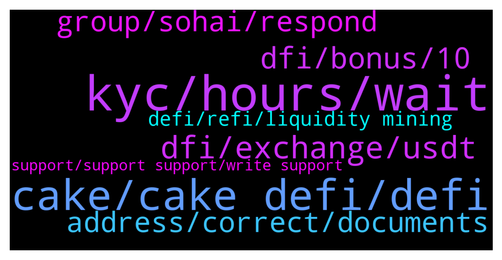

# **@CakeDeFi_EN**
 ## Analysis for **2022-02-05** - **2022-02-06**.

---

## 📊 **Basic Stats**

**n_messages_sent**: 290

---

---

## 🔝 **Top keywords and related messages**

1. **kyc, hours, wait**

    @ExRooney --- *I sent 50 usd dash to the stock market, how many minutes is it coming?* **--->** [TG Discussion](https://t.me/CakeDeFi_EN/172714)

    @BerndMack --- *no, if they are all real people with KYC nothing will happen.* **--->** [TG Discussion](https://t.me/CakeDeFi_EN/172474)

    @prasenjitbarua --- *Dose it take more than 24hours to varify cake?  I submitted documents of my brother 26 hours ago. It is still pending @admin* **--->** [TG Discussion](https://t.me/CakeDeFi_EN/172758)

    @Michael_Schredl --- *Just wait until it gets approved - it can take longer on weekends* **--->** [TG Discussion](https://t.me/CakeDeFi_EN/172642)

    @detbul --- *If I withdraw my ltc, when will it come, it says it will come late here* **--->** [TG Discussion](https://t.me/CakeDeFi_EN/173225)

    @DmgBautista --- *Yes, you can withdraw at any time :)* **--->** [TG Discussion](https://t.me/CakeDeFi_EN/173230)

2. **cake, cake defi, defi**

    @HeliumMarcos --- *How do I exchange DUSD for BCH through Cake-Defi?* **--->** [TG Discussion](https://t.me/CakeDeFi_EN/173154)

    @Diwashgh --- *I forget to unstake my DFI token and it Automatically restake for6 month please cake defi team i don't know the rules of cake defi please help me to unstake i need money now please help me dfi team* **--->** [TG Discussion](https://t.me/CakeDeFi_EN/172688)

    @ibrahim --- *I want to transfer the cake to another cake account, but it gives an error like this* **--->** [TG Discussion](https://t.me/CakeDeFi_EN/173217)

    @zachgax --- *I meant *demand* not demons lol. There are no demons on Cake afaik* **--->** [TG Discussion](https://t.me/CakeDeFi_EN/172765)

    @DmgBautista --- *Hi! That is impoossible to do, you cannot send funds from one Cake  account to another. It's not an error, it's a feature.* **--->** [TG Discussion](https://t.me/CakeDeFi_EN/173221)

    @BerndMack --- *that is possible, only between cake accounts it is not possible.* **--->** [TG Discussion](https://t.me/CakeDeFi_EN/172469)

3. **dfi, exchange, usdt**

    @DeFi_Skeptic --- *ok thanks, so there is no bridge currently, must exchange through a CEX* **--->** [TG Discussion](https://t.me/CakeDeFi_EN/173208)

    @mm_phoenix --- *From USDT to dfi yes Dfi to USDT no* **--->** [TG Discussion](https://t.me/CakeDeFi_EN/173175)

    @Rogue --- *Can i withdraw my dfi to it* **--->** [TG Discussion](https://t.me/CakeDeFi_EN/173056)

    @mm_phoenix --- *yes this is right. no you dont need a ETH address and so you dont need to pay the $130 but i think if you want to send the usdt then over the ethereum network you have to pay them 🧐* **--->** [TG Discussion](https://t.me/CakeDeFi_EN/173179)

    @TadekNorek --- *I can exchange DFI on USDT on site?* **--->** [TG Discussion](https://t.me/CakeDeFi_EN/173173)

    @Sebusuuu --- *Thanks, and what is the best way to withdraw from Dafi?  I mean the whole procedure, what wallet, then how to replace it best?* **--->** [TG Discussion](https://t.me/CakeDeFi_EN/173139)

4. **dfi, bonus, 10**

    @LucaJacket --- *My friend did everything correctly because she received the whole bonus (welcome + 8 DFI extra)* **--->** [TG Discussion](https://t.me/CakeDeFi_EN/173254)

    @fadfunky --- *Yes. The bonus $50 worth of DFI i have extend from 6 month to 10 years at the morning* **--->** [TG Discussion](https://t.me/CakeDeFi_EN/172801)

    @dumanalic --- *What does referral bonus 75% mean?* **--->** [TG Discussion](https://t.me/CakeDeFi_EN/172930)

    @Turan --- *How are the bonuses I earned from training transferred to my account?* **--->** [TG Discussion](https://t.me/CakeDeFi_EN/172683)

    @hiromi322 --- *i have a question guys and to admins ,i successfully invited a friend of mine ,she also deposited and received her rewards ,i also received my $30 rewards, my invite also receive the extra 8 DFI ,my question is why i didnt receive my bonus 8 DFI? is only for referrals and not for referrers as well?* **--->** [TG Discussion](https://t.me/CakeDeFi_EN/172567)

    @zachgax --- *Ah, then the explanation of derf_smash above my answer is closer to what you’re looking for. The value of the dTokens like dPDBC is determined by supply and demons on the DEX.* **--->** [TG Discussion](https://t.me/CakeDeFi_EN/172764)

5. **address, correct, documents**

    @imohitss --- *How can voter id is 90 days old sir* **--->** [TG Discussion](https://t.me/CakeDeFi_EN/172650)

    @imohitss --- *Phone or internet bill  Bank statement or bank letter  Electricity, gas, water, or other utility bills  Government-issued documents such as; tax declaration/filing, voter's registration, property tax, newly issued driver's license, etc.* **--->** [TG Discussion](https://t.me/CakeDeFi_EN/172647)

    @Michael_Schredl --- *Maybe try another document, like a phone or Internet bill or a bank statement* **--->** [TG Discussion](https://t.me/CakeDeFi_EN/172662)

    @detbul --- *my address was correct it was correct in the document but they asked me to send it again* **--->** [TG Discussion](https://t.me/CakeDeFi_EN/172658)

    @HeliumMarcos --- *I sent the documents for verification and they all turned green but they didn't approve my account* **--->** [TG Discussion](https://t.me/CakeDeFi_EN/172825)

    @ikbaldicaprio --- *I will verify the identity, but when I was a member, I wrote m instead of the letter n, I want to correct it and authenticate* **--->** [TG Discussion](https://t.me/CakeDeFi_EN/173267)

6. **group, sohai, respond**

    @zachgax --- *Ask Sohai questions, get Sohai answers. 🤷‍♂️* **--->** [TG Discussion](https://t.me/CakeDeFi_EN/172592)

    @KathleenBella1 --- *Hello 👋  I'M new here is there any sub group for Germany 🇩🇪  or anyone from Germany here 🤨* **--->** [TG Discussion](https://t.me/CakeDeFi_EN/173122)

    @Michael_Schredl --- *We have a german group: https://t.me/CakeDeFi_DE* **--->** [TG Discussion](https://t.me/CakeDeFi_EN/173126)

    @zachgax --- *🤷‍♂️ If you’ve been in the group long enough, you’ll notice a pattern for a particular few members. No need to really respond.* **--->** [TG Discussion](https://t.me/CakeDeFi_EN/172598)

    @zachgax --- *Don’t worry about it. He’s actually been around the last couple weeks, if you remember, always calls everyone in the group ‘Sohai’. He probably thinks the westerners don’t understand. It’s actually a degratory term in Chinese/Cantonese.* **--->** [TG Discussion](https://t.me/CakeDeFi_EN/172635)

    @Michael_Schredl --- *Sorry for that, I banned this guy 😅* **--->** [TG Discussion](https://t.me/CakeDeFi_EN/172632)

7. **defi, refi, liquidity mining**

    @Michael_Schredl --- *The 7 Most Frequently Asked Questions About Liquidity Mining  https://blog.cakedefi.com/the-7-most-frequently-asked-questions-about-liquidity-mining/* **--->** [TG Discussion](https://t.me/CakeDeFi_EN/172634)

    @Oniblend --- *Really like your work guys! I was one of the creators of the first DEFI token, called bitshares :)* **--->** [TG Discussion](https://t.me/CakeDeFi_EN/172539)

    @Aqaddxf --- *I'm just doing DeFi liquidity mining* **--->** [TG Discussion](https://t.me/CakeDeFi_EN/172461)

    @Nikki --- *When will we be able to convert Defi to bitcoin?* **--->** [TG Discussion](https://t.me/CakeDeFi_EN/172578)

    @Michael_Schredl --- *Take a look at the FAQ: https://support.cakedefi.com/hc/en-us/articles/4404348147481-How-much-can-I-earn-from-my-referees-* **--->** [TG Discussion](https://t.me/CakeDeFi_EN/172931)

    @zachgax --- *From what I understand, there is EVM on the roadmap for DeFiChain, but right now, nope.* **--->** [TG Discussion](https://t.me/CakeDeFi_EN/173210)

