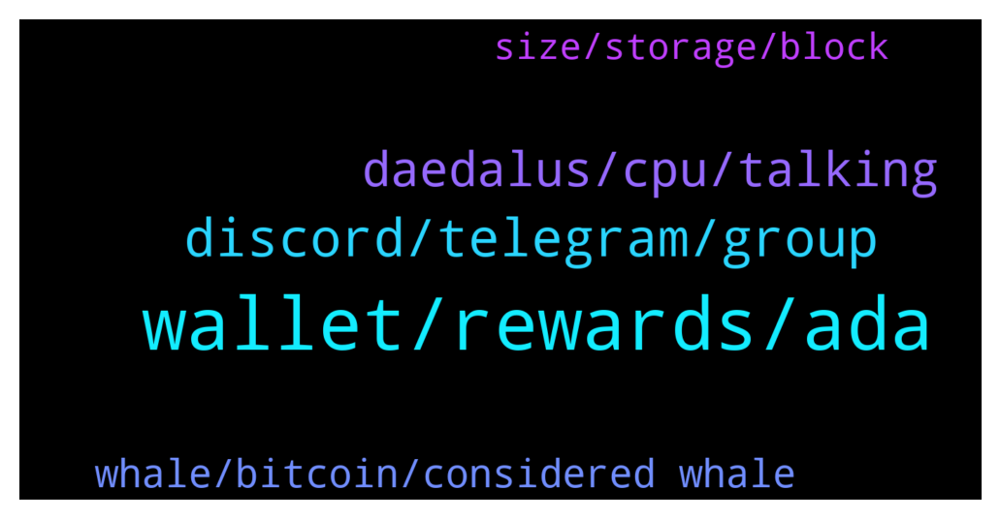

# **@Cardano**
 ## Analysis for **2022-02-05** - **2022-02-06**.

---

## 📊 **Basic Stats**

**n_messages_sent**: 95

---

---

## 🔝 **Top keywords and related messages**

1. **wallet, rewards, ada**

    @JR --- *is it safe to claim any/all airdrops from DripDropz?  Is there any risk to my wallet security?  Thanks in advance.* **--->** [TG Discussion](https://t.me/Cardano/778695)

    @Coltey --- *Anyone have any idea why staked value on MELD is not being counted towards TVL on defilama right now? https://defillama.com/protocol/meld afaik you can lock it for 6 months or 1 year* **--->** [TG Discussion](https://t.me/Cardano/779106)

    @srinivas2121 --- *Need small info... Now epoch is 319...but in yoroi... rewards showing epoch showing 317 not 318...it will always shows like this only...* **--->** [TG Discussion](https://t.me/Cardano/778757)

    @FlamingElim --- *Hello Admin. Question. I started stake ADA at 23Jan. Epoch 316. Now my 1st reward status is Pending. Why is that ?* **--->** [TG Discussion](https://t.me/Cardano/778691)

    @Ervin --- *Hello guys. newbie question. Why is it that in Binance, they give 7.5%APY for delegators. However, based on cardano.org, the current delegation rewards is at 4.6%. Why the difference?* **--->** [TG Discussion](https://t.me/Cardano/779182)

    @anapurnamaa --- *Unbeliveable.. this wallet just keeps on disappointing.* **--->** [TG Discussion](https://t.me/Cardano/778893)

2. **discord, telegram, group**

    @Corey --- *Do you have a link to the discord chat by any chance?  Or can I just search Cardano?  Sorry, I don’t use discord.  Thanks in advance.* **--->** [TG Discussion](https://t.me/Cardano/778950)

    @genepasker --- *Good day sir… Does You know what time frame that pipelining may be implemented? Thank you* **--->** [TG Discussion](https://t.me/Cardano/779166)

    @Zyroxa --- *Nope sorry i dont know yet.* **--->** [TG Discussion](https://t.me/Cardano/779167)

    @Mahoney1 --- *Just install discord and find them through google. Don’t think they have a telegram group. ;)* **--->** [TG Discussion](https://t.me/Cardano/778951)

    @Paulo --- *no idea, I just keep track of their discussions, but the deep technical talk is very niche and I can't keep up 😄* **--->** [TG Discussion](https://t.me/Cardano/778584)

    @Sydney --- *Haha ya.  Where is the best place to keep up with this talk? IOHK discord?* **--->** [TG Discussion](https://t.me/Cardano/778586)

3. **daedalus, cpu, talking**

    @cryptoustt --- *daedalus taking 6.6 GB memory and 33% CPU. is this normal?* **--->** [TG Discussion](https://t.me/Cardano/778849)

    @cryptoustt --- *and now CPU is up to 24%. just terrible* **--->** [TG Discussion](https://t.me/Cardano/778852)

    @cryptoustt --- *this was when I started it and in UI it said that it had already finished the syncing. now couple minutes later CPU load is 2% and uses 7.5 GB ram* **--->** [TG Discussion](https://t.me/Cardano/778851)

    @anapurnamaa --- *Yeah but I'm not talking about the in-app blockchain verification. I mean the small verification before even entering the app. It gets to 100% then restarts from 0%* **--->** [TG Discussion](https://t.me/Cardano/778888)

    @anapurnamaa --- *Guys, ever since I updated Daedalus, it won't stop verifying the blockcahin (before even entering the actual software). It gets to 100% then restarts all over again* **--->** [TG Discussion](https://t.me/Cardano/778883)

    @apex_pool_spo --- *close Daedalus and start it again after a couple of minutes, then wait for many hours.  I was not talking either about other checks, I was talking about the check before the application starts completely.* **--->** [TG Discussion](https://t.me/Cardano/778890)

4. **whale, bitcoin, considered whale**

    @slimjim1333 --- *Is 1000 ada enough to make me a whale?* **--->** [TG Discussion](https://t.me/Cardano/778962)

    @MrBigK1776 --- *If you held a small amount since then, you'd be considered almost a whale now* **--->** [TG Discussion](https://t.me/Cardano/778975)

    @slimjim1333 --- *Holy crap, I’ll be almost 26 by then….* **--->** [TG Discussion](https://t.me/Cardano/778974)

    @MrBigK1776 --- *If you hold at least past 2040 or so. Which is still a really great investment, by the way.* **--->** [TG Discussion](https://t.me/Cardano/778971)

    @MrBigK1776 --- *Bitcoin was less than $5 at some point, and $25 worth of Bitcoin in 2012 would buy you a couple Teslas now. Just saying* **--->** [TG Discussion](https://t.me/Cardano/778968)

    @MrBigK1776 --- *Bitcoin is like 12 years old.* **--->** [TG Discussion](https://t.me/Cardano/778973)

5. **size, storage, block**

    @Paulo --- *bigger storage, bigger SPO requirements (memory + disk size)* **--->** [TG Discussion](https://t.me/Cardano/778572)

    @Sydney --- *Hey everyone, what is the drawback for increasing cardano block size?* **--->** [TG Discussion](https://t.me/Cardano/778562)

    @Sydney --- *It was my understanding though that not every slot was filled with a block before* **--->** [TG Discussion](https://t.me/Cardano/778580)

    @Paulo --- *it's mainly for decongesting the network. the block size was too small for the amount of demand. blocks were always nearly 100% full, with all the transactions, NFT drops, smart contracts, etc* **--->** [TG Discussion](https://t.me/Cardano/778577)

    @Sydney --- *So it increases node storage requirements, but doesnt effect staking or mining operations?* **--->** [TG Discussion](https://t.me/Cardano/778574)

    @Morpheus369 --- *Is it better to store data on-chain or to use decentralized storage like IPFS? Where would you store important data that should last for thousands of years and can't be altered or destroyed?* **--->** [TG Discussion](https://t.me/Cardano/778902)

