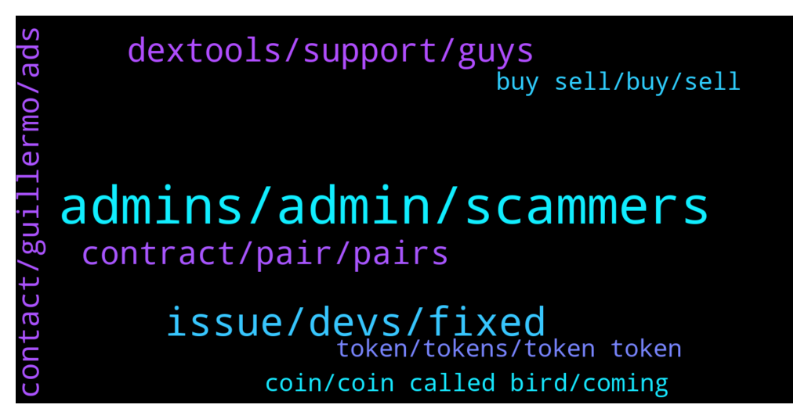

# **@DEXToolsCommunity**
 ## Analysis for **2022-02-04** - **2022-02-06**.

---

## 📊 **Basic Stats**

**n_messages_sent**: 364

---

---

## 🔝 **Top keywords and related messages**

1. **admins, admin, scammers**

    @napascual --- *Let them live peacefuly, everyone deserves some affection* **--->** [TG Discussion](https://t.me/DEXToolsCommunity/330729)

    @crypto0o0o0o --- *always telling me have to be an admin, I am the owner of the group* **--->** [TG Discussion](https://t.me/DEXToolsCommunity/331069)

    @stanes --- *But he is based in Spain so it's still early there and it's the week end so please be patient, he is working a lot 🙏* **--->** [TG Discussion](https://t.me/DEXToolsCommunity/331815)

    @hmk18990 --- *ខេមរៈ I warn you already please keep the channel clean and DO NOT POST every scam token you find here.* **--->** [TG Discussion](https://t.me/DEXToolsCommunity/331258)

    @SweetMonkeyLove --- *lol fake admin in my dms instantly haha* **--->** [TG Discussion](https://t.me/DEXToolsCommunity/331998)

    @gumbercules --- *Yessir be careful. None of us dm first 👀* **--->** [TG Discussion](https://t.me/DEXToolsCommunity/332001)

2. **issue, devs, fixed**

    @stanes --- *Issue has been forwarded to the devs, they will fix it asap. Thanks for reporting it 👍* **--->** [TG Discussion](https://t.me/DEXToolsCommunity/332283)

    @Cryptoflencer --- *ffs disable the function until you fixed it. Should be a fking basic move.* **--->** [TG Discussion](https://t.me/DEXToolsCommunity/330682)

    @napascual --- *It’s already fixed, no need to move anything* **--->** [TG Discussion](https://t.me/DEXToolsCommunity/330683)

    @stanes --- *It looks fine now for me.* **--->** [TG Discussion](https://t.me/DEXToolsCommunity/330669)

    @stanes --- *There is not the warning anymore but indeed makers are still wrong.* **--->** [TG Discussion](https://t.me/DEXToolsCommunity/330674)

    @FredericDEXT --- *Contact velox team directly, it can be some specific issue with your browser* **--->** [TG Discussion](https://t.me/DEXToolsCommunity/331366)

3. **dextools, support, guys**

    @MademoiselleDL --- *Yes, but is there a limit to it on Dextools ?* **--->** [TG Discussion](https://t.me/DEXToolsCommunity/331162)

    @JoeyDieleman --- *But this is Dextools support, for other talks please go to https://t.me/DEXTtraderslounge or our discord* **--->** [TG Discussion](https://t.me/DEXToolsCommunity/332243)

    @JoeyDieleman --- *Dextools has limit order support via Velox (https://t.me/veloxglobal)* **--->** [TG Discussion](https://t.me/DEXToolsCommunity/332235)

    @tgjck --- *yo does anyone here do dex tools trending?* **--->** [TG Discussion](https://t.me/DEXToolsCommunity/332068)

    @bastardganpunk --- *Dextools doesn’t provide APIs yet. In the future it will be available though 🙂* **--->** [TG Discussion](https://t.me/DEXToolsCommunity/331203)

    @freudyung --- *Sir this is the dextools community* **--->** [TG Discussion](https://t.me/DEXToolsCommunity/330750)

4. **contract, pair, pairs**

    @CryptoFatherBoard --- *I want to be sure which exactly is the right contract* **--->** [TG Discussion](https://t.me/DEXToolsCommunity/330878)

    @stanes --- *DEXT UNISWAP PAIR Chart and trade: https://www.dextools.io/app/uniswap/pair-explorer/0xa29fe6ef9592b5d408cca961d0fb9b1faf497d6d Contract: 0xfb7b4564402e5500db5bb6d63ae671302777c75a  DEXT PANCAKESWAP PAIR Chart and trade: https://www.dextools.io/app/pancakeswap/pair-explorer/0x4b729d5d871057f3a9c424792729217cde72410d Contract: 0xe91a8d2c584ca93c7405f15c22cdfe53c29896e3* **--->** [TG Discussion](https://t.me/DEXToolsCommunity/330858)

    @stanes --- *Hi, it always depends on how many people are watching the other pairs on the same blockchain at this time. We don't disclose this data.* **--->** [TG Discussion](https://t.me/DEXToolsCommunity/330638)

    @El_M4GO --- *I meant to add the CoinMarketCap link to the list of links* **--->** [TG Discussion](https://t.me/DEXToolsCommunity/331843)

    @mohammad721372 --- *And one more question dear Stanes  the interactions for 24hrs will be counts?  All the interactions I mean.   Just in 24hrs time?* **--->** [TG Discussion](https://t.me/DEXToolsCommunity/330651)

    @Hardik8898 --- *Hello one pair BUSD/ARMA not updated in coinmarketcap* **--->** [TG Discussion](https://t.me/DEXToolsCommunity/330863)

5. **contact, guillermo, ads**

    @Wnaqeeb --- *Hi Mr.  I would like to suggest you that  how about establishing an Arabic TG Channel for the Arabic community cuz as u know crypto is getting popular in the middle east. And I'm certain of that you guys will go big after CMC listing. Therefore, If you are interested plz let me know Mr.    By the way, I'm Waleed Alnaqeeb broadcasting from Yemen  and I have enough experience building crypto communities 👍* **--->** [TG Discussion](https://t.me/DEXToolsCommunity/330777)

    @JoeyDieleman --- *Hi you can ask here, if its about marketing (ads/promotions) please contact @guillermorodriguez78* **--->** [TG Discussion](https://t.me/DEXToolsCommunity/332238)

    @JoeyDieleman --- *@crypto_knight_mike please DM @guillermorodriguez78 for ads/promotions* **--->** [TG Discussion](https://t.me/DEXToolsCommunity/332077)

    @Uzzi | MVPAD --- *For advertising you will need to contact Guillermo* **--->** [TG Discussion](https://t.me/DEXToolsCommunity/332011)

    @CynKD6 --- *Hello, how do I go about purchasing a banner ad?* **--->** [TG Discussion](https://t.me/DEXToolsCommunity/330623)

    @JoeyDieleman --- *Ok 👍 and else indeed ask in the Velox Telegram channel.* **--->** [TG Discussion](https://t.me/DEXToolsCommunity/331377)

6. **coin, coin called bird, coming**

    @freudyung --- *Basically I got in right I bought the bottom; which I thought was bottom, then they sold and price of crypto tanked* **--->** [TG Discussion](https://t.me/DEXToolsCommunity/330756)

    @E --- *how can it be that such a coin is still online??? I've tried everything I can't sell ? how can it be that this coin is also in the trends that is unbelievable???* **--->** [TG Discussion](https://t.me/DEXToolsCommunity/331138)

    @AX3L_R0SE --- *@admin what's with this glitch on ETH showing marketing wallets/deployer selling ??* **--->** [TG Discussion](https://t.me/DEXToolsCommunity/330648)

    @E --- *can you please help me ? I bought a coin called bird and I can't sell it anymore can you please help me?* **--->** [TG Discussion](https://t.me/DEXToolsCommunity/331133)

    @preyegift --- *Please how can I sell my Terk coin* **--->** [TG Discussion](https://t.me/DEXToolsCommunity/332142)

    @AX3L_R0SE --- *all sells showing from our marketing wallet* **--->** [TG Discussion](https://t.me/DEXToolsCommunity/330670)

7. **buy sell, buy, sell**

    @♡𝚉𝙰𝙷𝚁𝙰♡ --- *You can easily buy and sell with a free plan??* **--->** [TG Discussion](https://t.me/DEXToolsCommunity/331093)

    @♡𝚉𝙰𝙷𝚁𝙰♡ --- *If we do not pay 100 dex, we can easily buy and sell in all platforms?* **--->** [TG Discussion](https://t.me/DEXToolsCommunity/331090)

    @♡𝚉𝙰𝙷𝚁𝙰♡ --- *If we do not have a trading robot, we can easily buy and sell?* **--->** [TG Discussion](https://t.me/DEXToolsCommunity/331080)

    @♡𝚉𝙰𝙷𝚁𝙰♡ --- *How to pay for Dex currency subscription in the standard???* **--->** [TG Discussion](https://t.me/DEXToolsCommunity/330753)

    @SuperLuckyInvestor --- *Hi, can im pls ask we need to buy 1000 dext token in order to set limit for bot trading? its will automatic buy and sell for me?* **--->** [TG Discussion](https://t.me/DEXToolsCommunity/332110)

    @lucky_bao1 --- *@dextools_bot How did my standard plan become a free plan?* **--->** [TG Discussion](https://t.me/DEXToolsCommunity/332151)

