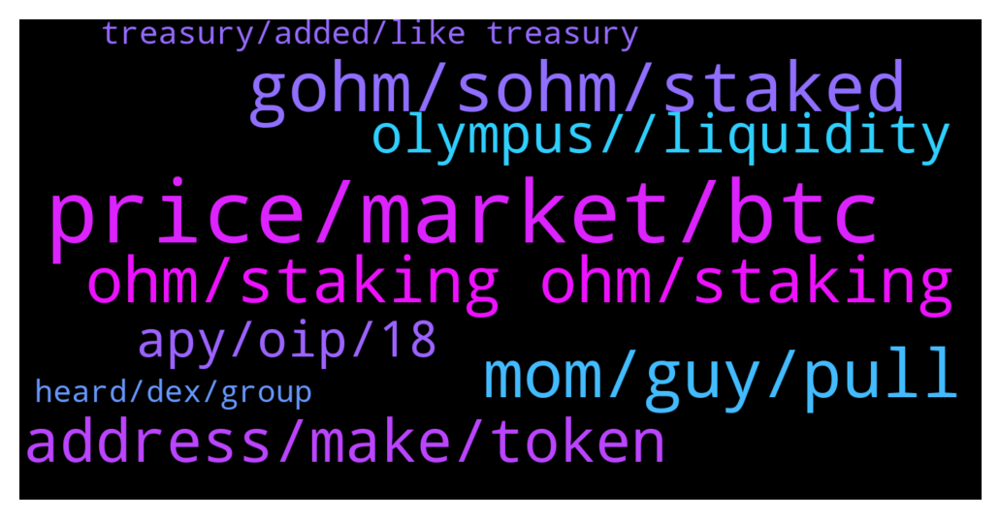

# **@OlympusTG**
 ## Analysis for **2022-02-05** - **2022-02-06**.

---

## 📊 **Basic Stats**

**n_messages_sent**: 496

---

---

## 🔝 **Top keywords and related messages**

1. **price, market, btc**

    @Host_Matt --- *weren't you saying btc was going to 20k* **--->** [TG Discussion](https://t.me/OlympusTG/180099)

    @rasputen1 --- *Nope bought the “dip” at $700* **--->** [TG Discussion](https://t.me/OlympusTG/179702)

    @nfwaple --- *no, price can go under $60* **--->** [TG Discussion](https://t.me/OlympusTG/179872)

    @Host_Matt --- *buy pressure should be huge sub 60* **--->** [TG Discussion](https://t.me/OlympusTG/179882)

    @noexec --- *The market is more mature than it used to be.* **--->** [TG Discussion](https://t.me/OlympusTG/180144)

    @Neba --- *Which is bad for price recovery* **--->** [TG Discussion](https://t.me/OlympusTG/180684)

2. **gohm, sohm, staked**

    @Theo --- *How do you track your rebase if your gOHM is on polygon?* **--->** [TG Discussion](https://t.me/OlympusTG/179709)

    @theMagicUnicorn --- *rewards are same for sohm or gohm, they both rebase at same apy ..you can bridge gohm between chains such as poly and ftm, avax, arb, but it may be pricey if bridging from eth chain, altho you can find times of the day that are less pricey for eth gas..* **--->** [TG Discussion](https://t.me/OlympusTG/180354)

    @Brownhkhk --- *once stake as sOHM and wrapped to gOHM then i'm good?* **--->** [TG Discussion](https://t.me/OlympusTG/180867)

    @Flower --- *sOHM is best if you like seeing your units grow and you enjoy paying high transaction fees. gOHM is better if you hate high transaction fees, you like adding to your investment in smaller amounts (which is made possible by the penny fees from Matic and Avalanche) and you have a governance vote.* **--->** [TG Discussion](https://t.me/OlympusTG/180749)

    @Flower --- *yeah ohm only available on eth meaning big fees to approve then stake. gOHM is already staked and available on Polygon and Avalanche for pennies 😎* **--->** [TG Discussion](https://t.me/OlympusTG/180257)

    @Crtlcontrol --- *is there any diff between staking ohm and buying gohm?* **--->** [TG Discussion](https://t.me/OlympusTG/180098)

3. **mom, guy, pull**

    @SinisterCyclops --- *I'm sorry my mind is dirty. I saw a sexual joke in that* **--->** [TG Discussion](https://t.me/OlympusTG/180774)

    @Host_Matt --- *i stop now 😆 all in good humour ❤️* **--->** [TG Discussion](https://t.me/OlympusTG/179626)

    @Max --- *Hey Waple, I was talking to that dude* **--->** [TG Discussion](https://t.me/OlympusTG/179688)

    @itsthegrandcam --- *Lol says the guy who hides behind computer images* **--->** [TG Discussion](https://t.me/OlympusTG/179608)

    @nfwaple --- *it's too good to be true* **--->** [TG Discussion](https://t.me/OlympusTG/180845)

    @Host_Matt --- *internet tough guy 😆 gonna fuck your mom once more for that* **--->** [TG Discussion](https://t.me/OlympusTG/179612)

4. **ohm, staking ohm, staking**

    @Gilberto --- *I want to invest in ohm and I don't know how it really works* **--->** [TG Discussion](https://t.me/OlympusTG/179720)

    @Neba --- *Good. That's exactly what we want people demanding more ohm to stake with limited supply.* **--->** [TG Discussion](https://t.me/OlympusTG/180712)

    @Host_Matt --- *hopefully when ohm 1k ohmie meetup strippers on me* **--->** [TG Discussion](https://t.me/OlympusTG/179818)

    @xz22222 --- *guys can we still buy OHM on ethereum? thre is no any v2 etc?* **--->** [TG Discussion](https://t.me/OlympusTG/180269)

    @david_np --- *Will ohm pump again? What are the future plan?* **--->** [TG Discussion](https://t.me/OlympusTG/179690)

    @filippobarucca --- *So i buy ohm on gate.io for example, send it to my metamask and then connect wallet to ohm dao and thats it . Right?* **--->** [TG Discussion](https://t.me/OlympusTG/180205)

5. **address, make, token**

    @Deepdiver --- *When I click migrate an overlay appears without any button and assets. On Chrome. Mobile same.* **--->** [TG Discussion](https://t.me/OlympusTG/180375)

    @Ap0l1o --- *Also make sure that the network is ethereum* **--->** [TG Discussion](https://t.me/OlympusTG/180382)

    @fěn jú --- *Alright can I be able to make purchases there?* **--->** [TG Discussion](https://t.me/OlympusTG/179839)

    @nfwaple --- *make sure you use to right address* **--->** [TG Discussion](https://t.me/OlympusTG/180581)

    @nfwaple --- *make sure you use the desktop version, if it still doesn't work clear browser cache* **--->** [TG Discussion](https://t.me/OlympusTG/180571)

    @sundigivn --- *i copy some address, but ít not work* **--->** [TG Discussion](https://t.me/OlympusTG/180580)

6. **olympus, , liquidity**

    @t_dit --- *Which Olympus is the best to get there are so many on CMC .. how does one choose ?* **--->** [TG Discussion](https://t.me/OlympusTG/180886)

    @nfwaple --- *Ohmies, The Heroes of Olympus auction that leads to the kickoff of the NFT drop for Halls of Olympia, is live!  Check out the FAQs to learn more: https://drive.google.com/file/d/1seFF8so3MqciEWuXgahWv8bH8_kDHJPB/view?usp=drivesdk  The auction page can be found here: https://opensea.io/collection/halls-of-olympia  Jump over to the Odyssey discord to learn more and talk to the team  Glory to Olympus!* **--->** [TG Discussion](https://t.me/OlympusTG/180553)

    @nfwaple --- *so when Olympus mcap goes up you can benefit from it* **--->** [TG Discussion](https://t.me/OlympusTG/179707)

    @theMagicUnicorn --- *Olympus PRO was introduced to the world on September 17, 2021. The idea was simple: allow DAOs and projects to take control of their token emissions and liquidity mining programs through protocol-owned liquidity. Since our launch in late September, we have been full steam ahead and have onboarded 40 partners across four different blockchains and layer 2s including Ethereum, Avalanche, Fantom, and Arbitrum. In total, we’ve helped projects bond >$45,000,000 in liquidity and have produced >$2,000,000 in revenue for the OlympusDAO treasury — all in just 4 months’ time    https://olympusdao.medium.com/olympus-pro-in-2022-c21c4fedb2cc     https://docs.olympusdao.finance/pro* **--->** [TG Discussion](https://t.me/OlympusTG/180757)

    @Ap0l1o --- *Try the wrap tab on the Olympus app* **--->** [TG Discussion](https://t.me/OlympusTG/180381)

    @nfwaple --- *see Olympus12 article in our medium for the roadmap, the link is also in the pinned message* **--->** [TG Discussion](https://t.me/OlympusTG/179699)

7. **apy, oip, 18**

    @Max --- *Because the APY will decrease between 100 and 500* **--->** [TG Discussion](https://t.me/OlympusTG/179703)

    @Lucas --- *Can APY go back higher again?* **--->** [TG Discussion](https://t.me/OlympusTG/179889)

    @AwfulFather --- *Couple of months ago I check the APY  was like 7000% now it’s at like 800%something….. is it going down steadily or what happened?* **--->** [TG Discussion](https://t.me/OlympusTG/180666)

    @Max --- *Yes, but you said the APY doesn't matter. Then only the price matter?* **--->** [TG Discussion](https://t.me/OlympusTG/179729)

    @Viron --- *Hey all. What happened to the APY it dropped a lot.* **--->** [TG Discussion](https://t.me/OlympusTG/180358)

    @nfwaple --- *apy gives you more OHM but it also increases the supply* **--->** [TG Discussion](https://t.me/OlympusTG/179730)

8. **treasury, added, like treasury**

    @nfwaple --- *the treasury growth benefits all of us* **--->** [TG Discussion](https://t.me/OlympusTG/180724)

    @Neba --- *This is where the pains are push to the investors while the treasury suffers little  or no effect.* **--->** [TG Discussion](https://t.me/OlympusTG/180721)

    @unban_peteypete --- *How is the treasury used? How do holders benefit from it?* **--->** [TG Discussion](https://t.me/OlympusTG/180397)

    @King_alts --- *why did the risk free value treasury drop?* **--->** [TG Discussion](https://t.me/OlympusTG/179968)

    @diegsssss --- *Just a random thought, what if the treasury had PAXG since gold is more stable, wouldn’t that help the treasury maintain a higher value? They could sell PAXG bonds or something like that* **--->** [TG Discussion](https://t.me/OlympusTG/180897)

    @cdp279 --- *I suppose it can be added and may be added to the treasury in future* **--->** [TG Discussion](https://t.me/OlympusTG/180901)

