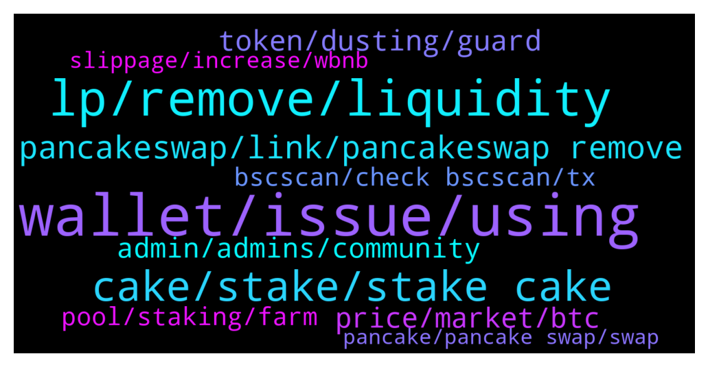

# **@PancakeSwap**
 ## Analysis for **2022-02-05** - **2022-02-06**.

---

## 📊 **Basic Stats**

**n_messages_sent**: 783

---

---

## 🔝 **Top keywords and related messages**

1. **wallet, issue, using**

    @senseibull --- *It is not bs.. this is real problem users are facing...* **--->** [TG Discussion](https://t.me/PancakeSwap/2321036)

    @Ceddi200 --- *Make sure you are using the right website. https://pancakeswap.finance/* **--->** [TG Discussion](https://t.me/PancakeSwap/2322507)

    @CakeCompounder --- *If you want help. I will help. But if you start with that boycotting bs….* **--->** [TG Discussion](https://t.me/PancakeSwap/2321025)

    @trentrez --- *ok. Is this the only solution if this doesnt work?* **--->** [TG Discussion](https://t.me/PancakeSwap/2322671)

    @HAITIENLK --- *you can try remove follow this way https://youtu.be/PxCAWx7yw3g* **--->** [TG Discussion](https://t.me/PancakeSwap/2323625)

    @TomorrowlandForLife --- *did you try clear cache?? since no one is reporting the same issue* **--->** [TG Discussion](https://t.me/PancakeSwap/2322664)

2. **lp, remove, liquidity**

    @Envifoundation --- *yes i know what i am doing but the problem is i can't find my LP which is still inside* **--->** [TG Discussion](https://t.me/PancakeSwap/2323685)

    @Envifoundation --- *The tricky things is i add LP at BNB/ENVI and it work, it can show the additional LP but main LP missing* **--->** [TG Discussion](https://t.me/PancakeSwap/2323619)

    @Envifoundation --- *yes this is the additional LP* **--->** [TG Discussion](https://t.me/PancakeSwap/2323622)

    @Envifoundation --- *I can judge my LP inside but it didn't appear to my LP that allow me to add and remove* **--->** [TG Discussion](https://t.me/PancakeSwap/2323722)

    @Envifoundation --- *I have check my history i have and the additional LP is just 3.4% mean my main LP is inside but it didn't show* **--->** [TG Discussion](https://t.me/PancakeSwap/2323624)

    @Sina --- *Is it necessary to remove my other LPs?* **--->** [TG Discussion](https://t.me/PancakeSwap/2323588)

3. **cake, stake, stake cake**

    @hoseiinnnna --- *Why are you warning? I'm worried about my capital You're not in my place. Find out how much I lost. Your job is just to warn you! What is your plan to improve the price of the cake?We trust you, but give us the right to worry about all this loss😔* **--->** [TG Discussion](https://t.me/PancakeSwap/2322063)

    @Rush_lover --- *hope u have staked your Cake for a nice profit* **--->** [TG Discussion](https://t.me/PancakeSwap/2322106)

    @QV_zz --- *Just stake it as you normally would put add the contract address like any other token* **--->** [TG Discussion](https://t.me/PancakeSwap/2323623)

    @FindAndKillCCITYDevs --- *Hello, may i ask how does cake burning mechanism work? As it has unlimited supply.* **--->** [TG Discussion](https://t.me/PancakeSwap/2321561)

    @Mohammad --- *I want to stake a cake, he wants my eth* **--->** [TG Discussion](https://t.me/PancakeSwap/2322512)

    @Rama Raju --- *Admin we can expect cake create new all time high?* **--->** [TG Discussion](https://t.me/PancakeSwap/2321919)

4. **pancakeswap, link, pancakeswap remove**

    @Captcha001 --- *My tweet was about pancakeswap  and u remove it. Sometimes u should allow free PR to improve the project and to let more people know about it that's what my tweet was abou t* **--->** [TG Discussion](https://t.me/PancakeSwap/2322341)

    @Mededdy --- *Hey guys why pancakeswap is the leading yield and farming platform on the BSC network and its reviews on CoinGecko only 6/10 is this from people who don’t like it or people who don’t understand it or it yes it’s not safe, need an answer guys ))??* **--->** [TG Discussion](https://t.me/PancakeSwap/2323973)

    @snuckles1 --- *has to be reomoved on Pancakeswap* **--->** [TG Discussion](https://t.me/PancakeSwap/2321907)

    @Luukku1 --- *Let's keep the chat Pancakeswap related(?)😇* **--->** [TG Discussion](https://t.me/PancakeSwap/2322568)

    @ManBlyat --- *remove  from rounter V2 pancakeswap sir, dm i send you guide, pls dont ban 🙃* **--->** [TG Discussion](https://t.me/PancakeSwap/2322333)

    @sabinusjoe --- *How do i create a link for investors to access the token directly on pancakeswap through my website without copy and paste?* **--->** [TG Discussion](https://t.me/PancakeSwap/2321510)

5. **token, dusting, guard**

    @vphasitha --- *How you check my wallet sir? I only mentioned hackers wallet and I never swapped those dusting tokens. I swapped guard token today and is it dusting token. Coz it was promoted by beefy and they said that was safe in codewise. You said it's dusting token? That's where I confused sir?* **--->** [TG Discussion](https://t.me/PancakeSwap/2322550)

    @vphasitha --- *@TomorrowlandForLife is @ManBlyat any admin here? He said GUARD token is dusting one and that's what cause me my wallet hack?* **--->** [TG Discussion](https://t.me/PancakeSwap/2322541)

    @JurnalTebe --- *How can I know that a token is a scam one?* **--->** [TG Discussion](https://t.me/PancakeSwap/2323318)

    @Ceddi200 --- *🚨🚨🚨🚨🚨🚨🚨🚨🚨🚨 7)If none of the above work, you've probably bought a coin you cant sell. 🚨🚨🚨🚨🚨🚨🚨🚨🚨🚨  Here you can check whether the token you bought is a scam. Paste the smart contract address! 👇👇👇👇👇   https://honeypot.rugdoc.io/* **--->** [TG Discussion](https://t.me/PancakeSwap/2323234)

    @vphasitha --- *I only swapped GUARD token today. Is that a dusting token? 0xf606bd19b1e61574ed625d9ea96c841d4e247a32* **--->** [TG Discussion](https://t.me/PancakeSwap/2322426)

    @FabulousXBT --- *Do not approve tokens that you dont know where they are from* **--->** [TG Discussion](https://t.me/PancakeSwap/2322561)

6. **price, market, btc**

    @forc3r --- *You'we been warned already about price talks* **--->** [TG Discussion](https://t.me/PancakeSwap/2322056)

    @speedplustrick --- *prediction bet was more but the history shows very less* **--->** [TG Discussion](https://t.me/PancakeSwap/2320989)

    @Dabsalot --- *Call me crazy but just keep that in mind when you see the price of btc and bnb in the future. I hope bnb can break the trend and become 50 bnb to a btc but i doubt it. People like even numbers* **--->** [TG Discussion](https://t.me/PancakeSwap/2322953)

    @Dabsalot --- *Of course but everything effects the market. Which is the basis of technical analysis. Which is psuedoscience to a degree but can increase odds slightly lol* **--->** [TG Discussion](https://t.me/PancakeSwap/2322951)

    @文 --- *In 53520, your forecast results suddenly soared, and the NMB five point market has been falling. How to explain* **--->** [TG Discussion](https://t.me/PancakeSwap/2322358)

    @Dabsalot --- *When I see bnb value is over 1/100th of a bitcoin I usually go on prediction and  wait to find good entries to vote down* **--->** [TG Discussion](https://t.me/PancakeSwap/2322949)

7. **admin, admins, community**

    @BiankFinancial --- *Can a real admin help in here what u mean report* **--->** [TG Discussion](https://t.me/PancakeSwap/2321589)

    @Soon --- *Hello ,any admin here i can dm ?* **--->** [TG Discussion](https://t.me/PancakeSwap/2323037)

    @H.J. --- *Good to have good admins here 😂* **--->** [TG Discussion](https://t.me/PancakeSwap/2323017)

    @forc3r --- *If you like this kind of admins then you have to join some honeypot community. We will always stay realistic and wouldn't hype or predict any pumps,dumps etc.* **--->** [TG Discussion](https://t.me/PancakeSwap/2321951)

    @senseibull --- *Please pass on my message/feedback to your Boss man* **--->** [TG Discussion](https://t.me/PancakeSwap/2321029)

    @TomorrowlandForLife --- *No, is not admin but helps a lot to the community* **--->** [TG Discussion](https://t.me/PancakeSwap/2322545)

8. **pool, staking, farm**

    @xt502 --- *There is no point in depositing in the pools !?  I have a lot of cake in the pool* **--->** [TG Discussion](https://t.me/PancakeSwap/2323926)

    @laichyeee --- *I staked for bcoin and the pool has expired. My cakes and bcoins are gone. Where do I find them? Went to finish staking it's not there too* **--->** [TG Discussion](https://t.me/PancakeSwap/2321981)

    @Worlu2 --- *How do I join pancake staking pool* **--->** [TG Discussion](https://t.me/PancakeSwap/2322153)

    @a352668703 --- *Click to withdraw the pool and there is no response* **--->** [TG Discussion](https://t.me/PancakeSwap/2323413)

    @trumprealme --- *0 handling fee. Is there any profit after adding the pool？* **--->** [TG Discussion](https://t.me/PancakeSwap/2322863)

    @HAITIENLK --- *you can click finish pool to find* **--->** [TG Discussion](https://t.me/PancakeSwap/2321983)

9. **bscscan, check bscscan, tx**

    @HAITIENLK --- *more LP in your wallet / pls check history by yourself on bscscan.com* **--->** [TG Discussion](https://t.me/PancakeSwap/2323621)

    @vphasitha --- *Someone hacked my account and unstake all the bsc tokens and swapped to bnb and drained my account. First he unstaked my 100 cakes from farm pool. This is its TX hash. 0xa3402c008f102318912a5521b7b866766e4a1103397b26e110c3714557d77692 Is there any way to find out how the hacker got initiated?* **--->** [TG Discussion](https://t.me/PancakeSwap/2322408)

    @Lethuha1994 --- *but I see many transactions in-out PRL-BUSD on BScscan* **--->** [TG Discussion](https://t.me/PancakeSwap/2321369)

    @ManBlyat --- *try remove with write rounter V2 on bscscan ser* **--->** [TG Discussion](https://t.me/PancakeSwap/2323501)

    @HAITIENLK --- *in your wallet bro. you can check in bscscan.com* **--->** [TG Discussion](https://t.me/PancakeSwap/2323444)

    @TomorrowlandForLife --- *you can check all your txns on bscscan.com* **--->** [TG Discussion](https://t.me/PancakeSwap/2322699)

10. **slippage, increase, wbnb**

    @trumprealme --- *Because the sliding point is 0, the business is harassed by robots* **--->** [TG Discussion](https://t.me/PancakeSwap/2321419)

    @Aggy1475 --- *Hello sir, i just swapped 84$ worth of tokens but received only 66$. Where's my remaining money? I used 1 slippage only* **--->** [TG Discussion](https://t.me/PancakeSwap/2322254)

    @Ceddi200 --- *if your slippage tolerance is too low like 0.1%, the transaction will fail if the price movement of the coin is above 0.1% and other reasons* **--->** [TG Discussion](https://t.me/PancakeSwap/2321043)

    @Ceddi200 --- *The exchange works fine. You code your tokens. I gave you guides already and possible stuff to do. Not only me sent you guides. You probably got issues with your tokens.  Just to remember you again.   Try increase slippage as much as possible and try bcoin / wbnb* **--->** [TG Discussion](https://t.me/PancakeSwap/2323608)

    @Envifoundation --- *I have try increase slippage and also Bcoin/wbnb and it won't work, my another pair also missing BNB/ENVI* **--->** [TG Discussion](https://t.me/PancakeSwap/2323609)

    @Envifoundation --- *Slip page increase to 5% and follow by 10% , just can't locate the LP , i don't know why Pancakeswap do so? i pair 20BNB to my BCOIN why it can be disappear like this?* **--->** [TG Discussion](https://t.me/PancakeSwap/2323593)

