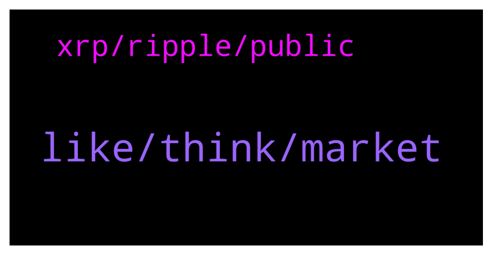

# **@Ripple**
 ## Analysis for **2022-02-05** - **2022-02-06**.

---

## 📊 **Basic Stats**

**n_messages_sent**: 90

---

---

## 🔝 **Top keywords and related messages**

1. **like, think, market**

    @Robert --- *Why do you guys from on here keep messaging me huh 😒?* **--->** [TG Discussion](https://t.me/Ripple/3049431)

    @Jake_ripple_XRP --- *My understanding is that mining BTC is requiring more and more energy for each new "coin"... That is my understanding... I could be wrong... but others might weigh in on this...* **--->** [TG Discussion](https://t.me/Ripple/3049099)

    @Sarashoba05 --- *How much u r getting? Im using hotbit* **--->** [TG Discussion](https://t.me/Ripple/3049160)

    @SJ --- *At the moment I really dont see any catalyst that can push btc to new ATH. But still let's hope for it to happen!* **--->** [TG Discussion](https://t.me/Ripple/3049222)

    @Riiggo --- *Thats how much i earn in intrest daily 😎* **--->** [TG Discussion](https://t.me/Ripple/3049395)

    @ReiTeh --- *You are making me look broke Harambe* **--->** [TG Discussion](https://t.me/Ripple/3049396)

2. **xrp, ripple, public**

    @Skylar920817 --- *XRP is completely following BTC, which makes me very unhappy* **--->** [TG Discussion](https://t.me/Ripple/3049024)

    @richcryto --- *Choose the colour of your lambo boys . XRP will go to Pluto .* **--->** [TG Discussion](https://t.me/Ripple/3049218)

    @Russty007 --- *Who else loves XRP to the moon and back?* **--->** [TG Discussion](https://t.me/Ripple/3049124)

    @nuszy --- *Is their any good staking/interest for XRP holders? I'm currently using Nexo, but is there anything else? Staking, etc?* **--->** [TG Discussion](https://t.me/Ripple/3049141)

    @KevivRoopak --- *Any group following XRP SEC case* **--->** [TG Discussion](https://t.me/Ripple/3049470)

    @CyrptocuErgin --- *I hodl 12k xrps. Would that be enough to retire in 2 years?* **--->** [TG Discussion](https://t.me/Ripple/3049199)

