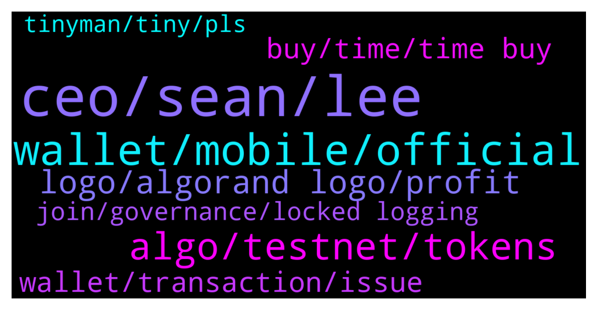

# **@algorand**
 ## Analysis for **2022-02-05** - **2022-02-06**.

---

## 📊 **Basic Stats**

**n_messages_sent**: 144

---

---

## 🔝 **Top keywords and related messages**

1. **ceo, sean, lee**

    @Todd --- *To have a ceo leave and no official statement to the public is completely unacceptable and profoundly unprofessional. Clarity is needed.* **--->** [TG Discussion](https://t.me/algorand/336948)

    @Sahand_tabrizzz --- *that is realy funny for this project* **--->** [TG Discussion](https://t.me/algorand/336868)

    @chad --- *is there a story somewhere on why Sean left?* **--->** [TG Discussion](https://t.me/algorand/337075)

    @Martin --- *Has there been any official info about why Sean Lee left?* **--->** [TG Discussion](https://t.me/algorand/337247)

    @Lorenzo --- *Any idea yet why Sean Lee is out and who will be replacing him?* **--->** [TG Discussion](https://t.me/algorand/336903)

    @chuhs --- *Which project are you talking about* **--->** [TG Discussion](https://t.me/algorand/336949)

2. **wallet, mobile, official**

    @MackDenver --- *MyAlgo: https://wallet.myalgo.com/  Yes, MyAlgo is one of our official wallets.* **--->** [TG Discussion](https://t.me/algorand/336984)

    @incognitocas --- *Does anyone know if there are plans to create a desktop wallet for Algo?* **--->** [TG Discussion](https://t.me/algorand/336972)

    @angelo9007 --- *You can simply google official algorand wallet* **--->** [TG Discussion](https://t.me/algorand/337104)

    @Sahand_tabrizzz --- *why oping out from apps is very hard in algorand???? i have 5 algo but 4.5 is locked... how can i opt out from apps* **--->** [TG Discussion](https://t.me/algorand/336865)

    @MackDenver --- *I will need to check in with the team about it. For now, we have a mobile, web and browser extension wallet available.* **--->** [TG Discussion](https://t.me/algorand/336973)

    @Flexcryptonite --- *Hi do you have a official link to my algo please? And is it a official web browser wallet? Ty* **--->** [TG Discussion](https://t.me/algorand/336983)

3. **algo, testnet, tokens**

    @MackDenver --- *You should have gotten some testnet tokens now* **--->** [TG Discussion](https://t.me/algorand/337171)

    @MackDenver --- *Staking APY is currently less than 1%* **--->** [TG Discussion](https://t.me/algorand/337177)

    @NguyenQuynh83 --- *How can I staking algos? Can someone guide me.* **--->** [TG Discussion](https://t.me/algorand/337139)

    @Lorenzo --- *Yeah I don’t like murky water. I love Algorand but this has to stop* **--->** [TG Discussion](https://t.me/algorand/336905)

    @chillytoast --- *How can people choose xgov option if they don’t even know how many percent return they will get for committing algo for longer period..* **--->** [TG Discussion](https://t.me/algorand/336918)

    @MackDenver --- *Enter your address and use the button to get testnet ALGO.* **--->** [TG Discussion](https://t.me/algorand/337164)

4. **logo, algorand logo, profit**

    @JR_GB --- *''for community purposes only, including merchandise'' what does that mean?* **--->** [TG Discussion](https://t.me/algorand/337231)

    @JR_GB --- *does that mean that someone cant sell something with the Algorand logo for profit?* **--->** [TG Discussion](https://t.me/algorand/337225)

    @NightAlgorand --- *It means that you can produce merchandise but it has to be non-profit I believe* **--->** [TG Discussion](https://t.me/algorand/337239)

    @JR_GB --- *great so would someone be able to sell merch with the logo in some way?* **--->** [TG Discussion](https://t.me/algorand/337222)

    @JR_GB --- *''The Algorand and “A” logo are to be used for community purposes only, including merchandise, but no other for profit business.''* **--->** [TG Discussion](https://t.me/algorand/337224)

    @JR_GB --- *what about selling a nft with the algorand logo?* **--->** [TG Discussion](https://t.me/algorand/337235)

5. **buy, time, time buy**

    @JAmesruq --- *it seems they start to grow a little, maybe now is the time. What to buy? I want to long-term invest into some cmc top coin* **--->** [TG Discussion](https://t.me/algorand/337233)

    @randygona --- *not the time yet, wait for a few days then buy* **--->** [TG Discussion](https://t.me/algorand/337232)

    @JAmesruq --- *hey everyone, the market stopped falling? when is time to buy?* **--->** [TG Discussion](https://t.me/algorand/337230)

    @NightAlgorand --- *Gentle reminder to take all price chat to https://t.me/algorand_price* **--->** [TG Discussion](https://t.me/algorand/336900)

    @rodrixt --- *Scammers are so good to do this* **--->** [TG Discussion](https://t.me/algorand/337199)

    @MackDenver --- *Please do report the account and stay safe* **--->** [TG Discussion](https://t.me/algorand/337147)

6. **wallet, transaction, issue**

    @The Dude --- *Please confirm transaction in Algorand wallet and nothing happens* **--->** [TG Discussion](https://t.me/algorand/337131)

    @fkyshow --- *Having this issue with wallet connect recently* **--->** [TG Discussion](https://t.me/algorand/337109)

    @min_time1 --- *Hi i have some of algo on trust wallet but i cant transfer  Why* **--->** [TG Discussion](https://t.me/algorand/336996)

    @NightAlgorand --- *Your minimum balance depends on how many ASA you added to your wallet. If you add ASA to your wallet, your minimum ALGO requirement increases. If you want to remove ASA, you can do it from the wallet you are using.* **--->** [TG Discussion](https://t.me/algorand/336871)

    @Am --- *Why I can't exchange from any coin to Algo in Atomic please?* **--->** [TG Discussion](https://t.me/algorand/337210)

    @MackDenver --- *Which dapp are you using? It is likely a dapp issue, not the wallet.* **--->** [TG Discussion](https://t.me/algorand/337133)

7. **join, governance, locked logging**

    @Discretionn --- *I'm being lazy, I probably should just check for mtself, can I jump in on governance at any time or is it only specified times when you have to be locked in by?* **--->** [TG Discussion](https://t.me/algorand/337143)

    @Crypto --- *okey how do i join the channel* **--->** [TG Discussion](https://t.me/algorand/337253)

    @MackDenver --- *You will need to join the governance during the Registration period. They usually start at the beginning of each quarter.* **--->** [TG Discussion](https://t.me/algorand/337144)

    @The Dude --- *I am logging in through the governance website* **--->** [TG Discussion](https://t.me/algorand/337134)

    @Todd --- *You can't.  No explanation given over a week now.* **--->** [TG Discussion](https://t.me/algorand/336970)

    @MackDenver --- *Which event are you trying to join?* **--->** [TG Discussion](https://t.me/algorand/337178)

8. **tinyman, tiny, pls**

    @MackDenver --- *You will need to use Tinyman for now. Atomic swap platforms are in the works as we speak* **--->** [TG Discussion](https://t.me/algorand/337212)

    @Bennylight --- *Pls my Tinyman has not be loading to the interface, for a week now Does anyone knows how i can go about it pls?* **--->** [TG Discussion](https://t.me/algorand/337009)

    @AKBARIIN --- *Hi, can you answer my question?* **--->** [TG Discussion](https://t.me/algorand/337040)

    @MackDenver --- *You should reach out to the tinyman team  https://t.me/tinymanofficial* **--->** [TG Discussion](https://t.me/algorand/337185)

    @NightAlgorand --- *You would have more clarity if you head to the tinyman group* **--->** [TG Discussion](https://t.me/algorand/337011)

    @Flexcryptonite --- *@MackDenver sorry just wondering if you have a official link for tiny man dex* **--->** [TG Discussion](https://t.me/algorand/337000)

