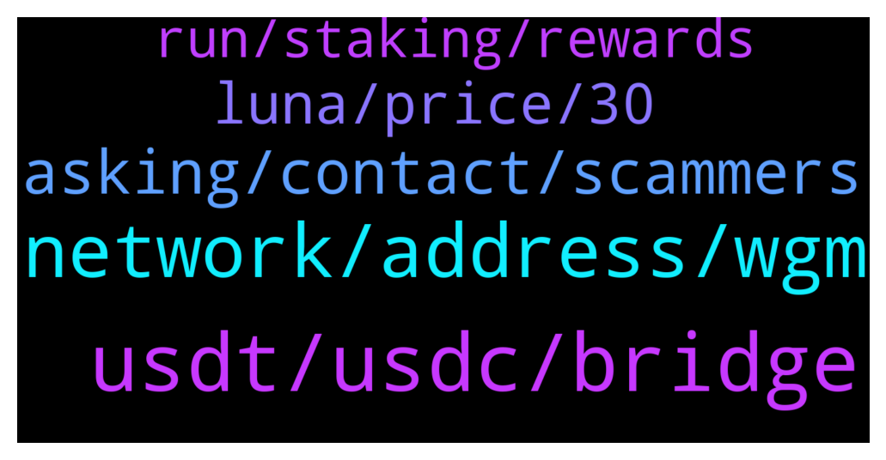

# **@avalancheavax**
 ## Analysis for **2022-02-05** - **2022-02-06**.

---

## 📊 **Basic Stats**

**n_messages_sent**: 106

---

---

## 🔝 **Top keywords and related messages**

1. **usdt, usdc, bridge**

    @jonijonimyfren --- *Whats the different usdt and usdt.e?* **--->** [TG Discussion](https://t.me/avalancheavax/326991)

    @serafettincetin --- *hello, I sent avax from coinlist to binanceTR with c chain, but binance tr says unsupported sending and says that it cannot transfer it to the wallet.  lingers, does not find a solution.  please help what can i do.* **--->** [TG Discussion](https://t.me/avalancheavax/326960)

    @Vinh86 --- *Hello admin.  I need help. 250 days ago I got CNR to usdt swap token. but the current usdt that is not used. and it still shows up on my wallet. my question. is the data in the time 250 day that. usdt on the avax system has an event contract? and how can i use usdt token on my wallet. thank you very much* **--->** [TG Discussion](https://t.me/avalancheavax/327093)

    @efiaskari --- *Send avax to cex , sell to usdt  , withdraw on solana* **--->** [TG Discussion](https://t.me/avalancheavax/326834)

    @phuboat --- *I sent UST from SOL > AVAX (0xb599c3590f42f8f995ecfa0f85d2980b76862fc1)  via wormhole. How to swap them to USDC?* **--->** [TG Discussion](https://t.me/avalancheavax/326968)

    @oathtobarbatos --- *usdt.e is one of the bridge tokens* **--->** [TG Discussion](https://t.me/avalancheavax/326993)

2. **network, address, wgm**

    @abedi_seyedmorteza --- *Yes BSC network.  I did not transfer to the wallet address  I transferred it to Avalanche network address* **--->** [TG Discussion](https://t.me/avalancheavax/326848)

    @Baribalthedruid --- *Hi, I'd like to setup Avalanche blockchain datas in Metamask. Would you please share them?* **--->** [TG Discussion](https://t.me/avalancheavax/326955)

    @Nicolas_A --- *There are just addresses no such thing as a network addresses* **--->** [TG Discussion](https://t.me/avalancheavax/326858)

    @Emmyology --- *Pls    Admin ..  How to get   Avalanche c chain address...??* **--->** [TG Discussion](https://t.me/avalancheavax/326964)

    @defirlkp --- *you can't transfer from bsc network to avalanche network without using a bridge* **--->** [TG Discussion](https://t.me/avalancheavax/326860)

    @son15119195 --- *Can anyone explain to me what the WAGMI subnet is. I received 10 WGM but I don't know what to do* **--->** [TG Discussion](https://t.me/avalancheavax/327019)

3. **asking, contact, scammers**

    @ricardogainza97 --- *Hello, could you give me a way to contact someone from support please?* **--->** [TG Discussion](https://t.me/avalancheavax/327078)

    @strikefox77 --- *I like when scammers send me DM. They help me a lot to practice my English.* **--->** [TG Discussion](https://t.me/avalancheavax/326883)

    @iwouldbediogenes --- *Did you try to ask help to the assistance ?* **--->** [TG Discussion](https://t.me/avalancheavax/326961)

    @oathtobarbatos --- *You could try asking them in their Telegram channel, here's the invitation link https://t.me/avalaunch_app* **--->** [TG Discussion](https://t.me/avalancheavax/327006)

    @TheSEOdude --- *Should contact on discord for technical support.* **--->** [TG Discussion](https://t.me/avalancheavax/327082)

    @oathtobarbatos --- *You could try asking it there* **--->** [TG Discussion](https://t.me/avalancheavax/327073)

4. **luna, price, 30**

    @frankophil --- *Is AVAX or TJ down? Submitted a transaction to TraderJoe and its taking forever, not showing up in Snowtrace* **--->** [TG Discussion](https://t.me/avalancheavax/326936)

    @frankophil --- *yeah it finaly went through, never seen a transaction that slow on AVAX before. Maybe Metamask didn't update the price fast enough* **--->** [TG Discussion](https://t.me/avalancheavax/326940)

    @raghav4288 --- *Buy avax Send in your wallet  then exchange it on dex* **--->** [TG Discussion](https://t.me/avalancheavax/326816)

    @AMPLHIGHPRIEST --- *Ampleforth up 30 percent.  Thank you avax for the support* **--->** [TG Discussion](https://t.me/avalancheavax/327058)

    @Princejonah13 --- *Please i want to buy small amount of avax worth $4* **--->** [TG Discussion](https://t.me/avalancheavax/327018)

    @joanandrewss --- *By the way! I've been searching deep, who knows if AVAX has any competitor. I'd love to see how the comparison turns out, no offence fam.* **--->** [TG Discussion](https://t.me/avalancheavax/326886)

5. **run, staking, rewards**

    @maartok --- *Is the summit in March also for investors or is it more a developers kind of event* **--->** [TG Discussion](https://t.me/avalancheavax/326916)

    @dc302 --- *Hey admins, is it possible for staking rewards to run out eventually? Or will they continue to come from transaction fees?* **--->** [TG Discussion](https://t.me/avalancheavax/326896)

    @MuhammadHamzaNisar --- *i have already stake xava from last 4 month, how i can take apart in competition* **--->** [TG Discussion](https://t.me/avalancheavax/327005)

    @Laura --- *Hello guys look how dope is the Staking dApp preview of @chillavax listing tonight on TraderJoe* **--->** [TG Discussion](https://t.me/avalancheavax/327096)

    @MalcolmLV5 --- *Biggest crypto fundraiser in Canadian history happening now after they shut down the protestor's $10 Mil GoFundMe. Crypto community stepping up huge!* **--->** [TG Discussion](https://t.me/avalancheavax/326974)

    @MirayHobert --- *Invest now on all this alt coins  Because it gonna yield good stuff in future* **--->** [TG Discussion](https://t.me/avalancheavax/326852)

